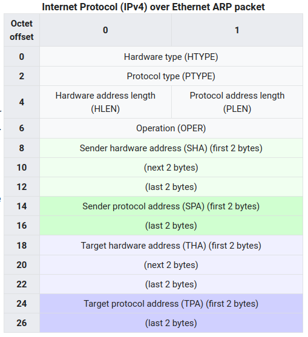
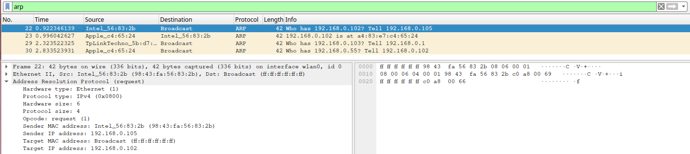
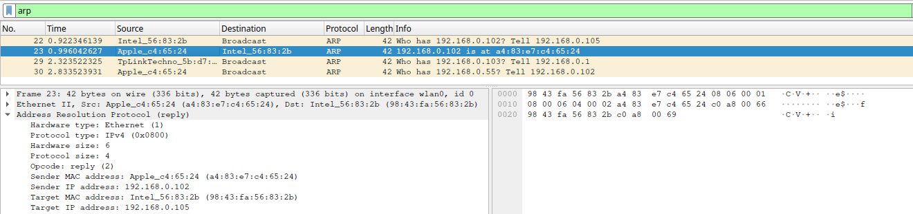
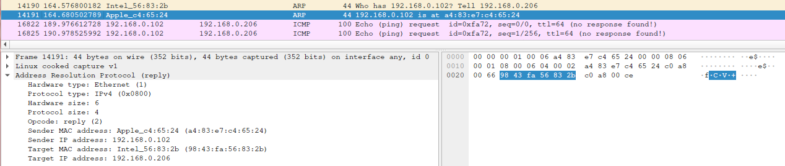
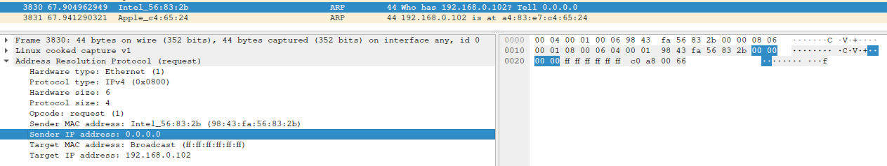

+++
title = "Address Resolution Protocol"
summary = ''
description = ""
categories = ["network"]
tags = []
date = 2023-12-31T17:38:26+09:00
draft = false

+++


## 概括

**核心**:

- 用于维护逻辑地址和物理地址的映射关系。即网络层地址和网络硬件地址进行转换，IPv4  <=> MAC（IPv6 不用这个协议）


**设计与实现**:

- Question and Answer 的形式

- 借助以太网帧进行发送。协议位于的层次可以是网络层也可以是数据链路层，这个不明确，存在争议

- 请求是广播，响应是单播。理论设计，不强制
- 收到广播请求的机器可以直接将对方的 MAC 和 IP 缓存。优化手段，不强制
- 系统会为 ARP 建立带过期时间的缓存。可以静态配置也可以手动配置


## 协议


### 报文格式

定长， 28 个字节，如下图




几个枚举类型字段的值及含义：

- Hardware Type
  - `1` 为 `Ethernet`

- Protocol Type

  - `0x0800` IPv4
  - `0x86DD` IPv6
  - `0x0806` ARP

- Operation

  - `1` 为 ARP 请求

  - `2` 为 ARP 应答

  - `3` 为 RARP 请求

  - `4` 为 RARP 应答


这里的协议设计在现在看上去有一点问题。首先 ARP 现在只用于 IPv4，所以协议类型是多余的。其次因为这个是定长报文，源协议地址和目标协议地址都是 IPv4 了，那么协议地址长度这个字段也是不必要的。虽然 ARP 中包含了 MAC，以太网帧也有，但是可以通过这个做不同的事情，这个不是冗余


### Wireshark 实验

使用 wlan0 作为出口，本机 IP 为 `192.168.0.105/24`。通过 `arping` 命令发送一个 `arp` 请求

```
>> sudo arping -f 192.168.0.102
ARPING 192.168.0.102 from 192.168.0.105 wlan0
Unicast reply from 192.168.0.102 [A4:83:E7:C4:65:24]  82.801ms
Sent 1 probes (1 broadcast(s))
Received 1 response(s)
```


或者这里可以清理 ARP 缓存后发送一个简单的 `ping` 命令，会看到相关的请求


#### Request




```
0000   ff ff ff ff ff ff 98 43 fa 56 83 2b 08 06 00 01   .......C.V.+....
0010   08 00 06 04 00 01 98 43 fa 56 83 2b c0 a8 00 69   .......C.V.+...i
0020   ff ff ff ff ff ff c0 a8 00 66                     .........f
```


这是一个目的地址为 `ff:ff:ff:ff:ff:ff` 的 broadcast 类型的以太网帧。注意这里有人说 Target MAC address 是全零的，但是实际看下来也是 `ff:ff:ff:ff:ff:ff`。不同工具实现不一样，这里 `arping` 是进行的 `1` 填充；但是如果使用 `ping` 的方式，是 `0` 填充。可以自己抓包看一下


####  Reply




```
0000   98 43 fa 56 83 2b a4 83 e7 c4 65 24 08 06 00 01   .C.V.+....e$....
0010   08 00 06 04 00 02 a4 83 e7 c4 65 24 c0 a8 00 66   ..........e$...f
0020   98 43 fa 56 83 2b c0 a8 00 69                     .C.V.+...i
```


目的地为 `98:43:fa:56:83:2b` 的以太网帧，即发送给 `192.168.0.105`


## 相关命令

###  `arping`

- `-A`: 与 `-U` 相同，但使用 ARP REPLY 数据包而不是 ARP REQUEST。

- `-b`: 仅发送 MAC 级别的广播。通常 arping 从发送广播开始，然后在接收到回复后切换到单播。

- `-c count`: 在发送 `count` 个 ARP REQUEST 数据包后停止。使用 `deadline` 选项时，等待 `count` 个 ARP REPLY 数据包，或者直到超时。

- `-D`: 重复地址检测模式（DAD）。参见 RFC2131, 4.4.1。如果 DAD 成功，即未收到回复，则返回 0。

- `-f`: 在第一个确认目标存活的回复后结束。

- `-I interface`: 发送 ARP REQUEST 数据包的网络设备的名称。

- `-h`: 打印帮助页面并退出。

- `-q`: 安静模式输出。不显示任何内容。

- `-s source`: 用于 ARP 数据包的 IP 源地址。如果不存在此选项，则源地址为：
  - 在 DAD 模式下（使用 `-D` 选项）设置为 0.0.0.0。
  - 在未经请求的 ARP 模式下（使用 `-U` 或 `-A` 选项）设置为目标地址。
  - 否则，它是从路由表中计算出来的。

- `-U`: 未经请求的 ARP 模式，用于更新邻居的 ARP 缓存。不期望回复。

- `-V`: 打印程序版本并退出。

- `-w deadline`: 指定 `arping` 在超时之前退出的时间（以秒为单位），而不管发送或接收了多少数据包。如果收到任何回复，则以状态 0 退出，否则为状态 1。当与 `count` 选项结合使用时，如果在截止日期到期之前收到 `count` 个回复，则以状态 0 退出，否则为状态 1。

- `-i interval`: 指定数据包之间的时间间隔，以秒为单位。


###  `arp`

- `-v`, `--verbose`: 以冗长模式输出，通过详细信息告知用户正在进行的操作。

- `-n`, `--numeric`: 显示数值地址，而不尝试确定符号主机、端口或用户名。

- `-H type`, `--hw-type type`, `-t type`: 在设置或读取 ARP 缓存时，此可选参数告诉 arp 应该检查哪类条目。此参数的默认值是 ether（即硬件代码 0x01，适用于 IEEE 802.3 10Mbps 以太网）。其他可能的值可能包括网络技术，如 ARCnet（arcnet）、PROnet（pronet）、AX.25（ax25）和 NET/ROM（netrom）。

- `-a`: 使用备选的 BSD 风格输出格式（无固定列）。

- `-e`: 使用默认的 Linux 风格输出格式（带有固定列）。

- `-D`, `--use-device`: 而不是使用 hw_addr，给定的参数是接口的名称。arp 将使用该接口的 MAC 地址进行表项。通常，这是设置对自己的代理 ARP 条目的最佳选项。

- `-i If`, `--device If`: 选择一个接口。在转储 ARP 缓存时，只会打印与指定接口匹配的条目。在设置永久或临时 ARP 条目时，将与该接口关联；如果不使用此选项，内核将根据路由表进行猜测。对于公共条目，指定的接口是将在其上回答 ARP 请求的接口。注意：这必须与将路由 IP 数据报的接口不同。注意：从内核 2.2.0 开始，不再可能为整个子网设置 ARP 条目。相反，Linux 在存在路由并进行转发时执行自动代理 ARP。有关详细信息，请参阅 arp(7)。同样，在 2.4 和更新的内核中，不能与 delete 和 set 操作一起使用 dontpub 选项。

- `-f filename`, `--file filename`: 类似于 -s 选项，只不过这次的地址信息来自文件 filename。如果必须设置大量主机的 ARP 条目，可以使用此选项。数据文件的名称往往是 /etc/ethers，但这不是官方规定。如果未指定 filename，则默认使用 /etc/ethers。文件的格式很简单；它只包含用空格分隔的主机名和硬件地址的 ASCII 文本行。此外，可以使用 pub、temp 和 netmask 标志。

  

在期望主机名的所有位置，也可以输入点分十进制表示法中的 IP 地址。作为兼容性的特殊情况，主机名和硬件地址的顺序可以交换。ARP 缓存中的每个完整条目将用 C 标记。永久条目用 M 标记，已发布的条目带有 P 标记。


```
>> sudo arp -d 192.168.0.102

>> arp -e -i wlan0
Address                  HWtype  HWaddress           Flags Mask            Iface
192.168.0.104            ether   94:f8:27:ad:ee:45   C                     wlan0
_gateway                 ether   9c:a6:15:5b:d7:d4   C                     wlan0
192.168.0.100            ether   d4:7c:44:22:90:6c   C                     wlan0
192.168.0.103            ether   e2:a3:6f:cd:46:c5   C                     wlan0

>> sudo arp -s 192.168.0.102 a4:83:e7:c4:65:24

>> arp -e -i wlan0
Address                  HWtype  HWaddress           Flags Mask            Iface
192.168.0.104            ether   94:f8:27:ad:ee:45   C                     wlan0
_gateway                 ether   9c:a6:15:5b:d7:d4   C                     wlan0
192.168.0.102            ether   a4:83:e7:c4:65:24   CM                    wlan0
192.168.0.100            ether   d4:7c:44:22:90:6c   C                     wlan0
192.168.0.103            ether   e2:a3:6f:cd:46:c5   C                     wlan0
```


### 缓存刷新实验


在 `192.168.0.102` 的机器上执行 `192.168.0.206`。`192.168.0.206` 是一个子网中不存在的 IP 地址。接下来我们在 `192.168.0.105` 的机器上向 `192.168.0.102`  发送一个 ARP 请求

```
>> sudo arping -I wlan0 -s 192.168.0.206 -f 192.168.0.102
arping: bind: Cannot assign requested address

>> sudo sysctl –w net.ipv4.ip_nonlocal_bind=1

>> sudo arping -I wlan0 -s 192.168.0.206 -f 192.168.0.102
ARPING 192.168.0.102 from 192.168.0.206 wlan0
Unicast reply from 192.168.0.102 [A4:83:E7:C4:65:24]  104.325ms
Sent 1 probes (1 broadcast(s))
Received 1 response(s)
```


在这个请求中我们的报文写入了自己的 IP 地址为 `192.168.0.206`，使得 `192.168.0.102` 这台机器刷新了自己的缓存，从而在 `192.168.0.105` 的机器上收到目的地为 `192.168.0.206` 的 ICMP





## ARP Probe

ARP 可以用于检测环境中是否存在 IPv4 地址，达到地址冲突的功能。此报文和通常的 ARP 请求类似，但是为了防止接收端刷新自己的缓存，所有会将源协议地址置零

```
>> sudo arping -D 192.168.0.102
```



时限内收到回复则存在冲突


## ARP announcements / Gratuitous ARP

利用对端会刷新 ARP 缓存的特性，在本机启动或者 IP 地址被更换后，发送一个 ARP 请求，刷新其他机器。可以通过

- 发送一个 TPA = SPA ，且 THA 为 0 的 ARP 请求
- 或者广播一个 ARP 响应


第一种做法比较常见


## Proxy ARP 

[ARP代理实例研究](http://just4coding.com/2017/02/19/arp-proxy/)

[linux的proxy_arp和arp_filter参数解释](https://imliuda.com/post/1015)


## 报文解析代码


```zig
const std = @import("std");
const testing = std.testing;
const Ip4Address = std.net.Ip4Address;

pub const HardwareType = enum(u16) {
    Unknown = 0,
    Ethernet = 1,
};

pub const Arp = packed struct {
    _hardware_type: u16,
    _protocol_type: u16,
    _hw_addr_len: u8,
    _proto_addr_len: u8,
    _operation: u16,
    _sender_hw_addr: u48,
    _sender_proto_addr: u32,
    _target_hw_addr: u48,
    _target_proto_addr: u32,

    const Self = @This();

    pub inline fn parse(bytes: []u8) *Self {
        return @ptrCast(@alignCast(bytes));
    }

    pub inline fn getHardwareType(self: *Self) HardwareType {
        const typ = std.mem.readInt(u16, @ptrCast(&self._hardware_type), .big);
        if (typ == 1) {
            return HardwareType.Ethernet;
        }
        return HardwareType.Unknown;
    }

    pub inline fn setHardwareType(self: *Self, typ: HardwareType) void {
        std.mem.writeInt(u16, @ptrCast(&self._hardware_type), @intFromEnum(typ), .big);
    }

    pub inline fn getSenderIpAddress(self: *Self) Ip4Address {
        return Ip4Address.init(@bitCast(self._sender_proto_addr), 0);
    }

    pub inline fn getTargetIpAddress(self: *Self) Ip4Address {
        return Ip4Address.init(@bitCast(self._target_proto_addr), 0);
    }
};

test "test request" {
    var bytes = [_]u8{ 0x00, 0x01, 0x08, 0x00, 0x06, 0x04, 0x00, 0x01, 0x98, 0x43, 0xfa, 0x56, 0x83, 0x2b, 0xc0, 0xa8, 0x00, 0x69, 0xff, 0xff, 0xff, 0xff, 0xff, 0xff, 0xc0, 0xa8, 0x00, 0x66 };
    const arp_packet = Arp.parse(&bytes);

    try testing.expect(arp_packet.getHardwareType() == .Ethernet);
    try testing.expectEqual(try Ip4Address.parse("192.168.0.105", 0), arp_packet.getSenderIpAddress());
    try testing.expectEqual(try Ip4Address.parse("192.168.0.102", 0), arp_packet.getTargetIpAddress());
}

test "test reply" {}
```


## Reference

[TCP/IP详解 卷1：协议（原书第2版）](https://book.douban.com/subject/26825411/) 第四章

