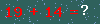

+++
title = "python 识别验证码"
summary = ''
description = ""
categories = []
tags = []
date = 2016-05-05T10:56:00+08:00
draft = false
+++

依赖  

    sudo apt-get install python-imaging
    sudo apt-get install tesseract-ocr
    pip install pytesseract

利用google ocr来识别验证码  

    from PIL import Image
    import pytesseract
    image = Image.open('v1.jpg')
    vcode = pytesseract.image_to_string(image)
    print vcode

但是pytesseract本身识别率不高，而且一般网站的验证码都带有大量干扰元素。(￣▽￣)"  
所以我们首先要对验证码进行去噪。  
对于单像素干扰线、干扰点我们可以通过扫描整个图像，考察每一个像素点所临近的八个像素点的颜色，如果不同的个数大于一定的值，那就说明该点是离散点，需要去除。  
另外也可以尝试设定阈值来直接将验证码二值化。  

下面是两张学校网站上的验证码  
  
  
我们可以看到验证码存在单像素干扰点，所以我们需要设法去除。但是经过反复刷新验证码，发现这个验证码  

*  只有加法运算  
*  至多两位数的加法  
*  文字部分一定是红色(255,0,0)  

有了上述的信息，可以判断这个验证码的生成算法是有缺陷的  
 
    import Image  
    from numpy import *  
    import pytesseract  
    im = Image.open('1.png')  
    im = im.convert('RGB')  
    #拉长图像，方便识别。
    im = im.resize((200,80))  
    a = array(im)  
    for i in xrange(len(a)):  
	for j in xrange(len(a[i])):  
		if a[i][j][0] == 255:  
			a[i][j]=[0,0,0]  
		else:  
			a[i][j]=[255,255,255]  
    im = Image.fromarray(a)  
    im.show()  
    vcode = pytesseract.image_to_string(im)  
    print vcode  

利用上述脚本我们可以将图像进行二值化，利用google ocr进行识别。再通过`eval()`来对表达式进行求值。  
    