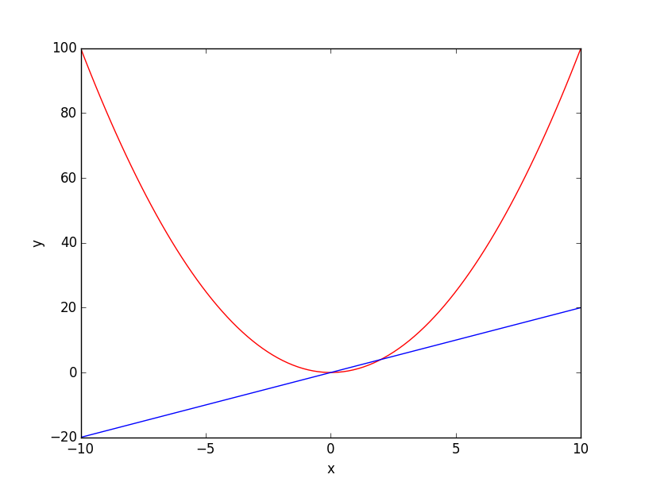
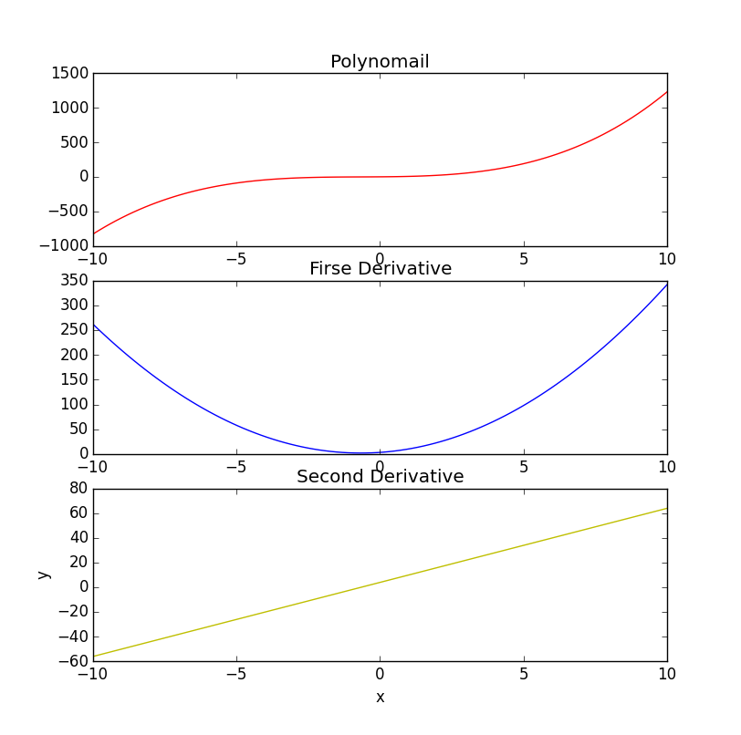
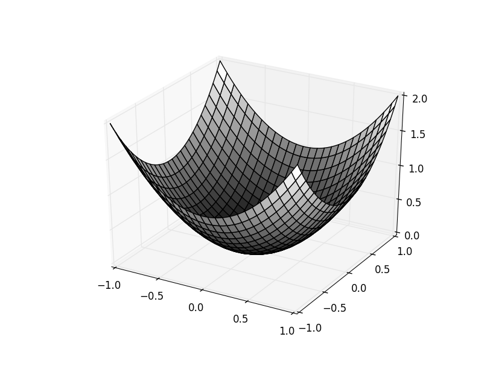
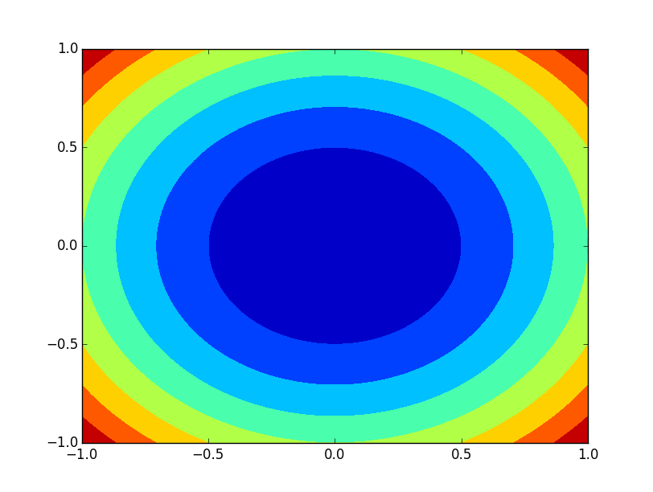

+++
title = "matplotlib画图教程"
summary = ''
description = ""
categories = []
tags = []
date = 2016-05-27T12:55:36+08:00
draft = false
+++

 Matplotlib是一个非常有用的python绘图库。
## 简单绘图

    # 创建多项式 1*x^2+0*x+0
    >>> func = poly1d(array([1,0,0]).astype(float))
    # 一阶导数
    >>> func1 = func.deriv(1)
    # 在-10,10之间产生100个均匀分布的数值
    >>> x = linspace(-10,10,100)
    >>> y = func(x)
    >>> y1 = func1(x)
    # 绘制两条曲线 分别为红色r和蓝色b
    >>> pyplot.plot(x,y,'r',x,y1,'b')
    [<matplotlib.lines.Line2D object at 0xb2eeefec>, <matplotlib.lines.Line2D object at 0xb2ef46ac>]
    # 横轴标签
    >>> pyplot.xlabel('x')
    <matplotlib.text.Text object at 0xb2f37e4c>
    >>> pyplot.ylabel('y')
    <matplotlib.text.Text object at 0xb3083c8c>
    >>> pyplot.show()

生成如下图像

## 子图

    from matplotlib import pyplot
    from numpy import *

    func = poly1d(array([1,2,3,4]).astype(float))
    x = linspace(-10,10,100)
    y = func(x)
    func1 = func.deriv(1)
    y1 = func1(x)
    func2 = func.deriv(2)
    y2 = func2(x)
    # subplot()创建子图，第一个参数为子图的行数，第二个参数是子图的列数，第三个参数是序号
    pyplot.subplot(3,1,1)
    pyplot.plot(x,y,'r')
    # 子图标题
    pyplot.title('Polynomail')

    pyplot.subplot(3,1,2)
    pyplot.plot(x,y1,'b')
    pyplot.title('Firse Derivative')

    pyplot.subplot(3,1,3)
    pyplot.plot(x,y2,'y')
    pyplot.title('Second Derivative')

    pyplot.xlabel('x')
    pyplot.ylabel('y')

    pyplot.show()

生成如下图像

## 绘制3维图像

    from mpl_toolkits.mplot3d import Axes3D
    import matplotlib.pyplot as plt
    from matplotlib import cm
    from numpy import *
    fig = plt.figure()
    ax = fig.add_subplot(1,1,1,projection='3d')
    u = linspace(-1,1,100)
    # 创建2维坐标网络
    x,y = meshgrid(u,u)
    z = x**2+y**2
    # 指定行和列的步长，并指定颜色
    ax.plot_surface(x,y,z,rstride=4,cstride=4,cmap=cm.binary_r)
    plt.show()

生成如下图像

## 绘制等高线图

    import matplotlib.pyplot as plt
    from matplotlib import cm
    from numpy import *
    fig = plt.figure()
    # 这里不需要指定三维参数 projection='3d'
    ax = fig.add_subplot(1,1,1)
    u = linspace(-1,1,100)
    x,y = meshgrid(u,u)
    z = x**2+y**2
    ax.contourf(x,y,z)
    plt.show()

生成如下图像

