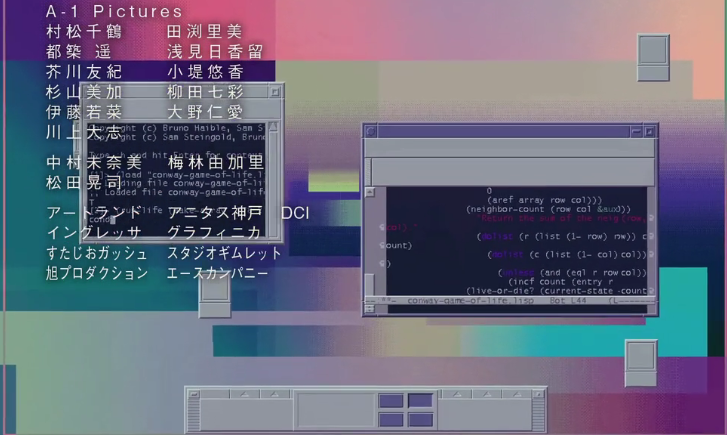
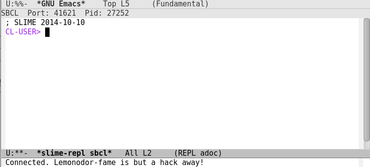

+++
title = "Ansi Common Lisp 初体验"
summary = ''
description = ""
categories = []
tags = []
date = 2016-06-11T10:47:13+08:00
draft = false
+++

#### 写在前面的废话
一直以来听闻lisp是一门高大上的语言，许多编程方式是源于lisp，如闭包，lambda ... 但是从来没有实际的去看过这门古老而神秘的编程语言。
但是昨天在偶然的情况下，补了一部名为 全部成为F 的番。浓厚的玛丽苏气息与日本独特的哲学观价值观。总之就是，人物的谈话我并不能听懂。不过最能引起一个码农兴趣的还是这部番剧的 ed 。此 ed 配合了新本格推理的科技元素。

对就是这样， 开始时是 linux 启动画面，然后是各种窗体，还有 ls 列文件 (dir溢出？？？) 。 图片中的 lisp 代码据某高人说是 生命游戏 。接着是 分形 ，最后呈现出真贺田四季的脸。这扑面而来的计算机科学气息深深的刺痛了码农的心。
于是今天开始了 lisp 之旅

#### 环境搭建
使用的是sbcl + emacs + slime

    apt-get install emacs
    apt-get install sbcl
    apt-get install slime

好吧， 根据别人教程来说，后面还要配置一下 ~/.emacs 文件。但是我安装了之后就可以正常使用了。
打开 emacs ， Alt + x 输入 slime 进入 lisp 的 REPL 如下

好了， 剩下的就是折腾 emacs ，学习 lisp 了

[Ansi Common Lisp 中文](https://github.com/acl-translation/acl-chinese)

#### Update 2016/6/19
断断续续看完了Common lisp。lisp的语法十分简洁(或许称得上没有语法)，但现在还是很难用它来写程序。因为lisp程序使用大量的递归，这对平常使用循环，迭代的我来说，思维上很难转化。近期又借了一本《计算机程序的构造与解释》(SICP)。这本是MIT大一入门课程，但是很有深度。许多书虽然很厚但是真正有用的压缩下来就那么几十页，但是这本书可以说是已经经过压缩的了。语言比较晦涩，不知是翻译的问题还是原书就这么精炼。正文内容和习题是夹杂在一起的，多部分习题涉及到了数学知识，不过如果学完高数的话读起来还好。
[SICP解题集](http://sicp.readthedocs.io/en/latest/)

