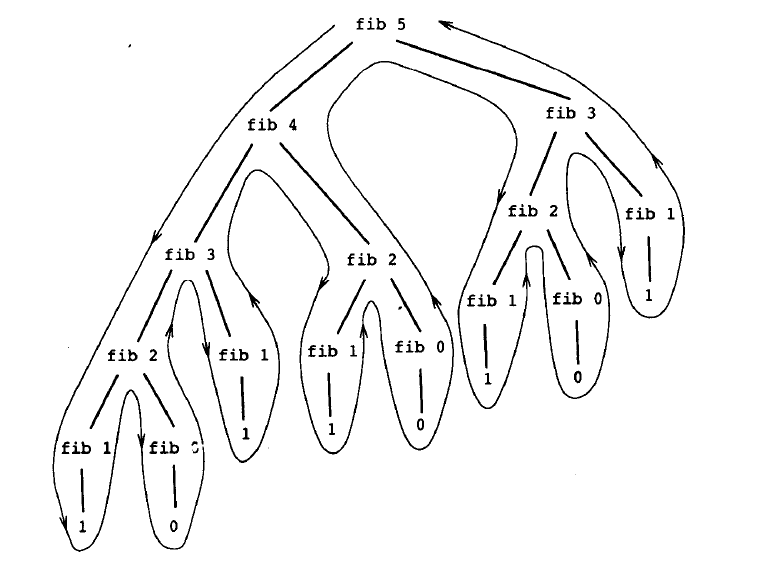

+++
title = "漫谈递归"
summary = ''
description = ""
categories = []
tags = []
date = 2016-06-15T10:25:36+08:00
draft = false
+++

### 递归和迭代
先看两个例子

    # 递归计算阶乘
    def factorial(n):
        if n==1:
            return 1
        else:
            return n * factorial(n-1)

    # 6! 的计算过程
    (factorial 6)
    (6 * factorial(5))
    (6 * (5 * factorial(4)))
    (6 * (5 * (4 * factorial(3))))
    (6 * (5 * (4 * (3 * factorial(2))))
    (6 * (5 * (4 * (3 * (2 * factorial(1))))))
    (6 * (5 * (4 * (3 * (2 * 1)))))
    (6 * (5 * (4 * (3 * 2))))
    (6 * (5 * (4 * 6)))
    (6 * (5 * 24))
    (6 * 120)
    720

    #迭代计算阶乘
    def factorial(n):
        def fact_iter(result, count):
            if count > n:
                return result
            else:
                return fact_iter(count * result, count+1)
        return fact_iter(1,1)

    # 6! 的计算过程
    (factorial 6)
    (fact-iter   1 1)
    (fact-iter   1 2)
    (fact-iter   2 3)
    (fact-iter   6 4)
    (fact-iter  24 5)
    (fact-iter 120 6)
    (fact-iter 720 7)
    720

第一个计算过程呈现一种先逐步展开， 然后收缩的形状。在展开阶段里，这一计算过程构造起一个需要推迟运算的链条，收缩阶段表现为这些运算的实际执行。要执行这种计算过程，我们便要保存好那些以后需要用到的信息。这样的计算过程是一个递归的计算过程。在计算n!时，这个链条的长度随着n而线性增长，所以这是线性递归。
与之相对应，第二个计算过程里并没有任何的增长或收缩。对于任意步，我们需要的只有` result count n `。这种计算过程是迭代的。从另一个角度来看这两个过程。在迭代的情况里， 计算过程中的任何一步，那几个变量都提供了有关计算状态的一个完整描述。而递归则需要之前计算所形成的链条。
有必要说明一点此处的递归指的是递归计算过程。当我们说一个过程是递归的时候，论述的是一个语法形式上的事实，说明这个过程中间接或直接的调用了这个过程自身。在说某一计算过程是递归的，我们指的是这一计算过程的进展方式。所以我们可能会说某个递归过程将产生一个迭代的计算过程。第二个计算过程确实是迭代的，因为它的状态能由其中的三个状态变量完全表示，虽然它使用的递归的语法。
具有例2这种特性的过程称为尾递归。我们知道递归过程中父过程中套有子过程，子过程中又套有子过程。一次次的入栈却不见出栈，总有一天栈溢出。当递归调用是整个函数体中最后执行的语句且它的返回值不属于表达式的一部分时，这个递归调用就是尾递归。尾递归的特点是在回归过程中不用做任何操作，这个特性很重要。就是说当前这个函数中的变量所占的那些栈空间不会再有人访问了，所以子过程可以直接覆写父过程中的变量占用的那层栈。

### 树形递归

根据斐波那契数列的定义，可得如下的递归过程：

    def fib(n):
        if n==0:
            return 0
        elif n==1:
            return 1
        else:
            return fib(n-1) + fib(n-2)

这个计算过程中多次计算了` fib(1) fib(0) `， 所以这是一种很糟的计算斐波那契的方法。一般来说，树形递归计算过程里所需要的步骤数将正比于树中的结点数，空间需求正比于树的深度。
我们可以使用迭代来计算斐波那契，因为斐波那契反复进行如下的变换:
初始时` a = 1 , b = 0 `
`a= a + b `
`b = a `

    def fib(n):
        def fib_iter(a, b, count):
            if count==n:
                return b
            else:
                return fib_iter(a+b, a, count+1)
        return fib_iter(1, 0, 0)

当然还有更好的方法
从上例我们可以知道，通过对` a=1，b=0 `反复进行` a=a+b, b=a `变换，我们可以求出斐波那契数列。不妨将这种变换称为T变换。换句话说，斐波那契数列可以通过将T变换的n次方应用于对偶(1,0)而产生出来。

已知对于对偶` (a,b) `，有变换` Tpq `为
` ab=bq+a(p+q) `
` b=bp+aq `
那么对于 `Tpq` 的平方 `(Tpq)2` 来说，有变换
`a= (bp+aq)q+(bq+a(p+q))(p+q)=b(2pq+q2)+a(p2+q2+2pq+q2)`
`b=(bp+aq)p+(bq+a(p+q))q=b(p2+q2)+a(2pq+q2)`
通过对比 `Tpq`
和 `(Tpq)2` ，可以得出变换 `Tp′q′` ，其中 `p′=p2+q2` 并且 `q′=2pq+q2` 因此，每次当 N 为偶数时，我们可以通过应用变换 `Tp′q′` 来减少一半计算 TN 所需的计算量。T变换即为 `Tpq` 变换族中` p=0, q=1 `的特殊情况，所以我们可以得出对数复杂度的斐波那契计算方法：

    def fib(n):
        def fib_iter(a, b, p, q, n):
            if n==0:
                return b
            elif n%2==0:
                return fib_iter(a, b, p*p+q*q, 2*p*q+q*q, n/2)
            else:
                return fib_iter(b*q+a*q+a*p, b*p+a*q, p, q, n-1)
        return fib_iter(1,0,0,1,n)

斐波那契数列通项

    def fib(n):
        sqrt5 = numpy.sqrt(5)
        phi = (1+sqrt5)/2
        return numpy.rint((phi**n - (-1/phi)**n)/sqrt5)

