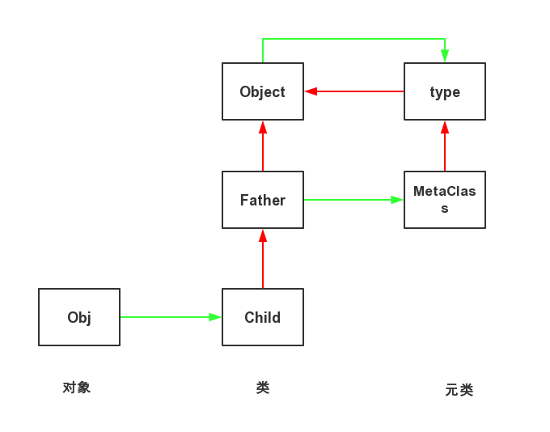

+++
title = "理解Python中的元类"
summary = ''
description = ""
categories = []
tags = []
date = 2016-09-19T13:26:55+08:00
draft = false
+++

元类 (metaclass) 是创建类的类，类是元类的实例，只有 type 及其派生类才可能充当元类。正如我们要先创建一个类，然后才能创建实例，我们先要创建元类，然后才能创建类。

好吧上面这段话确实很绕，下面我们一步一步来看

首先在 Python 中类也是一个对象

	class A(object):
	    pass

由于类也是一种对象(类可以称为类型对象)，所以它们也是通过什么东西来生成的。

	In [3]: a = A()

	In [4]: a.__class__
	Out[4]: __main__.A

	In [5]: a.__class__.__class__
	Out[5]: type

答案是 type
**object is the base of every object, type is the class of every type**

那 type 的类型又是什么呢

	In [10]: type(type)
	Out[10]: type

type 的类型就是他自身

type 比较特殊。它不只可以查看对象的类型，还可以接受一个类的描述作为参数，然后返回一个类

	Parent = type('Parent', (object,), {'bar': 1})

	def echo(self):
	    print self.bar

	Child = type('Child', (Parent,), {'echo': echo})

	child = Child()
	child.echo()

type 的参数依次为：

1. 类名；
2. 继承的父类集合；
3. 包含属性的字典；

但这种方法没有使用 class 关键字定义类来的直观

到这里，我们再来回想本文的开始处所讲:元类是用来创建类的。type 实际上就是一个元类，Python 使用 type 作为元类来创建所有的类。

元类实际上控制了类的创建行为，所以我们可以通过元类在类的创建时进行修饰。

可以使用 metaclass 关键字指定自定义元类

	class UpperAttrMetaclass(type):

	    def __init__(cls, name, bases, attrs):
	        print 'metaclass __init__'
	        super(UpperAttrMetaclass, cls).__init__(name, bases, attrs)

	    def __call__(self, *args):
	        print 'metaclass __call__', args
	        # return type.__call__(self, *args)
	        return super(UpperAttrMetaclass, self).__call__(*args)

	    def __new__(cls, name, bases, dct):
	        print 'metaclass __new__'
	        uppercase_attr = {}
	        for name, val in dct.items():
	            if not name.startswith('__'):
	                uppercase_attr[name.upper()] = val
	            else:
	                uppercase_attr[name] = val
	        # return type.__new__(cls, name, bases, uppercase_attr)
	        return super(UpperAttrMetaclass, cls).__new__(cls, name, bases, uppercase_attr)

	# For Python3
	# class A(metaclass=UpperAttrMetaclass):
	#     pass

	class A(object):
	    __metaclass__ = UpperAttrMetaclass

	    def __init__(self, bar):
	        print('A __init__')
	        self.bar = bar

	    def echo(self):
	        print(self.bar)

	print 'Create Instance'
	a = A(6)
	b = A(12)
	if hasattr(a, 'echo'):
	    print 'instance has echo'
	elif hasattr(a, 'ECHO'):
	    print 'instance has ECHO'
	else:
	    print 'instance has nothing'

Output

	metaclass __new__
	metaclass __init__
	Create Instance
	metaclass __call__ (6,)
	A __init__
	metaclass __call__ (12,)
	A __init__
	instance has ECHO

`UpperAttrMetaclass.__new__`是用来生成类A的类型对象, 我们可以在调用`type.__new__`之前更改 dct 变量来对类A进行修饰.
`UpperAttrMetaclass.__init__`是在生成类A的类型对象后被调用进行初始化. 第一个参数是已经生成的类A的类型对象.
`UpperAttrMetaclass.__call__`是在生成类A的实例对象时被调用的, 通过调用`type.__call__`可以生成该实例对象obj, 之后我们可以直接修改obj来实现实例对象的自定义.

元类的`__init__`和`__new__`只在创建类A时调用一次，而创建A的实例时，每次都会调用元类的`__call__`方法

Python 在创建类的过程中，会在类的定义中寻找`__metaclass__`，如果存在则用其创建类，否则使用内建的 type 来创建类。对于继承的情况，如果当前类没有找到，会继续在父类中寻找`__metaclass__`，直到所有父类中都没有找到才使用 type 创建类。所以元类可以隐式地继承到子类，但子类自己却感觉不到

	class A(object):
	    __metaclass__ = UpperAttrMetaclass

	    def __init__(self, bar):
	        print('A __init__')
	        self.bar = bar

	    def echo(self):
	        print(self.bar)

	class B(A):
	    pass

Output

	metaclass __new__
	metaclass __init__
	metaclass __new__
	metaclass __init__

元类可以用来干很多事,比如单例模式

    class Singleton(type):

        def __init__(self, *args, **kwargs):
            self.__instance = None
            super(Singleton, self).__init__(*args, **kwargs)

        def __call__(self, *args, **kwargs):
            if self.__instance is None:
                self.__instance = super(Singleton, self).__call__(*args, **kwargs)
                return self.__instance
            else:
                return self.__instance

	class A(object):
	    __metaclass__ = Singleton

	class Achild(A):
	    pass

	a1 = Achild()
	a2 = Achild()
	print id(a1) == id(a2)
	# True

为了彻底搞懂，再来看一个例子　

abc 是 Python 的一个内建库，用于模拟抽象基类（Abstract Base Classes）。开发者可以使用 abc.abstractmethod 装饰器，将指定了元类为 abc.ABCMeta 的类的方法定义成抽象方法，同时这个类也成了抽象基类。

	from abc import ABCMeta, abstractmethod

	class A(object):
	    __metaclass__ = ABCMeta

	    @abstractmethod
	    def method(self, bar):
	        pass

	a = A()

Output

	Traceback (most recent call last):
	  File "test.py", line 12, in <module>
	    a = A()
	TypeError: Can't instantiate abstract class A with abstract methods method

我们来看一下这个是如何实现的
abc.py 在/usr/lib/python2.7目录中

	def abstractmethod(funcobj):
	    """A decorator indicating abstract methods.

	    Requires that the metaclass is ABCMeta or derived from it.  A
	    class that has a metaclass derived from ABCMeta cannot be
	    instantiated unless all of its abstract methods are overridden.
	    The abstract methods can be called using any of the normal
	    'super' call mechanisms.

	    Usage:

	        class C:
	            __metaclass__ = ABCMeta
	            @abstractmethod
	            def my_abstract_method(self, ...):
	                ...
	    """
	    funcobj.__isabstractmethod__ = True
	    return funcobj

abstractmethod装饰器给类中的方法添加了`__isabstractmethod__ = True`

	class ABCMeta(type):

	    """Metaclass for defining Abstract Base Classes (ABCs).

	    Use this metaclass to create an ABC.  An ABC can be subclassed
	    directly, and then acts as a mix-in class.  You can also register
	    unrelated concrete classes (even built-in classes) and unrelated
	    ABCs as 'virtual subclasses' -- these and their descendants will
	    be considered subclasses of the registering ABC by the built-in
	    issubclass() function, but the registering ABC won't show up in
	    their MRO (Method Resolution Order) nor will method
	    implementations defined by the registering ABC be callable (not
	    even via super()).

	    """

	    # A global counter that is incremented each time a class is
	    # registered as a virtual subclass of anything.  It forces the
	    # negative cache to be cleared before its next use.
	    _abc_invalidation_counter = 0

	    def __new__(mcls, name, bases, namespace):
	        cls = super(ABCMeta, mcls).__new__(mcls, name, bases, namespace)
	        # Compute set of abstract method names
	        abstracts = set(name
	                     for name, value in namespace.items()
	                     if getattr(value, "__isabstractmethod__", False))
	        for base in bases:
	            for name in getattr(base, "__abstractmethods__", set()):
	                value = getattr(cls, name, None)
	                if getattr(value, "__isabstractmethod__", False):
	                    abstracts.add(name)
	        cls.__abstractmethods__ = frozenset(abstracts)
	        # Set up inheritance registry
	        cls._abc_registry = WeakSet()
	        cls._abc_cache = WeakSet()
	        cls._abc_negative_cache = WeakSet()
	        cls._abc_negative_cache_version = ABCMeta._abc_invalidation_counter
	        return cls
	    # 省略部分方法

可以看到`ABCMeta.__new__`将所要修饰的类与其抽象父类中的`__isabstractmethod__`为True的方法都添加到abstracts这个集合中，并添加了`__abstractmethods__`这个属性，然后返回修饰完成的类

	from abc import ABCMeta, abstractmethod

	class A(object):
	    __metaclass__ = ABCMeta

	    @abstractmethod
	    def say(self):
	        pass

	    @abstractmethod
	    def hi(self):
	        pass

	class B(A):
	    @abstractmethod
	    def bye(self):
	        pass

	print B.__abstractmethods__

Output

	frozenset(['bye', 'say', 'hi'])

----
2016.12.15
另外补充一下关于 Python 查找顺序的问题

实例的属性查找可归结：先在自己的空间查找，若没找到则到对应类空间去查找，并一路向上直至object
类的属性查找稍稍复杂一点：先在自己的 mro 上查找，若没找到再到元类的类空间查找

注意

Python mro 中的类的元类必须有继承关系

    class Meta1(type):
        m = 1

    class Meta2(type):
        m = 2

    class A(object):
        __metaclass__ = Meta1

    class B(object):
        __metaclass__ = Meta2

    class C(A, B):
        pass

Traceback (most recent call last):
  File "mro.py", line 13, in <module>
    class C(A, B):
TypeError: Error when calling the metaclass bases
    metaclass conflict: the metaclass of a derived class must be a (non-strict) subclass of the metaclasses of all its bases

#### Reference
- [python单例模式与metaclass](https://segmentfault.com/a/1190000004278703)
- [使用元类 - 廖雪峰的官方网站](http://www.liaoxuefeng.com/wiki/001374738125095c955c1e6d8bb493182103fac9270762a000/001386820064557c69858840b4c48d2b8411bc2ea9099ba000)
- [[译]什么是元类metaclass?](https://segmentfault.com/a/1190000005823759)

