+++
title = "SegmentFault 光棍节挑战writeup"
summary = ''
description = ""
categories = []
tags = []
date = 2016-11-12T10:33:49+08:00
draft = false
+++

第一关  
  
查看 html 源码可以看到还有一个 a 标签被css隐藏了  

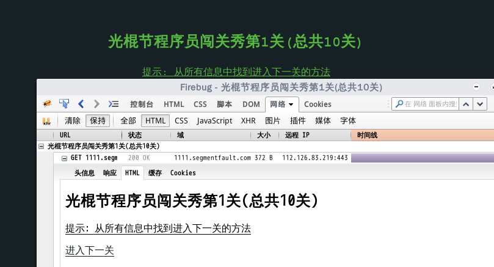 

第二关  

还是在 html 源码中  

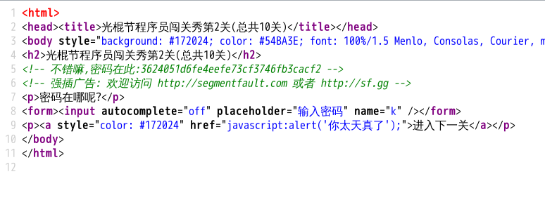

第三关  

key 在 响应头中

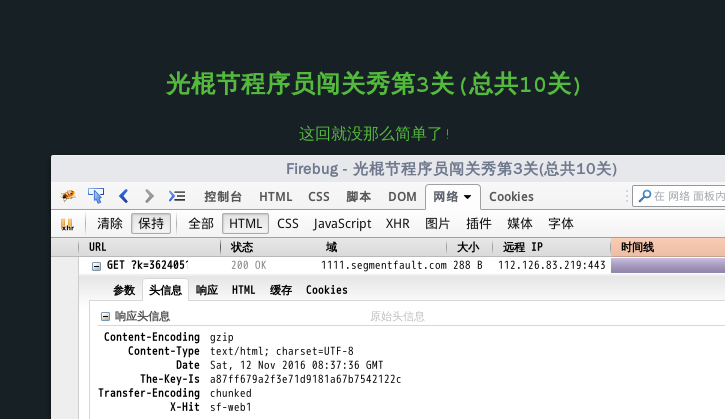

第四关  

提示是 观察密码的规律  

https://1111.segmentfault.com/?k=a87ff679a2f3e71d9181a67b7542122c

k 是32位的，应该是 md5

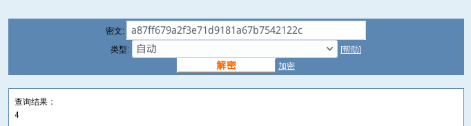 

那么第五关的话，应当为 5 的 md5 值 e4da3b7fbbce2345d7772b0674a318d5

第五关  

 

扫描后，进入到 sf 的官网，应该不是这样的。

我们将图片保存，查看 hex 得到 key

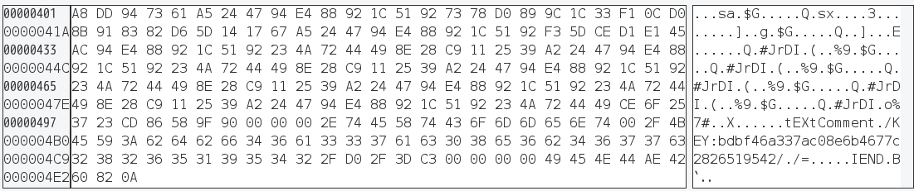 

第六关  

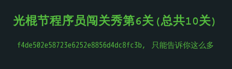 

你只能告诉我这么多，但 Google 可以告诉我更多  

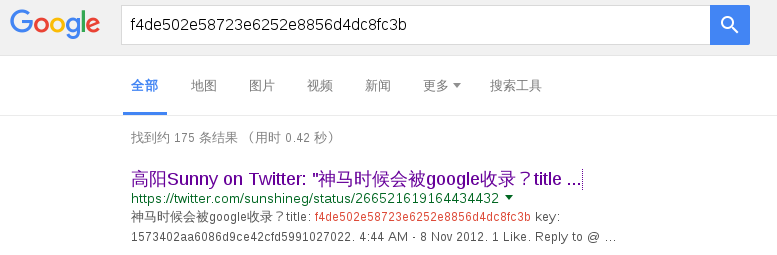 

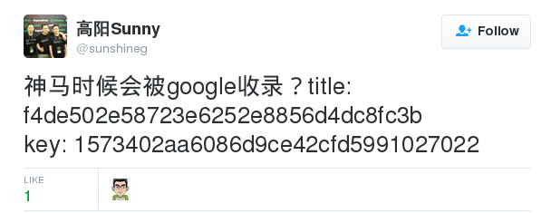 

看评论发现，原来n年前就有了，好像这个光棍节挑战 n 年没变过了

第七关  

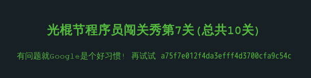 

上一题是 Google 到的，这一题也 Google ？

直接 k=a75f7e012f4da3efff4d3700cfa9c54c 访问就行了  

第八关  

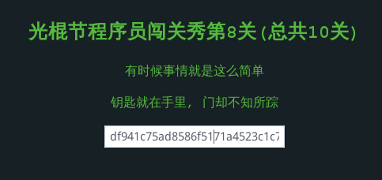 

没写提交按钮，提交方式是 GET

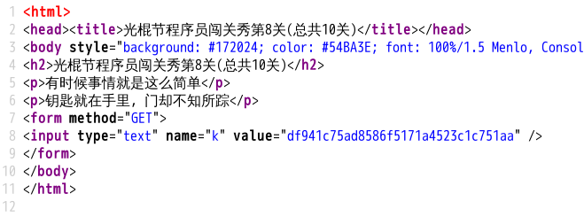 

如果是 GET 就不用大费周章了，因为我们可以直接将 value 的值放到url 中访问，改成 POST 试一下

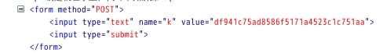

第九关  

这关有点难

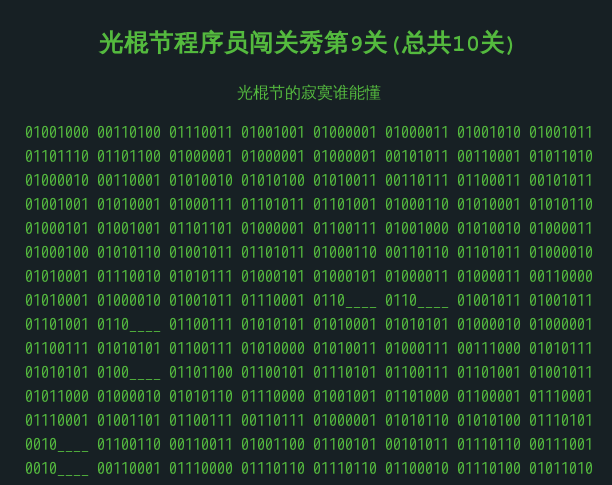

这么整齐，8位8位的分开，看起来像是二进制。横线是未知的4位

瞄了一眼域名`https://1111.segmentfault.com` 说不定是 1111

替换后每8位转换成ascii表对应的字符，得到了base64加密的字符串(尾部有=)

解密后的内容，一堆乱码。

看了看头几个字节，好像见过

查了一下是 tar.gz 的文件头

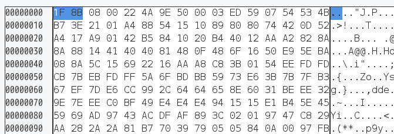

打开后，得到苍老师

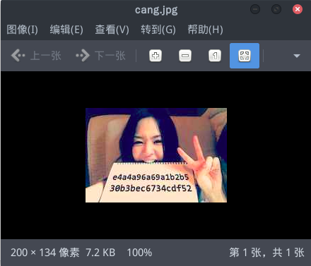 

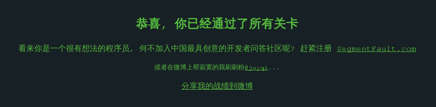 

一共不应该十关么？
    