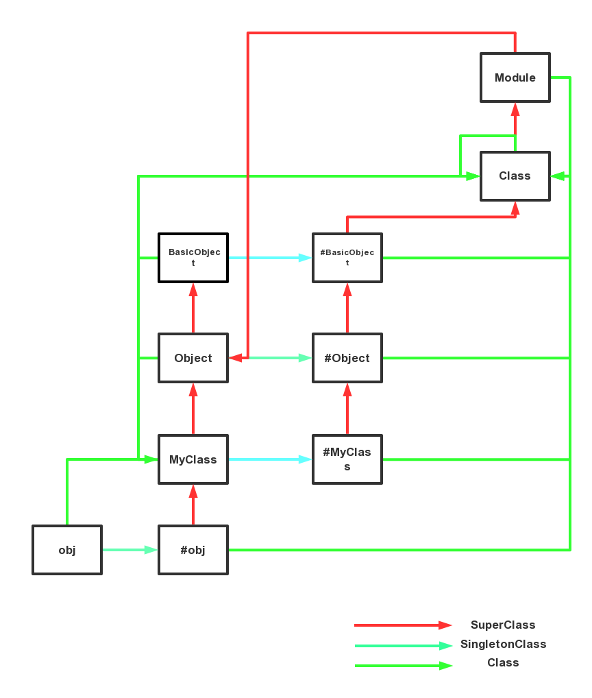

+++
title = "Ruby 对象模型小记"
summary = ''
description = ""
categories = []
tags = []
date = 2016-12-20T04:52:36+08:00
draft = false
+++

#### Ruby 中的对象模型
对象模型可以大致表现为下图

当进行方法查找时还要考虑到 `include` 或 `prepend` 进来的模块

#### self
不管在 Ruby 程序的哪一个位置，都存在一个当前对象 self
比如定义一个类时， self 就是当前的类

	class MyClass
		# self : MyClass
	    @var = 1
	    def self.get_var
			# self : obj
	        @var
	    end
	    def set_var(var)
	        @var = varw
	    end
	    def get_var
	        @var
	    end
	end

	obj = MyClass.new
	puts MyClass.get_var
	puts obj.get_var
	obj.set_var(666)
	puts obj.get_var
	puts MyClass.get_var

	# Output
	# 1
	# nil
	# 666
	# 1

在 MyClass 充当 self 时定义的那个 @var 变量称为 类实例变量
一个类实例变量只可以被类本身所访问，而不能被类的实例或者子类所访问

我们也可以使用 `instance_eval` 和 `class_eval` 等方法来改变当前的 self

	class MyClass
	    puts self
	end
	puts self
	MyClass.class_eval{ puts self}
	MyClass.instance_eval{puts self}
	obj = MyClass.new
	obj.instance_eval {puts self}

	# Output
	# MyClass
	# main
	# MyClass
	# MyClass
	# <MyClass:0xf759994c>

#### 单件类/本征类

我们知道单件方法是只对单个对象生效的方法

	s = "just a string"
	def s.new_method
	    puts "A new method only belong myself"
	end

	s.new_method
	puts s.singleton_methods

	# Output
	# A new method only belong myself
	# new_method

单件方法存放于单件类中, Ruby 查找方法时会先查找单件类然后沿祖先链攀升
	# 获取 s 的单件类的两种方法
	singleton_class = class << s
		self
	end

	puts singleton_class
	puts s.singleton_class

	# Output
	# <Class:#<String:0x007fe08ffcb0a8>>
	# <Class:#<String:0x007fe08ffcb0a8>>

类方法就是一种单件方法

	class MyClass
		class << self
			def new_method
				puts "A new method only belong myself"
			end
		end
	end

#### 打开类
当定义一个类时，若它已经存在，则会重新打开这个已存在的类，并添加上所定义的方法

	class String
	    def new_method
	        puts 'A new method'
	    end
	end

	s = "hello world"
	s.new_method

	# Output
	# A new method

打开类涉及全局性的修改，使用起来带有风险，比如无意中覆盖了类中的同名方法。

#### 细化
我们可以使用 细化 进行安全的修改

	module StringExtensions
	    refine String do
	        def length
	            "It's not %d" % [super]
	        end
	    end
	end

	module Show
	    using StringExtensions
	    puts "123456".length

	end

	puts "123456".length

	# Output
	# It's not 6
	# 6

