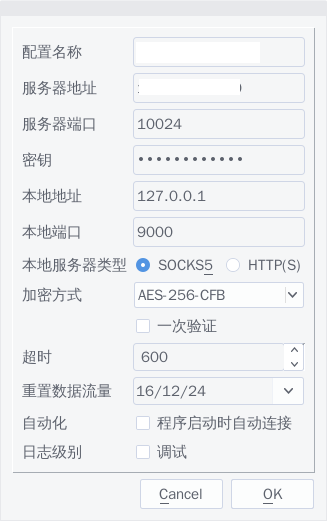

+++
title = "shadowsocks 基本配置"
summary = ''
description = ""
categories = []
tags = []
date = 2016-12-24T04:52:20+08:00
draft = false
+++

笔者这里服务端，客户端均为 debian jessie

#### 服务端

先确保以下包被安装

	$ apt-get update
	$ apt-get install apt-transport-https ca-certificates gnupg2

下载GPG

	$ sudo apt-key adv \
	       --keyserver hkp://ha.pool.sks-keyservers.net:80 \
	       --recv-keys 58118E89F3A912897C070ADBF76221572C52609D

添加

	deb https://apt.dockerproject.org/repo debian-jessie main

至 `/etc/apt/sources.list.d/docker.list`

执行

	$ apt-get update
	$ apt-get install docker-engine

下载我们的含有 shadowsocks 的 docker 镜像

	docker pull oddrationale/docker-shadowsocks

启动一个容器

	docker run -d -p 10024:10024 oddrationale/docker-shadowsocks -s 0.0.0.0 -p 10024 -k yourpassword -m aes-256-cfb

#### 客户端

1) 安装 libQtShadowsocks
先确保以下依赖已被安装

	$ apt-get install qt5-qmake qtbase5-dev libbotan1.10-dev

本地 `git clone  https://github.com/shadowsocks/libQtShadowsocks.git`

进入目录后执行

	$ dpkg-buildpackage -uc -us -b

在**上一级目录**中会多三个 deb 包

	libqtshadowsocks_1.10.0-1_amd64.deb
	libqtshadowsocks-dev_1.10.0-1_amd64.deb
	shadowsocks-libqtshadowsocks_1.10.0-1_amd64.deb

`dpkg -i`  安装这三个包

2) 安装 shadowsocks-qt5

本地 `git clone https://github.com/shadowsocks/shadowsocks-qt5.git`

进入目录后执行

	$ dpkg-buildpackage -uc -us -b

在**上一级目录**中会生成一个 deb 包，安装

	$ dpkg -i shadowsocks-qt5_2.8.0-1_amd64.deb

配置一下就可以了

