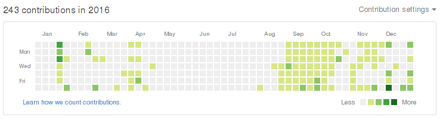

+++
title = "2016 的墓志铭"
summary = ''
description = ""
categories = []
tags = []
date = 2017-01-24T08:20:31+08:00
draft = false
+++

2016 已死，愿你安眠  R.I.P
<iframe frameborder="no" border="0" marginwidth="0" marginheight="0" width=330 height=86 src="//music.163.com/outchain/player?type=2&id=26124987&auto=1&height=66"></iframe>

### 关于代码
这一年算是比较努力的一年，GitHub上 243 个contributions

主要集中于以下几个 projects  *~~开坑一时爽~~*

[rumRaisin](https://github.com/Hanaasagi/rumRaisin)  存放了部分奇葩的CTF题目，没有使用 docker 差评!
[Ushio](https://github.com/Hanaasagi/Ushio)  一个基于 Tornado Redis MongoDB的社区，至今还在拖更
[codepad](https://github.com/Hanaasagi/codepad)  模仿 codepad 的平台，仅支持 Python
[py-actor](https://github.com/Hanaasagi/py-actor)  Actor 模式的 Python 实现，目前尚有缺陷
[pyLeetCode](https://github.com/Hanaasagi/pyLeetCode)  占据了大量绿点点的 LeetCode 题解

嗯，明年需要改掉拖更的毛病，顺便 fix 掉已有的几个 bugs，任重而道远

### 关于博客
Blog 是今年刚开的，服务器每月已经 60+ 了。
觉得写得不错的文章，我会发到开发者头条上
目前是下面这个样子，有好多篇是0赞 ( ＿ ＿)ノ｜

### 关于生活

糟透了

### 关于读书
心爱的国产寨板让我的阅读量飞了起来  ~~人丑就该多读书~~
统计读完且 200pages+ 的技术类书籍

Python Cookbook 3rd
七周七并发模型
可能与不可能的边界
精通Python设计模式
LINUX/UNIX设计思想
Python性能分析与优化
Ruby基础教程
Python网络编程攻略
Python数据分析基础教程
XSS跨站脚本攻击与防御
图解HTTP
程序是怎样跑起来的
Introduction to Tornado
web之困 现代web应用安全指南
Ruby元编程
Python编程实战:运用设计模式、并发和程序库创建高质量程序
Flask Web开发：基于Python的Web应用开发实战

也许这将成为人生中阅读量最大的一年吧，毕竟即将成为社畜 (￣▽￣")

### 关于 2017
(ง •̀_•́)ง
1) 学日语 学日语 学日语 重要的事情说三遍
2) 找一份满意工作
3) 如果工作定下来的话，养只猫
4) 想去旅行
5) 学习绘画，我想要萝莉｡◕‿◕｡

