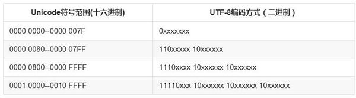

+++
title = "谈谈 Python 中的编码"
summary = ''
description = ""
categories = []
tags = []
date = 2017-01-25T06:50:49+08:00
draft = false
+++

计算机编码大致经历了以下几个阶段
1) ASCII
2) EASCII  扩展了西欧字符
3) GB2312  等各国扩展的编码
4) Unicode 对各种语言字符统一规范化处理
5) UTF-8   方便网络传输，节省存储空间

关于各种编码，可以通过 Wiki 或者 知乎 来了解

下面来说一说， Unicode 如何转化成 UTF-8

以汉字 `花` 为例

    >>> u'花'
    u'\u82b1'

可以知道 `花` 的 Unicode 码为 `82b1`，对照上图可得位于区间 `0000 0800-0000 FFFF`，所以对应的 UTF-8 码占用三个字节。`82b1` 用 二进制表示为 `1000001010110001`，按顺序填充即可得 `11101000-10001010-10110001`

回到正题，我们先来查看一下 Python 中的默认编码

Python2

    In [1]: import sys

    In [2]: sys.getdefaultencoding()
    Out[2]: 'ascii'

Python3

    In [2]: import sys

    In [3]: sys.getdefaultencoding()
    Out[3]: 'utf-8'

我们可以知道 Python 的默认编码在 Python3 之前是 ascii。这是由于

>Python 的诞生(1989年)比 unicode 标准发布的时间(1991年10月发布1.0.0)还要早，所以最早的Python 只支持 ascii ，并没有关心编码问题。之后扩充了 unicode 编码，但是默认编码仍为 ascii

(以上未经考证，参阅各种中文博客所写)

好了，这个默认编码有什么用处呢

以 Python2 举例

Python2 中，有三大类字符串类型，`str`（byte string，字节字符串），`unicode`（text string，文本字符串）和 `basestring`。其中 `basestring` 是前两者的父类。我们平常写代码时，不管用单引号还是双引号定义字符串，都是字节字符串。要想使用文本字符串则需要 `u''`

    In [1]: isinstance('hello', unicode)
    Out[1]: False

    In [2]: isinstance('hello', str)
    Out[2]: True

当我们尝试将字节字符串和一个文本字符串拼接时，比如下例

    s = 'abc' + u'bcd'

Python 会隐式执行 `'abc'.decode(sys.getdefaultencoding())` ，将字节字符串 `'abc'` 转换为 `u'abc'`。如果字节字符串中含有非 ascii 字符便会抛出如下这样的错误

    UnicodeDecodeError: 'ascii' codec can't decode byte 0xe4 in position 0: ordinal not in range(128)

为了避免 `UnicodeDecodeError` 可能会有人这么做

    import sys
    reload(sys)
    sys.setdefaultencoding('utf-8')

但这并不是最佳方法，反而会引入更多问题

    In [9]: import sys

    In [10]: sys.getdefaultencoding()
    Out[10]: 'ascii'

    In [11]: d = {'a': 0}

    In [12]: 'a' in d
    Out[12]: True

    In [13]: u'a' in d
    Out[13]: True

    In [14]: 'a' == d.keys()[0]
    Out[14]: True

    In [15]: u'a' == d.keys()[0]
    Out[15]: True

    In [16]: reload(sys)
    <module 'sys' (built-in)>

    In [17]: sys.setdefaultencoding('utf-8')

    In [18]: sys.getdefaultencoding()
    'utf-8'

    In [19]: d = {'你好': 'hello'}

    In [20]: '你好' in d
    True

    In [21]: u'你好' in d
    False

    In [22]: '你好' == d.keys()[0]
    True

    In [23]: u'你好' == d.keys()[0]
    True

可以看到执行 `u'你好' in d` 时返回的是 `False`，这是因为 `in` 操作符对键进行散列，然后比较哈希值来判断是否相等。在 utf-8 编码下，无论是字节字符串还是文本字符串，只有能够用 ASCII 表示的字符才会被散列到相同的值

    In [27]: hash('hello')
    Out[27]: -1267296259

    In [28]: hash(u'hello')
    Out[28]: -1267296259

    In [29]: hash('你好')
    Out[29]: -2141741720

    In [30]: hash(u'你好')
    Out[30]: 660139871

而 `==` 操作符会先调用 `decode(sys.getdefaultencoding())` 解码成 unicode，再进行比较，所以返回了 `True`

至于 Python3
Python3 中默认编码已经从 ascii 修改为 utf-8 了，而且字符串类型有较大改动，分为 `bytes` (字节字符串) 和 `str` (unicode编码的文本字符串)，两者之间不会进行任何的隐式转换

    In [18]: d = {'a': 0}

    In [19]: 'a' in d
    Out[19]: True

    In [20]: u'a' in d
    Out[20]: True

    In [21]: b'a' in d
    Out[21]: False

    In [22]: 'a' == list(d.keys())[0]
    Out[22]: True

    In [23]: u'a' == list(d.keys())[0]
    Out[23]: True

    In [24]: b'a' == list(d.keys())[0]
    Out[24]: False

另外在 Python3 中已经移除 `setdefaultencoding` :)

再来说说刚才用到的这个 `decode` 方法，`decode` 还有一个兄弟方法 `encode`。
根据刚才所述，无论是 Python2 还是 Python3 ，字符串都有有两种表示，即文本表示和字节表示
编码就是将文本转换成字节，如

    In [1]: u'你好'.encode('utf-8')
    Out[1]: '\xe4\xbd\xa0\xe5\xa5\xbd'

解码就是将字节转换为文本，如

    In [2]: '\xe4\xbd\xa0\xe5\xa5\xbd'.decode('utf-8')
    Out[2]: u'\u4f60\u597d'

在 Python2 中，str 和 unicode 都有 `encode` 和 `decode` 方法。但是不建议对 str 使用 `encode`，对 unicode 使用 `decode`。想想便知，已经是字节的话为什么还要 `encode` 呢。Python3 进行了改进，str 只有一个 `encode` 方法将文本转化为字节，而且 bytes 也只有一个 `decode` 方法将字节转化为一个文本。

#### Reference
[DefaultEncoding - Python Wiki](https://wiki.python.org/moin/DefaultEncoding)
[PYTHON编码的前世今生](https://foofish.net/python-character-encode.html)
[初探Python编码](http://blog.csdn.net/liuxincumt/article/details/8183391)
[Why sys.setdefaultencoding() will break code](https://anonbadger.wordpress.com/2015/06/16/why-sys-setdefaultencoding-will-break-code/)

