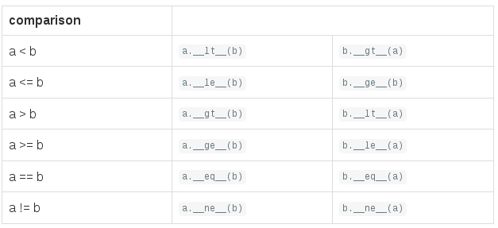

+++
title = "如何使用 NotImplemented"
summary = ''
description = ""
categories = []
tags = []
date = 2017-02-18T07:41:00+08:00
draft = false
+++

*version python3.5.3*

`NotImplemented` 是 Python 中的一个内建常量，文档中表述如下

This object is returned from comparisons and binary operations when they are asked to operate on types they don’t support. See Comparisons for more information. There is exactly one `NotImplemented` object. `type(NotImplemented)()` produces the singleton instance.

当比较操作和二元运算中遇到不支持的类型时，会返回这个对象

根据个人浅薄的编程经验来说，遇到不支持的类型时，我常常会 `raise NotImplementedError`;而返回常量 `NotImplemented` 的这种处理方式有点像 C 的风格

那么这种形式有什么好处呢

当我们进行对象间的比较时(调用对象的 `__eq__`, `__lt__`)，如果对应的方法返回了 `NotImplemented`，则会从右操作数的角度调用方法进行比较。
如下：

    In [22]: class A(object):
        ...:     def __init__(self, num):
        ...:         self.num = num
        ...:     def __eq__(self, other):
        ...:         print('call A __eq__')
        ...:         return NotImplemented
        ...:
        ...:

    In [23]: class B(object):
        ...:     def __init__(self, num):
        ...:         self.num = num
        ...:     def __eq__(self, other):
        ...:         print('call B __eq__')
        ...:         return self.num == other.num
        ...:

    In [24]: a = A(2)

    In [25]: b = B(2)

    In [26]: a == b
    call A __eq__
    call B __eq__
    Out[26]: True

    In [27]: b == a
    call B __eq__
    Out[31]: True

可以看到首先调用了 `a.__eq__(b)`，由于返回了 `NotImplemented` 常量，所以 `b.__eq__(a)` 被调用。

对应的如下

