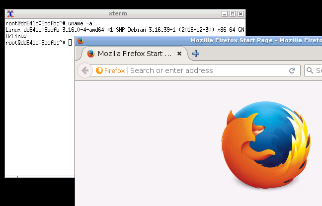

+++
title = "Use Debian in your browser"
summary = ''
description = ""
categories = []
tags = []
date = 2017-02-22T14:09:35+08:00
draft = false
+++

Sometimes I have to use some softwares which only support GUI. But, I don't want to install the dependent package and build the whole environment in my os.  
So I build a debian docker image with noVNC, it still use 648 MB.  

You can just pull the image  

    docker pull hub.c.163.com/hanaasagi/debianbrowser:latest

Or build by yourself  

Dockerfile  

    # for chinese, need to change the hub
    FROM daocloud.io/library/debian:jessie
    
    # for chinese
    RUN echo "deb http://mirrors.163.com/debian jessie main non-free contrib" >/etc/apt/sources.list
    RUN echo "deb-src http://mirrors.163.com/debian jessie main non-free contrib" >>/etc/apt/sources.list

    RUN apt-get update -y && \
    apt-get install -y \
    net-tools \
    openbox \
    x11vnc \
    xvfb \
    python \
    geany \
    firefox-esr \
    menu \
    git \
    ttf-wqy-zenhei && \
    cd /root && git clone https://github.com/novnc/noVNC.git && \
    cd noVNC/utils && git clone https://github.com/novnc/websockify && \
    cd /root

    ADD startup.sh /startup.sh

    RUN chmod 0755 /startup.sh && \
    apt-get autoremove && \
    apt-get clean && \
    rm -rf /var/lib/apt/lists/* /tmp/* /var/tmp/*

    RUN apt-get update -y && apt-get dist-upgrade -y

startup.sh

    #!/bin/bash

    export DISPLAY=:1
    Xvfb :1 -screen 0 1024x768x16 &
    sleep 5
    openbox-session&
    x11vnc -display :1 -nopw -listen localhost -xkb -ncache 10 -ncache_cr -forever &
    cd /root/noVNC && ln -s vnc_auto.html index.html && ./utils/launch.sh --vnc localhost:5900

Then run

    docker build -t debianbrowser .

and start the container  

    docker run -d -t -i -p 6080:6080 debianbroswer:latest ./startup.sh

open `http://ip:6080` and enjoy it :

    