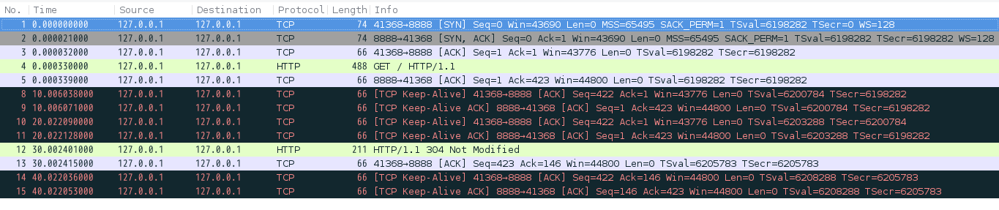
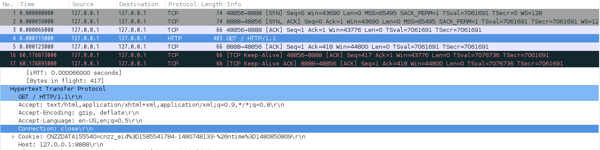
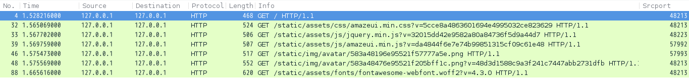

+++
title = "关于 Keep-alive 的一点分析"
summary = ''
description = ""
categories = []
tags = []
date = 2017-04-07T06:14:43+08:00
draft = false
+++

*本篇文章为蠢作者对 TCP Keep-alive 和 HTTP Keep-alive 的分析*  

平常所说到的 Keep-alive 有两种，一种为 TCP Keep-alive，另一种为 HTTP Keep-alive。首先说明这两个概念是不同的  

TCP 的 Keep-alive (截取自[TCP Keepalive HOWTO](http://www.tldp.org/HOWTO/html_single/TCP-Keepalive-HOWTO/)并翻译)

>首先TCP是通过三次握手建立连接的，用来传输上层协议的报文。难免会遇到上层协议迟迟不发送报文，或者隔很久才会发送一次报文的情况(例如 WebSocket)，这时便需要判断连接是断掉了还是确实没有数据传输。Keep-alive 报文便是为此而生的。当超过一段时间之后，会发送一个数据为空的报文给对方，如果对方回应了这个报文，说明对方还在线，连接可以继续保持，如果对方没有报文返回，并且重试了多次无果则认为连接已经丢失。

HTTP 的 Keep-alive (摘自 [wiki-HTTP持久连接](https://zh.wikipedia.org/wiki/HTTP%E6%8C%81%E4%B9%85%E8%BF%9E%E6%8E%A5))

>HTTP持久连接（HTTP persistent connection，也称作HTTP keep-alive 或HTTP connection reuse）是使用同一个TCP连接来发送和接收多个HTTP请求/应答，而不是为每一个新的请求/应答打开新的连接的方法。

综合上面的定义，蠢作者认为 TCP 的 Keep-alive 具体是指一种用来检测连接是否存活的机制(心跳包)；而 HTTP 的 Keep-alive 则是复用一条 TCP 连接来传输 HTTP request/response 的技术(减少三次握手四次挥手的开销)  

好了，蠢作者码了段代码，这段代码中在 client 发送 HTTP request 后，经过 30s 才会发送对应的 response。借此进行抓包分析

```python
import tornado.ioloop
import tornado.gen


class MainHandler(tornado.web.RequestHandler):

    @tornado.gen.coroutine
    def get(self):
        yield tornado.gen.sleep(30)
        self.write("Hello, world")


def make_app():
    return tornado.web.Application([
        (r"/", MainHandler),
    ], debug=True)


if __name__ == "__main__":
    app = make_app()
    app.listen(8888)
    tornado.ioloop.IOLoop.current().start()
```

抓包结果如下图



黑色高亮的便是心跳包
可以看到 HTTP 请求发送后， Server 端并没有及时返回(sleep 30s)。此时双端并没有释放掉这个 TCP 连接，而是浏览器不断地发送 Keep-alive 来检测连接是否存活。

经过测试心跳包发送的间隔 Firefox 下为 10s，而 Chrome 为 45s，curl 命令下则为 60s

其实这个心跳包的间隔是可以自定义的，相关配置在 `/proc/sys/net/ipv4` 目录下的这几个文件

1. `tcp_keepalive_intvl`
The number of seconds between TCP keep-alive probes
心跳包的重试间隔 默认75s

2. `tcp_keepalive_probes`
The maximum number of TCP keep-alive probes to send before giving up and killing the connection if no response is obtained from the other end
重试多少次认为连接失效 默认9次

3. `tcp_keepalive_time`
The number of seconds a connection needs to be idle before TCP begins sending out keep-alive probes.   Keep-alives are sent only when the SO_KEEPALIVE socket option is enabled.
多久未发送/接收数据后发送心跳包 默认7200s

当然也可以在编程时修改掉(以 `Python` 为例)

`socket.TCP_KEEPCNT` <=>  `tcp_keepalive_probes`  
`socket.TCP_KEEPIDLE` <=> `tcp_keepalive_time`  
`socket.TCP_KEEPINTVL` <=> `tcp_keepalive_intvl`

当然上面的例子使用的是 HTTP/1.1 默认 HTTP Keep-alive。那么再让我们试试 Connection: Close，看看TCP层 会不会发生变化

```
curl 'http://127.0.0.1:8888/' -H 'Connection: close' -H 'Host: 127.0.0.1:8888'
```



可以看到并没有什么卵用，证实了本文一开始的观点：HTTP 的 Keep-alive 和 TCP 的 Keep-alive 两个概念。  

根据定义 HTTP 的 Keep-alive 会对 TCP 连接进行复用，那么是否只使用一条连接呢？
蠢作者还是通过一个本地服务来演示，所有资源都从同一个 web 服务获取，排除向 cdn 请求的情况。



从上图可以看到有连接被复用，但是并不是只通过一条TCP连接完成所有请求。浏览器是存在并发请求的。最大并发请求数各浏览器存在差异，Sever 端如果使用 nginx 可以通过设置 `keepalive_timeout time` 来指定这条 TCP 连接的维持时间。

### Reference
[TCP Keepalive HOWTO](http://www.tldp.org/HOWTO/html_single/TCP-Keepalive-HOWTO/)  
[RFC 2616 section-8.1](https://tools.ietf.org/html/rfc2616#section-8.1)

    
