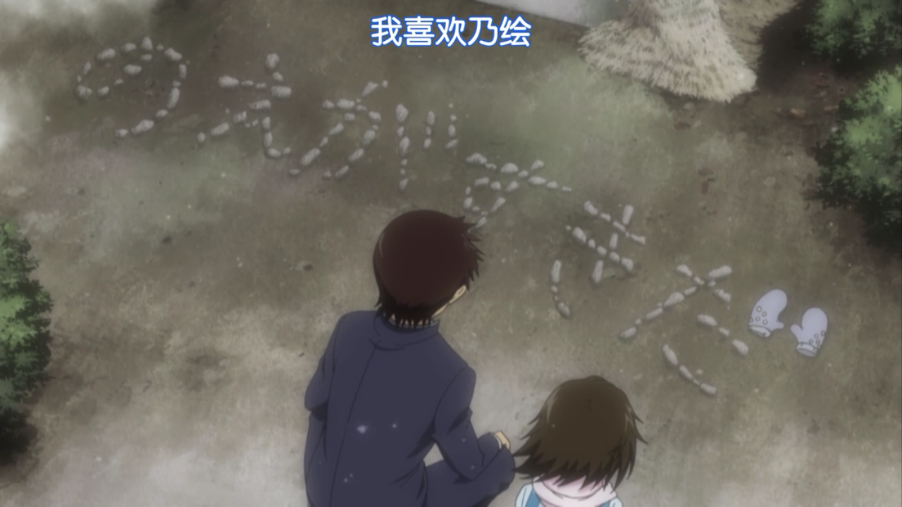

+++
title = "我想拭去你的泪水—true tears 漫评"
summary = ''
description = ""
categories = []
tags = []
date = 2017-05-25T02:33:39+08:00
draft = false
+++

最近补了 true tears 这部番，感觉实在是太棒了。所以不禁想要发表一下感想，上一次写这种文章大概是高中时期了，所以可能表达上出现语无伦次的情况。

true tears 是 2008 年的冬番，距今已经有 9 年了，所以可能会觉得画风上有些奇怪(个人还蛮喜欢这种风格的)，但这并不影响它成为我心目中的一部佳作，因为个人认为故事才是一部动漫的灵魂，而不是那几卡的精彩作画。BD 销量 5,988，数据来自名作之壁吧。制作公司为 P.A.WORKS， P.A.WORKS 就是那个制作了 AB(2010年) 和 白箱(2014年) 的公司，值得一提的是，这是这家公司第一次独立制作的动画。该作品以 La'cryma 发售的同名游戏 true tears 为原作，但除了主题同样是 true tears ，其他毫无关联性，故事、角色都属于原创。监督是西村纯二，我对这个人并没有什么印象。不过此番的系列构成是冈田麿里。冈妈就不必说了，估计现在大家都知道的。关口可奈味担任总作画监督。  

音乐方面音我写不如你亲自来感受  
BGM
<iframe frameborder="no" border="0" marginwidth="0" marginheight="0" width=330 height=86 src="//music.163.com/outchain/player?type=2&id=456177&auto=0&height=66"></iframe>
OP
<iframe frameborder="no" border="0" marginwidth="0" marginheight="0" width=330 height=86 src="//music.163.com/outchain/player?type=2&id=26475785&auto=0&height=66"></iframe>
PS. eufonius 也是穹妹 OP 的演唱者

好了进入重点，为何我认为她是一部佳作。这部作品正如冈妈的其他作品一样(因为创作时间更早，或许更应当说其他作品和这部一样)，通过细致的人物心里刻画与气氛烘托，引发观众对胃药的需求，却还能吸引观众忍受着胃痛继续看下去(笔者实际感受)。

先来简短的介绍一下主要人物    
仲上真一郎：男主人公  
野伏三代吉：男二，主人公朋友
汤浅比吕美：青梅竹马，其亲生父母和男主人公父母是朋友，但双双去世，她成为仲上家的养女  
石动乃绘：女主角？，由于奶奶的死，变得不会再流泪。只有收集到重要的人的眼泪，才能恢复。(奶奶为了让她不在其死后悲伤，而给她的心理暗示)  
安藤爱子：男二三代吉的女朋友  
石动纯：乃绘的哥哥，喜欢乃绘

进入正题，故事发生在一个平静的乡下小镇(秋冬季节)，整部番也是这种气氛，但是平和的表象下充斥着各主要人物内心的矛盾。

这就是养女的第一次登场，一闪而过，十分自然，就像一个无关角色。

然后便是男主的独白：  
"我心目中的你，总是在哭泣"  
"我想拭去你的泪水，但是，泪水逝去后那脸颊的柔软触感，我却无从得知……"  

这番话当然是对养女说的，男主内心其实是喜欢着养女的。接着男主下楼，与正在记账的养女聊了几句(男主家里是开酒厂的，养女主动承担了部分家务)。通过这对话便可以看出，男主内心有话却无法直说，二者仿佛隔了一层玻璃。随着剧情的逐步深入可以逐步了解到，男主的母亲很讨厌比吕美的母亲，认为她和自己的老公有一腿，甚至认为比吕美是自己老公的私生女。同时她也将这份抱有恶意的想法灌输给了比吕美，使得她将自己对于男主的感情隐藏了起来。而男主这方面则是太过迟钝，他不仅没有察觉到比吕美的感情，也没有察觉到女三爱子的感情。爱子虽然名义上是男主好友的女朋友，但实际上却喜欢着男主。做男二的女朋友也是因为男主从中牵线搭桥。女三爱子是此番中第一个直面自己内心的人，她率先向男主明确的表达了自己的心意。被男主拒绝后，因为觉得自己对不起男二的好意，所以一直向找男二提出分手。当然男二也通过平日的种种(爱子为男主织毛衣)，早已发现了爱子的真正心意。可男二一直在回避分手的请求，或许应当说是在欺骗自己

"算了算了 小爱手很笨呢"  
"但是这种地方正是……"  
"不要对我这么温柔"  
"我没有资格享受三代吉你的温柔"  

逃避终究是不可能的，这份感情本身便没有牢固的基础，更何况现在已经碎得难以维持。

三代吉最终选择了分手  

"我觉得必须再好好说一次"  
"我已经没关系啦"  
"我让石动乃绘对我下了不会喜欢上别人的诅咒"  
"因为我想见到爱子的笑容"  
"爱子还是笑起来最合适"  

一个人的爱子，仿佛缺少了什么

两人的后续

"想不想要个活泼的女性朋友"  
"和她成为朋友的人，统统附赠可乐和今川烧"  
"我..."  
"再一次从朋友开始吧"  
"一开始就织毛衣是不可能的哦"  
"必须从更简单一点的东西开始才行啊 我们"  
"但是 我会努力到能让你织毛衣给我的那天"  
"到那之前我也会锻炼自己的编织水平的"  

然后再来看看石动绘乃的登场

与比吕美的出场有着明显的反差，当然这也和乃绘自身的中二气息相关。乃绘的眼泪被去世的奶奶带去天国，所以她认为只有收集到一直注视着天空的人的眼泪，才能恢复。她的第一个候选者是雷轰丸，一直想飞的鸡。而开场不不久后，那只鸡便被狸猫捉走了。于是她选择了男主，想去收集他的眼泪。乃绘的哥哥知道了她与男主的事情后，主动来找男主，请求男主和乃绘交往。男主听了这个无理的决定后，一气之下，说出了如果他和比吕美交往，自己便和乃绘交往，乃绘的哥哥欣然答应。男主提出这个约定是因为之前发生了这两件事。因为听说男主和乃绘经常在一起，比吕美便向男主要求想和乃绘也做朋友，比吕美这番举动只是想借机会靠男主近一点。但是在男主的追问下，比吕美谎称自己喜欢乃绘的哥哥(都是各自篮球队的王牌)。更加凑巧的是，由于对男主和乃绘的各种亲昵行为感到厌恶，比吕美和闺蜜谈话时说自己其实喜欢的不是仲上君而是对手篮球队的 4 号(乃绘哥哥)，这番谈话被恰巧过来的男主听到了。

比吕美当时就是这个表情  

男主和 4 号交谈过后，便去找了比吕美。比吕美发现敲门的人是男主，一脸错愕，因为这是男主第一次进她的房间  

正当比吕美满心期待时，男主的一番话语使他心如刀割

"刚才见到萤川高中的 4 号了"  
"好像 说你很可爱哦"  
"唔……"  
"唔？难道你不高兴吗"  
"多管闲事的男孩像傻瓜一样"  
"我说，从真心的想象力来说是必要的"  
"那是什么"  
"难道你就是为了说这句话才进来的吗"  
"不是你让我进来的吗，我说明天也可以的"  
"被伯母知道会很麻烦的"  

就算二人近在眼前，却无法坦白自己的真心  

接着便是 4 号主动和比吕美交往，不断督促男主遵守约定的剧情  

剧情小高潮部分，比吕美对真一郎坦白了为什么自己一直受其母亲的排斥

"因为我出生的比较晚"  
"所以真一郎是哥哥"  

言语中充满悲伤，相恋的心因为血缘而无法触碰  

学校中，乃绘和比吕美打了一架，因为她发现真一郎的眼睛不再注视天空，而是注视着比吕美。之后，男主真正和乃绘交往  

比吕美在发现养母将她生母的照片烧掉后，终于爆发了。她离开了这个家，想让 4 号带她离开这个下雪的城市。可是路上因为积雪，出了事故，二人也因此停学。期间，养母也向比吕美道歉，承认这一切只是自己的臆想，比吕美和真一郎并不是兄妹关系。或许是因为这个家中发生了太多的事情，或许是因为想要冷静地思考对真一郎的感情，比吕美选择离开这个家  

比吕美离开时留下了泪水

"我明明做得到，拭去比吕美的泪水"  
"然而……我却在迷茫什么"  

男主骑着自行车追了出去，一个拐弯不慎摔倒，比吕美发现后面的男主后哭着扑了过去。本以为故事到此可能会结束，但男主并没有明确表达自己的感情，但这可以看作男主选择了比吕美

"我会全部处理好，一切都会处理好的"

故事依旧平静的展开，男主去比吕美的新家做客，被邀请去海边

乃绘那边也注意到了真一郎的变化，在冬夜一个人走到海边，自言自语道  

一切都已经明了，就像真一郎所言，"我会全部处理好的"。男主最终对这段纠缠不清的感情做了了断

向乃绘表明他真正喜欢的人是比吕美后，真一郎去了儿时和比吕美留下深刻回忆的竹林  

"我们交往吧"  
"不要"  
"我们交往吧"  
"无论何时都想让你看到"  
"反正从今以后永远都在你身边"  
"永远……在你身边？那算什么，相求婚一样"  
"明明还没答应和你交往"  
"我想拭去你的泪水"  
"对于现在的我来说，我能做到"  
"二人紧紧拥抱在了一起"  

影片最后，乃绘在风中留下了泪水

本文忽略了较多的细节，比如男主给乃绘画的关于雷轰丸的绘本，这本绘本侧面表达了男主的内心世界。请自行补番。

那什么是 true tears，我想 true tears 应该是指男主最后向乃绘表达自己真实情感所留下的泪水
    