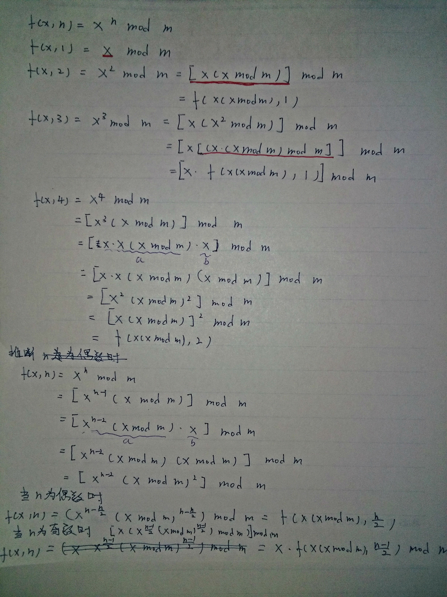

+++
title = "powMod 的实现"
summary = ''
description = ""
categories = []
tags = []
date = 2017-05-30T12:07:20+08:00
draft = false
+++

今天做 Codewars 的 Haskell 练习时遇到了 `powMod`。 `powMod` 是一个比较常用的操作，就是求 `x` 的 `n` 次幂对 `m` 取余。Python builtin `pow` 自身提供了 `powMod` 的功能

```Python
In [2]: pow?
Signature: pow(x, y, z=None, /)
Docstring:
Equivalent to x**y (with two arguments) or x**y % z (with three arguments)

Some types, such as ints, are able to use a more efficient algorithm when
invoked using the three argument form.
Type:      builtin_function_or_method

In [3]: pow(2, 100, 3)
Out[3]: 1
```

如果要实现高效的 `powMod` 操作，必然不能将 `x` 的 `n` 次幂全部算出来。作为引例，先来看看如何实现一个比较高效的 `pow` 操作

观察以下式子


通过归纳，我们可以清晰发现递归的特征

```Haskell
pow' :: Integral a => a -> a -> a
pow' x 0 = 1
pow' x n = x * pow' x (n-1)
```

这种方法是最一般的方法，需要进行 `n` 次乘法运算。经过进一步观察，可以这么认为


所以可以得出

1) n 为偶数

2) n 为奇数


相应代码如下

```Haskell
square :: Integral a => a -> a
square x = x * x
pow' :: Integral a => a -> a -> a
pow' _ 0 = 1
pow' x n
  | even n = square $ pow' x (n `div` 2)
  | otherwise = x * pow' x (n-1)
```

我们只进行了 log(n) 次乘法

进入正题，如何实现高效的 `powMod`，首先要了解一个公式


通过观察


依旧可以通过递归实现，让我们类比 `pow` 的做法，试着对奇数幂和偶数幂做不同的处理  
~~(我实在不想写 LaTex 了 QAQ)~~



最终代码如下

```Haskell
powMod :: Integral a => a -> a -> a -> a
powMod _ 0 _ = 1
powMod x 1 m = x `mod` m
powMod x n m
    | even n = powMod modSquare (n`div`2) m
    | otherwise = (x * powMod modSquare ((n-1)`div`2) m) `mod` m
    where modSquare = x * (x `mod` m)
```

    