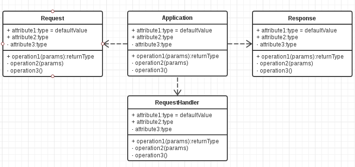

+++
title = "自制 Web 框架"
summary = ''
description = ""
categories = []
tags = []
date = 2017-06-15T08:53:15+08:00
draft = false
+++


本偏文章是 [imouto project](https://github.com/Hanaasagi/imouto) 的开发日志，想到哪里写到哪里，会比较凌乱

### 写在前面

#俺は妹が大好きだあああああ！！！

### Web 框架应该做什么

1. HTTP 数据包的解析与构建
2. 控制反转  依赖注入  
3. 适配各种 driver  
4. 转义，单独拿出来说，XSS, SQL Injection, Shell Injection等都可以通过正确的转义来防止(若是 PHP，或许可以通过畸形数据(进制)来钻空子，所以最好进行预编译)
5. 提供各种功能的抽象(类似 redirect, set_cookie)
6. 异常处理与 logging
7. 模板渲染，可以通过插件的方式载入，不是重点任务
8. 易于与中间件进行联动，或许不是很重要
9. PEP 333/ PEP 3333

### 基本流程

应用服务器 -> 应用主体 -> 路由匹配 -> 用户逻辑代码 -> 响应/模板渲染

以 Tornado 为例

首先是 `Application` 的 `__init__` 注册了所有的路由(通过调用 `add_handlers` 方法)。当有请求来时触发 `Application` 的 `__call__` 方法
```Python
def __call__(self, request):
    # Legacy HTTPServer interface
    dispatcher = _RequestDispatcher(self, None)
    dispatcher.set_request(request)
    return dispatcher.execute()
```

其中 `_RequestDispatcher` 类用来解耦 `Application` 和 路由分发。 `app` 自身被注入进去，所以能够获得所有经过注册的路由。`set_request` 中调用了 `_find_handler` 进行了路由匹配；`execute` 实例化了对应路由的 RequestHandler。
通过 `RequestHandler` 的 `__init__` 方法，`app` 对象和 `request` 对象(包含请求信息)被注入。`__init__` 方法会调用 `initialize` 方法，即用户自定义的初始化方法。`RequestHandler` 创建完成后，其 `_execute` 方法被调用。这里会做一些 XSRF 检查之类的工作，然后调用 `prepare()` 进行准备处理。最后便是根据请求方法来调用 `get/post` 等方法了

```Python
method = getattr(self, self.request.method.lower())
result = method(*self.path_args, **self.path_kwargs)
```


### MMP 的兼容性

兼容性要考虑 unicode 和 bytes 的类型统一，lib 的更改(如 `thread`) win 和 linux等

这点可以参考 Bottle 源码，已经封装成了工具函数

~~当然是选择放弃 2.x 了~~

### 一些辅助工具

test_client 这个很重要，如果你不想一次次运行然后打开浏览器或者使用 curl 之类的人工判断是否合理的话

HTTP Header 是一个一对多值的映射，需要一个辅助数据结构 MultiDcit 可以参考 Bottle 源代码

autoload 模式，可以方便调试代码，当用户修改代码时能够监测到，并重启 server，可以参见蠢作者之前的文章，或者 Tornado 的源码(分离成单独的一个模块)

secure_cookie 经过签名的 cookie 可以参见蠢作者之间的文章


### 注意事项

做之前请充分的考虑，虽然避免不了写的时候也许会灵光一闪，然后推了重造  

bytesting 没有 format。或许统一使用 C 风格的格式化比较好呢？

思考问题的本源，有可能会出现发现 bug 然后引入解决方法，然后又遇到 bug，又去尝试解决。这时应该思考问题的本质是什么，不能去缝缝补补

EAFP 和 LBYL

```
# LBYL
def tob(s, enc='utf8'):
     """convert to bytes
     """
-    return s.encode(enc) if isinstance(s, str) else bytes(s)

# EAFP
def tob(s, enc='utf8'):
     """convert to bytes
     """
    try:
        return s.encode(enc)
    except AttributeError:
        return str(s).encode(enc)

```

在 Python 中推荐使用 EAFP，重点放在对象的行为上而不是对象的类型上。只要实现对应的 encode 方法便可以进行 tob


OK， 上面代码 EAFP 的示例代码是有瑕疵的，因为他没有实现幂等

```
In [11]: tob('test')
Out[11]: b'test'

In [12]: tob(tob('test'))
Out[12]: b"b'test'"
```

为什么要实现幂等呢？因为 tob 的存在意义是：给予任何一个数据类型，我想让他返回 bytes 表示。那么已经是 bytes 的应当直接返回才对(这段代码来自于 sanic)


应当设计成什么形态，感觉这个事情不好描述，直接上个例子好了。比如是选择支持用户代码中多次进行数据的 write，然后框架给一个 chunk 来收集(Tornado 风格)；还是让用户自己去组合这些数据，之后返回一个 HTTPResponse 实例(Sanic 风格)。两种那种比较好？可能会遇到很多这样的问题，能达到同样目的的设计有很多很多，应当选择那种。以此为例，平常的 Web 开发一般是 1) API 2) MVC。在 API 中显然是由用户构建数据然后 json 后返回。在 MVC 中也是构建好数据然后去渲染模板。所以 Tornado 风格显然做了多余的事情,但是这种风格易于 `set_cookie` `set_header` 等操作，不必像这样冗长 `return HttpResponse(header=header, cookie=cookie)`

注重优化，比如

```python

    def _find_handler(self, path: str):
        """Find the corresponding handler for the path
        if nothing mathed but having default handler, use default
        otherwise 404 Not Found
        """
        for route, handler_class in self._handlers:
            match = route.match(path)
            if match:
                return handler_class, match.groupdict()

        if self.settings.get('default_handler'):
            handler_class = self.settings['default_handler']
            return handler_class, {}

        # attenton !!! TODO
        return None, None
```

`_find_handler` 每次请求都会执行，用于路由匹配。当未匹配到任何路由时，返回 `default_handler`。其用来自定义 404 页面。显然上面的代码不够好，可以修改为

```Python
    def __init__(self, request, resposne, settings):
        self.default_handler = settings.get('default_handler', None)

    def _find_handler(self, path: str):
        """Find the corresponding handler for the path
        if nothing mathed but having default handler, use default
        otherwise 404 Not Found
        """
        for route, handler_class in self._handlers:
            match = route.match(path)
            if match:
                return handler_class, match.groupdict()

        return self.default_handler, None


```

### 持续集成
比如常见的图标
[](https://travis-ci.org/Hanaasagi/XXTEA-Rust)
可以通过 travisCI 来生成


### imouto 的构造

大致画了一下，应该是这样的



原型设计图，后面应该会改

### Tips
Tips 有可能又解，有可能无解

#####Cookie 过期

```
# Tornado
    def clear_cookie(self, name, path="/", domain=None):
        """Deletes the cookie with the given name.

        Due to limitations of the cookie protocol, you must pass the same
        path and domain to clear a cookie as were used when that cookie
        was set (but there is no way to find out on the server side
        which values were used for a given cookie).
        """
        expires = datetime.datetime.utcnow() - datetime.timedelta(days=365)
        self.set_cookie(name, value="", path=path, expires=expires,
                        domain=domain)

# Bottle
    def delete_cookie(self, key, **kwargs):
        ''' Delete a cookie. Be sure to use the same `domain` and `path`
            settings as used to create the cookie. '''
        kwargs['max_age'] = -1
        kwargs['expires'] = 0
        self.set_cookie(key, '', **kwargs)

```

使 Cookie 过期可以通过 `expired` 或者 `max-age` 来控制。推荐使用 `max-age`，`expired` 在 HTTP 1.1 开启弃用。新浏览器一定支持 `max-age`，旧浏览器不一定支持。所以为了兼容 Bottle 采取了同时设置这两个域

##### HTTP 状态码 3xx
301 Move Permanently
302 Found 问题来了，在 HTTP 1.0 中规定，如果不是一个 GET 请求或者 HEAD 请求，浏览器是禁止自动重定向的，除非得到用户的确认。但是这个浏览器并没有遵守，允许了 POST -> 302 -> GET 的重定向。所以在 HTTP 1.1 中加入了 303
303 See Other POST 可以直接重定向
304 Not Modified
305 Use Proxy 会在 Location 域中给出代理
306 此状态码被弃用
307 Temporary Redirect 重定向是请求方法和请求体不会改变，就是说 POST -> 307 -> POST

更详细的请参照 [MDN](https://developer.mozilla.org/en-US/docs/Web/HTTP/Status)

##### 迭代一个 OrderDict 比 list 慢很多


##### WSGI 还原 url
```Python
python from urllib import quote

url = environ['wsgi.url_scheme']+'://'

if environ.get('HTTP_HOST'):
    url += environ['HTTP_HOST']
else:
    url += environ['SERVER_NAME']

if environ['wsgi.url_scheme'] == 'https':
    if environ['SERVER_PORT'] != '443':
       url += ':' + environ['SERVER_PORT']
else:
    if environ['SERVER_PORT'] != '80':
       url += ':' + environ['SERVER_PORT']

url += quote(environ.get('SCRIPT_NAME', ''))
url += quote(environ.get('PATH_INFO', ''))
if environ.get('QUERY_STRING'):
    url += '?' + environ['QUERY_STRING']
```

### 压力测试

#### wrk

需要 LuaJIT  
```
git clone https://github.com/wg/wrk.git
cd wrk
make
sudo cp wrk /usr/local/bin
```
imouto 目前的测试，性能很不理想，如果使用 `uvloop` 效果会好一些(测试于 2017.7.12)
```
➜  ~ wrk -t12 -c400 -d30s http://127.0.0.1:8080           
Running 30s test @ http://127.0.0.1:8080
  12 threads and 400 connections
  Thread Stats   Avg      Stdev     Max   +/- Stdev
    Latency   306.72ms   93.61ms   1.82s    61.95%
    Req/Sec    53.61     42.64   323.00     69.78%
  17351 requests in 30.04s, 1.24MB read
  Socket errors: connect 0, read 17350, write 0, timeout 0
Requests/sec:    577.58
Transfer/sec:     42.30KB
```

Tornado 测试结果(未使用 async/await)

```
Running 30s test @ http://127.0.0.1:8888/
  12 threads and 400 connections
  Thread Stats   Avg      Stdev     Max   +/- Stdev
    Latency   214.20ms   34.26ms 305.17ms   86.52%
    Req/Sec   149.42    108.79   595.00     54.22%
  53007 requests in 30.04s, 9.10MB read
Requests/sec:   1764.54
Transfer/sec:    310.17KB
```

flask 测试
```
Running 30s test @ http://127.0.0.1:9001
  12 threads and 400 connections
  Thread Stats   Avg      Stdev     Max   +/- Stdev
    Latency    97.22ms  107.17ms   1.81s    94.54%
    Req/Sec   134.64    140.48   515.00     77.59%
  19664 requests in 30.04s, 3.09MB read
  Socket errors: connect 0, read 169, write 0, timeout 531
Requests/sec:    654.54
Transfer/sec:    105.47KB
```

感觉这个结果需要研究一下

#### ab

    