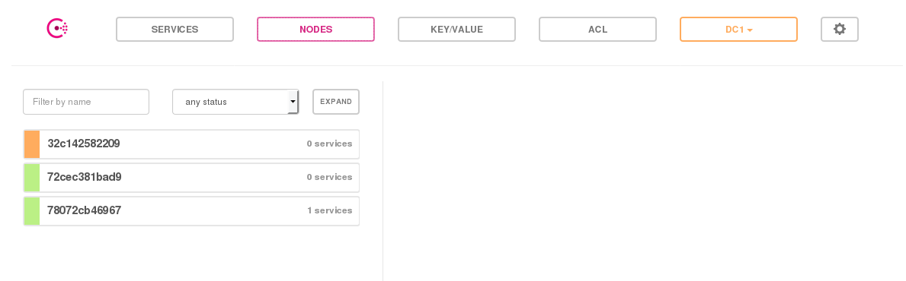

+++
title = "Consul 上手指南"
summary = ''
description = ""
categories = []
tags = []
date = 2017-07-30T06:26:53+08:00
draft = false
+++

### Introduction

Consul 是一个分布式高可用(distributed,highly available)的系统。它提供了多个组件，但总体来说是用来做服务发现和服务配置的工具。其具备以下几个关键特性：

- 服务发现
- 健康检查
- k/v 存储
- Multi Datacenters

每一个向 Consul 提供 service 的 node 都运行着一个 agent。运行一个 agent 并不是发现其他 service 或设置/获取 k/v 所必须的。agent 负责 node 上运行的 service 及 node 自身的健康检查。agent 和一个和多个 Consul server 进行交互。server 用于数据存储和复制，并且能够自行选举 leader。虽然一台 server 就能完成功能，但建议配置 3 到 5 台来避免失败情况下的数据丢失。每个 datacenter 建议配置一个 server 集群。基础设施中的任一部分想要发现其他 service 或者 node 时可以向任何一个 Consul server 进行查询。也可以向 agent 发起查询，agent 会自动转发查询请求到 server。每一个 datacenter 运行着一组 Consul server 的集群，当一个跨 datacenter 的服务发现或配置请求创建时，本地的 Consul server 会转发这个请求到远程的 datacenter 并返回结果

根据 Dockerfile 可以看到 Consul 使用了如下几个端口

```
# Server RPC is used for communication between Consul clients and servers for internal
# request forwarding.
EXPOSE 8300

# Serf LAN and WAN (WAN is used only by Consul servers) are used for gossip between
# Consul agents. LAN is within the datacenter and WAN is between just the Consul
# servers in all datacenters.
EXPOSE 8301 8301/udp 8302 8302/udp

# HTTP and DNS (both TCP and UDP) are the primary interfaces that applications
# use to interact with Consul.
EXPOSE 8500 8600 8600/udp
```


### Learning Consul

本文直接使用 Consul 的 docker。Consul 的 agent 既可以当 server 又可以当 client。每一个 datacenter 至少须有一个 server。client 是一个轻量级的进程用来服务注册，健康检查，转发查询至 server。agent 必须运行在集群中的每个 node 上

```
sagiri ➜  ~ docker run -it -d --name agent-1 consul agent
1030b879f56db461ce2e207d60450d433a4952ed4087e01bf5d3d9bba3cd942e
```

进入容器可以查看现在集群中的成员，因为使用 alpine 镜像进行构建的，所以是 `/bin/ash`

```    
sagiri ➜  ~ docker exec -it agent-1 /bin/ash
/ # consul members
Node          Address          Status  Type    Build  Protocol  DC
1030b879f56d  172.17.0.2:8301  alive   client  0.9.0  2         dc1
```

向 Consul 中注册服务有两种方式，一种是通过配置文件，比如

```
# /etc/consul.d/web.json
{"service": {"name": "web", "tags": ["rails"], "port": 80}}
# 启动 Consul 中指定 -config-dir=/etc/consul.d
```

另一种则是通过 RESTful API

对于查询，Consul 提供了 HTTP API 和 DNS API 两种方式

当一个 Consul agent 启动时，它是孤立的。为了加入一个已经存在的集群，仅需要知道一个已经存在的成员即可(不一定 server 模式)。通过和这个成员进行信息交换，可以发现这个集群中的其他成员

让我们开启一个 server mode 的 agent，然后将 agent-1 加入其中

```
sagiri ➜  ~ docker run -it -d --name agent-2 consul agent -server -bootstrap
78072cb46967cc3381e0aac03841891778f03250c87a784f01dd028dafd59069
sagiri ➜  ~ docker inspect --format '{{ .NetworkSettings.IPAddress }}' agent-2
172.17.0.3
sagiri ➜  ~ docker exec -it agent-1 /bin/ash
/ # consul join 172.17.0.3
Successfully joined cluster by contacting 1 nodes.
/ # consul members
Node          Address          Status  Type    Build  Protocol  DC
1030b879f56d  172.17.0.2:8301  alive   client  0.9.0  2         dc1
78072cb46967  172.17.0.3:8301  alive   server  0.9.0  2         dc1
```

使用 SIGINT 信号(如 Ctrl-C)退出，Consul 会认为这个 node 离开，将其从记录中删除。如果强制停止 agent 进程，集群的其他成员会认为这个 node 失败，所以进行自动重连，期望它能够恢复

让我们再添加一个 agent，然后删除这个容器会看到 status 为 failed

```
sagiri ➜  ~ docker run -it -d --name agent-3 consul agent
32c142582209524348de15c1a6f48f385d4f8e3c99f1e61ab49d434ff8716c6a
sagiri ➜  ~ docker exec -it agent-3 /bin/ash
/ # consul members
Node          Address          Status  Type    Build  Protocol  DC
32c142582209  172.17.0.4:8301  alive   client  0.9.0  2         dc1
/ # consul join 172.17.0.3
Successfully joined cluster by contacting 1 nodes.
/ # consul members
Node          Address          Status  Type    Build  Protocol  DC
1030b879f56d  172.17.0.2:8301  alive   client  0.9.0  2         dc1
32c142582209  172.17.0.4:8301  alive   client  0.9.0  2         dc1
78072cb46967  172.17.0.3:8301  alive   server  0.9.0  2         dc1
/ # exit
sagiri ➜  ~ docker rm -f agent-3
agent-3
sagiri ➜  ~ docker exec -it agent-1 /bin/ash
/ # consul members
Node          Address          Status  Type    Build  Protocol  DC
1030b879f56d  172.17.0.2:8301  alive   client  0.9.0  2         dc1
32c142582209  172.17.0.4:8301  failed  client  0.9.0  2         dc1
78072cb46967  172.17.0.3:8301  alive   server  0.9.0  2         dc1
```

接着我们在 agent-1 中执行 leave，可以看到 status 为 left

```
/ # consul leave
Graceful leave complete
sagiri ➜  ~ docker exec -it agent-2 /bin/ash
/ # consul members
Node          Address          Status  Type    Build  Protocol  DC
1030b879f56d  172.17.0.2:8301  left    client  0.9.0  2         dc1
32c142582209  172.17.0.4:8301  failed  client  0.9.0  2         dc1
78072cb46967  172.17.0.3:8301  alive   server  0.9.0  2         dc1
```

Consul 支持 k/v 存储，可以通过两种方式 HTTP API 和 Consul Command

```
/ # consul kv put foo 1
Success! Data written to: foo
/ # consul kv get foo
1
/ # consul kv delete foo
Success! Deleted key: foo
/ # consul kv get foo
Error! No key exists at: foo
/ # consul kv put redis/config/maxconns 20
Success! Data written to: redis/config/maxconns
/ # consul kv get redis/config/maxconns
20
```

除此之外，Consul 提供了原子性的操作，通过指定 `ModifyIndex` 的值，如果相等才会进行更改，如果不同则会失败

```
/ # consul kv get -detailed redis/config/maxconns
CreateIndex      94
Flags            0
Key              redis/config/maxconns
LockIndex        0
ModifyIndex      94
Session          -
Value            20
/ # consul kv put -cas --modify-index=94 redis/config/maxconns 25
Success! Data written to: redis/config/maxconns
/ # consul kv put -cas --modify-index=94 redis/config/maxconns 26
Error! Did not write to redis/config/maxconns: CAS failed
```

Cosul 还提供了 Web 管理界面

```
docker run -it -d -p 8500:8500 --name agent-ui consul agent -ui --client 0.0.0.0 -join 172.17.0.3
```




### 实战

下面来介绍使用 Consul 进行服务配置自动化的步骤，主要用到了 Confd 和 Consul

首先来安装 Confd

```
sagiri ➜  ~ git clone https://github.com/kelseyhightower/confd.git
sagiri ➜  ~ cd confd
sagiri ➜  confd git:(master) docker build -t confd_builder -f Dockerfile.build.alpine .
# omit output
sagiri ➜  confd git:(master) docker run -ti --rm -v $(pwd):/app confd_builder ./build
Building confd...
sagiri ➜  confd git:(master) cd bin
sagiri ➜  bin git:(master) ./confd
zsh: no such file or directory: ./confd
sagiri ➜  bin git:(master) ll
total 21M
-rwxr-xr-x 1 root root 21M Jul 30 18:23 confd
sagiri ➜  bin git:(master) file confd
confd: ELF 64-bit LSB executable, x86-64, version 1 (SYSV), dynamically linked, interpreter /lib/ld-musl-x86_64.so.1, with debug_info, not stripped
```

如果运行时出现 `no such file or directory: ./confd` 可能是缺少 `/lib/ld-musl-x86_64.so.1`。通过 `yaourt -S musl` 可以解决


创建如下工程结构

```
.               
├── conf.d      
│   └── config.toml              
└── templates   
    └── demo.conf.tmpl
```

conf.d/config.toml

```
[template]
src = "demo.conf.tmpl"
dest = "/opt/openresty/nginx/conf/nginx.conf"
keys = ["/nginx",]

reload_cmd = "/opt/openresty/nginx/sbin/nginx -s reload"
```

templates/demo.conf.tmpl

```
worker_processes  1;

events {
    worker_connections  1024;
}


http {
    server {
        listen       80;
        location / {
            proxy_pass http://www.{{getv "/nginx/http/server/proxy"}};
        }
    }
}
```

启动 nginx

```
/opt/openresty/nginx/sbin/nginx
```


启动 Consul

```
consul agent -server -bootstrap -data-dir /tmp/consul
```


启动 Confd， 每 2 秒去询问 Consul，判断是否更新配置

```
confd -confdir="./" -config-file="./conf.d/config.toml" -interval=2 -backend consul -node localhost:8500
```

因为现在没有 k/v，所以 Confd 这边应当会一直 ERROR

```
2017-07-30T20:45:19+09:00 archlinux confd[29973]: ERROR template: demo.conf.tmpl:12:36: executing "demo.conf.tmpl" at <getv "/nginx/http/se...>: error calling getv: key does not exist: /nginx/http/server/proxy
```

添加记录

```
sagiri ➜ curl -X PUT -d 'google.com' localhost:8500/v1/kv/nginx/http/server/proxy
true#
```

从 log 中可以看到 confd 已经成功更新 nginx.conf，并且将 nginx reload

```
2017-07-30T20:58:47+09:00 archlinux confd[30480]: INFO /opt/openresty/nginx/conf/nginx.conf has md5sum 913ee7c8298ebc1233ed26bee3521abf should be 6fc369b6edb94040b95711d444132884
2017-07-30T20:58:47+09:00 archlinux confd[30480]: INFO Target config /opt/openresty/nginx/conf/nginx.conf out of sync
2017-07-30T20:58:48+09:00 archlinux confd[30480]: INFO Target config /opt/openresty/nginx/conf/nginx.conf has been updated
```

    