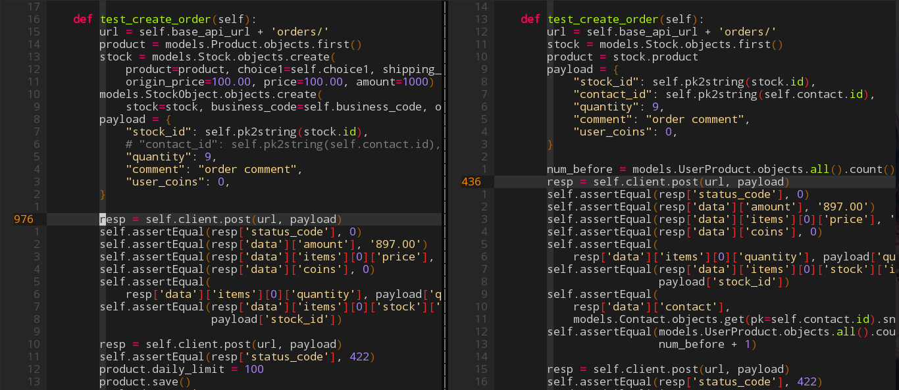

+++
title = "由某次坑爹的测试所引发的感想"
summary = ''
description = ""
categories = []
tags = []
date = 2017-08-21T14:24:13+08:00
draft = false
+++

今天真的被恶心到了，给 API 新加了一个 field，所以改了单元测试。结果发现改测试的时间比开发用的时间都长。仔细想了想原因，大致有以下几点
1) 代码没有复用。感觉以前完全是新加一个功能，便去复制前面人写的测试，然后稍加修改，导致代码冗余度相当高。某一段代码，至少改了四五次

摘取一点代码结构

```
▼ NoContactTest : class
   +_create_contact : function
   +_create_virtual_product : function
   +setUp : function
   +tearDown : function
   +test_create_order : function
   +test_create_order_from_cart : function
   +test_create_order_from_cart_contact : function

▼ OrderAPITest : class
   +setUp : function
   +tearDown : function
   +test_cancel_order : function
   +test_complete_order : function
   +test_create_comment : function
   +test_create_order : function
   +test_create_order_from_cart : function
   +test_list_order_comments : function
   +test_list_orders : function
   +test_list_reasons : function
   +test_retrieve_order : function
```

`test_create_order` 方法的代码相似度起码有 60%



你能体会改代码时一直重复，然后迷失，分不清自己具体在哪个测试用例的那种感觉么？将 `OrderAPITest` 作为基类应该是一个不错的选择


2) 硬编码实在太过严重

```
stock = models.Stock.objects.create(
    product=product, choice1=self.choice1, shipping_type=0,
    origin_price=100.00, price=100.00, amount=1000)

stock_1 = models.Stock.objects.create(
    product=product, choice1=self.choice1, shipping_type=1,
    origin_price=50.00, price=40.00, amount=1000)

models.StockObject.objects.create(
    stock=stock, business_code=self.business_code, object_id=1)

items = []
item = models.CartItem.objects.create(
    user_id=self.normal_user_id, product=product, stock=stock,
    quantity=2)
items.append(item)
item = models.CartItem.objects.create(
    user_id=self.normal_user_id, product=product, stock=stock_1,
    quantity=1)
items.append(item)
payload = {
    "item_ids": [self.pk2string(i.id) for i in items],
    "user_coins": 0
}
resp = self.client.post(url, payload)
self.assertEqual(resp['status_code'], 0)
self.assertEqual(resp['data']['amount'], '245.00')
self.assertEqual(resp['data']['shipping_fee'], '8')
```

你能知道 `amount` 为什么是 245 么？反正我是去又翻了一遍代码逻辑。可这是一个原则性的错误，测试代码不应当去迎合你的业务代码逻辑，而应该去检验预期逻辑。否则要什么测试？我都不知道之前的人是不是将代码运行结果直接粘到测试中了。测试中比较理想的是填充一定程度上随机的数据，不过这是比较麻烦的，因为有些复杂的逻辑难以实现，无法准确模拟。覆盖边界条件一般就差不多了，毕竟想要完全覆盖边界也是很麻烦的

3) 一个测试应当仅做一件事情

这测试代码处处违反了这个规则，比如之前测试过创建订单了。但是有些业务依赖于订单的创建这个条件，比如取消订单。那么需要在取消订单这里需要再测试一遍创建订单么。之前已经测试过了，除非你对自己先前的测试不满意，你应当将其视为数据填充才是正确的


所以说测试代码和生产代码一样重要，生产代码需要可扩展、可维护、可复用，测试代码也同样需要。希望不要抱着反正下次不是我写的这种**消极态度**去敷衍测试环节。

    