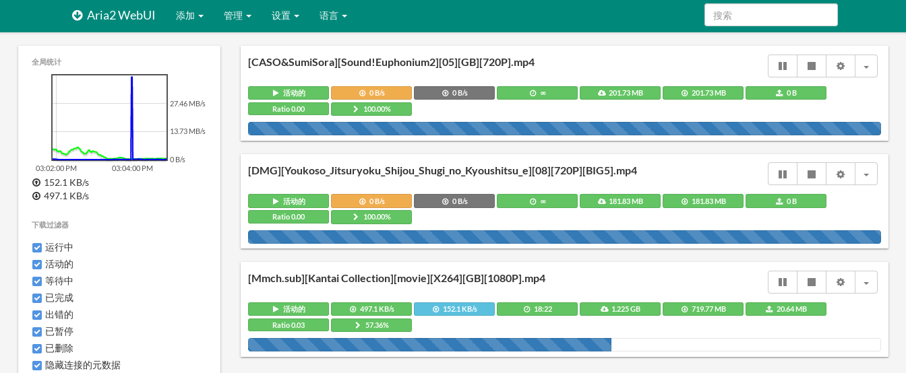

+++
title = "搭建私有下载服务"
summary = ''
description = ""
categories = []
tags = []
date = 2017-09-05T07:58:07+08:00
draft = false
+++

~~秋名山如今流行飙倒车 _(:зゝ∠)_~~

[aria2](https://github.com/aria2/aria2) 是一个支持多种协议的轻量级命令行下载工具。既然是命令行工具，不免操作有些不便。不过它提供了 jsonrpc 服务，可以直接向这个接口发送请求。并且有大佬为其搞了一套 [webui](https://github.com/ziahamza/webui-aria2)，极大的简化了上手难度。

部署这套服务本身就比较方便了，蠢作者又搞了傻瓜式部署脚本 [acqua](https://github.com/Hanaasagi/acqua)。分了三个 docker 容器，一个是纯粹的数据卷，另一个是 aria2 的服务，最后一个是 webui 和 方便在线观看视频的一个 httpserver (darkhttpd)。这个容器貌似违反了一个 docker 运行一个服务(进程)的概念。这是本 project 的缺点之一。另一个则是在宿主机上开了多个端口，主要是因为 webui 的那个本身就是个前端，全都是通过 websocket 和 ajax 向 rpc 服务发起的请求。这样 rpc 的端口必须暴露出来。本来是想搞一个 docker network 的，通过 link 的方式进行互联。


试了一下感觉还行吧，第一次要配置一下连接，填上 token



为了更懒一点，用 bookmarklet 做了一个将选中链接直接发送到 rpc server 的 js 脚本

```
javascript: (function () {
  constrpcUrl = 'http://133.130.97.89:6800/jsonrpc';
  consttoken = '1!2@3#4$5%6^7&8*9';
  letdownloadLink = window.getSelection().toString();
  if (downloadLink.length == 0) {
    alert('no selected text');
    return;
  }
  fetch(rpcUrl, {
    method: 'POST',
    headers: new Headers({
      'Content-Type': 'application/json'
    }),
    body: JSON.stringify({
      'jsonrpc': 2,
      'id': 'web',
      'method': 'aria2.addUri',
      'params': [
        'token:' + token,
        [
          downloadLink
        ]
      ]
    })
  }).then(function (response) {
    if (response.ok) {
      alert('success');
      return;
    }
    alert('failed to download ' + downloadLink);
  }).catch (function (err) {
    alert(err);
  })
}) ();
```

bookmarklet 要求没有换行，而且空白要 escape，添加时要做一下处理。另外就是，https 的 domin 内不能发 http 的 XMLHttpRequest

    