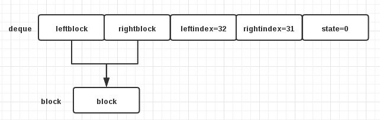
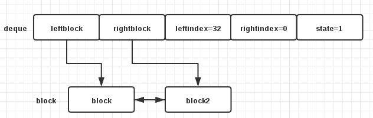

+++
title = "Python deque 源码分析"
summary = ''
description = ""
categories = []
tags = []
date = 2017-09-10T04:16:07+08:00
draft = false
+++

`deque` 是 Python 中的一个双端队列，`deque` 来源于 double-ended queue 的缩写，写作 deque 读作 deck。对于常见的数据结构 `list` 来说，下标为 0 的 `push` 和 `pop` 操作需要移动整个 `list`。而 `deque` 则不需要。并且它是线程安全的。除此之外还能为其设置 `max-length`，当 `deque` 满时，会自动丢弃相反一端的元素

`deque` 提供了如下的方法

```Python
['append', 'appendleft', 'clear', 'copy', 'count', 'extend', 'extendleft', 'index', 'insert', 'maxlen', 'pop', 'popleft', 'remove', 'reverse', 'rotate']
```

其源码位于 [`Modules/_collectionsmodule.c`](https://github.com/python/cpython/blob/3.6/Modules/_collectionsmodule.c)

先来看几个和 `deque` 相关结构体

```c
#define BLOCKLEN 64
#define CENTER ((BLOCKLEN - 1) / 2)

typedef struct BLOCK {
    struct BLOCK *leftlink;
    PyObject *data[BLOCKLEN];
    struct BLOCK *rightlink;
} block;
```
`block` 类型含有指向左右两个 `block` 的指针，是一个链表结构的结点(node)。并且包含一个长度为 64 的指针数组，数组的每一个元素都是一个指向 `PyObject` 的指针

```c
typedef struct {
    PyObject_VAR_HEAD
    block *leftblock;
    block *rightblock;
    Py_ssize_t leftindex;       /* 0 <= leftindex < BLOCKLEN */
    Py_ssize_t rightindex;      /* 0 <= rightindex < BLOCKLEN */
    size_t state;               /* incremented whenever the indices move */
    Py_ssize_t maxlen;
    PyObject *weakreflist;
} dequeobject;
```

`dequeobject` 类型的 `leftblock` 和 `rightblock` 分别指向此 `deque` 的最左和最右的 `block`。`leftindex` 和 `rightindex` 为 `leftblock` 与 `rightblock` 中 `data` 数组的索引，用于记录存储位置。`maxlen` 为 `deque` 的最大长度

有了以上的准备，便可以来看看 `deque` 对象是如何生成的

```c
static PyObject *
deque_new(PyTypeObject *type, PyObject *args, PyObject *kwds)
{
    dequeobject *deque;
    block *b;

    /* create dequeobject structure */
    deque = (dequeobject *)type->tp_alloc(type, 0);
    if (deque == NULL)
        return NULL;

    b = newblock(0);
    if (b == NULL) {
        Py_DECREF(deque);
        return NULL;
    }
    MARK_END(b->leftlink);
    MARK_END(b->rightlink);

    assert(BLOCKLEN >= 2);
    Py_SIZE(deque) = 0;
    deque->leftblock = b;
    deque->rightblock = b;
    deque->leftindex = CENTER + 1;
    deque->rightindex = CENTER;
    deque->state = 0;
    deque->maxlen = -1;
    deque->weakreflist = NULL;

    return (PyObject *)deque;
}
```

`deque = (dequeobject *)type->tp_alloc(type, 0);` 为分配 deque 的存储空间。[tp_alloc](https://docs.python.org/3/c-api/typeobj.html#c.PyTypeObject.tp_alloc) 文档中有说明

`newlbock(0)` 为创建了一个 `block`

`MARK_END` 是一个 macro，用于将指针指向 NULL `#define MARK_END(link)  link = NULL;`

第一次设置 `deque->leftindex = CENTER + 1; deque->rightindex = CENTER;` 是因为共享了一个 `block`




`append` 操作的源码如下

```c
static PyObject *
deque_append(dequeobject *deque, PyObject *item)
{
    deque->state++;
    if (deque->rightindex == BLOCKLEN - 1) {
        block *b = newblock(Py_SIZE(deque));
        if (b == NULL)
            return NULL;
        b->leftlink = deque->rightblock;
        CHECK_END(deque->rightblock->rightlink);
        deque->rightblock->rightlink = b;
        deque->rightblock = b;
        MARK_END(b->rightlink);
        deque->rightindex = -1;
    }
    Py_INCREF(item);
    Py_SIZE(deque)++;
    deque->rightindex++;
    deque->rightblock->data[deque->rightindex] = item;
    deque_trim_left(deque);
    Py_RETURN_NONE;
}
```

这里首先会判断 `deque` 的 `rightindex` 是否为 63。一个 `block` 最多持有 64 个 `PyObject` 的引用。如果达到上限则会创建一个新的 `block`




`CHECK_END` 也是一个 macro，用于在赋值时检查是否为 NULL

```
#define CHECK_END(link) assert(link == NULL);
```

`Py_INCREF(item);` 用于增加对象的引用计数。

`trim_left` 会检查 `deque` 的长度是否超过设置的最大长度。若超过则会将最左侧的元素 `pop` 出去。同理 `trim_right` 是 `pop` 最右侧的元素

```c
deque_trim_left(dequeobject *deque)
{
    if (deque->maxlen != -1 && Py_SIZE(deque) > deque->maxlen) {
        PyObject *rv = deque_popleft(deque, NULL);
        assert(rv != NULL);
        assert(Py_SIZE(deque) <= deque->maxlen);
        Py_DECREF(rv);
    }
}
```

`deque_appendleft` 操作正相反，不再多说


`deque_extend` 源码如下

```
static PyObject *
deque_extend(dequeobject *deque, PyObject *iterable)
{
    PyObject *it, *item;

    /* Handle case where id(deque) == id(iterable) */
    if ((PyObject *)deque == iterable) {
        PyObject *result;
        PyObject *s = PySequence_List(iterable);
        if (s == NULL)
            return NULL;
        result = deque_extend(deque, s);
        Py_DECREF(s);
        return result;
    }

    /* Space saving heuristic.  Start filling from the left */
    if (Py_SIZE(deque) == 0) {
        assert(deque->leftblock == deque->rightblock);
        assert(deque->leftindex == deque->rightindex+1);
        deque->leftindex = 1;
        deque->rightindex = 0;
    }

    it = PyObject_GetIter(iterable);
    if (it == NULL)
        return NULL;

    if (deque->maxlen == 0)
        return consume_iterator(it);

    while ((item = PyIter_Next(it)) != NULL) {
        deque->state++;
        if (deque->rightindex == BLOCKLEN - 1) {
            block *b = newblock(Py_SIZE(deque));
            if (b == NULL) {
                Py_DECREF(item);
                Py_DECREF(it);
                return NULL;
            }
            b->leftlink = deque->rightblock;
            CHECK_END(deque->rightblock->rightlink);
            deque->rightblock->rightlink = b;
            deque->rightblock = b;
            MARK_END(b->rightlink);
            deque->rightindex = -1;
        }
        Py_SIZE(deque)++;
        deque->rightindex++;
        deque->rightblock->data[deque->rightindex] = item;
        deque_trim_left(deque);
    }
    if (PyErr_Occurred()) {
        Py_DECREF(it);
        return NULL;
    }
    Py_DECREF(it);
    Py_RETURN_NONE;
}
```

首先是为了防止循环引用
```c
/* Handle case where id(deque) == id(iterable) */
if ((PyObject *)deque == iterable) {
    PyObject *result;
    PyObject *s = PySequence_List(iterable);
    if (s == NULL)
        return NULL;
    result = deque_extend(deque, s);
    Py_DECREF(s);
    return result;
}
```
然后就是一个优化，如果当前 `deque` 中无任何元素。会调整 `leftindex` 和 `rightindex` 的位置。为即将实施的大量右侧插入腾出位置

```
if (Py_SIZE(deque) == 0) {
    assert(deque->leftblock == deque->rightblock);
    assert(deque->leftindex == deque->rightindex+1);
    deque->leftindex = 1;
    deque->rightindex = 0;                                                
}           
```

当 `deque` 的 `maxlen` 为 0 时，会直接将 `iterator` 迭代完

```c
static PyObject*
consume_iterator(PyObject *it)
{
    PyObject *item;

    while ((item = PyIter_Next(it)) != NULL) {
        Py_DECREF(item);
    }
    Py_DECREF(it);
    if (PyErr_Occurred())
        return NULL;
    Py_RETURN_NONE;
}
```

之后便是和 `append` 相似的操作

`pop` 操作首先从 `rightblock` 中取出 `rightindex` 的元素。然后判断 `block` 的大小，决定是否需要 free。特别地，当 `deque` 中的元素数目为 0 时，会重置 `leftindex` 和 `rightindex` 的值。源码如下

```c
static PyObject *
deque_pop(dequeobject *deque, PyObject *unused)
{
    PyObject *item;
    block *prevblock;

    if (Py_SIZE(deque) == 0) {
        PyErr_SetString(PyExc_IndexError, "pop from an empty deque");
        return NULL;
    }
    item = deque->rightblock->data[deque->rightindex];
    deque->rightindex--;
    Py_SIZE(deque)--;
    deque->state++;

    if (deque->rightindex == -1) {
        if (Py_SIZE(deque)) {
            prevblock = deque->rightblock->leftlink;
            assert(deque->leftblock != deque->rightblock);
            freeblock(deque->rightblock);
            CHECK_NOT_END(prevblock);
            MARK_END(prevblock->rightlink);
            deque->rightblock = prevblock;
            deque->rightindex = BLOCKLEN - 1;
        } else {
            assert(deque->leftblock == deque->rightblock);
            assert(deque->leftindex == deque->rightindex+1);
            /* re-center instead of freeing a block */
            deque->leftindex = CENTER + 1;
            deque->rightindex = CENTER;
        }
    }
    return item;
}
```

`rotate` 方法不仅作为公共方法被使用，内部其他方法也有使用，比如 `remove`。`rotate(1)` 或者 `rotate(-1)` 是最常见的情况。所以任何的优化手段都不能使这两种情况的性能下降。概念上，一个 `rotate` 操作相当于一侧 `pop` 另一侧 `append`。然而 `pop/append` 会产生不必要的性能消耗，因为带来了引用计数上的增减(`pop` -1, `append` +1)。最好的方法是移动指针。当批量移动指针时，`memcpy` 是一个诱人的选择。但事实证明它比循环慢。原因有很多：`memcpy` 不能提前知道我们复制的是源和目标是指针对齐并且不重叠的指针而不是字节；移动一个指针是最常见的情况；从不需要移动超过 `BLOCKLEN` 指针。对于大规模的 `rotate`， `newblock` 和 `freeblock` 不会被调用超过一次。之前空的 `block` 会被重复使用，如果有一个 `block` 在最后被留下，才会释放。

```c
static int
_deque_rotate(dequeobject *deque, Py_ssize_t n)
{
    block *b = NULL;
    block *leftblock = deque->leftblock;
    block *rightblock = deque->rightblock;
    Py_ssize_t leftindex = deque->leftindex;
    Py_ssize_t rightindex = deque->rightindex;
    Py_ssize_t len=Py_SIZE(deque), halflen=len>>1;
    int rv = -1;

    // 当 deque 长度为 0 或 1 时，rotate 是无意义的，直接返回
    if (len <= 1)
        return 0;
    // 优化 减少移动次数
    // halflen 为 len 的一半 9>>1==4
    // 当 rotate(8) 相当于 rotate(-1)
    if (n > halflen || n < -halflen) {
        n %= len;
        if (n > halflen)
            n -= len;
        else if (n < -halflen)
            n += len;
    }
    assert(len > 1);
    assert(-halflen <= n && n <= halflen);

    deque->state++;
    while (n > 0) {
        // 左侧 block 已满，开辟新存储空间
        if (leftindex == 0) {
            if (b == NULL) {
                b = newblock(len);
                if (b == NULL)
                    goto done;
            }
            b->rightlink = leftblock;
            CHECK_END(leftblock->leftlink);
            leftblock->leftlink = b;
            leftblock = b;
            MARK_END(b->leftlink);
            leftindex = BLOCKLEN;
            // *
            b = NULL;
        }
        assert(leftindex > 0);
        {
            PyObject **src, **dest;
            Py_ssize_t m = n;

            // 要移动多个 block 的情况，先移动一个
            if (m > rightindex + 1)
                m = rightindex + 1;
            if (m > leftindex)
                m = leftindex;
            assert (m > 0 && m <= len);
            rightindex -= m;
            leftindex -= m;
            src = &rightblock->data[rightindex + 1];
            dest = &leftblock->data[leftindex];
            // 计算剩余需要移动的量
            n -= m;
            do {
                *(dest++) = *(src++);
            } while (--m);
        }
        // rightblock 为空
        if (rightindex == -1) {
            // 这里没有 free 已经为空的 rightblock
            assert(leftblock != rightblock);
            assert(b == NULL);
            // 复用，若 leftblock 满会直接用这块空间
            b = rightblock;
            CHECK_NOT_END(rightblock->leftlink);
            rightblock = rightblock->leftlink;
            MARK_END(rightblock->rightlink);
            rightindex = BLOCKLEN - 1;
        }
    }
    while (n < 0) {
        // omit
    }
    rv = 0;
done:
    if (b != NULL)
        freeblock(b);
    deque->leftblock = leftblock;
    deque->rightblock = rightblock;
    deque->leftindex = leftindex;
    deque->rightindex = rightindex;

    return rv;
}
```

`remove` 操作借助了 `rotate`

```c
static PyObject *
deque_remove(dequeobject *deque, PyObject *value)
{
    Py_ssize_t i, n=Py_SIZE(deque);

    for (i=0 ; i<n ; i++) {
        PyObject *item = deque->leftblock->data[deque->leftindex];
        int cmp = PyObject_RichCompareBool(item, value, Py_EQ);

        if (Py_SIZE(deque) != n) {
            PyErr_SetString(PyExc_IndexError,
                "deque mutated during remove().");
            return NULL;
        }
        // 找到此元素
        if (cmp > 0) {
            PyObject *tgt = deque_popleft(deque, NULL);
            assert (tgt != NULL);
            if (_deque_rotate(deque, i))
                return NULL;
            Py_DECREF(tgt);
            Py_RETURN_NONE;
        }
        // error
        else if (cmp < 0) {
            _deque_rotate(deque, i);
            return NULL;
        }
        // 未找到 rotate(-1)
        _deque_rotate(deque, -1);
    }
    PyErr_SetString(PyExc_ValueError, "deque.remove(x): x not in deque");
    return NULL;
}
```
例如 `remove(3)`
```
i=0       [1, 2, 3, 4, 5]
i=1       [2, 3, 4, 5, 1]
i=2       [3, 4, 5, 1, 2]
popleft   [4, 5, 1, 2]
rotate(i) [1, 2, 4, 5]
```
关于 [`PyObject_RichCompareBool`](https://docs.python.org/3/c-api/object.html#c.PyObject_RichCompareBool)，文档中有说明

`deque_reverse` 就是简单的 swap 了 `len/2` 次  
`deque_count` 也是在简单的循环计数  
剩下的几个方便便不再赘述了

    