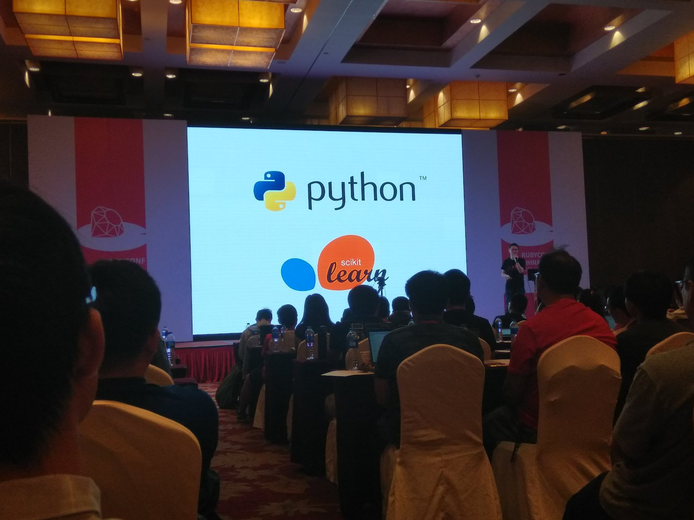

+++
title = "RubyConf 2017"
summary = ''
description = ""
categories = []
tags = []
date = 2017-09-17T15:02:25+08:00
draft = false
+++

9.16 和 9.17 两天非常荣幸地参加了今年的 RubyConf。虽然根据 Ruby 本身在国内的招聘行情来看应该算是个低谷，但是这次大会让我感到 Ruby 社区是一个具有活力的组织。Ruby 本身是一门魔性的语言，从其他语言中吸收了比较多的特性，自身也不乏创新。比如单身狗运算符 `&.`。我想正是这份包容的心态才造就了今日的 Ruby。在这次的 RubyConf 中，有些参加者并不是使用的 Ruby 技术栈，议题也有的和 Ruby 半毛钱关系都没有，Erlang,Elixir,Haskell。但这对于开拓一个人的视野挺重要的，虽然可能“诱拐”别人转移技术栈(笑)。总之，感觉门票是赚回来了 _(:3 」∠ )_

    