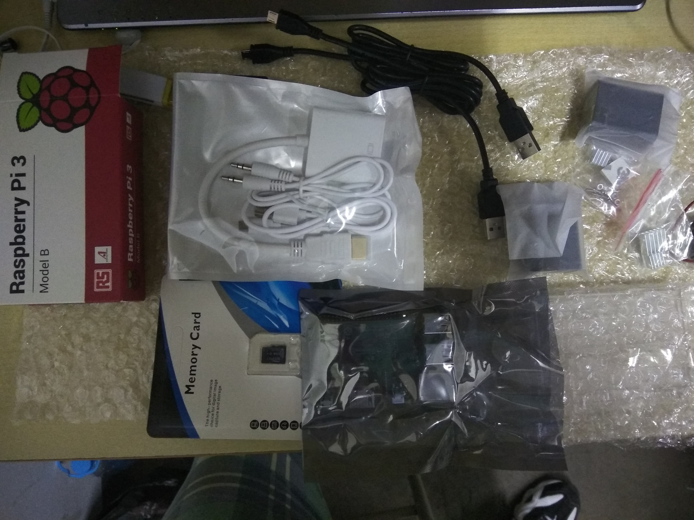
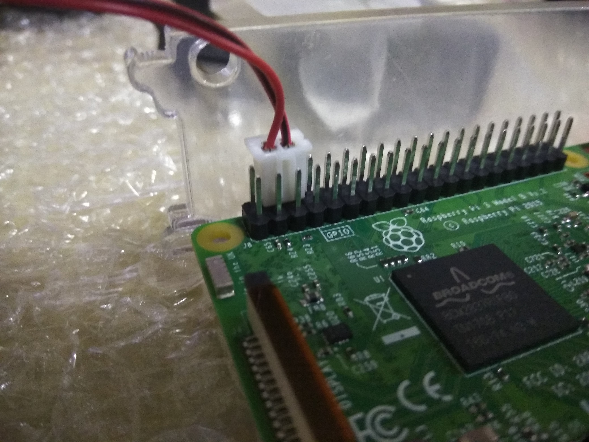
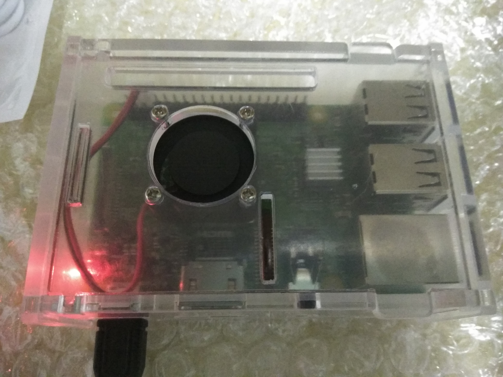

+++
title = "Raspberry Pi 3 安装手记"
summary = ''
description = ""
categories = []
tags = []
date = 2017-10-02T04:09:26+08:00
draft = false
+++

由于种种原因 Raspberry 从到手到现在才装起来

先来放几张照片(摄于 2017/09/11)





对于安装，Archlinux 官方已经有完善的[描述](https://archlinuxarm.org/platforms/armv8/broadcom/raspberry-pi-3)了

安装后是没有 `sudo` 的，所以先切到 root 用户

```Shell
su
# 更新系统
pacman -Syu
# 安装 sudo
pacman -S sudo
exit
```

然后以 `sudo` 执行命令时，会发现 alarm 用户不是 sudoers

```Shell
alarm is not in the sudoers file.  This incident will be reported.
```
再次切到 root

输入 `visudo` 去掉 `#%wheel ALL=(ALL) ALL` 此行注释，使wheel 用户组可以使用 `sudo`

用户名和主机名当然要华丽丽滴才好，所以修改主机名

```
sudo hostnamectl set-hostname sakuragaoka
```

修改用户名将下面三个文件的 alarm 替换为 mio

```
[root@sakuragaoka alarm]# vim /etc/passwd
[root@sakuragaoka alarm]# vim /etc/shadow
[root@sakuragaoka alarm]# vim /etc/group
```

`reboot` 一下

```
ssh mio@raspberryAddr
```

发现 `sudo` 又用不了了，直接这么加

```
# User privilege specification
root	ALL=(ALL:ALL) ALL
mio     ALL=(ALL:ALL) ALL
```

使用 `tmux` 会发生这么个问题

```
mio ➜  ~ tmux
tmux: need UTF-8 locale (LC_CTYPE) but have ANSI_X3.4-1968
```

解决方法 `vim /etc/locale.gen` 去掉 `en_US.UTF-8 UTF-8` 的注释，运行 `sudo locale-gen`


接下来解决一些操蛋的问题，因为大学校局域网的问题，所以做一下内网穿透，具体参照 arondight 菊苣的[博客](http://arondight.me/2016/02/17/%E4%BD%BF%E7%94%A8SSH%E5%8F%8D%E5%90%91%E9%9A%A7%E9%81%93%E8%BF%9B%E8%A1%8C%E5%86%85%E7%BD%91%E7%A9%BF%E9%80%8F/)。我就无耻的摘了下来

主要是借助 `autossh`，先添加 `autossh` 用户

```
sudo useradd -m autossh
sudo passwd autossh

su autossh
ssh-keygen -t 'rsa' -C 'autossh@sakuragaoka'
ssh-copy-id vps-user@vps-addr
```

添加 init 脚本 `vim /lib/systemd/system/autossh.service`

```
[Unit]
Description=Auto SSH Tunnel
After=network-online.target
[Service]
User=autossh
Type=simple
ExecStart=/bin/autossh -p 22 -M 6322 -NR '*:6323:localhost:22' vps-user@vps-addr -i /home/autossh/.ssh/id_rsa
ExecReload=/bin/kill -HUP $MAINPID
KillMode=process
Restart=always
[Install]
WantedBy=multi-user.target
WantedBy=graphical.target
```

添加自启动，并直接运行

```
sudo systemctl enable autossh
sudo systemctl start autossh
```

后续
等回学校会更新一个自启动连接 wifi 的脚本
    