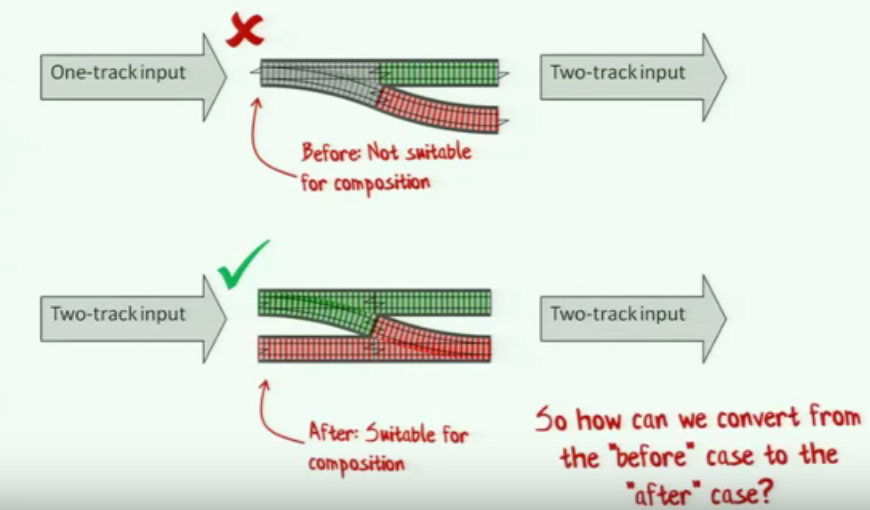

+++
title = "Functional-Programming-Design-Pattern"
summary = ''
description = ""
categories = []
tags = []
date = 2017-10-14T14:40:35+08:00
draft = false
+++

今天尝试着去了解了 F# 中的 Railway Oriented Programming(面向铁轨编程？)，详细的讲解可以在 [https://fsharpforfunandprofit.com/rop/](https://fsharpforfunandprofit.com/rop/) 上找到，另外结合同作者的另一个演讲视频 [functional-programming-design-patterns](https://youtu.be/E8I19uA-wGY) 食用更佳

视频都是用 F# 举例，不过也没关系，如果你有 Haskell 的使用经验，应该不会对下面的内容感到惊讶

下面总结了函数式编程的几个概念以及 Railway Oriented Programming， **由于本人才疏学浅，如有疏漏之处，希望能在本文之后评论一下**

### Function are things

函数是独立的(一等公民)，不关联类和对象。他可以被理解为一个进行转换的隧道(the tunnel of transformation)。在 F# 中函数定义和变量定义是相同的语法，你可以将函数用在所有可以使用变量的场景中，比如作为函数的参数，函数的返回值等

*F# 中的函数定义和变量定义相似*
```F#
let z = 1
let add a b = a + b
```

### Function Components

函数可以进行组合，可以将返回类型和输入类型相同的函数串联起来组成一个新的函数

```Haskell
(.) :: (b->c)->(a->b)->a->c
```

实现与下面等价

```Haskell
(f . g) = \x -> f(g x)
```

### Types are not classes

types 有别于 classes，它是一组值的名字(name of a set of values)

types 从行为中将数据抽离出来(separate data from behavior)

types 可以进行组合如 union types

### Design Principle: Strive for totality

totality 指对于每一个输入，函数都有一个输出。所以下面这个例子有点奇怪，对于 `12/0` 我们应当得到什么？

```
int TwelveDividedBy(int input)
{
    switch (input)
    {
        case 3: return 4;
        case 2: return 6;
        case 1: return 12;
        case 0: ???
    }
}
```

在大部分语言中会这样做

```
case 0:
  throw InvalidArgException
```

但是与函数签名 `int->int` 相矛盾，对于输入 `0`，我们并不能得到一个 `int` 的输出。这显然不是我们想要的

第一种解决方法是将输入类型改为 `NonZeroInteger`
第二种解决方法是将输出类型改为 `Option<Int>` 并在输入 `0` 时 `return None`

### Parameterize all the thing

尽可能的去参数化，而不是硬编码(hard-code)

比如下面这个函数(F#语法)

```F#
let printList() -
  for i in [1..10] do
    printfn "the number is %i" i
```

第一 `[1..10]` 应当被参数化

```F#
let printList aList =
  for i in aList do
    printfn "the number is %i" i
```

第二处是 `printfn` 也应当被参数化

```F#
let printList anAction aList =
  for i in aList do
    anAction i
```

这样可以省去很多面向对象中的样板方法

### Fucntion types are interface

根据单一职责和接口隔离原则，一个接口仅有一个方法，这和函数类型很像

```C#
interface IBunchOfStuff
{
  int DoSomething(int x);
}
```

An interface with one method is a just a function type

```F#
type IBunchOfStuff: int -> int
```

### Every function is a one parameter function

composition patterns only work for functions that have on parameter
but every function is a one parameter function

```
// Normal(Two parameters)
let add x y = x + y
// As a thing(No parameters)
let add = (func x y -> x + y)
// One parameter
let add x = (fun y -> x + y)
```

### Partial application

可以部分应用参数然后返回一个接收剩余参数的东西

```
let name = "Scott"
printfn "Hello, my name is %s" name

// convert to one parameter

let name = "Scott"
(printfn "Hello, my name is %s") name

// partial application

let name = "Scott"
let hello =printfn "Hello, my name is %s"
hello name
```

`hello` 即为一个 Partial application，这种操作常用在 `map` 等上面

```
let hello = printfn "Hello, my name is %s"
let names = ["Alice"; "Bob"; "Scott"]
names |> List.iter hello
```

partial application 也可以用在依赖注入(Dependency Injection)上

比如实现 DB select 和 memory select

```F#
type GetCustomer = CustomerId -> Customer

// select from db
let getCustomerFromDatabase connection (customerId:CustomerId) =
  // pass

type of getCustomerFromDatabase =
              DbConnection -> CustomerId -> Customer

let getCustomer1 = getCustomerFromDatabase myconn


// select from memory
let getCustomerFromMemory dict (customerId:CustomerId) = dict.Get(customerId)

type of getCustomerFromMemory =
        Dictionary<Id, Customer> -> CustomerId -> Customer

let getCustomer2 = getCustomerFromMemory dict
```

### continuations
A continuation is simply a function that you pass into another function to tell it what to do next.

比如下面这样由调用方来决定操作

```
void Divide(int top, int bottom,
            Action ifZero, Action<int>)
{
  if (bottom == 0)
  {
    ifZero();
  }
  else
  {
    ifSuccess( top/bottom );
  }
}
```

continuation 可以避免嵌套过深的条件检查

```F#
let example input =
  let x = doSomething input
  if x <> null then
    let y = doSomethingElse x
    if y <> null then
      let z = doAThirdThing y
      if z <> null then
        let result = z
        result
      else
        null
    else
      null
  else
    nuill
```

可以视为

```F#
let example input =
  let x = doSomething input
  if x.IsSome then
    let y = doSomethingElse (x.Value)
    if y.IsSome then
      let z = doAThirdThing (y.Value)
      if z.IsSome then
        let result = z.Value
        Some result
      else
        None
    else
      None
  else
    None
```

经过观察可以发现是以下操作的重复

```F#
if z.IsSome then
  // do something with z.Value
  // in this block
else
  None
```

进行抽象

```F#
let ifSomeDo f opt =
  if opt.IsSome then
    f opt.Value
  else
    None
```

最终可以简化为

```F#
let example input =
  doSomething input
  |> ifSomeDo doSomethingElse
  |> ifSomeDo doAThirdThing
  |> ifSomeDo (fun z -> Some z)
```

### monads(aka chaining continuation)

上面代码其实现了 `bind`

```F#
let bind f opt =
  match opt with
  | Some v -> f v
  | None -> None
```

```F#
let example input =
  doSomething input
  |> bind doSomethingElse
  |> bind doAThirdThing
  |> bind (fun z -> Some z)
```

一个具有单一输入，两个输出的函数可以视为一个 railway track。比如给定输入然后返回结果，如果结果不为 `None` 则继续下一步操作(将值传入下一个函数中)，如果为 `None` 则什么都不做。多个这样的函数是无法进行串联的(输出个数无法对象下一个函数的输入个数)。所以借助上面的 `bind` 来做



具体可以观看[https://youtu.be/E8I19uA-wGY?t=38m42s](https://youtu.be/E8I19uA-wGY?t=38m42s)

### map

即 Haskell 的 `fmap`

### Monoids

数学概念：幺半群，需要满足下面三个规则

- Rule 1(Closure): The result of combining two things is always another one of the things.

- Rule 2(Associativity): When combining more than two things, which pairwise combination you do first doesn't matter.

- Rule 3(Identity element): There is a special thing called "zero" such that when you combine any thing with "zero" you get the orginal thing back.

Monoids 的组合依然是 Monoid

function where the input and output are the same type are monoids! It called endomorphisms. All endomorphisms are monoids.

### Reference
[Functional Programming Design Patterns](https://fsharpforfunandprofit.com/fppatterns/)  
[Railway Oriented Programming](https://fsharpforfunandprofit.com/rop/)

    