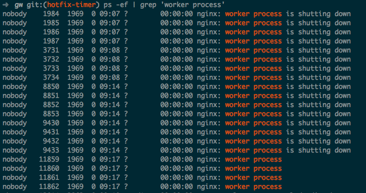

+++
title = "openresty timer 在 reload 时无法退出"
summary = ''
description = ""
categories = []
tags = []
date = 2017-10-24T14:17:56+08:00
draft = false
+++

昨天遇到一件诡异的事情，线上用作 gateway 的 openresty 引发了内存报警。这些 openresty 之前已经运行了 5 周左右的时间。开始还以为代码中或许有引发内存泄漏的 bug，但是仔细查看后。发现了如下的情况 (因为我是实习的碰不到生产环境，所以下面这个图是本地模拟的)



显示 `is shutting down` 的进程数目足足有 `212` 个(线上服务器只有 8G 内存)。

WTF，这些进程一直没有自杀，最长的从九月份活到了现在

由于这 gateway 是我写的，所以找 bug 的重任自然落到我的头上了(自食恶果)。一共也没多少代码，很容易地就将问题定位在了 `reload` 上。线上 `reload` 了一次，结果成功增加了一个进程(也就是说 `5` 周的时间发了 `212` 次代码，这是加特林么？没错，毕竟用的 `gunnery`)

只增加了一个进程，这个很关键。因为我们一共开启了 `4` 个 `worker`。换句话说，有一个进程是特殊的。那便是用来定时同步数据的 `worker`。大致代码如下：

```Lua
if 0 == ngx.worker.id() then
  local delay = 0
  local handler = function (premature)
    if premature then
      return
    end

    -- 使用 ngx.sleep 替换了网络 IO 和 ngx.share.DICT 的读写
    ngx.sleep(60)

    local ok, err = ngx.timer.at(delay, handler)
    if not ok then
      ngx.log(ngx.ERR, "failed to create the timer: ", err)
      return
    end
  end

  -- 实际上同时运行了 3 个 timer，来执行不同的 cron job
  local ok, err = ngx.timer.at(delay, handler)
  if not ok then
    ngx.log(ngx.ERR, "failed to create the timer: ", err)
    return
  end
end
```

好吧，可能有人会说这是什么烂代码(本人无法反对)。`delay` 是 `0` 啊，相当于 `while true`，算什么 cron job。实际上，之所以 `delay` 为 `0` 是因为那次请求是一个长连接，在 upstream 没有数据变动的时候，足足会在那里维持 `4` 分钟。问题在于根据文档所说，worker 即将退出时会将 `callback` 的第一个参数设置为一个退出原因(`process exiting`)的字符串，而我们的 `premature` 没起作用

接下来，便是漫长的 Google 时间。然而没什么卵用，只找到了个相似的 [帖子](https://groups.google.com/d/msg/openresty/JmPf9HtdYwk/0kcn6vF_GWEJ)，不过解决办法却适用(玄学？)

```Lua
if ngx.worker.exiting() then
  return
end
```

无奈之下，只能去翻看 openresty 的源代码了。其实这个问题很简单

``` C
static int
ngx_http_lua_ngx_timer_at(lua_State *L)
{
    return ngx_http_lua_ngx_timer_helper(L, 0);
}


/*
 * TODO: return a timer handler instead which can be passed to
 * the ngx.timer.cancel method to cancel the timer.
 */
static int
ngx_http_lua_ngx_timer_every(lua_State *L)
{
    return ngx_http_lua_ngx_timer_helper(L, 1);
}


static int
ngx_http_lua_ngx_timer_helper(lua_State *L, int every)
{
    int                      nargs, co_ref;
    u_char                  *p;
    lua_State               *vm;  /* the main thread */
    lua_State               *co;
    ngx_msec_t               delay;
    ngx_event_t             *ev = NULL;
    ngx_http_request_t      *r;
    ngx_connection_t        *saved_c = NULL;
    ngx_http_lua_ctx_t      *ctx;
#if 0
    ngx_http_connection_t   *hc;
#endif

    ngx_http_lua_timer_ctx_t      *tctx = NULL;
    ngx_http_lua_main_conf_t      *lmcf;
#if 0
    ngx_http_core_main_conf_t     *cmcf;
#endif

    nargs = lua_gettop(L);
    if (nargs < 2) {
        return luaL_error(L, "expecting at least 2 arguments but got %d",
                          nargs);
    }

    delay = (ngx_msec_t) (luaL_checknumber(L, 1) * 1000);

    if (every && delay == 0) {
        return luaL_error(L, "delay cannot be zero");
    }

    luaL_argcheck(L, lua_isfunction(L, 2) && !lua_iscfunction(L, 2), 2,
                  "Lua function expected");

    r = ngx_http_lua_get_req(L);
    if (r == NULL) {
        return luaL_error(L, "no request");
    }

    ctx = ngx_http_get_module_ctx(r, ngx_http_lua_module);

    /* look here */
    if (ngx_exiting && delay > 0) {
        lua_pushnil(L);
        lua_pushliteral(L, "process exiting");
        return 2;
    }
```

`ngx_exiting` 为 `true` 且 `delay` 的值应当大于 `0` 才会起将 `premature` 设为 `process exiting`。而我们的 `delay` 一直是 `0` ！！！

解决方法：将 `delay` 更改为 `0.001` 即可

本来以为这貌似是个 bug，但是看了看这行代码的 [`commit` 信息](https://github.com/openresty/lua-nginx-module/commit/4d6dc5804a3be5230173fef1d713a56634700cf3)，觉得的确这样做是有道理的。`delay` 为 `0` 代表应当立即处理(实际上并不是立即)，worker 本来就是要在处理完手头已有的任务才会退出

另外说一下 openresty 已经添加了 [`ngx.timer.every` API](https://github.com/openresty/lua-nginx-module#ngxtimerevery)(今年五月的时候)，你再也不用这样写定时任务了。而且此 API 的 `delay` 参数当然也不能为 `0`

    