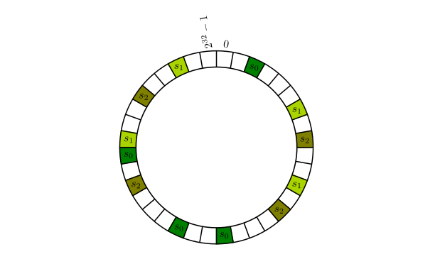

+++
title = "Consistent Hashing And Python Implement"
summary = ''
description = ""
categories = []
tags = []
date = 2017-10-29T12:45:57+08:00
draft = false
+++

本文内容大致来源于 [CS168: The Modern Algorithmic Toolbox Lecture #1: Introduction and Consistent Hashing](http://theory.stanford.edu/~tim/s17/l/l1.pdf)

### 0X00

假设你对 cache 进行水平扩展，那么你便希望将数据较均匀地存储到每一台 cache 中。Hash 算法可以帮助你，比如 `MD5(id) % cache_num`。理想情况下可以运作，但是现实情况中有很多干扰因素。如果想对这个集群进行扩容，比如增加一个 cache 节点，那么可能引发所有的数据进行重新定位。同样的，如果有一个节点宕机也会产生这种状况

```
md5('user_id#1001') % 3  # 1
md5('user_id#1002') % 3  # 0
# add a new cache node
md5('user_id#1001') % 4  # 2
md5('user_id#1002') % 4  # 0
```

一致性哈希可以解决上述的场景，某个节点的添加和移除不会重新分配全部的数据，而只会影响小部分的数据，如果均衡性做的好的话，当添加一个节点时，会均匀地从其它节点移一部分到新的节点上；当删除一个节点的时候，这个节点上的数据会均匀地分配到其它活着的节点上

Karger 一致性哈希算法首先对 cache 进行哈希(可以根据 server name 之类的唯一性标识)，然后散列到一个环上(假设长度为 2^32-1)【下图左】。对于数据我们也同样哈希至环上的某个位置，再顺时针找到第一个 cache 节点，这便是它的存储位置。如果新增了节点 s3，那么原来放到 s0 的一部分数据就可以存放到 s3 上，不会导致所有节点的数据分配受到影响【下图右】


但是这种做法也有些问题。首先 cache 节点应在环上分配均匀。其次如果有一个节点宕机，那么顺时针方向的下一个节点将会承受原来两倍的数据量(分配均匀的情况下)，搞不好会崩溃，然后引发雪崩效应。我们可以通过 "virtual copies" 的方法来解决。具体来说是使用 k 种不同的 Hash 算法来对 cache 节点进行散列。n 个节点，在环上会出现 n × k 次



"virtual copies" 也可用于解决异构 cache 的场景。根据容量或者其他参数来合理地制定 virtual copies 的数量。例如，如果一个 cache 容量是另一个 cache 的两倍，那么应该有两倍的 virtual copies

### 0X01

下面是论文中的关于使用何种数据结构的讨论

>A hash table isn’t good enough (it doesn’t maintain any order information at all); a heap isn’t good enough (it only maintains a partial order so that identifying the minimum is fast); but recall that binary search trees, which maintain a total ordering of the stored elements, do export a Successor function. Since the running time of this operation is linear in the depth of the tree, it’s a good idea to use a balanced binary search tree, such as a Red-Black tree. Finding the cache responsible for storing a given object x then takes O(log n) time, where n is the number of caches.

Python 实现如下 *借助红黑树，个人感觉没必要，直接用 `bisect` 就行了*

```Python
import hashlib
from bintrees.rbtree import RBTree
from types import GeneratorType


def md5(data: str) -> int:
    """md5 util function"""
    return int(hashlib.md5(data.encode('utf-8')).hexdigest(), 16)


class Node:
    """Node Implemention
    >>> n1 = Node('192.168.1.203')
    >>> n1.name
    '192.168.1.203'
    >>> n2 = Node('192.168.1.203', prefix='slave')
    >>> n2.name
    'slave#192.168.1.203'
    >>> n1.nid != n2.nid
    True
    """

    algorithms = {
        'md5': md5
    }

    def __init__(self, node_name: str, prefix: str='',
                 nid: int=None, kind: str='md5'):
        self._node_name = node_name
        if prefix:
            self._node_name = '{}#{}'.format(prefix, self._node_name)
        self._nid = nid or self.algorithms[kind](self._node_name)

    @property
    def name(self) -> str:
        return self._node_name

    @property
    def nid(self) -> int:
        return self._nid


class ConsistentHashing:
    """Consistent Hashing Implemention
    >>> ch = ConsistentHashing()
    >>> ch.size
    255
    >>> ch.join(Node('192.168.1.2'))
    >>> ch.node_count
    1
    >>> ch.join(Node('192.168.1.2', prefix='slave'))
    >>> ch.node_count
    2
    >>> ch.join(Node('192.168.1.65'))
    >>> ch.join(Node('192.168.1.232'))
    >>> [nid for nid, _ in ch.nodes]
    [83, 135, 141, 243]
    >>> ch.get_location(0)
    83
    >>> ch.get_location(39)
    83
    >>> ch.get_location(100)
    135
    >>> ch.get_location(141)
    141
    >>> ch.get_location(244)
    83
    """

    def __init__(self, size: int=255):
        self._rbtree = RBTree()
        self._size = size

    @property
    def size(self)-> int:
        return self._size

    @property
    def nodes(self)-> GeneratorType:
        """a generator"""
        return self._rbtree.items()

    @property
    def node_count(self)-> int:
        return self._rbtree.count

    def join(self, node):
        self._rbtree.insert(node.nid % self._size, node)

    def depart(self, node):
        self._rbtree.remove(node.nid % self._size, node)

    def get_location(self, elem)-> int:
        try:
            # raise KeyError When no key greater than the elem
            # so return the min key, since this is a loop
            location = self._rbtree.ceiling_key(elem)
        except KeyError:
            location = self._rbtree.min_key()
        return location


if __name__ == '__main__':
    import doctest
    doctest.testmod(verbose=False)
```

    