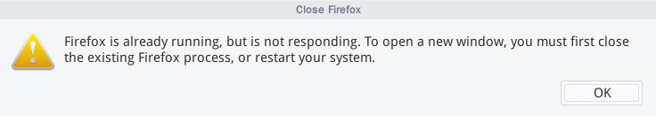
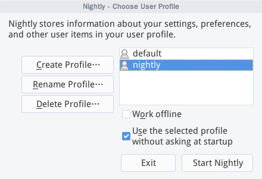
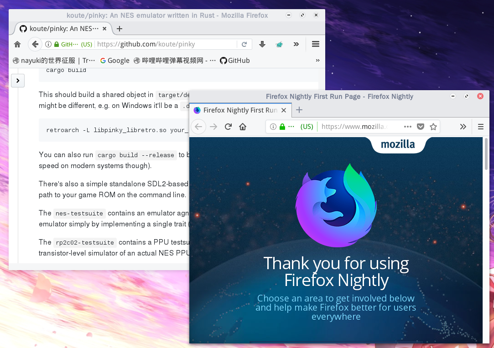
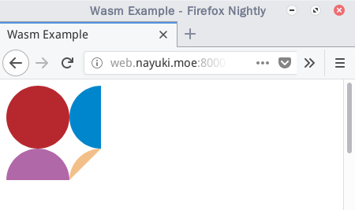

+++
title = "Web Assembly 初体验"
summary = ''
description = ""
categories = []
tags = []
date = 2018-01-03T12:50:27+08:00
draft = false
+++

如果要体验 web-assembly 首先要具备一个高版本的浏览器，比如 FireFox-nightly

假设你已经安装了低版本的 Firefox，比如我的 debian8-stable 还在用源中的 Firefox-esr 52，它是无法使用 web-assembly。自行下载 nightly 后运行，会发现如下的提示



本以为有一个文件锁，但是删除 `/home/user/.mozilla/firefox/tu8u4d8l.default` 的 `lock` 文件并没有什么卵用。经过查询后，这个问题可以通过以 `-p -no-remote` 的方式启动 Firefox 来解决



创建并选择一个新的 `profile` 即可




那么我们便可以写代码了，这里我使用我喜欢的 Rust

需要 nightly 版本的 Rust。因为机器上已经装过 Rust了，所以这里直接上 Docker 好了

```Bash
docker pull rustlang/rust:nightly
```

运行容器时挂载一个本地目录，方便写代码

```Bash
docker run -it -v /root/rustbyexample/webAssembly:/home --net host rustlang/rust:nightly /bin/bash
```

新建一个 Rust 项目，并切换至该目录

```Bash
cargo new --bin wasm-example
```

这里选择使用 [`stdweb`](https://github.com/koute/stdweb) 来与 Web API 进行交互，根据 `README` 需要执行下面的命令

```Bash
rustup target add wasm32-unknown-unknown
```

安装 `cargo-web`，这一步耗时炒鸡长

```Bash
cargo install -f cargo-web
```

至此准备工作已经完成，下面可以写代码了。建立 `static` 目录，写一段简单的 `html`

```html
<!DOCTYPE html>
<html lang="en">
  <head>
    <meta charset="UTF-8">
    <title>Wasm Example</title>
  </head>
  <body>
    <script src="js/app.js"></script>
    <canvas id="viewport" width="256" height="240"></canvas>
  </body>
</html>
```

在 `Cargo.toml` 中加入依赖

```
[dependencies]
stdweb = "0.3"
```

编写 `src/main.rs`，这段来自于 MDN[使用canvas来绘制图形](https://developer.mozilla.org/zh-CN/docs/Web/API/Canvas_API/Tutorial/Drawing_shapes) 中的圆弧部分

```Rust
#![recursion_limit="2048"]

#[macro_use]
extern crate stdweb;

use stdweb::web;
use std::f32::consts::PI;


fn draw_circle(ctx: &stdweb::Value, color: &str, pos: (f32, f32),
               radius: f32, angle: (f32, f32), anticlockwise: bool) {
    js!(
        @{ctx}.beginPath();
        @{ctx}.arc(@{pos.0}, @{pos.1}, @{radius},
                   @{angle.0}, @{angle.1}, @{anticlockwise});
        @{ctx}.fillStyle = @{color};
        @{ctx}.fill();
    );
}

fn main() {
    stdweb::initialize();

    let canvas = web::document().get_element_by_id("viewport").unwrap();
    let ctx: stdweb::Value = js!( return @{canvas}.getContext("2d"); );

    draw_circle(&ctx, "#B7282E", (40.0, 40.0), 40.0, (0.0, 2.0*PI), true);
    draw_circle(&ctx, "#0086CC", (120.0, 40.0), 40.0, (PI/2.0, 3.0*PI/2.0), false);
    draw_circle(&ctx, "#B168A8", (40.0, 120.0), 40.0, (0.0, PI), true);
    draw_circle(&ctx, "#F3BF88", (120.0, 120.0), 40.0, (-PI, -PI/2.0), false);
}
```

编译并运行

```Bash
cargo web start --host 0.0.0.0 --target-webasm --release
```



关于 `stdweb` 的进一步使用可以参考原作者写的 [NES 模拟器](https://github.com/koute/pinky)

    