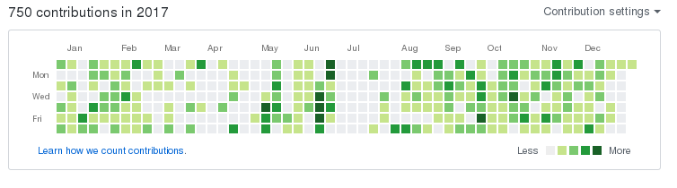

+++
title = "2017: 伪物"
summary = ''
description = ""
categories = []
tags = []
date = 2018-01-12T00:07:00+08:00
draft = false
+++

PID 66372709
首先晒一下去年的目标  

1) 学日语 学日语 学日语 重要的事情说三遍
2) 找一份满意工作
3) 如果工作定下来的话，养只猫
4) 想去旅行
5) 学习绘画，我想要萝莉｡◕‿◕｡ 

可以算作一个都没有达到  
1) 只是有段时间在下班地铁上学过，之后又弃了，已经记不清这是第几次了  
2) 找了一份工作，然后辞职了  
3) ~ 5) 仿佛都忘记了

所以说 2017 年我干了些什么呢？

#### 依旧在码农到程序员之路上前行

GitHub 上 750 个 contributions 

大概是去年的 3 倍，大部分给了公司的开源项目

[lupinus](https://github.com/Hanaasagi/lupinus) Ruby 实现的模板引擎  
[Functional Programming in Python](https://github.com/Hanaasagi/FP-in-python-zh) 翻译  
[XXTEA-Rust](https://github.com/Hanaasagi/XXTEA-Rust) XXTEA 加密 Rust 实现  
[imouto](https://github.com/Hanaasagi/imouto) 一个异步 Web 框架，还有很多坑没填  
[meido-vim](https://github.com/Hanaasagi/meido-vim) 自己的 Vim 配置  
[pony-tutorial-chinese](https://github.com/Hanaasagi/pony-tutorial-chinese) 文档翻译  
[sea](https://github.com/shanbay/sea) 基于 gRpc 的一个框架  
[sorator](https://github.com/shanbay/sorator) 基于 orator ORM 二次开发  

相对的，读的书比去年少一些(买了 Kindle，但也没什么时间)

[Python Web 开发实战](https://book.douban.com/subject/26852057/)  
[算法图解](https://book.douban.com/subject/26979890/)  
[魔力 Haskell](https://book.douban.com/subject/26877215/) (只读了一半左右)  
[Fluent Python](https://book.douban.com/subject/26278021/) (读的原版，差不多看了 1/3)  
[Linux 内核设计与实现](https://book.douban.com/subject/6097773/)(正在开坑)  
[自制编程语言](https://book.douban.com/subject/25735333/)  
[SQL 反模式](https://book.douban.com/subject/6800774/)  
[理解 Unix 进程](https://book.douban.com/subject/24298701/)  
[代码之髓](https://book.douban.com/subject/25927585/)  
[架构真经](https://book.douban.com/subject/27020143/)  
[垃圾回收算法的设计与实现](https://book.douban.com/subject/26821357/)  
[代码整洁之道](https://book.douban.com/subject/4199741/)

#### 依旧在博客上写水文

今年博客更新比较频繁，一个月基本有 4 篇。但感觉挺水的，毕竟本人水平就这样了

#### 依旧在现实生活中苟且

<iframe frameborder="no" border="0" marginwidth="0" marginheight="0" width=330 height=86 src="//music.163.com/outchain/player?type=2&id=29099412&auto=0&height=66"></iframe>

#### 关于 2018 ?(依旧无法完成计划)

1) 养猫
2) 日语
3) 日本旅行

年终总结这种行为，无疑是一种自我虐待
    