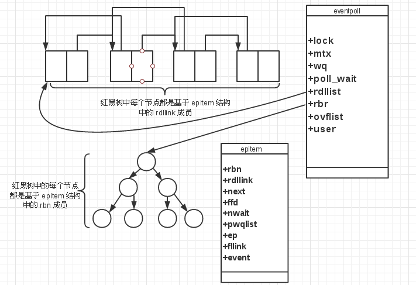

+++
title = "select 和她的朋友们"
summary = ''
description = ""
categories = []
tags = []
date = 2018-01-16T03:16:49+08:00
draft = false
+++

### `select`

`select(2)` 系统调用需要我们告诉内核

- 我们所关心的描述符
- 对于每个描述符我们所关心的事件(是否想从一个给定的描述符读，是否想写一个给定的描述符，是否关心一个给定的描述符的异常)
- 愿意等待多长时间(可以永远等待、等待一个固定的时间或者根本不等待)

从 `select` 返回时，内核会告诉我们

- 已经就绪的描述符的数量
- 对于读、写、异常这三种条件中的每一个，哪些描述符已经就绪

使用这种返回信息，就可调用相应的 I/O 函数(一般是 `read` 或 `write`)，并且确知该函数不会阻塞

函数签名如下

```
#include <sys/select.h>
int select(int nfds, fd_set *readfds, fd_set *writefds,
           fd_set *exceptfds, struct timeval *timeout);
```

中间三个参数 `readfds`、`writefds`、`exceptfds` 是指向描述符集的指针。每个描述符集存储在一个 `fd_set` 类型中，它可以为每一个可能的描述符保留 1 bit(一个 bitmap 可以参考[实现](https://stackoverflow.com/questions/18952564/understanding-fd-set-in-unix-sys-select-h))。有四个函数可以操作描述符集

```
void FD_CLR(int fd, fd_set *set);  // 将 fd 对应的位置 0
int  FD_ISSET(int fd, fd_set *set);  // fd 是否在描述符集中
void FD_SET(int fd, fd_set *set);  // 将 fd 对应的位置 1
void FD_ZERO(fd_set *set);  // 将 fd_set 中所有位置 0

/* Example */
fd_set rset;
int fd;
FD_ZERO(&rset);
FD_SET(fd, &rset);
FD_SET(STDIN_FILENO, &rset);
```

另外这三个参数均可以为 `NULL`，表示对相应条件不关心。

第一个参数 `nfds` 为三个描述符集中最大描述符的值 **`+1`**。也可以将此参数设置为 `FD_SETSIZE`(`sys/select.h` 中的常量)，它指定最大描述符数。通过指定我们所关注的最大描述符，内核就只需在此范围内寻找打开的位，而不必在三个描述符集中的数百个没有使用的位中进行搜索


最后一个参数 `timeout` 用于指定愿意等待的时间长度，为 `timeval` 类型，定义如下

```
struct timeval {
      time_t        tv_sec;     /* seconds */
      suseconds_t   tv_usec;    /* microseconds */
};
```

存在以下三种情况：

- `timeout == NULL` 永远等待，除非所指定的描述符中的一个已经就绪，或者捕捉到一个信号则中断此无限等待(返回 `-1`， `errno` 置为 `EINTR`)
- `timeout->tv_sec == 0 && timeout->tv_usec == 0` 测试所有指定的描述符并立即返回
- `timeout->tv_sec != 0 || timeout->tv_usec != 0` 等待指定时间，如果在超时到期间无描述符就绪则返回 `0`


`select` 的返回值有三种：

- `-1` 出现异常。例如在所指定的描述符一个都没准备好的时候捕捉到了一个信号。此情况下，一个描述符集都不修改
- `0` 没有描述符就绪(超时)。此时所有的描述符集都会置 `0`
- `正整数 n` 已经就绪的描述符的数量。该值是三个描述符集中已就绪的描述符数目之和，所以 **如果同一描述符读和写均就绪，那么会重复计数**。此情况下，三个描述符集中仍打开得到位对应于已就绪的描述符

就绪的含义如下

- 对于读集(`readfds`)中的一个描述符进行的 `read` 操作不会阻塞，则认为此描述符就绪
- 对于读集(`writefds`)中的一个描述符进行的 `write` 操作不会阻塞，则认为此描述符就绪
- 对于异常集(`exceptfds`)中的一个描述符有一个未决异常条件，则认为此描述符就绪
- 对于读、写、异常条件，普通文件的文件描述符总是返回就绪

一个描述符阻塞并不影响 `select` 是否阻塞

示例代码(来自于代码的未来)

```
#define NSOCKS 2
int sock[NSOCKS], maxfd; ←---sock[1]、sock[2]……中存入要监视的socket。maxfd中存入最大的文件描述符
fd_set readfds;
struct timeval tv;
int i, n;

FD_ZERO(&readfds); ←---fd_set初始化
for (i=0; i<NSOCKS; i++) {
  FD_SET(sock[i], &readfds);
}

tv.tv_sec = 2; ←---2秒超时
tv.tv_usec = 0;

n = select(maxfd+1, &readfds, NULL, NULL, &tv); ←---调用select，这次只监视read。关于返回值n：负数–出错，0–超时，正数–状态发生变化的fd数量

if (n < 0) {  /* 出错 */
  perror(NULL);
  exit(0);
}
if (n == 0) { /* 超时 */
  puts("timeout");
  exit(0);
}
else {        /* 成功 */
  for (i=0; i<NSOCKS; i++) {
    if (FD_ISSET(sock[i], &fds)) {
      do_something(sock[i]);
    }
  }
}
```

### poll

```
#include <poll.h>

int poll(struct pollfd *fds, nfds_t nfds, int timeout);
```

与 `select` 不同，`poll` 不是为每个条件(读、写、异常)构造一个描述符集，而是构造一个 `pollfd` 结构的数组，每个数组元素指定一个描述符编号以及对该描述符感兴趣的条件

```
struct pollfd {
    int   fd;         /* file descriptor */
    short events;     /* requested events */
    short revents;    /* returned events */
};
```

应将数组元素的 `events` 域设置为 `POLLIN`、`POLLOUT` 等 `poll(2)` 中所列出的值。通过这些值告诉内核我们关心的是描述符的何种条件。`poll` 调用返回时，`revents` 域会被内核设置，用于说明每个描述符发生了哪些事件

数组中的元素数目由第二个参数 `nfds` 指定。第三个参数 `timeout` 和 `select` 中用法差不多，不过数据类型不同(单位为毫秒)

与 `select` 一样，一个描述符是否阻塞不会影响 `poll` 是否阻塞

### epoll

设想一个场景：有 100 万用户同时与一个进程保持着 TCP 连接，而每一时刻只有几千个或几百个 TCP 连接是活跃的(接收到 TCP 包)，也就是说，在每一时刻，进程只需要处理这 100 万连接中的一小部分。即在某一时刻，进程收集有事件的连接时，其实这 100 万连接中的大部分是没有事件发生的。因此，如果每次收集时间时，都把这 100 万连接的套接字传给操作系统(用户态到内核态的大量复制)，而由操作系统内核寻找这些连接上有没有未处理的事件，将会是巨大的资源浪费，然而 `select` 和 `poll` 就是这样做的，因此它们最多只能处理几千个并发连接。而 `epoll` 不这样做，它在 Linux 内核中申请了一个简易的文件系统，把原先的一个 `select` 或者 `poll` 调用分成了三个部分：

1. 调用 `poll_create` 建立一个 `epoll` 对象(在 `epoll` 文件系统中给这个描述符分配资源)
2. 调用 `epoll_ctl` 向 `epoll` 对象中添加这 100 万个连接的套接字
3. 调用 `epoll_wait` 收集发生事件的连接。这样，只需要在进程启动时建立一个 `epoll` 对象，并在需要的时候向它添加或删除连接就可以了，因此，在实际收集事件时，`epoll_wait` 的效率就会非常高，因为调用 `epoll_wait` 时并没有向它传递 100 万个连接，内核也不需要去遍历全部的连接

以 Linux 内核 2.6.35 版本代码为例

当某一个进程调用 `epoll_create` 方法时，Linux 内核会创建一个 `eventpoll` 结构体，这个结构体中有两个成员与 `epoll` 的使用方式相关

```
struct eventpoll {
    ...
    /* 红黑树的根节点，这个树中存储着所有添加到 epoll 中的事件，也就是这个 epoll 监控的事件 */
    struct rb_root rbr;
    /* 双向链表 rdllist 保存着将要通过 epoll_wait 返回给用户的、满足条件的事件 */
    struct list_head rdllist;
    ...
};
```



每个 `epoll` 对象都有一个独立的 `eventpoll` 结构体，这个结构体会在内核空间中创造独立的内存，用于存储使用 `epoll_ctl` 方法向 `epoll` 对象中添加进来的事件。这些事件都会挂到 `rbr` 红黑树中，这样，重复添加的事件就可以通过红黑树而高效地识别出来(`epoll_ctl` 方法会很快)

所有添加到 `epoll` 中的事件都会与设备驱动程序建立回调关系，也就是说，相应的事件发生时会调用这里的回调方法。这个回调方法在内核中叫做 `ep_poll_callback`，它会把这样的事件放到上面的 `rdllist` 双向链表中。在 `epoll` 中对于每个事件都会建立一个 `epitem` 结构体

```
struct epitem {
    ...
    /* 红黑树节点 */
    struct rb_node rbn;
    /* 双向链表节点 */
    struct list_head rdllink;
    /* 事件描述符等信息 */
    struct epoll_filefd ffd;
    /* 指向其所属的 eventpoll 对象 */
    struct eventpoll *ep;
    /* 期待的事件类型 */
    struct epoll_event event;
    ...
};
```

这里包含每一个事件对应着的信息

当调用 `epoll_wait` 检查是否有发生事件的连接时，只是检查 `eventpoll` 对象中的 `rdllist` 双向链表是否有 `epitem` 元素而已，如果 `rdllist` 链表不为空，则把这里的事件复制到用户态中，同时将事件的数量返回给用户。因此，`epoll_wait` 的效率非常高。`epoll_ctl` 在向 `epoll` 对象中添加、修改、删除事件时，从 `rbr` 红黑树中查找事件也非常快

`epoll` 通过下面 3 个 `epoll` 系统调用为用户提供服务

(1) `epoll_create` 系统调用

```
int epoll_create(int size);
```

`epoll_create` 返回一个描述符，之后 `epoll` 的使用都将依靠这个描述符来标识。参数 `size` 告诉 `epoll` 所需处理的大致事件数目(不是能够处理的事件的最大个数)。不再使用 `epoll` 时，必须调用 `close` 来关闭

(2) `epoll_ctl` 系统调用

```
int epoll_ctl(int epfd, int op, int fd, struct epoll_event* event);
```

`epoll_ctl` 向 `epoll` 对象中添加、修改、删除感兴趣的事件，返回 0 表示成功，否则返回 -1，此时需要根据 `errno` 来判断错误类型。`epoll_wait` 方法返回的事件必然是通过 `epoll_ctl` 添加到 `epoll` 中的。参数 `epfd` 是 `epoll_create` 返回的描述符。`op` 参数的取值

```
EPOLL_CTL_ADD 添加
EPOLL_CTL_MOD 修改
EPOLL_CTL_DEL 删除
```

第三个参数 `fd` 是待检测的描述符(比如socket套接字)，第四个参数是在告诉 `epoll` 对何种事件感兴趣，为 `epoll_event` 结构体

```
struct epoll_event {
    uint32_t     events;      /* Epoll events */
    epoll_data_t data;        /* User data variable */
};
```

`events` 的取值在 `man epoll_ctl(2)` 中。`data` 域是一个 `union` 类型，定义如下

```
typedef union epoll_data {
    void        *ptr;
    int          fd;
    uint32_t     u32;
    uint64_t     u64;
} epoll_data_t;
```

(3) `epoll_wait` 系统调用

```
int epoll_wait(int epfd, struct epoll_event* events, int maxevents, int timeout);
```

收集在 `epoll` 监控的事件中已经发生的事件，如果 `epoll` 中没有任何一个事件发生，则最多等待 `timeout` 毫秒后返回。`epoll_wait` 的返回值表示当前发生的事件个数，如果返回 `0` 则表示本次调用中没有事件发生。如果返回 `-1` 则表示出现错误，需要检查 `errno` 来判断错误类型。第一个参数 `epfd` 是 `epoll` 的描述符。第二个参数 `events` 则是分配好的 `epoll_event` 结构体数组，`epoll` 将会把发生的事件复制到 `events` 数组中(`events` 不可以为 `NULL`，内核只负责把数据复制到这个数组中，不会去帮助我们在用户态中分配内存)。第三个参数 `maxevents` 表示本次可以返回的最大时间数目，通过 `maxevents` 参数和预分配的 `events` 数组的大小相等。第四个参数 `timeout` 的单位为毫秒，用法同 `poll`

`epoll` 有两种工作模式： LT(水平触发)模式和 ET(边缘触发)模式。默认情况下使用 LT 模式，这时可以处理阻塞和非阻塞套接字。可以通过 `epoll_ctl` 来进行更改模式(`EPOLLET`)。ET 模式的效率比 LT 模式高，但是它仅支持非阻塞套接字。ET 模式和 LT 模式的区别在于，当一个新的事件到来时，ET 模式下当然可以从 `epoll_wait` 调用中获取到这个事件，可是如果这次没有把这个时间对应的套接字缓冲区处理完，在这个套接字没有新的事件再次到来时，在 ET 模式下无法再次从 `epoll_wait` 调用中获取到这个事件的；而 LT 模式则相反，只要一个事件对应的套接字缓冲区还有数据，就总能从 `epoll_wait` 中获取这个事件。Nginx 使用 ET 模式

关于这两种模式的区别，`epoll_ctl(2)` 中也有详细的介绍，需要注意一下 `EPOLLONESHOT`

>Since even with edge-triggered epoll, multiple events can be generated upon receipt of multiple chunks of data, the caller has the option to specify the `EPOLLONESHOT` flag, to tell
epoll to disable the associated file descriptor after the receipt of an event with `epoll_wait(2)`.  When the `EPOLLONESHOT`， flag is specified, it is the  caller's  responsibility  to
rearm the file descriptor using `epoll_ctl(2)` with `EPOLL_CTL_MOD`.

### Reference
Unix 环境高级编程(APUE) 第三版 Page 404~409  
深入理解 nginx 第二版 Page 309  
Linux Programmer's Manual  
代码的未来

    