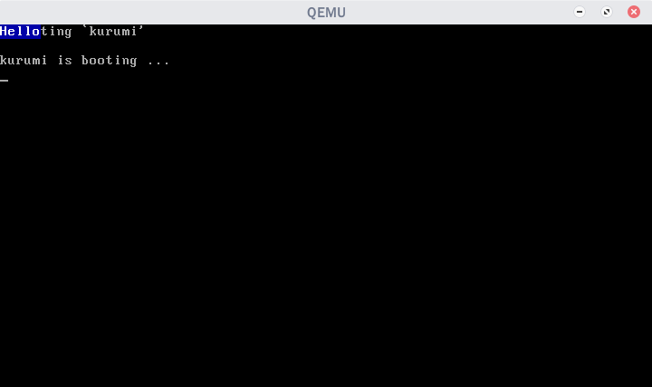

+++
title = "Kurumi Atelier Day1"
summary = ''
description = ""
categories = []
tags = []
date = 2018-01-20T12:36:46+08:00
draft = false
+++

### How computer boots up

首先是按下电源键进入 BIOS。这时会进行自检(POST or power-on self-test)，如果此时出现蜂鸣声，则代表失败。以前蠢作者的 HP 台式机出现过这种情况，这种蜂鸣声是有节奏的，可以去查对应的蜂鸣代码列表来排查故障。没有出现问题的话，BIOS 会根据设置来选择一个设备(U盘、硬盘)。通常，Linux 都是从硬盘上引导的，其中主引导记录(MBR)中包含主引导加载程序。MBR 是一个 512 字节大小的扇区，位于磁盘上的第一个扇区中(0 道 0 柱面 1 扇区)。当 MBR 被加载到内存中之后，BIOS 就会将控制权交给 MBR。MBR 以两个特殊的字节 0xAA55 结束。BIOS 便是根据这两个字节来判断此设备是否可以用于启动；如果不是则会尝试去启动启动顺序表中的下一个设备

PS 0xAA55 的值为 0b1010101001010101，貌似是因为这种和谐的格式。另外这 512 字节是载入到内存的 0x7c00 处

由于 MBR 的容量限制无法容纳整个 bootloader 程序(可使用的仅有 446 字节，另外分区表占 64 字节)。以 GRUB 为例，分为三个启动阶段

stage1:安装在 MBR 中
stage1.5:存放在 MBR 之后的扇区中，可以帮助识别文件系统
stage2:存放在磁盘分区上的，一般都在/boot/grub/目录下

如果是双系统，可以在 stage2 时看到系统选择界面。之后便是载入内核映像文件

更详细的介绍可以戳这里  
[计算机是如何启动的？ - 阮一峰的网络日志](http://www.ruanyifeng.com/blog/2013/02/booting.html)  
[Linux 的启动流程 - 阮一峰的网络日志](http://www.ruanyifeng.com/blog/2013/08/linux_boot_process.html)

### Multiboot

GRUB 实现了 Multiboot 的规范 [PDF](http://nongnu.askapache.com/grub/phcoder/multiboot.pdf)，只要我们的遵循这份规范，我们便可以使用 GRUB 来载入内核。一个好处就是它可以帮助我们从 real mode 切换到 protected mode

编写 `multiboot_header.asm`

```nasm
section .multiboot_header
header_start:
    dd 0xe85250d6                ; magic number (multiboot 2)
    dd 0                         ; architecture 0 (protected mode i386)
    dd header_end - header_start ; header length
    ; checksum
    dd 0x100000000 - (0xe85250d6 + 0 + (header_end - header_start))

    ; insert optional multiboot tags here

    ; required end tag
    dw 0    ; type
    dw 0    ; flags
    dd 8    ; size
header_end:
```

需要解释一下 checksum，规范中是这样表述的

>The field checksum is a 32-bit unsigned value which, when added to the other magic fields (i.e.  magic, architecture and header_length), must have a 32-bit unsigned sum of zero.

即 `checksum + magic_number + architecture + header_length = 0`，所以 `checksum = -(magic_number + architecture + header_length)`

因为是一个 `u32`，所以这里使用了溢出的 trick

接下来需要进行汇编生成 `multiboot_header.o` 文件

```
nasm -f elf64 multiboot_header.asm
```

### Say Hello

编写 `boot.asm` 文件

```
global start

section .text
bits 32
start:
    ; print `Hello` to screen
    mov WORD [0xb8000], 0x1f48;
    mov WORD [0xb8002], 0x1f65;
    mov WORD [0xb8004], 0x1f6c;
    mov WORD [0xb8006], 0x1f6c;
    mov WORD [0xb8008], 0x1f6f;
    hlt

```

`start` label 是 GRUB 一个约定，kernel 的入口(类似 main 函数)。`bits 32` 指定接下来的指令是 32 位的。`[0xb8000]` 是一个特殊的地址，向其后的 32KB 内存中写入数据，会打印至屏幕。原理是 memory-mapped，IO 设备上的设备内存和寄存器都已经被映射到内存空间的某个地址。这样设备内存也可以通过内存访问指令来完成读写。写入需要按照一定的格式，每个输出字符占用两个字节，一个字节是 ASCII 码，另一个字节是属性。比如 `Hello` 的输出

```
0x000b8000: 'H', colour_for_H
0x000b8002: 'e', colour_for_e
0x000b8004: 'L', colour_for_L
0x000b8006: 'l', colour_for_l
0x000b8008: 'o', colour_for_o
```

属性字节的最高位取决于硬件，接下来的 3 位是背景色，最后 4 位是前景色，详细的戳这里 [VGA text buffer](https://en.wikipedia.org/wiki/VGA-compatible_text_mode)

接下来进行汇编

```bash
nasm -f elf64 boot.asm
```

### Linking

我们将两个 `.o` 文件进行连接，就像 PPAP 那样。编写 `linker.ld` 文件

```
ENTRY(start)

SECTIONS {
    . = 1M;

    .boot :
    {
        /* ensure that the multiboot header is at the beginning */
        *(.multiboot_header)
    }

    .text :
    {
        *(.text)
    }
}
```

linker script 的语法可以参考 [这里](https://sourceware.org/binutils/docs/ld/Scripts.html)

`ENTRY` 用于指定入口，需要和前面保持一致，设置为 `start`

`. = 1M` 指定将此 section 放于 1M 处的内存空间中，这是一个传统的位置。低于 1M 的内存空间有可能用于 memory-mapped

剩下的就是指定嵌入的 section

进行连接时需要指定 `-n` 参数禁止 page align，这会影响到 GRUB 的识别

```
ld -n -o kernel.bin -T linker.ld multiboot_header.o boot.o
```

### Making ISO

建立如下的工程目录，将刚才生成的 `kernel.bin` 拷贝至指定位置

```
isofiles/
└── boot
    ├── grub
    │   └── grub.cfg
    └── kernel.bin
```

编写 `grub.cfg` 文件，你可以观察一下你自己 Linux 中的 `/boot/grub/grub.cfg` 文件

```
set timeout=0
set default=0

menuentry "kurumi" {
    multiboot2 /boot/kernel.bin
    echo	'kurumi is booting...'
    boot
}
```

如果你使用过双系统，并用 GRUB 作为引导。那么你开机时应该会看到一个菜单，让你选择启动的系统，`set timeout = 0` 正是设置此菜单的超时时间。`set default = 0` 用于设置默认启动的启动项。`menuentry` 用于设置每一个启动项的详细信息，有几个系统就会出现几个 `menuentry` block

下面的命令用于生成 `iso` 镜像

```
grub-mkrescue -o os.iso isofiles
```

使用 qemu 启动

```
qemu-system-x86_64 -cdrom os.iso
```




### Reference
[Inside the Linux boot process](https://www.ibm.com/developerworks/linux/library/l-linuxboot/)  
[Printing To Screen - OSDev Wiki](http://wiki.osdev.org/Printing_To_Screen)  
[A minimal x86 kernel | Writing an OS in Rust](https://os.phil-opp.com/multiboot-kernel/)

    