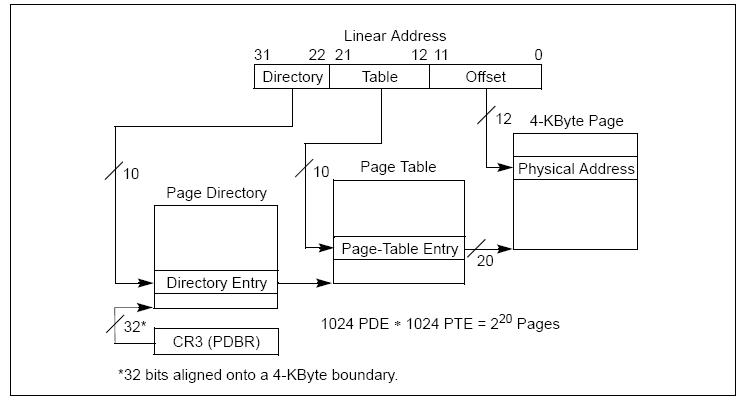

+++
title = "Kurumi Atelier Day3"
summary = ''
description = ""
categories = []
tags = []
date = 2018-01-22T09:00:31+08:00
draft = false
+++

关于 real mode、protected mode、long mode 的模式可以参考 [Wiki](https://en.wikipedia.org/wiki/X86-64#Operating_modes)

进入 long mode 前我们要开启 paging

### Basics

分页(paging)是内存管理的一种手段。在分页内存管理中，把物理地址空间(physical addr)划分为许多个固定大小的帧(frame)，把虚拟地址空间(virtual addr)也划分为多个固定大小的页(page)，物理地址空间和虚拟地址空间的映射关系存储在页表(page table)中。每个进程都会持有一个页表，进程直接访问的是虚拟地址，由 CPU 中的 MMU 实现虚拟地址到物理地址的转换。分页机制能够让程序可以在逻辑上连续、物理上离散

考虑大小为 64 byte 的物理地址空间，我们将其分为 4 个 frame，每个 frame 大小为 16 byte。我们可以使用 6 bit 来表示全部的物理地址空间，像下面这样划分这 6 个bit

```
  VPN   |    offset
-------------------------
| 5 | 4 | 3 | 2 | 1 | 0 |
-------------------------
```

前两位用作虚拟页号(virtual page number,aka VPN)，后四位用作每一页的偏移量，4 bit 正好可以表达 16 byte。这样一来当我们想要访问 `21` 号地址时，将其二进制 `010101` 按上述原则划分，得到 VPN 为 1，页内偏移量为 5。此时去查找页表中编号为 5 的那一页，然后转换成实际的物理地址加上偏移量便可以得到真正的地址

但是这种简单的分页的页表占用空间比较大。比如x86 4GB 内存，每页大小为 4KB，那么便需要 20 bit 用作 VPN，12 bit 用作偏移量。每一个页表占用 4MB(`2^20`) 内存空间，并且页表是进程独立的，所以 100 个进程就要 400 MB 的页表

### Paging in x86

x86 通常使用了两级页表，第一级称为页目录表，存储在一个 4KB 的物理页中，页目录表共有 1024 个表项，其中每个表项为 4 byte，页表项中包含对应第二级表所在的基地址。第二级表称为页表，每个页表也安排在一个 4KB 的页中，每张页表中有 1024 个表项，每个表项为 4 byte长，包含对应的物理地址。因为每级只有 1024 个，所以 20 bit 就可以表达，而每一项占用 4 byte，那么便会剩下 12 bit 的空间。这部分空间用作属性位



访问时 CPU 首先会把控制寄存器 CR3 的高 20 位 作为页目录表所在的物理基地址，再把待访问地址的高 10 位(即22~31位)作为页目录表的索引，查找到对应的页目录表项，这个表项中所包含的高 20 位是对应的页表所在物理页的物理基地址；然后，再把待访问地址的中间 10 位(即12~21位)作为页表中的页表项索引，查找到对应的页表项。此表项的高 20 位用作最终物理地址的高 20 位，与待访问地址的低12位进行组合便可以得出最终的物理地址

另外需注意这不是 **唯一的** 策略，详细可以参考 [Protected/compatibility mode (32-bit) page map - OSDev Wiki](wiki.osdev.org/Page_Tables#Long_mode_.2864-bit.29_page_map)

### Paging in long mode

在 long mode 下分为 4 个层级

- Page-Map Level-4 Table (PML4)
- Page-Directory Pointer Table (PDP)
- Page-Directory Table (PD)
- Page Table (PT)

每一个页表包含 512 项，每一个项占用 8 字节，所以占用 4096 bytes。就像 x86 二级页表一样，自上而下每一页表指向下一层级的页表


页表项结构如下

<table><thead><tr><th>Bit(s)                </th><th> Name </th><th> Meaning</th></tr></thead><tbody>
<tr><td>0 </td><td> present </td><td> the page is currently in memory</td></tr>
<tr><td>1 </td><td> writable </td><td> it's allowed to write to this page</td></tr>
<tr><td>2 </td><td> user accessible </td><td> if not set, only kernel mode code can access this page</td></tr>
<tr><td>3 </td><td> write through caching </td><td> writes go directly to memory</td></tr>
<tr><td>4 </td><td> disable cache </td><td> no cache is used for this page</td></tr>
<tr><td>5 </td><td> accessed </td><td> the CPU sets this bit when this page is used</td></tr>
<tr><td>6 </td><td> dirty </td><td> the CPU sets this bit when a write to this page occurs</td></tr>
<tr><td>7 </td><td> huge page/null </td><td> must be 0 in P1 and P4, creates a 1GiB page in P3, creates a 2MiB page in P2</td></tr>
<tr><td>8 </td><td> global </td><td> page isn't flushed from caches on address space switch (PGE bit of CR4 register must be set)</td></tr>
<tr><td>9-11 </td><td> available </td><td> can be used freely by the OS</td></tr>
<tr><td>12-51 </td><td> physical address </td><td> the page aligned 52bit physical address of the frame or the next page table</td></tr>
<tr><td>52-62 </td><td> available </td><td> can be used freely by the OS</td></tr>
<tr><td>63 </td><td> no execute </td><td> forbid executing code on this page (the NXE bit in the EFER register must be set)</td></tr>
</tbody></table>

这里采取另一种分页方式，物理页大小为 2M，将最初的 1G 物理地址空间分配给内核

```
; boot.asm

section .bss
align 4096
p4_table:
    resb 4096
p3_table:
    resb 4096
p2_table:
    resb 4096
stack_bottom:
    resb 64
stack_top:
```

将 P4 中的第一项指向 P3，P3 的第一项指向 P2，并且划分 P2 到物理地址的映射

```
set_up_page_tables:
    ; map first P4 entry to P3 table
    mov eax, p3_table
    or eax, 0b11 ; present + writable
    mov dword [p4_table], eax

    ; map first P3 entry to P2 table
    mov eax, p2_table
    or eax, 0b11 ; present + writable
    mov dword [p3_table], eax

    ; map each P2 entry to a huge 2MiB page
    mov ecx, 0         ; counter variable

.map_p2_table:
    ; map ecx-th P2 entry to a huge page that starts at address 2MiB*ecx
    mov eax, 0x200000  ; 2MiB
    mul ecx            ; start address of ecx-th page
    or eax, 0b10000011 ; present + writable + huge
    mov [p2_table + ecx * 8], eax ; map ecx-th entry

    inc ecx            ; increase counter
    cmp ecx, 512       ; if counter == 512, the whole P2 table is mapped
    jne .map_p2_table  ; else map the next entry

    ret
```

需要注意的是 P2 中的表项需要设置 `huge` 位，因为页的大小为 2MiB

### Enable Paging

开启 paging 并进入 long mode 还需要以下的步骤

- 将 P4 的地址写入 CR3 寄存器
- 开启 PAE(Physical Address Extension)
- 在 EFER 寄存器上设置 long mode 标志位
- 允许 paging

```
enable_paging:
    ; load P4 to cr3 register (cpu uses this to access the P4 table)
    mov eax, p4_table
    mov cr3, eax

    ; enable PAE-flag in cr4 (Physical Address Extension)
    mov eax, cr4                 ; Set the A-register to control register 4.
    or eax, 1 << 5               ; Set the PAE-bit, which is the 6th bit (bit 5).
    mov cr4, eax                 ; Set control register 4 to the A-register.

    ; set the long mode bit in the EFER MSR (model specific register)
    mov ecx, 0xC0000080          ; Set the C-register to 0xC0000080, which is the EFER MSR.
    rdmsr                        ; Read from the model-specific register.
    or eax, 1 << 8               ; Set the LM-bit which is the 9th bit (bit 8).
    wrmsr                        ; Write to the model-specific register.

    ; enable paging in the cr0 register
    mov eax, cr0                 ; Set the A-register to control register 0.
    or eax, 1 << 31              ; Set the PG-bit, which is the 32nd bit (bit 31).
    mov cr0, eax                 ; Set control register 0 to the A-register.

    ret
```

在我们的 kernel 入口添加上对应的函数调用

```
section .text
bits 32
start:
    mov esp, stack_top
    call check_cpuid
    call check_long_mode

    call set_up_page_tables
    call enable_paging
```

### Reference
[Entering Long Mode | Writing an OS in Rust](https://os.phil-opp.com/entering-longmode/)  
[Setting Up Long Mode - OSDev Wiki](http://wiki.osdev.org/Setting_Up_Long_Mode)  
[Page Tables - OSDev Wiki](http://wiki.osdev.org/Page_Tables)

    