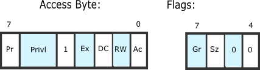

+++
title = "Kurumi Atelier Day4"
summary = ''
description = ""
categories = []
tags = []
date = 2018-01-23T12:00:36+08:00
draft = false
+++

我们需要更新[全局描述符表(Global Descriptor Table,aka GDT)](https://wiki.osdev.org/Global_Descriptor_Table)，虽然我们并不需要用到

### GDT

GDT 中的每一个 entry 都是 8 个字节，结构如下




`Base` 域总共有 32 位，存储段开始的虚拟地址。`Limit` 总共 20 位，存储有最大可取址的单元数目。标志位的作用如下

- Pr: Present bit. This must be 1 for all valid selectors.
- Privl: Privilege, 2 bits. Contains the ring level, 0 = highest (kernel), 3 = lowest (user applications).
- Ex: Executable bit. If 1 code in this segment can be executed, ie. a code selector. If 0 it is a data selector.
- DC: Direction bit/Conforming bit.
  - Direction bit for data selectors: Tells the direction. 0 the segment grows up. 1 the segment grows down, ie. the offset - has to be greater than the limit.
   - Conforming bit for code selectors:
     - If 1 code in this segment can be executed from an equal or lower privilege level. For example, code in ring 3 can far-jump to conforming code in a ring 2 segment. The privl-bits represent the highest privilege level that is allowed to execute the segment. For example, code in ring 0 cannot far-jump to a conforming code segment with privl equals 0x2, while code in ring 2 and 3 can. Note that the privilege level remains the same, ie. a far-jump form ring 3 to a privl equals 2-segment remains in ring 3 after the jump.
     - If 0 code in this segment can only be executed from the ring set in privl.
- RW: Readable bit/Writable bit.
  - Readable bit for code selectors: Whether read access for this segment is allowed. Write access is never allowed for code segments.
  - Writable bit for data selectors: Whether write access for this segment is allowed. Read access is always allowed for data segments.
- Ac: Accessed bit. Just set to 0. The CPU sets this to 1 when the segment is accessed.
- Gr: Granularity bit. If 0 the limit is in 1 B blocks (byte granularity), if 1 the limit is in 4 KiB blocks (page granularity).
- Sz: Size bit. If 0 the selector defines 16 bit protected mode. If 1 it defines 32 bit protected mode. You can have both 16 bit and 32 bit selectors at once.

*x86-64 Changes*

- 'L' bit (bit 21, next to 'Sz') is used to indicate x86-64 descriptor
- 'Sz' bit (bit 22) has to be 0 when the 'L' bit is set, as the combination Sz = 1, L = 1 is reserved for future use (and will throw an exception if you try to use it)

制作一个最小化的 GDT，包含下面三个 entry

- zero entry
- code segment
- data segment

GDT 的一个 entry 是特殊的，他必须为 0(64bit)

```
; boot.asm

section .rodata
gdt64:
    dq 0
```

code segment 需要将标志位41, 44, 47, 43, 53置为 1

```
.code: equ $ - gdt64
    dq  (1<<41) | (1<<44) | (1<<47) | (1<<43) | (1<<53)
```

data segment 需要将标志位41, 44, 47置为1

```
.data: equ $ - gdt64
    dq (1<<44) | (1<<47) | (1<<41)
```

GDT 需要 `lgdt` 指令来载入，但是他需要一个特殊的结构：GDT 长度(2字节)，GDT 地址(8字节)

```
.pointer:
    dw $ - gdt64 - 1
    dq gdt64
```

下面我们便可以载入 GDT 了

```
start:
    ...
    call enable_paging
    lgdt [gdt64.pointer]
```

### Last Step

我们将 64 位代码放到新的文件 `long_mode_init.asm` 中

```
global long_mode_start

section .text
bits 64
long_mode_start:
    ; reset segment register 
    mov ax, 0
    mov ss, ax
    mov ds, ax
    mov es, ax
    mov fs, ax
    mov gs, ax
    ; print `OKAY` to screen
    mov rax, 0x2f592f412f4b2f4f ; rax 64 bit register
    mov qword [0xb8000], rax
    hlt
```

在 `boot.asm` 中进行跳转

```
start:
    ...
    lgdt [gdt64.pointer]
    jmp gdt64.code:long_mode_start
```


### Reference
[Global Descriptor Table - OSDev Wiki](http://wiki.osdev.org/Global_Descriptor_Table)

    