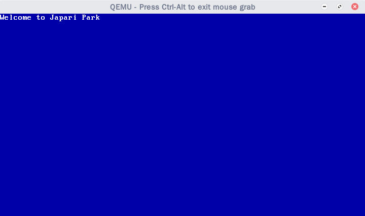

+++
title = "Kurumi Atelier Day5"
summary = ''
description = ""
categories = []
tags = []
date = 2018-01-24T12:13:00+08:00
draft = false
+++

初始化 Rust 工程目录

```
cargo init --name kurumi
```

Rust 默认生成 `.rlib` 文件，这是 Rust 库的格式，而我们需要静态库

```
# Cargo.toml
crate-type = ["staticlib"]
```

为 cross-compile 做准备，安装 `xargo` 并创建 `x86_64-kurumi.json` 文件

```
{
    "arch": "x86_64",
    "cpu": "x86-64",
    "llvm-target": "x86_64-unknown-none-gnu",
    "data-layout": "e-m:e-i64:64-f80:128-n8:16:32:64-S128",
    "linker-flavor": "gcc",
    "no-compiler-rt": true,
    "os": "kurumi",
    "target-endian": "little",
    "target-pointer-width": "64",
    "target-c-int-width": "32",
    "features": "-mmx,-fxsr,-sse,-sse2,+soft-float",
    "disable-redzone": true,
    "eliminate-frame-pointer": false
}
```

用 Rust 编写 kernel 时不能使用 `std`，因为其依赖操作系统。不过我们需要 `libcore`，这是必要的

`xargo build --release --target x86_64-kurumi.json` 编译时会抛出下面的错误

```
error: language item required, but not found: `panic_fmt`

error: language item required, but not found: `eh_personality`

error: aborting due to 2 previous errors

error: Could not compile `kurumi`.
```

因为 `panic_fmt` 和 `eh_personality` 需要我们自己实现，可以参考 [文档](https://doc.rust-lang.org/1.11.0/book/no-stdlib.html)

```
// src/lib.rs

#![feature(lang_items)]
#![no_std]

#[lang = "eh_personality"]
#[no_mangle]
extern fn eh_personality() {
}

#[lang = "panic_fmt"]
#[no_mangle]
extern fn rust_begin_panic() -> ! {
    loop {}
}
```

编写 `main` 函数

```
#[no_mangle]
pub extern fn kmain() -> ! {

    // clear screen
    let mut buffer = [0x1fu8; 80*50];
    for i in 0..(80*25) {
        buffer[i*2] = 0x00u8;
    }
    let buffer_ptr = (0xb8000) as *mut _;
    unsafe { *buffer_ptr = buffer};

    // print guest string
    let prompt = b"Welcome to Japari Park"; // length 22

    let mut prompt_buf = [0x1fu8; 44];
    for (i, char_byte) in prompt.into_iter().enumerate() {
        prompt_buf[i*2] = *char_byte;
    }
    let buffer_ptr = (0xb8000) as *mut _;
    unsafe { *buffer_ptr = prompt_buf };

    loop {}
}
```

在汇编代码中进行跳转

```
long_mode_start:
    ...

    ; call the kernel main
    extern kmain
    jmp kmain
```

连接时需要将 rust 部分也放进去，更新一下 Makefile

```
target ?= $(arch)-kurumi
rust_os := target/$(target)/release/libkurumi.a

$(kernel): kernel $(rust_os) $(assembly_object_files) $(linker_script)
        @ld -n -T $(linker_script) -o $(kernel) $(assembly_object_files) $(rust_os)

kernel:
        @RUST_TARGET_PATH="$(shell pwd)" xargo build --release --target $(target)
```

会发现如下报错

```
undefined reference to 'memcpy'
```

这是因为 `memcpy` 是 `libc` 中的函数，通常 `libc` crate 会和 Rust 程序通过标准库进行连接，但是我们现在不使用标准库，而且 `libc` 是系统底层 `libc` 的封装。所以我们现在要手动添加这个 `rlibc` create

编写 Rust 代码时，需要小心 Rust 将字面量自动整型推断为 `i32` 的情况



### Reference
[Set Up Rust | Writing an OS in Rust](https://os.phil-opp.com/set-up-rust/)

    