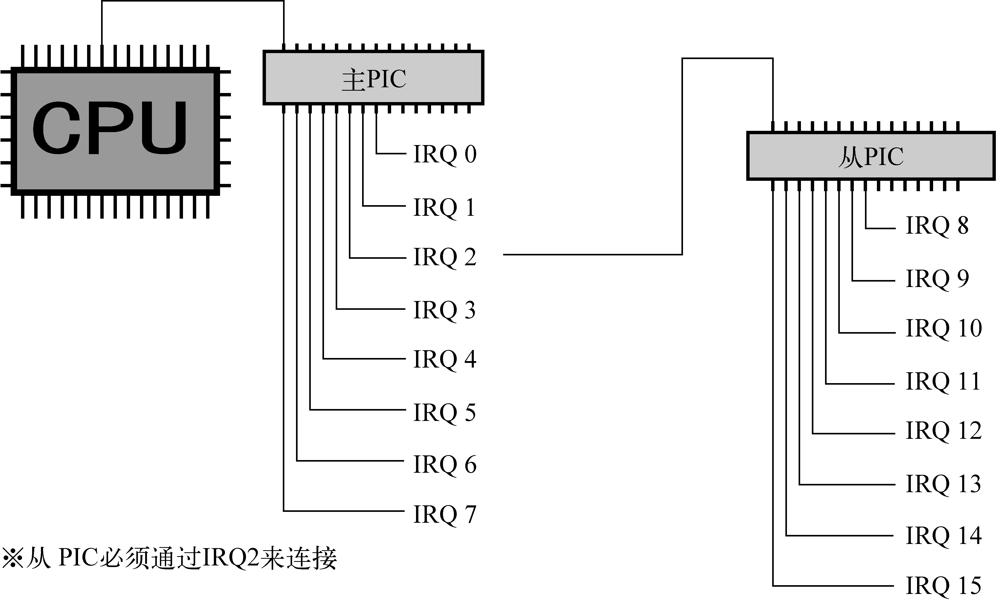

+++
title = "Kurumi Atelier Day8"
summary = ''
description = ""
categories = []
tags = []
date = 2018-01-27T09:19:13+08:00
draft = false
+++

为了实现键盘输入需要初始化 PIC 和 IDT。今天先来编写 PIC 初始化的相关代码。PIC 是 programmable interrupt controller 的缩写，意思是可编程中断控制器。PIC 基本上有两种 8259A PIC(传统 PIC) 和 APIC， APIC 更现代化。但是因为蠢作者没想清楚 APIC 如何激活，所以这里先留个坑使用 8259 PIC

### Interrupt

内核需要对外设进行管理，

- 轮询（polling） 让内核定期对设备的状态进行查询，然后做出相应的处理
- 中断（interrupt） 让硬件在需要的时候向内核发出信号(变内核主动为硬件主动)

显然第一种方式是不妥的，比如轮询键盘是否有输入发生，会大量地耗用 CPU 时间导致效率地下。所以实际上采用中断来解决。中断是一种电信号，由硬件设备产生，并直接送入中断控制器(如 8259A)的输入引脚上，然后再由中断控制器向处理器发送相应的信号。处理器一经检测到该信号，便中断自己当前正在处理的工作，转而去处理中断。此后，处理器会通知 OS 已经产生中断。这样，OS 就可以对这个中断进行适当的处理。不同的设备对应的中断不同，而每个中断都通过一个唯一的数字标识，这些值通常被称为中断请求线(IRQ)

上面所说的其实是硬件中断，还有用于系统调用的软件中断，可以参考 [wikipedia: 中断](https://zh.wikipedia.org/wiki/%E4%B8%AD%E6%96%B7)

### 8259A 和 APIC

关于 PIC 的历史可以参考 [知乎：计算机中断体系一：历史和原理](https://zhuanlan.zhihu.com/p/26464793)

##### 传统 PIC

由两片 8259A 风格的外部芯片以“级联”的方式连接在一起。每个芯片可处理多达 8 个不同的 IRQ。因为从 PIC 的 INT 输出线连接到主 PIC 的 IRQ2 引脚，所以可用 IRQ 线的个数达到 15 个，如下图所示



##### APIC

8259A 只适合单 CPU 的情况，为了充分挖掘 SMP 体系结构的并行性，能够把中断传递给系统中的每个 CPU 至关重要。基于此理由，Intel 引入了一种名为 I/O 高级可编程控制器的新组件，来替代老式的 8259A 可编程中断控制器。该组件包含两大组成部分：一是"本地 APIC"，主要负责传递中断信号到指定的处理器；举例来说，一台具有三个处理器的机器，则它必须相对的要有三个本地 APIC。另外一个重要的部分是 I/O APIC，主要是收集来自 I/O 装置的 Interrupt 信号且在当那些装置需要中断时发送信号到本地 APIC，系统中最多可拥有 8 个 I/O APIC

目前大部分单处理器系统都包含一个 I/O APIC 芯片，可以通过以下两种方式来对这种芯片进行配置：

1) 作为一种标准的 8259A 工作方式。本地 APIC 被禁止，外部 I/O APIC 连接到 CPU，两条 LINT0 和 LINT1 分别连接到 INTR 和 NMI 引脚

2) 作为一种标准外部 I/O APIC。本地 APIC 被激活，且所有的外部中断都通过 I/O APIC 接收

判断系统正在使用何种 PIC 可以通过 `cat /proc/interrupts`

### How does the 8259 PIC chip work?

引用自 [8259 PIC - OSDev Wiki](https://wiki.osdev.org/8259_PIC#How_does_the_8259_PIC_chip_work.3F)

>Each of the two 8259 PICs in modern systems have 8 inputs. When any of the inputs is raised, the PIC sets a bit internally telling one of the inputs needs servicing. It then checks whether that channel is masked or not, and whether there's an interrupt already pending. If the channel is unmasked and there's no interrupt pending, the PIC will raise the interrupt line. On the slave, this feeds IRQ 2 to the master, and the master is connected to the processor interrupt line.

>When the processor accepts the interrupt, the master checks which of the two PICs is responsible for answering, then either supplies the interrupt number to the processor, or asks the slave to do so. The PIC that answers looks up the "vector offset" variable stored internally and adds the input line to form the requested interrupt number. After that the processor will look up the interrupt address and act accordingly.

### Programming

新建一个工程目录 `device` 结构如下

```
device
├── Cargo.toml
└── src
    ├── io.rs
    ├── lib.rs
    └── pic.rs
```

每个芯片(master 和 slave)都具有 command port 和 data port

```Rust
// device/src/pic.rs

const  PIC1: u16         = 0x20;          // IO base address for master PIC
const  PIC2: u16         = 0xA0;          // IO base address for slave PIC
const  PIC1_COMMAND: u16 = PIC1;
const  PIC1_DATA: u16    = (PIC1+1);
const  PIC2_COMMAND: u16 = PIC2;
const  PIC2_DATA: u16    = (PIC2+1);
```

初始化

```Rust
// device/src/pic.rs

const ICW1_ICW4: u8       = 0x01;       // ICW4 (not) needed
const ICW1_SINGL: u8      = 0x02;       // Single (cascade) mode
const ICW1_INTERVAL4: u8  = 0x04;       // Call address interval 4 (8)
const ICW1_LEVEL: u8      = 0x08;       // Level triggered (edge) mode
const ICW1_INIT: u8       = 0x10;       // Initialization - required!

const ICW4_8086: u8       = 0x01;       // 8086/88 (MCS-80/85) mode
const ICW4_AUTO: u8       = 0x02;       // Auto (normal) EOI
const ICW4_BUF_SLAVE: u8  = 0x08;       // Buffered mode/slave
const ICW4_BUF_MASTER: u8 = 0x0C;       // Buffered mode/master
const ICW4_SFNM: u8       = 0x10;       // Special fully nested (not)

// arguments:
//     offset1 - vector offset for master PIC
//               vectors on the master become offset1..offset1+7
//     offset2 - same for slave PIC: offset2..offset2+7

pub fn remap() {
    unsafe {
        // save masks
        let a1 = inb(PIC1_DATA);
        let a2 = inb(PIC2_DATA);

        let offset1: u8 = 0x20;
        let offset2: u8 = 0x28;
        outb(PIC1_COMMAND, ICW1_INIT+ICW1_ICW4);  // starts the initialization sequence (in cascade mode)
        io_wait();
        outb(PIC2_COMMAND, ICW1_INIT+ICW1_ICW4);
        io_wait();
        outb(PIC1_DATA, offset1);                 // ICW2: Master PIC vector offset
        io_wait();
        outb(PIC2_DATA, offset2);                 // ICW2: Slave PIC vector offset
        io_wait();
        outb(PIC1_DATA, 4);                       // ICW3: tell Master PIC that there is a slave PIC at IRQ2 (0000 0100)
        io_wait();
        outb(PIC2_DATA, 2);                       // ICW3: tell Slave PIC its cascade identity (0000 0010)
        io_wait();

        // set both PICs to 8086 mode
        outb(PIC1_DATA, ICW4_8086);
        io_wait();
        outb(PIC2_DATA, ICW4_8086);
        io_wait();

        // restore saved masks.
        outb(PIC1_DATA, a1);
        outb(PIC2_DATA, a2);
    }
}
```

IO 相关的函数使用内联汇编完成，可以参考 [Inline Assembly/Examples - OSDev Wiki](https://wiki.osdev.org/Inline_Assembly/Examples)

```Rust
// device/src/io.rs

// Write 8 bits to port
pub unsafe fn outb(port: u16, val: u8) {
    asm!("outb %al, %dx" :: "{dx}"(port), "{al}"(val));
}

// Read 8 bits from port
pub unsafe fn inb(port: u16) -> u8 {
    let ret: u8;
    asm!("inb %dx, %al" : "={ax}"(ret) : "{dx}"(port) :: "volatile");
    ret
}

// Forces the CPU to wait for an I/O operation to complete.
// only use this when there's nothing like
// a status register or an IRQ to tell you the info has been received.
pub unsafe fn io_wait() {
    asm!("jmp 1f;1:jmp 2f;2:" :::: "volatile");
}
```

需要在基于 IRQ 的中断程序结束时发给 PIC 芯片一个 EOI。如果 IRQ 来自 master PIC，则仅向 master PIC 发送即可;如果 IRQ 来自从 slave PIC，则有必要向两个 PIC 芯片发出命令

```Rust
// device/src/pic.rs

// End-of-interrupt command code
const PIC_EOI: u8 = 0x20;

pub fn send_eoi(interrupt_number: isize) {
    // TODO
    if interrupt_number >= 8 {
        unsafe { outb(PIC2_COMMAND,PIC_EOI); }
    }
    unsafe {outb(PIC1_COMMAND,PIC_EOI); }
}
```

### Reference
[8259 PIC - OSDev Wiki](https://wiki.osdev.org/8259_PIC)  
[Inline Assembly/Examples - OSDev Wiki](https://wiki.osdev.org/Inline_Assembly/Examples#I.2FO_access)

    