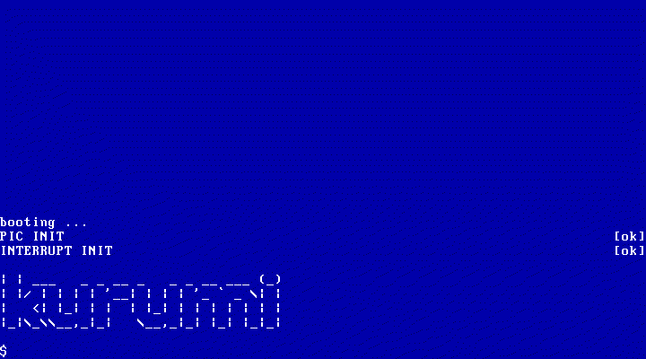

+++
title = "Kurumi Atelier Day10"
summary = ''
description = ""
categories = []
tags = []
date = 2018-01-29T12:18:01+08:00
draft = false
+++

我们总共支持 256 个中断，所以这里创建一个数组

```Rust
pub static IDT: Mutex<[IdtEntry; 256]> = Mutex::new([IdtEntry::new(); 256]);
```

接下来初始化并载入 IDT

```Rust
pub fn init() {
    let ptr: DescriptorTablePointer =
        DescriptorTablePointer::new_idtp(&IDT.lock()[..]);

    unsafe { dtables::lidt(&ptr) };
}
```

ISR 被调用时我们需要进行 `pushad` 和 `popad`，所以添加下面几个 macro

```Rust
#[macro_export]
macro_rules! scratch_push {
    () => (asm!(
        "push rax
        push rcx
        push rdx
        push rdi
        push rsi
        push r8
        push r9
        push r10
        push r11"
        : : : : "intel", "volatile"
    ));
}

#[macro_export]
macro_rules! scratch_pop {
    () => (asm!(
        "pop r11
        pop r10
        pop r9
        pop r8
        pop rsi
        pop rdi
        pop rdx
        pop rcx
        pop rax"
        : : : : "intel", "volatile"
    ));
}

#[macro_export]
macro_rules! preserved_push {
    () => (asm!(
        "push rbx
        push rbp
        push r12
        push r13
        push r14
        push r15"
        : : : : "intel", "volatile"
    ));
}

#[macro_export]
macro_rules! preserved_pop {
    () => (asm!(
        "pop r15
        pop r14
        pop r13
        pop r12
        pop rbp
        pop rbx"
        : : : : "intel", "volatile"
    ));
}

#[macro_export]
macro_rules! interrupt {
    ($name:ident, $body:expr) => {

        #[naked]
        unsafe extern fn $name() {
            #[inline(never)]
            fn inner() {
                $body
            }

            scratch_push!();
            preserved_push!();

            inner();

            preserved_pop!();
            scratch_pop!();
            iret!();

            intrinsics::unreachable();
        }
    };
}
```

feature `#[naked]` 可以使函数没有栈帧上的操作，比如

```nasm
push ebp
mov ebp, esp
...
ret
```

尝试添加

```Rust
pub fn init() {
    // ...
    interrupt!(isr32, {
        pic::send_eoi(32);
    });

    interrupt!(isr33, {
        let scancode = unsafe { inb(0x60) };

        if let Some(c) = keyboard::from_scancode(scancode as usize) {
            kprint!("{}", c);
        }

        pic::send_eoi(33);
    });

    // IDT Table
    IDT.lock()[32].set_func(isr32);
    IDT.lock()[33].set_func(isr33);

    unsafe { enable(); }
}
```

因为我们 PIC 被映射到了 `0X20` 的位置，所以 IDT 的 32 为 IRQ0(定时器)，33 为 IRQ1(键盘)，以此类推。当键盘中断发生时可以读取 `0x60` 来获取扫描码然后转换成按键，这里可以参考 [Keyboard Scan Codes](http://www.computer-engineering.org/ps2keyboard/scancodes1.html)

```Rust
pub fn from_scancode(code: usize) -> Option<char> {
    let printable = match code {
        0x1e => 'a',
        0x30 => 'b',
        0x2e => 'c',
        // ...
        _ => return None,
    };

    Some(printable)
}
```

现在我们的 OS 可以输入了



### Reference
[Interrupt Service Routines - OSDev Wiki](https://wiki.osdev.org/Interrupt_Service_Routines)

    