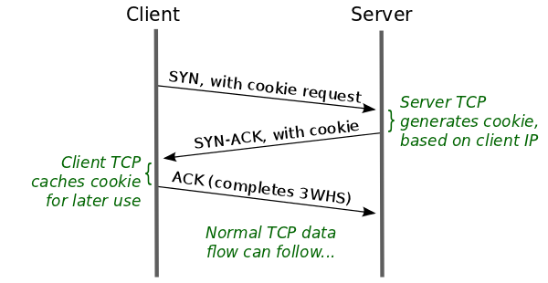

+++
title = "TCP Fast Open"
summary = ''
description = ""
categories = []
tags = []
date = 2018-01-30T12:33:08+08:00
draft = false
+++

### Traditional Three-Way Handshake

传统的 TCP 三次握手过程如下


数据只能在第三步中发送，也就是说在连接的建立上会浪费一次往返时延(RTT)。HTTP 持久连接(HTTP persistent connections)是一种应用层上的优化，其使用同一个 TCP 连接来发送和接收多个 HTTP 请求/应答，而不是为每一个新的请求/应答打开新的连接。但是，由于空闲连接在被重新使用之前可能会被关闭，所以这不是一个很有效的解决方法。比如，为了限制资源使用，Web Server 通常会主动关闭空闲的 HTTP 连接

### TCP Fast Open

从理论上来说，最开始的 SYN segment 中可以包含连接发起者的数据。但是不允许在三次握手完成前将数据传送到应用层，这是一种安全考虑。TCP Fast Open(以下简称TFO)通过将数据作为最开始 SYN segment 的一部分以消除 TCP 会话中的一个 RTT。为了防止恶意攻击，TFO 使用了 cookie。 TFO cookie 由 Server 端生成一次，并返回给 Client 以备后用。该 cookie 是根据 Client IP 地址进行加密得到的，通过重新生成此 cookie 来校验 Client 发送的 cookie 是否正确(类似 JWT)

在协议层，Client 通过向 Server 发送包含了特殊 TCP 选项的 SYN segment 请求 TFO cookie。除此之外和普通的 SYN 相同，建立连接仍需要经过三次握手。作为响应，Server 生成 TFO cookie，该 cookie 在 SYN-ACK segment 中返回。Client 缓存 TFO cookie 供以后使用。整个流程如下图



对于之后建立的会话，可以在三次握手完成前发送数据


如果 TFO cookie 不合法，Server 会丢弃数据仅发送 ACK，此时 TCP 会话会回退至正常的三次握手

cookie 在 Linux 下是通过 AES-128 加密原地址和目的地址生成的，secret key 是个随机数。可以参考 Linux Kernel v4.15 的[源代码](https://github.com/torvalds/linux/blob/v4.15/net/ipv4/tcp_fastopen.c#L141)，相关函数如下

```C
void tcp_fastopen_init_key_once(struct net *net);

int tcp_fastopen_reset_cipher(struct net *net, struct sock *sk,
                              void *key, unsigned int len);

static bool __tcp_fastopen_cookie_gen(struct sock *sk, const void *path,
                                      struct tcp_fastopen_cookie *foc)

static bool tcp_fastopen_cookie_gen(struct sock *sk,
                                    struct request_sock *req,
                                    struct sk_buff *syn,
                                    struct tcp_fastopen_cookie *foc);
```

由于 TFO 机制允许提交有效 TFO cookie 的 Client 在完成三次握手之前使用 Server 上的资源，因此 Server 可能成为资源耗尽攻击(resource-exhaustion attacks)的目标。为了防止这种可能性， Server 对尚未完成三次握手的 TFO 连接的数量施加限制。当超出此限制时，Server 将忽略 TFO cookie，并回退至正常的三次握手，直到 TFO 连接数量低于限制; 这允许 Server 采用传统的措施来防御 SYN 泛洪攻击(SYN-flood attacks)

### Experiment

首先是开启 参考 [network文档](https://www.kernel.org/doc/Documentation/networking/ip-sysctl.txt)

```
tcp_fastopen - INTEGER
	Enable TCP Fast Open (RFC7413) to send and accept data in the opening
	SYN packet.

	The client support is enabled by flag 0x1 (on by default). The client
	then must use sendmsg() or sendto() with the MSG_FASTOPEN flag,
	rather than connect() to send data in SYN.

	The server support is enabled by flag 0x2 (off by default). Then
	either enable for all listeners with another flag (0x400) or
	enable individual listeners via TCP_FASTOPEN socket option with
	the option value being the length of the syn-data backlog.

	The values (bitmap) are
	  0x1: (client) enables sending data in the opening SYN on the client.
	  0x2: (server) enables the server support, i.e., allowing data in
			a SYN packet to be accepted and passed to the
			application before 3-way handshake finishes.
	  0x4: (client) send data in the opening SYN regardless of cookie
			availability and without a cookie option.
	0x200: (server) accept data-in-SYN w/o any cookie option present.
	0x400: (server) enable all listeners to support Fast Open by
			default without explicit TCP_FASTOPEN socket option.

	Default: 0x1

	Note that that additional client or server features are only
	effective if the basic support (0x1 and 0x2) are enabled respectively.
```

因为都是在本机测试的，所以需要同时开启 Client 和 Server

```Bash
# 0x01 & 0x02 == 0x03
echo 3 > /proc/sys/net/ipv4/tcp_fastopen
```

Client 和 Server 端的代码(Python 实现)

```Python
# client.py

import socket

addr = ("localhost", 8000)
s = socket.socket(socket.AF_INET, socket.SOCK_STREAM)

# Since a TFO client combines connection initiation and data transmission in a single step,
# it needs to employ an API that allows both the server address and the data to
# be specified in a single operation. For this purpose, the client can use either of
# two repurposed system calls: sendto() and sendmsg().
s.sendto(b"hello", socket.MSG_FASTOPEN, addr)
print(s.recv(1024))
s.close()
```

```Python
# server.py
import socket

# pecifies this server's limit on the size of the queue of TFO requests
# that have not yet completed the three-way handshake
qlen = 5

def listen():
    connection = socket.socket(socket.AF_INET, socket.SOCK_STREAM)
    connection.setsockopt(socket.SOL_SOCKET, socket.SO_REUSEADDR, 1)
    connection.setsockopt(socket.SOL_TCP, socket.TCP_FASTOPEN, qlen)
    connection.bind(('localhost', 8000))
    connection.listen(10)
    while True:
        current_connection, address = connection.accept()
        while True:
            data = current_connection.recv(1024)

            if not data:
                current_connection.close()
                break
            current_connection.send(data)
            print(data)


if __name__ == "__main__":
    try:
        listen()
    except KeyboardInterrupt:
        pass
```

</p>

### Reference
[TCP Fast Open](https://static.googleusercontent.com/media/research.google.com/en//pubs/archive/37517.pdf)  
[TCP Fast Open: expediting web services](https://lwn.net/Articles/508865/)

    