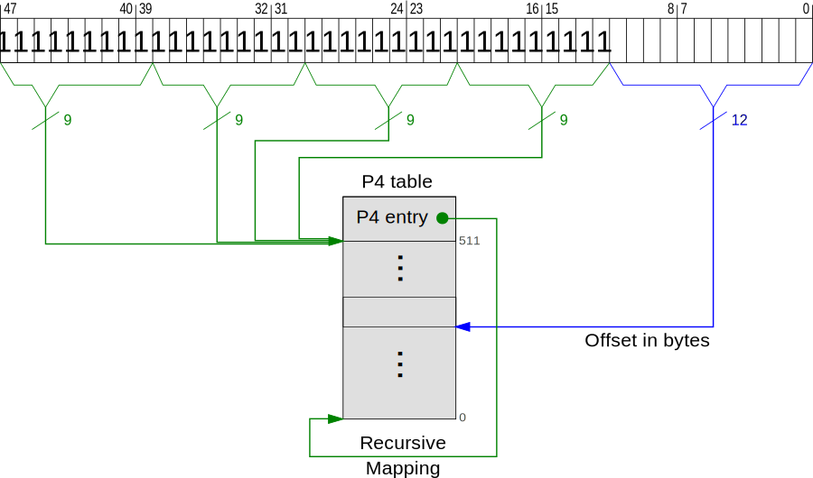

+++
title = "Kurumi Atelier Day15"
summary = ''
description = ""
categories = []
tags = []
date = 2018-02-03T11:51:00+08:00
draft = false
+++

现在我们来实现分页，回顾一下 4 级页表的工作原理

x86-64 的页大小为 4KB，寻址所用位数为 48 位，使用 4 级页表，虚拟地址(线性地址)为 9 + 9 + 9 + 9 + 12


每级页表有 512(2^9) 项，每项为 8 字节，正好满足一页大小。首先从 CR3 寄存器获取 P4 table 的地址，然后使用虚拟地址的 39-47 位作为偏移量得到页表项(entry)。注意 39-47 bit 是包含起始的闭区间，所以总共 9 位，正好可以索引 512 项。此页表项的 12-51 位存放着下一级页表 P3 的起始地址，同样使用 30-38 位作为偏移量得到存放 P2 地址的页表项。以此类推...得到最后一级页表 P1 的某一页表项，然后将此项的 12-51 位作为物理地址帧的编号，虚拟地址的剩余 12 bit 作为偏移去找出对应的帧

需要注意 CPU 的位宽和寻址能力没有直接的关系，寻址能力和地址总线的位宽，比如我的 64 位笔记本的寻址能力如下

```
$ cat /proc/cpuinfo
...
address sizes	: 39 bits physical, 48 bits virtual
...
```

### Page 实现

先来使用一个结构体表示页

```Rust
struct Page {
   number: usize,
}
```

然后是 `Entry`，8 字节使用 `u64` 表示

```Rust
const ENTRY_COUNT: usize = 512;
struct Entry(u64);
```

[之前](https://blog.dreamfever.me/kurumi-atelier-day3/)已经介绍过页表项每一位的含义了

<table><thead><tr><th>Bit(s)                </th><th> Name </th><th> Meaning</th></tr></thead><tbody>
<tr><td>0 </td><td> present </td><td> the page is currently in memory</td></tr>
<tr><td>1 </td><td> writable </td><td> it's allowed to write to this page</td></tr>
<tr><td>2 </td><td> user accessible </td><td> if not set, only kernel mode code can access this page</td></tr>
<tr><td>3 </td><td> write through caching </td><td> writes go directly to memory</td></tr>
<tr><td>4 </td><td> disable cache </td><td> no cache is used for this page</td></tr>
<tr><td>5 </td><td> accessed </td><td> the CPU sets this bit when this page is used</td></tr>
<tr><td>6 </td><td> dirty </td><td> the CPU sets this bit when a write to this page occurs</td></tr>
<tr><td>7 </td><td> huge page/null </td><td> must be 0 in P1 and P4, creates a 1GiB page in P3, creates a 2MiB page in P2</td></tr>
<tr><td>8 </td><td> global </td><td> page isn't flushed from caches on address space switch (PGE bit of CR4 register must be set)</td></tr>
<tr><td>9-11 </td><td> available </td><td> can be used freely by the OS</td></tr>
<tr><td>12-51 </td><td> physical address </td><td> the page aligned 52bit physical address of the frame or the next page table</td></tr>
<tr><td>52-62 </td><td> available </td><td> can be used freely by the OS</td></tr>
<tr><td>63 </td><td> no execute </td><td> forbid executing code on this page (the NXE bit in the EFER register must be set)</td></tr>
</tbody></table>

这里借助 `bitflags` crate，实现如下

```Rust
bitflags! {
    struct EntryFlags: u64 {
        const PRESENT         = 1 << 0;
        const WRITABLE        = 1 << 1;
        const USER_ACCESSIBLE = 1 << 2;
        const WRITE_THROUGH   = 1 << 3;
        const NO_CACHE        = 1 << 4;
        const ACCESSED        = 1 << 5;
        const DIRTY           = 1 << 6;
        const HUGE_PAGE       = 1 << 7;
        const GLOBAL          = 1 << 8;
        const NO_EXECUTE      = 1 << 63;
    }
}
```

添加几个方法

```Rust
impl Entry {
    pub fn is_unused(&self) -> bool {
        self.0 == 0
    }

    pub fn set_unused(&mut self) {
        self.0 = 0;
    }

    pub fn flags(&self) -> EntryFlags {
        EntryFlags::from_bits_truncate(self.0)
    }

    pub fn pointed_frame(&self) -> Option<Frame> {
        if self.flags().contains(EntryFlags::PRESENT) {
            // physical address store in bits 12–51
            let addr = (self.0 as usize) & 0x000fffff_fffff000;
            Some(Frame::containing_address(addr))
        } else {
            None
        }
    }

    pub fn set(&mut self, frame: Frame, flags: EntryFlags) {
        assert!(frame.start_address() & !0x000fffff_fffff000 == 0);
        self.0 = (frame.start_address() as u64) | flags.bits();
    }
}
```

### Page Table 实现

因为页表自身也可以被寻址，所以不妨将 P4 的最后一个 entry 不指向 P3，而是指向 P4 自身。这样如果要寻址 P1 的某个 entry，便可以按照 P4 -> P4 -> P3 -> P2 -> physical address(实际上是 P1 地址的某一部分)的方式。相同的道理，循环 P4 两次的话便可以访问 P2，循环三次的话便可以访问 P3，循环四次便可以访问自身，如下图



在 `boot.asm` 中修改  P4 的最后一个页表项，使其指向自身

```nasm
set_up_page_tables:
    ; recursive map P4
    mov eax, p4_table
    or eax, 0b11 ; present + writable
    mov [p4_table + 511 * 8], eax
```

因为将 48 位划分为了 9-9-9-9-12，所以使用八进制表示更加清楚一些

<table><thead><tr><th>Table </th><th> Address                         </th><th> Indexes</th></tr></thead><tbody>
<tr><td>P4    </td><td> <code>0o177777_777_777_777_777_0000</code> </td><td> –</td></tr>
<tr><td>P3    </td><td> <code>0o177777_777_777_777_XXX_0000</code> </td><td> <code>XXX</code> 是 P4 索引</td></tr>
<tr><td>P2    </td><td> <code>0o177777_777_777_XXX_YYY_0000</code> </td><td> <code>YYY</code> 是 P3 索引</td></tr>
<tr><td>P1    </td><td> <code>0o177777_777_XXX_YYY_ZZZ_0000</code> </td><td> <code>ZZZ</code> 是 P2 索引</td></tr>
</tbody></table>

P3 页表的地址是经过三次 P4 的末表项和一次 P4 XXX 表项所得到的，进一步观察可以得出 `next_table_address = (table_address << 9) | (index << 12)` 的规律，所以只需要在代码中定义 P4 地址即可

```Rust
const P4: *mut Table = 0xffffffff_fffff000 as *mut _;
```

另外一点，只有 P4, P3, P2 才能调用 `next_table`，所以在 `Table` 类型上加上 `TableLevel` 约束

```Rust
use core::marker::PhantomData;

pub trait TableLevel {}

pub struct Table<L: TableLevel> {
    entries: [Entry; ENTRY_COUNT],
    level: PhantomData<L>,
}
```

实现四种 `TableLevel`

```Rust
pub enum Level4 {}
pub enum Level3 {}
pub enum Level2 {}
pub enum Level1 {}

impl TableLevel for Level4 {}
impl TableLevel for Level3 {}
impl TableLevel for Level2 {}
impl TableLevel for Level1 {}

pub trait HierarchicalLevel: TableLevel {
    type NextLevel: TableLevel;
}

impl HierarchicalLevel for Level4 {
    type NextLevel = Level3;
}

impl HierarchicalLevel for Level3 {
    type NextLevel = Level2;
}

impl HierarchicalLevel for Level2 {
    type NextLevel = Level1;
}
```

实现 `core::ops` 中的 `Index` 和 `IndexMut`，使其能够进行索引

```Rust
impl<L> Index<usize> for Table<L> where L: TableLevel {
    type Output = Entry;

    fn index(&self, index: usize) -> &Entry {
        &self.entries[index]
    }
}

impl<L> IndexMut<usize> for Table<L> where L: TableLevel {
    fn index_mut(&mut self, index: usize) -> &mut Entry {
        &mut self.entries[index]
    }
}
```

接下来为 `Table` 添加方法

```Rust
impl<L> Table<L> where L: HierarchicalLevel {
    fn next_table_address(&self, index: usize) -> Option<usize> {
        let entry_flags = self[index].flags();
        if entry_flags.contains(EntryFlags::PRESENT) && !entry_flags.contains(EntryFlags::HUGE_PAGE) {
            let table_address = self as *const _ as usize;
            Some((table_address << 9) | (index << 12))
        } else {
            None
        }
    }

    // convert pointer into references
    pub fn next_table(&self, index: usize) -> Option<&Table<L::NextLevel>> {
        self.next_table_address(index)
            .map(|address| unsafe { &*(address as *const _) })
    }

    pub fn next_table_mut(&mut self, index: usize) -> Option<&mut Table<L::NextLevel>> {
        self.next_table_address(index)
            .map(|address| unsafe { &mut *(address as *mut _) })
    }

}
```

### Reference
[Page Tables | Writing an OS in Rust](https://os.phil-opp.com/page-tables/)

    