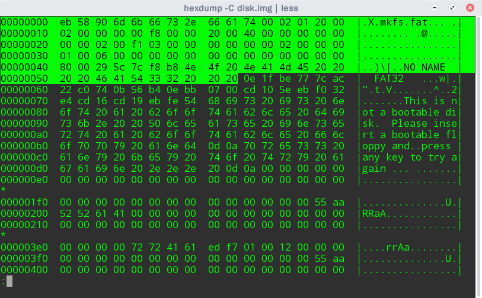
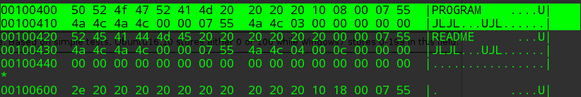
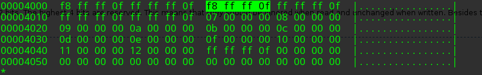
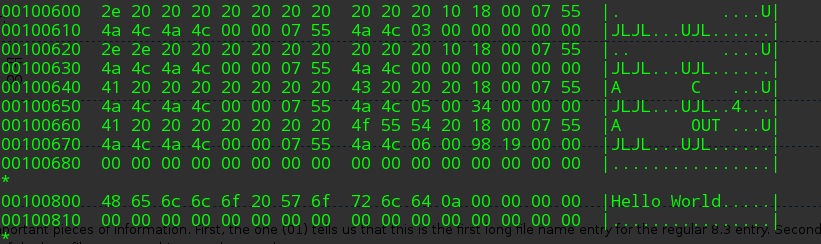

+++
title = "Kurumi Atelier FAT32 Storage"
summary = ''
description = ""
categories = []
tags = []
date = 2018-02-10T11:51:04+08:00
draft = false
+++

FAT32 文件系统也算是时代的眼泪了，虽然目前多数U盘还在使用此格式作为出厂格式，但是因为设计简单及时代的局限性，无法一次性写入 4GB 文件，已经可以入土了

### Make FAT32 img file

首先需要生成一个 FAT32 格式的 img 文件，创建一个目录用于拷贝至 FAT32 中

```Bash
test
├── program
│   ├── a.c
│   └── a.out
└── README
```

生成 FAT32 的脚本如下

```Bash
#!/bin/bash

set -e

IMG="disk.img" # image name
SIZE=64        # image size
SOURCE="test"  # source dir

relpath() {
  full=$1
  if [ "$full" == "$SOURCE" ]; then
    echo ""
  else
    base=${SOURCE%%/}/
    echo "${full##$base}"
  fi
}

fallocate -l ${SIZE}M "$IMG"
/sbin/mkfs.fat -F32 -S 512 "$IMG" >/dev/null

# copy file
find "$SOURCE" -type d | while read dir; do
  target=$(relpath $dir)
  [ -z "$target" ] && continue
  mmd -i "$IMG" "::$target"
done
find $SOURCE -type f | while read file; do
  target=$(relpath $file)
  mcopy -i "$IMG" "$file" "::$target"
done

dd if="$IMG" of="$IMG" bs=$SECTOR_SIZE seek=0 >/dev/null 2>&1
```

### How it work

FAT32 由下面三部分组成

- boot record
- File Allocation Table (FAT)
- The directory and data area

boot record 占用一个扇区(sector)，它是分区的第一个逻辑扇区。对于我们生成的 `disk.img` 来说，它长这个样子



boot record 又分为 BPB 和 EBPB 两部分。FAT 系列(FAT12, FAT16, FAT32)在 BPB 上具有相同的表示，区别只在于 EBPB 上

BPB 的各位含义如下

<table style="margin-top:1em; margin-bottom:1em; background:#f9f9f9; border:1px #aaa solid; border-collapse:collapse; {{{1}}}" cellspacing="0" cellpadding="4" border="2">
<tbody><tr>
<th> Offset (in bytes)
</th>
<th> Size (in bytes)
</th>
<th> Meaning
</th></tr>
<tr>
<td> 0
</td>
<td> 3
</td>
<td>	The first three bytes EB 3C 90 disassemble to JMP SHORT 3C NOP. (The 3C value may be different.) The reason for this is to jump over the disk format information (the BPB and EBPB). Since the first sector of the disk is loaded into ram at location 0x0000:0x7c00 and executed, without this jump, the processor would attempt to execute data that isn't code. Even for non-bootable volumes, code matching this pattern (or using the E9 jump opcode) is required to be present by both Windows and OS X. To fulfil this requirement, an infinite loop can be placed here with the bytes EB FE 90.
</td></tr>
<tr>
<td> 3
</td>
<td> 8
</td>
<td>	OEM identifier. The first 8 Bytes (3 - 10) is the version of DOS being used. The next eight Bytes 29 3A 63 7E 2D 49 48 and 43 read out the name of the version. The official FAT Specification from Microsoft says that this field is really meaningless and is ignored by MS FAT Drivers, however it does recommend the value "MSWIN4.1" as some 3rd party drivers supposedly check it and expect it to have that value. Older versions of dos also report MSDOS5.1 and linux-formatted floppy will likely to carry "mkdosfs" here. If the string is less than 8 bytes, it is padded with spaces.
</td></tr>
<tr>
<td> 11
</td>
<td> 2
</td>
<td>	The number of Bytes per sector (remember, all numbers are in the little-endian format).
</td></tr>
<tr>
<td> 13
</td>
<td> 1
</td>
<td>	Number of sectors per cluster.
</td></tr>
<tr>
<td> 14
</td>
<td> 2
</td>
<td>	Number of reserved sectors. The boot record sectors are included in this value.
</td></tr>
<tr>
<td> 16
</td>
<td> 1
</td>
<td>	Number of File Allocation Tables (FAT's) on the storage media. Often this value is 2.
</td></tr>
<tr>
<td> 17
</td>
<td> 2
</td>
<td>	Number of directory entries (must be set so that the root directory occupies entire sectors).
</td></tr>
<tr>
<td> 19
</td>
<td> 2
</td>
<td>	The total sectors in the logical volume. If this value is 0, it means there are more than 65535 sectors in the volume, and the actual count is stored in "Large Sectors (bytes 32-35).
</td></tr>
<tr>
<td> 21
</td>
<td> 1
</td>
<td>	This Byte indicates the <a rel="nofollow" class="external text" href="http://support.microsoft.com/kb/q140418/">media descriptor type</a>.
</td></tr>
<tr>
<td> 22
</td>
<td> 2
</td>
<td>	Number of sectors per FAT. FAT12/FAT16 only.
</td></tr>
<tr>
<td> 24
</td>
<td> 2
</td>
<td>	Number of sectors per track.
</td></tr>
<tr>
<td> 26
</td>
<td> 2
</td>
<td>	Number of heads or sides on the storage media.
</td></tr>
<tr>
<td> 28
</td>
<td> 4
</td>
<td>	Number of hidden sectors. (i.e. the LBA of the beginning of the partition.)
</td></tr>
<tr>
<td> 32
</td>
<td> 4
</td>
<td>	Large amount of sector on media. This field is set if there are more than 65535 sectors in the volume.
</td></tr></tbody></table>


FAT32 的 EBPB

<table style="margin-top:1em; margin-bottom:1em; background:#f9f9f9; border:1px #aaa solid; border-collapse:collapse; {{{1}}}" cellspacing="0" cellpadding="4" border="2">

<tbody><tr>
<th> Offset (from the start of the standard boot record)
</th>
<th> Length (in bytes)
</th>
<th> Meaning
</th></tr>
<tr>
<td> 36
</td>
<td> 4
</td>
<td>	Sectors per FAT. The size of the FAT in sectors.
</td></tr>
<tr>
<td> 40
</td>
<td> 2
</td>
<td>	Flags.
</td></tr>
<tr>
<td> 42
</td>
<td> 2
</td>
<td>       FAT version number. The high byte is the major version and the low byte is the minor version. FAT drivers should respect this field.
</td></tr>
<tr>
<td> 44
</td>
<td> 4
</td>
<td>	The cluster number of the root directory. Often this field is set to 2.
</td></tr>
<tr>
<td> 48
</td>
<td> 2
</td>
<td>	The sector number of the FSInfo structure.
</td></tr>
<tr>
<td> 50
</td>
<td> 2
</td>
<td>       The sector number of the backup boot sector.
</td></tr>
<tr>
<td> 52
</td>
<td> 12
</td>
<td>       Reserved. When the volume is formated these bytes should be zero.
</td></tr>
<tr>
<td> 64
</td>
<td> 1
</td>
<td>	Drive number. The values here are identical to the values returned by the BIOS interrupt 0x13. 0x00 for a floppy disk and 0x80 for hard disks.
</td></tr>
<tr>
<td> 65
</td>
<td> 1
</td>
<td>	Flags in Windows NT. Reserved otherwise.
</td></tr>
<tr>
<td> 66
</td>
<td> 1
</td>
<td>	Signature (must be 0x28 or 0x29).
</td></tr>
<tr>
<td> 67
</td>
<td> 4
</td>
<td>       VolumeID 'Serial' number. Used for tracking volumes between computers. You can ignore this if you want.
</td></tr>
<tr>
<td> 71
</td>
<td> 11
</td>
<td>	Volume label string. This field is padded with spaces.
</td></tr>
<tr>
<td> 82
</td>
<td> 8
</td>
<td>	System identifier string. Always "FAT32&nbsp;&nbsp;&nbsp;". The spec says never to trust the contents of this string for any use.
</td></tr>
<tr>
<td> 90
</td>
<td> 420
</td>
<td>	Boot code.
</td></tr>
<tr>
<td> 510
</td>
<td> 2
</td>
<td>	0xAA55 bootable partition signature.
</td></tr></tbody></table>

下面以定位并读取 README 为例，说明 FAT32 的工作机制。为了方便描述，将 ebpb 表示如下

```Rust
#[derive(Debug, Clone, Copy)]
#[repr(packed, C)]
pub struct Bpb {
    pub bootjmp:                [u8; 3],
    pub oem_identifier:         [u8; 8],
    pub bytes_per_sector:       u16,
    pub sectors_per_cluster:    u8,
    pub reserved_sectors_count: u16,
    pub table_count:            u8,
    pub root_entry_count:       u16,
    pub total_sectors:          u16,
    pub media_descriptor_type:  u8,
    pub sectors_per_fat:        u16,
    pub sectors_per_track:      u16,
    pub head_size_count:        u16,
    pub hidden_sectors_count:   u32,
    pub total_sectors_large:    u32,
}

// Extended Boot Record
#[derive(Debug, Clone, Copy)]
#[repr(packed, C)]
pub struct Ebpb {
    pub bpb:               Bpb,
    pub sectors_per_fat:   u32,
    pub flags:             u16,
    pub version_number:    u16,
    pub root_dir_cluster:  u32,
    pub fsinfo_sector:     u16,
    pub backup_mbr_sector: u16,
    pub reserved:          [u8; 12],
    pub drive_number:      u8,
    pub flags_nt:          u8,
    pub signature:         u8,
    pub volume_id:         u32,
    pub volume_label:      [u8; 11],
    pub system_identifier: [u8; 8]
}
```

首先取出 `ebpb.root_dir_cluster` 这里的值是 `0x02`，偏移量为 `0x2c`。这便是当前需要遍历的 cluster chain 的第一个 cluster(active cluster) 的编号。一个 cluster 可以包含多个扇区，数目存储在 `ebpb.bpb.sectors_per_cluster` 中，所以 cluster 的大小可以通过下面的式子计算

```
ebpb.bpb.sectors_per_cluster * ebpb.bpb.bytes_per_sector // 512
```

我们需要计算出 cluster 中的第一个扇区的起始

```
first_data_sector = ebpb.bpb.reserved_sectors_count + (ebpb.bpb.table_count * ebpb.sectors_per_fat)
first_sector_of_cluster = first_data_sector + ((cluster-2) * (ebpb.bpb.sectors_per_cluster))
```

在此例子中 `first_sector_of_cluster = 32 + 2 * 1009 + ((2-2) * 1 = 2050`，2050 扇区对应 `disk.img` 文件偏移量为 `2050 * 512`(`0x100400`)的位置，好了这便是数据的存储位置。读取一个 cluster 大小，这部分数据有两种形式，一种为  Standard 8.3 format，另一种为  Long File Names

Standard 8.3 format

<table style="margin-top:1em; margin-bottom:1em; background:#f9f9f9; border:1px #aaa solid; border-collapse:collapse; {{{1}}}" cellspacing="0" cellpadding="4" border="2">
<tbody><tr>
<th> Offset (in bytes)
</th>
<th> Length (in bytes)
</th>
<th> Meaning
</th></tr>
<tr>
<td> 0
</td>
<td> 11
</td>
<td> 8.3 file name. The first 8 characters are the name and the last 3 are the extension.
</td></tr>
<tr>
<td> 11
</td>
<td> 1
</td>
<td> Attributes of the file. The possible attributes are: <pre>READ_ONLY=0x01 HIDDEN=0x02 SYSTEM=0x04 VOLUME_ID=0x08 DIRECTORY=0x10
ARCHIVE=0x20 LFN=READ_ONLY|HIDDEN|SYSTEM|VOLUME_ID </pre> (LFN means that this entry is a <a href="#Long_File_Names">long file name entry</a>)
</td></tr>
<tr>
<td> 12
</td>
<td> 1
</td>
<td> Reserved for use by Windows NT.
</td></tr>
<tr>
<td> 13
</td>
<td> 1
</td>
<td> Creation time in tenths of a second. Range 0-199 inclusive. Based on simple tests, Ubuntu16.10 stores either 0 or 100 while Windows7 stores 0-199 in this field.
</td></tr>
<tr>
<td> 14
</td>
<td> 2
</td>
<td> The time that the file was created. Multiply Seconds by 2.
</td></tr>
<tr>
<td> 16
</td>
<td> 2
</td>
<td> The date on which the file was created.
</td></tr>
<tr>
<td> 18
</td>
<td> 2
</td>
<td> Last accessed date. Same format as the creation date.
</td></tr>
<tr>
<td> 20
</td>
<td> 2
</td>
<td> The high 16 bits of this entry's first cluster number. For FAT 12 and FAT 16 this is always zero.
</td></tr>
<tr>
<td> 22
</td>
<td> 2
</td>
<td> Last modification time. Same format as the creation time.
</td></tr>
<tr>
<td> 24
</td>
<td> 2
</td>
<td> Last modification date. Same format as the creation date.
</td></tr>
<tr>
<td> 26
</td>
<td> 2
</td>
<td> The low 16 bits of this entry's first cluster number. Use this number to find the first cluster for this entry.
</td></tr>
<tr>
<td> 28
</td>
<td> 4
</td>
<td> The size of the file in bytes.
</td></tr></tbody></table>

可见一个 Directory entry 占用 32 字节，所以我们将读取到的数据按照 32 字节划分为若干个 Driectory entry (512/32 = 16)。如果某个 Directory entry 的首字节为 0 则说明后续不再有 Directory entry 了



从中我们已经能够得到目录 `PROGRAM` 和 `README` 文件的元数据了。这里可能对于 `program` 是大写的有疑问。这是因为上表中的保留字段 `OCH`，后来被用于大小写判断了

`0CH` 字节的值

- 此值为18H时，文件名和扩展名都小写。
- 此值为10H时，文件名大写而扩展名小写。
- 此值为08H时，文件名小写而扩展名大写。
- 此值为00H时，文件名和扩展名都大写。


之后我们需要继续遍历 cluster chain 需要经过如下的步骤去访问 File Allocation Table

```
first_fat_sector = ebpb.bpb.reserved_sectors_count;
sector_size = ebpb.bpb.bytes_per_sector;
fat_offset = active_cluster * 4;
fat_sector = first_fat_sector + (fat_offset / sector_size);
```

经过计算可得 `fat_sector = 32 + (2 * 4 / 512) = 32` 即在 `disk.img` 的偏移量为 `32*512 = 16384` 即 `0x4000`



从此扇区(`FAT_table`)中读取索引为 `fat_offset % sector_size` 处的连续 32 bit，并且忽略高 4 bit

在这里我们为索引为 8，读取到的字节为 `0x0ffffff8`。这便是我们需要的读取的下一个 cluster 的编号。如果此值大于等于 `0x0FFFFFF8` 说明此后已经没有 cluster 了，如果此值等于 `0x0FFFFFF7` 则说明此 cluster 被标记为 "BAD"，应当抛出错误。而在这里我们的遍历结束

接下来可以根据得到的 Directory 项去寻找其子目录，具体做法是从偏移量为 `0x14` 处取双字节作为高 16bit，`0x1a` 处去双字节作为低 16bit。由观察可以得出 `program` 对应的值为 `0x0003`，`README` 对应的值为 `0x0004`。这些值便是新的 cluster number，套用计算 `first_sector_of_cluster` 公式，重复上面的步骤。如果是文件的话直接读取；如果是目录的话遍历这条 cluster chain



最后再说说明一下 Long File Names 格式，当我们读取的 Directory entry 的 attribute(偏移量为11) 为 0x0F 时，说明它实际上是一个 Long File Name 格式，我们应当按照如下表格对待这块数据

<table style="margin-top:1em; margin-bottom:1em; background:#f9f9f9; border:1px #aaa solid; border-collapse:collapse; {{{1}}}" cellspacing="0" cellpadding="4" border="2">
<tbody><tr>
<th> Offset (in bytes)
</th>
<th> Length (in bytes)
</th>
<th> Meaning
</th></tr>
<tr>
<td> 0
</td>
<td> 1
</td>
<td> The order of this entry in the sequence of long file name entries. This value helps you to know where in the file's name the characters from this entry should be placed.
</td></tr>
<tr>
<td> 1
</td>
<td> 10
</td>
<td> The first 5, 2-byte characters of this entry.
</td></tr>
<tr>
<td> 11
</td>
<td> 1
</td>
<td> Attribute. Always equals 0x0F. (the long file name attribute)
</td></tr>
<tr>
<td> 12
</td>
<td> 1
</td>
<td> Long entry type. Zero for name entries.
</td></tr>
<tr>
<td> 13
</td>
<td> 1
</td>
<td> Checksum generated of the short file name when the file was created. The short filename can change without changing the long filename in cases where the partition is mounted on a system which does not support long filenames.
</td></tr>
<tr>
<td> 14
</td>
<td> 12
</td>
<td> The next 6, 2-byte characters of this entry.
</td></tr>
<tr>
<td> 26
</td>
<td> 2
</td>
<td> Always zero.
</td></tr>
<tr>
<td> 28
</td>
<td> 4
</td>
<td> The final 2, 2-byte characters of this entry.
</td></tr></tbody></table>

此时相邻下一个 Directory entry 依然存储的是此项的元数据，并且是 Standard 8.3 format。也就是说是使用两个 entry 来表示的

### Reference
[FAT - OSDev Wiki](https://wiki.osdev.org/FAT)  

    