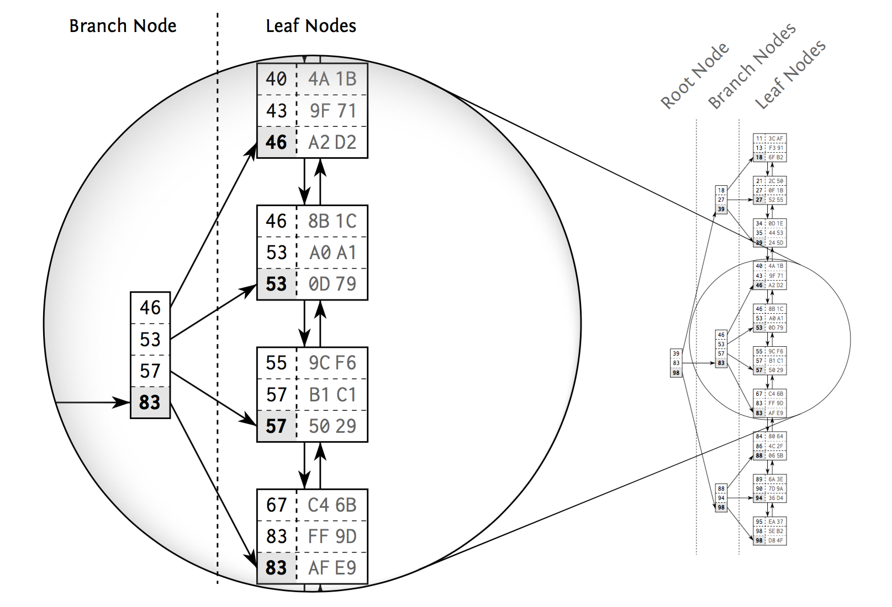
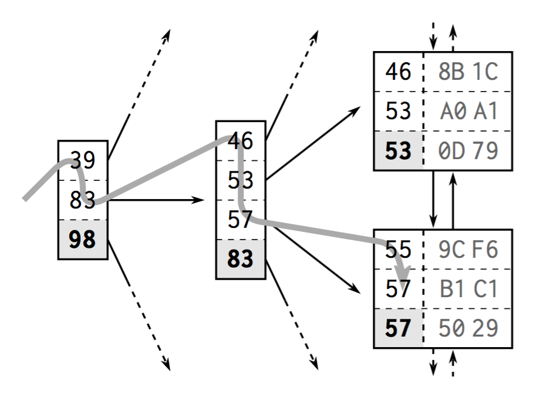
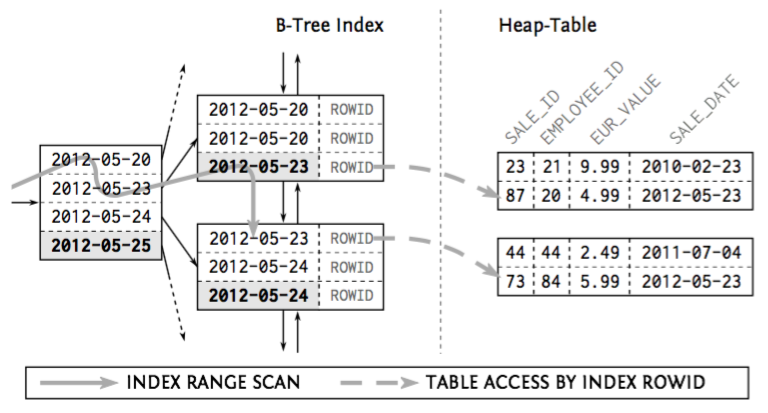
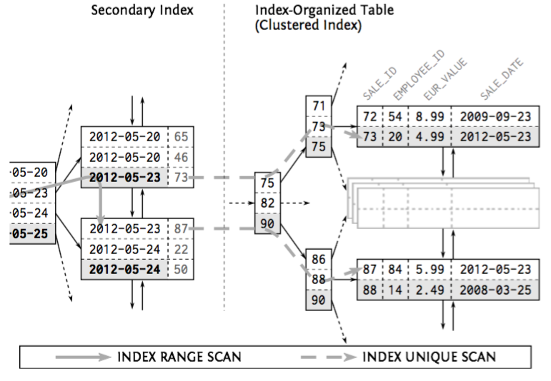

+++
title = "半吊子开发：SQL INDEX"
summary = ''
description = ""
categories = []
tags = []
date = 2018-02-22T12:57:04+08:00
draft = false
+++

本文为 SQL Performance Explained 一书的阅读笔记，有兴趣可以试试这个关于索引的 [3-minute-test](https://use-the-index-luke.com/3-minute-test)。另附 [PDF 下载连接](http://is.hust.edu.vn/~lamdb/DBTuning/SQLPerformanceExplained.pdf)

### 环境准备
使用 MySQL 提供的样本数据库

```
$ git clone https://github.com/datacharmer/test_db.git
$ mysql -u username -p < employees.sql
```

我们只用这张表

```
mysql> desc employees;
+------------+---------------+------+-----+---------+-------+
| Field      | Type          | Null | Key | Default | Extra |
+------------+---------------+------+-----+---------+-------+
| emp_no     | int(11)       | NO   | PRI | NULL    |       |
| birth_date | date          | NO   |     | NULL    |       |
| first_name | varchar(14)   | NO   |     | NULL    |       |
| last_name  | varchar(16)   | NO   |     | NULL    |       |
| gender     | enum('M','F') | NO   |     | NULL    |       |
| hire_date  | date          | NO   |     | NULL    |       |
+------------+---------------+------+-----+---------+-------+
6 rows in set (0.01 sec)

mysql> select count(*) from employees;
+----------+
| count(*) |
+----------+
|   300024 |
+----------+
```

数据量在 30 万左右

### 预备知识

#### About SQL index
>An index is a distinct structure in the database that is built using the create index statement. It requires its own **disk space** and **holds a copy of the indexed table data**. That means that an index is pure redundancy. Creating an index does not change the table data; it just creates a new data structure that refers to the table. A database index is, after all, very much like the index at the end of a book: it occupies its own space, it is highly redundant, and it refers to the actual information stored in a different place.

>The database combines two data structures to meet the challenge: a doubly linked list and a search tree. These two structures explain most of the database’s performance characteristics.

>Databases use doubly linked lists to connect the so-called index leaf nodes. Each leaf node is stored in a database block or page; that is, the database’s smallest storage unit. All index blocks are of the same size —typically a few kilobytes. The database uses the space in each block to the extent possible and stores as many index entries as possible in each block. That means that the index order is maintained on two different levels: the index entries within each leaf node, and the leaf nodes among each other using a doubly linked list.

#### Adverse effects
使用索引的坏处，数据变更时的维护成本
>An index is pure redundancy. It contains only data that is also stored in the table. During write operations, the database must keep those redundancies consistent. Specifically, it means that insert , delete and update not only affect the table but also the indexes that hold a copy of the affected data.

其中 `insert` 操作性能完全受影响；`delete` 可以借助 index 进行查找，但是依然需要维护删除后的索引；`update` 更为耗时
>An update statement must relocate the changed index entries to maintain the index order. For that, the database must remove the old entry and add the new one at the new location. The response time is basically the same as for the respective delete and insert statements together.

#### Behind the index

稍微涉及一些 B 树原理




关于 MySQL 使用的 B+ 树，可以参考这里 [MySQL索引背后的数据结构及算法原理](http://blog.codinglabs.org/articles/theory-of-mysql-index.html)

#### EXPLAIN
`EXPLAIN` 语句可以提供 MySQL 执行时的相关信息，可以从中得出是否有使用索引  
*PS 我这里使用 `mycli` 了，因为 `mysql clint` 用起来有点别扭*

```
mysql> explain select first_name from employees where emp_no=20392\G
***************************[ 1. row ]***************************
id            | 1
select_type   | SIMPLE
table         | employees
partitions    | <null>
type          | const
possible_keys | PRIMARY
key           | PRIMARY
key_len       | 4
ref           | constze
rows          | 1
filtered      | 100.0
Extra         | <null>
```

这里简单解释一下几个字段的含义，详细解释参考文档 [8.8.2 EXPLAIN Output Format](https://dev.mysql.com/doc/refman/5.7/en/explain-output.html)

`type` 字段从好到差依次为 `system`,`const`,`eq_ref`,`ref`,`fulltext`,`ref_or_null`,`index_merge`,`unique_subquery`,`index_subquery`,`range`,`index`,`ALL` 除了 `ALL` 之外，其他的有用到到索引。比如 `const` 代表使用唯一索引(`UNIQUE`)或者主键(`PRIMARY KEY`);`rows` 是执行计划中估算的扫描行数

### Concatenated Indexes

组合索引是指将多个 column 放到一个索引中，建立组合索引和建立普通索引并无不同

```
CREATE INDEX employee_name ON employees (first_name, last_name)
```

```
mysql> explain select hire_date from employees where first_name='Vishu'\G
***************************[ 1. row ]***************************
id            | 1
select_type   | SIMPLE
table         | employees
partitions    | <null>
type          | ref
possible_keys | employee_name
key           | employee_name
key_len       | 16
ref           | const
rows          | 240
filtered      | 100.0
Extra         | <null>
```

如果查找 `last_name` 则无法使用索引

```
mysql> explain select hire_date from employees where last_name='Azumi'\G
***************************[ 1. row ]***************************
id            | 1
select_type   | SIMPLE
table         | employees
partitions    | <null>
type          | ALL
possible_keys | <null>
key           | <null>
key_len       | <null>
ref           | <null>
rows          | 299468
filtered      | 10.0
Extra         | Using where
```

这便是组合索引的最左前缀规则，要想利用索引中的后一个 column，必须先使用到前一个 column，而且前一个 column 必须是等值匹配。比如 `a = 1 and b = 2 and c > 3 and d = 4` 如果建立 `(a, b, c, d)` 顺序的组合索引，`d` 是利用不上索引的，如果建立 `(a, b, d, c)` 的顺序则可以利用

既然用法限制这么多，那么是否可以将组合索引拆成多个单列索引呢?

>The other option is to use two separate indexes, one for each column. Then the database must scan both indexes first and then combine the results. The duplicate index lookup alone already involves more effort because the database has to traverse two index trees. Additionally, the database needs a lot of memory and CPU time to combine the intermediate results.

多列联合索引和多列单独索引相比，应当使用多列索引

#### Most Selective First Myth

The index definition should then mention the more selective column first so it can be used with an access predicate. That might be the origin of the “most selective first” myth but this rule only holds true if you cannot avoid a filter predicate.

### Using function in query

`where` 谓词条件中如果对 column 使用函数，则不会发挥处索引的效果

```
mysql> explain select hire_date from employees where left(first_name, 5)='Vishu'\G
***************************[ 1. row ]***************************
id            | 1
select_type   | SIMPLE
table         | employees
partitions    | <null>
type          | ALL
possible_keys | <null>
key           | <null>
key_len       | <null>
ref           | <null>
rows          | 299468
filtered      | 100.0
Extra         | Using where
```

无法利用索引的原因在于 `left()` 函数就相当于一个黑盒，我们需要对 column 应用 `left()` 后的结果建立索引

1) 尽量转换输入参数而不是 column.(Do not convert the table column, instead convert the search term.)
比如像这样的奇怪操作

```
TO_CHAR(sale_Date, 'YYYY-MM-DD') = '1970-01-01'
应当修改为
sale_date = TO_DATE('1970-01-01', 'YYYY-MM-DD')
```

2) 可借助 function-based-index 来解决，不过要注意此函数需要是纯函数，即对于相同的参数，函数产生的结果都是相同的，换句话说就是 deterministic function

```
CREATE INDEX emp_name ON employees (left(first_name, 5))
```

MySQL 没有 function-based-index 但是在 5.7 提供了 [Generated Column](http://mysqlserverteam.com/generated-columns-in-mysql-5-7-5/) 可以在此 column 上添加索引

另外我估计没人这么做，那就是 text column 存储 numeric strings 时

```
mysql> create table t( id varchar(6) not null );
mysql> create index t_i on t (id);
mysql> insert into  t (id) values ('2');
```

下面的语句也不会发挥索引的效果

```
mysql> explain select * from t where id = 2\G
***************************[ 1. row ]***************************
id            | 1
select_type   | SIMPLE
table         | t
partitions    | <null>
type          | index
possible_keys | t_i
key           | t_i
key_len       | 8
ref           | <null>
rows          | 1
filtered      | 100.0
Extra         | Using where; Using index
```

需要同类型才行

```
mysql> explain select * from t where id = '2'\G;
***************************[ 1. row ]***************************
id            | 1
select_type   | SIMPLE
table         | t
partitions    | <null>
type          | ref
possible_keys | t_i
key           | t_i
key_len       | 8
ref           | const
rows          | 1
filtered      | 100.0
Extra         | Using index
```

这是因为发生了隐式转换，将 `id` column 的值转换成了数字。那么为什么不将 `42` 转换成 `'42'` 呢?

>It is because converting a string to a number always gives an unambiguous result. This is not true the other way around. A number, formatted as text, can contain spaces, punctation, and leading zeros. A single value can be written in many ways:
42
042
0042
00042
The TO_CHAR function returns only one string representation of the number. It will therefore only match the first of above listed strings. If we use TO_NUMBER , it matches all of them. That means there is not only a performance difference between the two variants but also a semantic difference!

所以，当数字存放在 int column 时，我们使用 numeric_string 作为 search term 是没问题的

```
SELECT ... FROM ... WHERE numeric_number = '42'
```

>The database will consistently transform the string into a number. It does not apply a function on the potentially indexed column: a regular index will therefore work.

可以得出一个结果：当一端为数字一端为字符串时，数据库只会将字符串转成数字。不过最佳策略还是
>Use numeric types to store numbers.

### Like

使用 `LIKE` 时需要注意通配符的位置

```
mysql> explain select * from employees where first_name like '%Vishu'\G
***************************[ 1. row ]***************************
id            | 1
select_type   | SIMPLE
table         | employees
partitions    | <null>
type          | ALL
possible_keys | <null>
key           | <null>
key_len       | <null>
ref           | <null>
rows          | 299468
filtered      | 11.11
Extra         | Using where
```

```
mysql> explain select * from employees where first_name like 'Vi%'\G
***************************[ 1. row ]***************************
id            | 1
select_type   | SIMPLE
table         | employees
partitions    | <null>
type          | range
possible_keys | employee_name
key           | employee_name
key_len       | 16
ref           | <null>
rows          | 2429
filtered      | 100.0
Extra         | Using index condition
```

>LIKE filters can only use the characters before the first wildcard during tree traversal.The remaining characters are just filter predicates that do not narrow the scanned index range. A single LIKE expression can therefore contain two predicate types: (1) the part before the first wildcard as an access predicate; (2) the other characters as a filter predicate. The more selective the prefix before the first wildcard is, the smaller the scanned index range becomes.

### Clustering Data (Second power of indexing)

使用索引不仅可以提升查询速度，也可以 Clustering Data。即将数据存储到一起，减少读取次数

#### Index Filter Predicates Used Intentionally

```
SELECT first_name, last_name, subsidiary_id, phone_number
FROM employees
WHERE subsidiary_id = ?
AND
UPPER(last_name) LIKE '%INA%';
```

上面的查询虽然无法使用索引，但是将 `where` 谓词中的 `last_name` 作为索引的一部分可以不用去访问表

####　Index-Only Scan
>The index-only scan is one of the most powerful tuning methods of all. It not only avoids accessing the table to evaluate the where clause, but avoids accessing the table completely if the database can find the selected columns in the index itself. If an index prevents a table access it is also called a covering index. The performance advantage of an index-only scans depends on the
number of accessed rows and the index clustering factor. The relevant factor is not how many rows the query delivers but how many rows the database must inspect to find them.

```
mysql> explain select last_name from employees where first_name='Vishu'\G
***************************[ 1. row ]***************************
id            | 1
select_type   | SIMPLE
table         | employees
partitions    | <null>
type          | ref
possible_keys | employee_name
key           | employee_name
key_len       | 16
ref           | const
rows          | 240
filtered      | 100.0
Extra         | Using index
```

`Extra` 显示的 `Using index` 含义如下
>The column information is retrieved from the table using only information in the index tree without having to do an additional seek to read the actual row. This strategy can be used when the query uses only columns that are part of a single index.

当我们需要查询需要查询的 column 就存放在索引中时，便可以不去访问表。这并不意味着可以将大量的 column 都存放到索引中。index 中的 column 是有数量限制的，总共占用字节数也有限制。MySQL 5.6 with InnoDB limits every single column to 767 bytes and all columns together to 3072 bytes.

### Sort (Third power of indexing)

索引本身提供了一种排序，可以避免 `Using filesort`。但是这个有可能不会用上，因为有时候使用索引并不比 `filesort` 快速

```
mysql> explain select hire_date from employees order by first_name\G
***************************[ 1. row ]***************************
id            | 1
select_type   | SIMPLE
table         | employees
partitions    | <null>
type          | ALL
possible_keys | <null>
key           | <null>
key_len       | <null>
ref           | <null>
rows          | 299468
filtered      | 100.0
Extra         | Using filesort
```

这是因为 InnoDB 使用的是 clustered index 而不是 heap table



>In InnoDB, each record in a secondary index contains the primary key columns for the row, as well as the columns specified for the secondary index. InnoDB uses this primary key value to search for the row in the clustered index.



在数据量大的情况下，使用索引索引带来的二次查询开销会比 `filesort` 更高。数据量小的情况下则会利用索引

```
mysql> explain select hire_date from employees order by first_name limit 100\G
***************************[ 1. row ]***************************
id            | 1
select_type   | SIMPLE
table         | employees
partitions    | <null>
type          | index
possible_keys | <null>
key           | employee_name
key_len       | 34
ref           | <null>
rows          | 100
filtered      | 100.0
Extra         | <null>
```

但是也要注意下面查询是不能利用的，原因便是最左前缀规则

```
select hire_date from employees where first_name like 'V%' order by last_name\G
```

指定 `ASC`, `DESC` 时，需要索引也进行调整，但是 MySQL 并不支持

```
mysql> explain select hire_date from employees order by first_name, last_name DESC limit 1\G
***************************[ 1. row ]***************************
id            | 1
select_type   | SIMPLE
table         | employees
partitions    | <null>
type          | ALL
possible_keys | <null>
key           | <null>
key_len       | <null>
ref           | <null>
rows          | 299468
filtered      | 100.0
Extra         | Using filesort
```

### Odd operation

下面的查询无法利用索引
```
WHERE ADDTIME(date_column, time_column)
  > DATE_ADD(now(), INTERVAL -1 DAY)
```

一种骚操作：冗余一个 where 条件，强行使用索引
>Use a redundant condition on the most significant column when a range condition combines multiple columns.

```
WHERE ADDTIME(date_column, time_column)
  > DATE_ADD(now(), INTERVAL -1 DAY)
  AND date_column
  >= DATE(DATE_ADD(now(), INTERVAL -1 DAY))
```

### Reference
[SQL Performance Explained](http://is.hust.edu.vn/~lamdb/DBTuning/SQLPerformanceExplained.pdf)  
[Mysql优化之explain详解](https://www.jianshu.com/p/73f2c8448722)

    