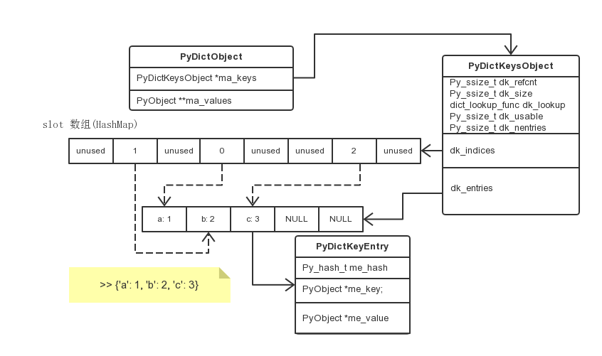

+++
title = "CPython 源码阅读 - dict"
summary = ''
description = ""
categories = []
tags = []
date = 2018-03-12T15:52:00+08:00
draft = false
+++

*本文所用代码取自 CPython 3.6.3 commit sha 2c5fed86e0cbba5a4e34792b0083128ce659909d*

和 dict 相关的源码大致位于三个文件

```
Include/dictobject.h
Objects/dict-common.h
Objects/dictobject.c
```

首先确保阅读自带说明文件 `Objects/dictnotes.txt`，这里摘取部分的内容

dict 所经历的变化

>The key differences between this implementation and earlier versions are:
>
>    1. The table can be split into two parts, the keys and the values.
>
>    2. There is an additional key-value combination: (key, NULL).
>       Unlike (<dummy>, NULL) which represents a deleted value, (key, NULL)
>       represented a yet to be inserted value. This combination can only occur
>       when the table is split.
>
>    3. No small table embedded in the dict,
>       as this would make sharing of key-tables impossible.

所带来的优缺点

>These changes have the following consequences.
>
>   1. General dictionaries are slightly larger.
>
>   2. All object dictionaries of a single class can share a single key-table,
>      saving about 60% memory for such cases.

dict 在 Python 中的主要使用场景

- Passing keyword arguments
- Class method lookup
- Instance attribute lookup and Global variables
- Builtins
- Uniquification: 如计算 list 中元素出现的次数 `for e in seqn: d[e] = d.get(e, 0) + 1`
- Membership Testing
- Dynamic Mappings

步入正题，先来看一下 `PyDictObject` 的定义

```cpp
// dictobject.h
typedef struct _dictkeysobject PyDictKeysObject;

typedef struct {
    PyObject_HEAD

    /* Number of items in the dictionary */
    Py_ssize_t ma_used;

    /* Dictionary version: globally unique, value change each time
       the dictionary is modified */
    uint64_t ma_version_tag;

    PyDictKeysObject *ma_keys;

    /* If ma_values is NULL, the table is "combined": keys and values
       are stored in ma_keys.
       If ma_values is not NULL, the table is splitted:
       keys are stored in ma_keys and values are stored in ma_values */
    PyObject **ma_values;
} PyDictObject;
```

dict 实际上有两种形式

- combined table: `ma_values == NULL`, `dk_refcnt == 1`。k/v 以 `PyDictKeysObject` 类型存储在 `ma_keys` 中
- split table: `ma_values != NULL`, `dk_refcnt >= 1`。k (必须为 string)存储在 `ma_keys` 中, v 存储在 `ma_values` 中

这个 split table 是在 Python 3.3 中引入的，可以参考 [PEP 412](https://www.python.org/dev/peps/pep-0412/#implementation)

通过共享同一个类的实例的属性字典的 k，来减少实例化大量对象时的内存占用(自带享元模式[Flyweight Pattern])

可以知道 `ma_keys` 可能存 k/v，也可能仅存 k，那么这个 `PyDictKeysObject` 到底是什么呢

```cpp
// dict-common.h
struct _dictkeysobject {
    Py_ssize_t dk_refcnt;

    /* Size of the hash table (dk_indices). It must be a power of 2. */
    Py_ssize_t dk_size;

    /* Function to lookup in the hash table (dk_indices)
       lookdict() / lookdict_unicode() / lookdict_unicode_nodummy() / lookdict_split() */
    dict_lookup_func dk_lookup;

    /* Number of usable entries in dk_entries. */
    Py_ssize_t dk_usable;

    /* Number of used entries in dk_entries. */
    Py_ssize_t dk_nentries;

    /* Actual hash table of dk_size entries. It holds indices in dk_entries,
       or DKIX_EMPTY(-1) or DKIX_DUMMY(-2).
       Indices must be: 0 <= indice < USABLE_FRACTION(dk_size).
       The size in bytes of an indice depends on dk_size:
       - 1 byte if dk_size <= 0xff (char*)
       - 2 bytes if dk_size <= 0xffff (int16_t*)
       - 4 bytes if dk_size <= 0xffffffff (int32_t*)
       - 8 bytes otherwise (int64_t*)
       Dynamically sized, 8 is minimum. */
    union {
        int8_t as_1[8];
        int16_t as_2[4];
        int32_t as_4[2];
#if SIZEOF_VOID_P > 4
        int64_t as_8[1];
#endif
    } dk_indices;

    /* "PyDictKeyEntry dk_entries[dk_usable];" array follows:
       see the DK_ENTRIES() macro */
};
```

根据注释可知，`PyDictKeysObject` 的内存布局是下面这个样子的

```
+---------------+
| dk_refcnt     |
| dk_size       |
| dk_lookup     |
| dk_usable     |
| dk_nentries   |
+---------------+
| dk_indices    |
|               |
+---------------+
| dk_entries    |
|               |
+---------------+
```

What，这个 `dk_entries` 是怎么跑出来的？它是在结构体生成时多分配出来的，这部分代码在 `new_keys_object` 当中，稍后便会提到

对于这么一个 dict `d = {'timmy': 'red', 'barry': 'green', 'guido': 'blue'}`

原来我们这么存储

```
entries = [['--', '--', '--'],
           [-8522787127447073495, 'barry', 'green'],
           ['--', '--', '--'],
           ['--', '--', '--'],
           ['--', '--', '--'],
           [-9092791511155847987, 'timmy', 'red'],
           ['--', '--', '--'],
           [-6480567542315338377, 'guido', 'blue']]
```

现在这么存储

```
dk_indices = [None, 1, None, None, None, 0, None, 2]
dk_entries = [[-9092791511155847987, 'timmy', 'red'],
              [-8522787127447073495, 'barry', 'green'],
              [-6480567542315338377, 'guido', 'blue']]
```

所以在 Python 3.6 中 dict 是 insertion ordered 的，因为 `dk_entries` 是有序的

接下来需要解释一下那个 `dk_indices` 为什么定义的这么奇怪。这是为了节省空间，`dk_indices` 会根据 `dk_size`(dict 总共大小) 来决定应当使用什么类型存储 index。比如当前 dict 的大小为 `0xff`，那么索引最大才是 `255`，一个 `int8_t` 类型便可以表示此范围，注意这里是 **有符号的**

`dk_indices` 是实际的哈希表，将自身下标与 `dk_entries` 的下标进行映射。根据哈希表术语来说，其元素称为 slot/bucket

```
dk_indices
-------------------------
| slot1 | slot2 | slot3 |
-------------------------
```

slot 的值不仅表示下标，还表示状态。状态有四种

1. Unused: `index == DKIX_EMPTY`，初始状态，从没有使用过
2. Active:  `index >= 0`, 对应 `PyDictKeyEntry` 的 `me_key != NULL`，`me_value != NULL`
3. Dummy:  `index == DKIX_DUMMY`  (combined only)
   Dummy slots cannot be made Unused again else the probe sequence in case of
   collision would have no way to know they were once active.
4. Pending: `index >= 0`, `key != NULL`, and `value == NULL`  (split only)

但只有三个与状态相关的宏

```cpp
// dict-common.h
#define DKIX_EMPTY (-1)
#define DKIX_DUMMY (-2)  /* Used internally */
#define DKIX_ERROR (-3)
```

初始化 `dk_indices` 时，会将这篇内存区域 `memset` 为 `0xff`。显然这里是通过溢出得到 `-1` 的，也就是 `DKIX_EMPTY`

这有一个 trick，如果真的有下标是 `0xff` 怎么办，不是和 `DKIX_EMPTY` 冲突了么？不会的，当你的 `dk_entries` 的长度(已经使用的 bucket 的数量)到达这个值时，为了避免 hash collision，你的 `dk_size` 早就比 `0xff` 大了，也就是说我们会按照 `int16_t` 来读取。此时 `DKIX_EMPTY` 实际上为 `0xffff` 了，而你的下标 `0xff` 应当是 `0x00ff`

`dk_entries` 需要通过 `DK_ENTRIES` 这个宏来访问

```CPP
// dictobject.c
#define DK_SIZE(dk) ((dk)->dk_size)
#if SIZEOF_VOID_P > 4
#define DK_IXSIZE(dk)                          \
    (DK_SIZE(dk) <= 0xff ?                     \
        1 : DK_SIZE(dk) <= 0xffff ?            \
            2 : DK_SIZE(dk) <= 0xffffffff ?    \
                4 : sizeof(int64_t))
#else
#define DK_IXSIZE(dk)                          \
    (DK_SIZE(dk) <= 0xff ?                     \
        1 : DK_SIZE(dk) <= 0xffff ?            \
            2 : sizeof(int32_t))
#endif
#define DK_ENTRIES(dk) \
    ((PyDictKeyEntry*)(&(dk)->dk_indices.as_1[DK_SIZE(dk) * DK_IXSIZE(dk)]))
```

这个宏的作用就是计算 `dk_entries` 的起始地址。举个例子比如现在我的 `dk_size` 为 `0xff00`，此时我的下标应当是 `int16_t` 类型表示的，其占用两个字节。所以 `dk_indices` 占用的内存区域大小为 `2 * 0xff00` 个字节，便可以算出 `dk_entries` 的起始地址了

`dk_entries` 中的每一个元素都是 `PyDictKeyEntry` 对象

```cpp
typedef struct {
    /* Cached hash code of me_key. */
    Py_hash_t me_hash;
    PyObject *me_key;
    PyObject *me_value; /* This field is only meaningful for combined tables */
} PyDictKeyEntry;
```

`me_hash` 为 `me_key` 的哈希值，缓存下来不需要每次进行计算。

根据以上内容可以整理出下图



dict(combined) 的创建

```cpp
// dictobject.c
PyObject *
PyDict_New(void)
{
    PyDictKeysObject *keys = new_keys_object(PyDict_MINSIZE);  // PyDict_MINSIZE == 8
    if (keys == NULL)
        return NULL;
    return new_dict(keys, NULL);
}
```

先来看之前便提到的 `new_keys_object`

```cpp
// dictobject.c
static PyDictKeysObject *new_keys_object(Py_ssize_t size)
{
    PyDictKeysObject *dk;
    Py_ssize_t es, usable;

    assert(size >= PyDict_MINSIZE);
    assert(IS_POWER_OF_2(size));

    // [1]
    usable = USABLE_FRACTION(size);
    if (size <= 0xff) {
        es = 1;
    }
    else if (size <= 0xffff) {
        es = 2;
    }
#if SIZEOF_VOID_P > 4
    else if (size <= 0xffffffff) {
        es = 4;
    }
#endif
    else {
        es = sizeof(Py_ssize_t);
    }

    if (size == PyDict_MINSIZE && numfreekeys > 0) {
        // [2]
        dk = keys_free_list[--numfreekeys];
    }
    else {
        // [3]
        dk = PyObject_MALLOC(sizeof(PyDictKeysObject)
                             - Py_MEMBER_SIZE(PyDictKeysObject, dk_indices)
                             + es * size
                             + sizeof(PyDictKeyEntry) * usable);
        if (dk == NULL) {
            PyErr_NoMemory();
            return NULL;
        }
    }
    DK_DEBUG_INCREF dk->dk_refcnt = 1;
    dk->dk_size = size;
    dk->dk_usable = usable;
    dk->dk_lookup = lookdict_unicode_nodummy;
    dk->dk_nentries = 0;
    // 置为默认状态
    memset(&dk->dk_indices.as_1[0], 0xff, es * size);
    memset(DK_ENTRIES(dk), 0, sizeof(PyDictKeyEntry) * usable);
    return dk;
}
```

代码有点长，所以标了序号，[1] 处的 `USABLE_FRACTION` 计算了哈希表的填充率(2/3)

```cpp
// dictobject.c
#define USABLE_FRACTION(n) (((n) << 1)/3)
```

比如 `dk_size` 为 8 的 dict，最多只能容纳 5 个 k/v

[2] 处的 `keys_free_list` 是一个对象池，当有 `PyDictKeysObject` 被 dealloc 时，便会加入这个对象池中

重点来看 [3] 处 `PyObject_MALLOC` 时分配的大小

```cpp
// 结构体大小 + dk_indices 大小 + dk_entries 大小
sizeof(PyDictKeysObject) - Py_MEMBER_SIZE(PyDictKeysObject, dk_indices) + \
es * size + sizeof(PyDictKeyEntry) * usable
```

我们需要减去 `dk_indices` 的 8 个字节，因为这在 `es * size` 中被重复计算

接下来将生成的 `PyDictKeysObject` 传入 `new_dict` 函数中，以生成最终的 dict 对象

```cpp
// dictobject.c
static PyObject *
new_dict(PyDictKeysObject *keys, PyObject **values)
{
    PyDictObject *mp;
    assert(keys != NULL);
    if (numfree) {
        mp = free_list[--numfree];
        assert (mp != NULL);
        assert (Py_TYPE(mp) == &PyDict_Type);
        _Py_NewReference((PyObject *)mp);
    }
    else {
        mp = PyObject_GC_New(PyDictObject, &PyDict_Type);
        if (mp == NULL) {
            DK_DECREF(keys);
            free_values(values);
            return NULL;
        }
    }
    mp->ma_keys = keys;
    mp->ma_values = values;
    mp->ma_used = 0;
    mp->ma_version_tag = DICT_NEXT_VERSION();
    assert(_PyDict_CheckConsistency(mp));
    return (PyObject *)mp;
}
```

这里没什么好说的了，依旧是对象缓冲池 `free_list` 的套路，然后初始化了几个 field

### Reference
[Python 源码剖析](https://read.douban.com/ebook/1499455/)  
[PEP 412 -- Key-Sharing Directory](https://www.python.org/dev/peps/pep-0412/)  
[[Python-Dev] More compact dictionaries with faster iteration](https://mail.python.org/pipermail/python-dev/2012-December/123028.html)  

    