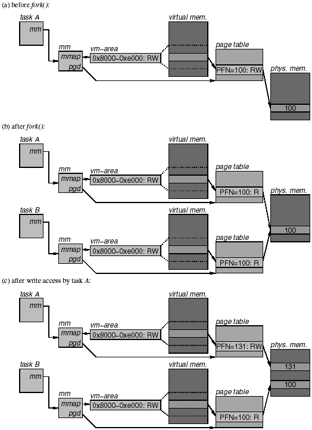

+++
title = "Copy-On-Write or Copy-On-Read"
summary = ''
description = ""
categories = []
tags = []
date = 2018-03-20T12:36:52+08:00
draft = false
+++

~~这可能是我所用过的最有价值的 Banner~~
本文主要是解决上次面试时的疑惑：一个 200MB 的 list，fork 出一个子进程后迭代输出此 list 中的元素。此时内存情况如何，呃，我说的是 Python

先来看看如何去计算对象的大小，虽然这个并不是重点。Python 标准库提供了 `sys.getsizeof` 函数来获取对象的大小(单位为字节)，不过这里有几个坑，[文档](https://docs.python.org/3/library/sys.html)上是这么说明的

> Return the size of an object in bytes. The object can be any type of object. All built-in objects will return correct results, but this does not have to hold true for third-party extensions as it is implementation specific.  
Only the memory consumption directly attributed to the object is accounted for, not the memory consumption of objects it refers to. `getsizeof()` calls the object’s `__sizeof__` method and adds an additional garbage collector overhead if the object is managed by the garbage collector.

可以通过递归的方式去计算对象，参考 [recursive sizeof recipe](https://code.activestate.com/recipes/577504)

本文所用的测试代码如下(有点丑)

```Python
import os
import time
import gc
import signal
from mem import total_size  # see https://code.activestate.com/recipes/577504

# disable GC
gc.set_threshold(0)

long_list = list(range(1000000))
print('the list use {} MB mem'.format(total_size(long_list) / (1024 * 1024)))


def sleep_forever():
    while True:
        time.sleep(1)


pid = os.fork()  # noqa
if pid == 0:
    # child
    signal.signal(signal.SIGINT, signal.SIG_DFL)
    time.sleep(16)
    for i in long_list:
        print(i)
    # gc.collect()
    sleep_forever()
else:
    # parent
    print('parent pid {}'.format(os.getpid()))
    print('child pid {}'.format(pid))
    try:
        sleep_forever()
    except KeyboardInterrupt:
        os.wait()
```

首先来粗略地估计一下，未运行脚本前我机器的内存占用大概在 255M 上下浮动。运行脚本从输出可以看到 `long_list` 在我的机器上占用 35MB 内存。待子进程 spawn 成功进入长达 16 sec 的睡眠时，内存在 362M 上下浮动。当子进程开始输出计数，内存占用慢慢升高，最后维持在 394M 上下浮动

可见在子进程中仅仅是读取变量并未修改，无法有效利用 Linux 的 COW 所带来的好处

那么回顾一下 COW 是什么，参考 [wiki](https://en.wikipedia.org/wiki/Copy-on-write)

>Copy-on-write finds its main use in sharing the virtual memory of operating system processes, in the implementation of the fork system call. Typically, the process does not modify any memory and immediately executes a new process, replacing the address space entirely. Thus, it would be wasteful to copy all of the process's memory during a fork, and instead the copy-on-write technique is used. **It can be implemented efficiently using the page table by marking certain pages of memory as read-only and keeping a count of the number of references to the page. When data is written to these pages, the kernel intercepts the write attempt and allocates a new physical page, initialized with the copy-on-write data, although the allocation can be skipped if there is only one reference.** The kernel then updates the page table with the new (writable) page, decrements the number of references, and performs the write. The new allocation ensures that a change in the memory of one process is not visible in another's. The copy-on-write technique can be extended to support efficient memory allocation by having a page of physical memory filled with zeros. When the memory is allocated, all the pages returned refer to the page of zeros and are all marked copy-on-write. This way, physical memory is not allocated for the process until data is written, allowing processes to reserve more virtual memory than physical memory and use memory sparsely, at the risk of running out of virtual address space.

好吧，细节部分还是不够清楚，我们需要参考一下 Kernel 相关的资料。我这里找到一份 [IA64 架构的实现](http://www.informit.com/articles/article.aspx?p=29961&seqNum=5)



> So what happens when one of the processes attempts to write to the virtual page at 0x8000? Suppose process A writes to the page first. Because the PTE allows only read accesses, this write triggers a page fault. The page fault handler goes through the steps described in the previous section and first locates the matching vm-area. It then checks whether the vm-area permits write accesses. Because the vm-area in process A still has the access rights set to RW, the write access is permitted. The page fault handler then checks whether the PTE exists in the page table and whether the PTE has the present bit on. Because the page is resident, both of these checks pass. In the last step, the page fault handler checks whether it is dealing with a write access to a page whose PTE does not permit write accesses. Because this is the case, the handler detects that it is time to copy a copy-on-write page. It proceeds by checking the page frame descriptor of page frame 100 to see how many processes are currently using this page. Because process B is also using this page frame, the count is 2 and the page fault handler decides that it must copy the page frame. It does this by first allocating a free page frame, say, page frame 131, copying the original frame to this new frame, and then updating the PTE in process A to point to page frame 131. Because process A now has a private copy of the page, the access permission in the PTE can be set to RW again. The page fault handler then returns, and at this point the write access can complete without any further errors. Figure 4.35 (c) illustrates the state as it exists at this point.

> Note that the PTE in process B still has write permission turned off, even though it is now the sole user of page frame 100. This remains so until the process attempts a write access. When that happens, the page fault handler is invoked again and the same steps are repeated as for process A. However, when checking the page frame descriptor of page frame 100, it finds that there are no other users and goes ahead to turn on write permission in the PTE without first making a copy of the page

所以说可以 COW 时一定会伴随 Page fault，但是 Page fault 不代表发生了 COW

参考 [Page fault 的 wiki](https://en.wikipedia.org/wiki/Page_fault)，其分为 Minor, Major, Invalid 三种类型。其中 Minor 是与 COW 相关的

>If the page is loaded in memory at the time the fault is generated, but is not marked in the memory management unit as being loaded in memory, then it is called a minor or soft page fault. The page fault handler in the operating system merely needs to make the entry for that page in the memory management unit point to the page in memory and indicate that the page is loaded in memory; it does not need to read the page into memory. This could happen if the memory is shared by different programs and the page is already brought into memory for other programs.  
The page could also have been removed from the working set of a process, but not yet written to disk or erased, such as in operating systems that use Secondary Page Caching. For example, HP OpenVMS may remove a page that does not need to be written to disk (if it has remained unchanged since it was last read from disk, for example) and place it on a Free Page List if the working set is deemed too large. However, the page contents are not overwritten until the page is assigned elsewhere, meaning it is still available if it is referenced by the original process before being allocated. Since these faults do not involve disk latency, they are faster and less expensive than major page faults.

`ps` 命令提供了 `min_flt`、`maj_flt` 两个指标。蠢作者这里一共会发生 8036 次 `min_flt`  
借助 `smem` 命令也可以看出父子进程逐渐不再共享内存

```Bash
[before loop]
PID User       Command                         Swap      USS      PSS      RSS
22296 root     python cow.py                      0      296    54372   109588
22162 root     python cow.py                      0      296    54768   113076

[after loop]
22296 root     python cow.py                      0    32064    70365   110320
22162 root     python cow.py                      0    32064    70627   113076
// 22162 is parent; 22296 is child
```

PS. 简略说一下 `USS`、`PSS`、`RSS` 这几个指标的含义

- `USS` (Unique Set Size) This is the amount of unshared memory unique to that process
- `PSS` (Proportional Set Size) USS + 共享内存/拥有此共享内存的进程数
- `RSS` (Resident Set Size) USS + 共享内存
以上三个指标均指实际在内存中的部分，不包括 swap 中的 可以参考 [Stack Overflow: What is RSS and VSZ in Linux memory management](https://stackoverflow.com/questions/7880784/what-is-rss-and-vsz-in-linux-memory-management)

可见 `USS` 增长了大概 31M((32064-296)/1024)。另外有一个简单的 Python 脚本 [ps_mem](https://github.com/pixelb/ps_mem) 也可以进行测量

```Bash
➜  ps_mem -p 22296
Private  +   Shared  =  RAM used       Program

31.3 MiB +  37.4 MiB =  68.7 MiB       python
---------------------------------
                        68.7 MiB
=================================
```

看了此脚本的源码发现这个是在统计 `/proc/<pid>/smaps` 中指标以 `Shared`/`Private` 起始的项的对应值

回到正题上来，Python 一定是进行了 write 操作才导致了这种情况

原因便是 Python 的引用计数，当我们去使用一个对象时，Python 会对此对象执行 `Py_INCREF`

```Python
# 变量 i 会使 long_list 中每个元素的引用计数 +1/-1
for i in long_list:
    print(i)
```

顺便说一下，Python 针对循环引用的垃圾回收的目标为容器对象，即生成时执行过 `_PyObject_GC_TRACK` 的对象

### Reference
[Python vs Copy on Write](https://llvllatrix.wordpress.com/2016/02/19/python-vs-copy-on-write/)

    