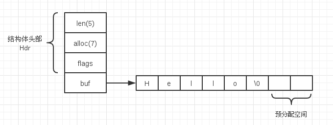

+++
title = "Redis 数据结构 - SDS"
summary = ''
description = ""
categories = []
tags = []
date = 2018-04-02T11:46:00+08:00
draft = false
+++

*本文代码取自 Redis 4.0.9，commit sha 为 3150c672442b2275d75a1b6cedf45084019f4d57*

我们平常所使用到的 Redis 数据结构 `String`、`Hash`、`List` 等都是 `redisObject`，就算同一个类型也会有不同的底层数据结构表示，比如

```Bash
127.0.0.1:6379> SADD simple_set 1 2 3
(integer) 3
127.0.0.1:6379> OBJECT ENCODING simple_set
"intset"
127.0.0.1:6379> SADD simple_set 'string'
(integer) 1
127.0.0.1:6379> OBJECT ENCODING simple_set
"hashtable"
```

当集合的元素均为整数时且保存的元素数量不超过 512 个时，`Set` 会使用 `intset` 作为底层表示，否则便会使用 `hashtable`

SDS(simple dynamic string) 是 Redis 内部所使用的字符串类型，用于整个 k/v 空间的 k 和 `String` 类型的底层表示，其定义如下

```
// sds.h
struct __attribute__ ((__packed__)) sdshdr8 {
    uint8_t len; /* used */
    uint8_t alloc; /* excluding the header and null terminator */
    unsigned char flags; /* 3 lsb of type, 5 unused bits */
    char buf[];
};
struct __attribute__ ((__packed__)) sdshdr16 {
    uint16_t len; /* used */
    uint16_t alloc; /* excluding the header and null terminator */
    unsigned char flags; /* 3 lsb of type, 5 unused bits */
    char buf[];
};
// 省略类似的 sdshdr32,sdshdr64 的定义
```

` __attribute__ ((__packed__))` 取消结构体的内存对齐，可以参考 [GCC-Type-Attributes](https://gcc.gnu.org/onlinedocs/gcc-4.9.4/gcc/Type-Attributes.html)

`sdshdr8`、`sdshdr16`、`sdshdr32`、`sdshdr64` 是针对字符串长度所做的优化，可以减少 `len` 和 `alloc` field 所占用的空间。

`len` 为字符串的真实长度，不包含 `\0`;`alloc` 为 `buf` 的分配长度，同样不包含 `\0`

`flags` 的低三位存储了类型 `#define SDS_TYPE_8  1; #define SDS_TYPE_16 2`

`char buf[]` 是 C99 下的 [Zero Length Array](https://gcc.gnu.org/onlinedocs/gcc/Zero-Length.html)


下面来看字符串的创建

```
// sds.c
/* Create a new sds string starting from a null terminated C string. */
sds sdsnew(const char *init) {
    size_t initlen = (init == NULL) ? 0 : strlen(init);
    return sdsnewlen(init, initlen);
}
```

核心部分位于 `sdsnewlen` 中

```
// sds.c
sds sdsnewlen(const void *init, size_t initlen) {  // sds 类型即 char *，定义于 sds.h
    void *sh;
    sds s;
    char type = sdsReqType(initlen);  // 内联函数，根据字符串长度来选择合适的 SDS 表示
    /* Empty strings are usually created in order to append. Use type 8
     * since type 5 is not good at this. */
    if (type == SDS_TYPE_5 && initlen == 0) type = SDS_TYPE_8;
    int hdrlen = sdsHdrSize(type);  // 计算 SDS 结构体大小
    unsigned char *fp; /* flags pointer. */

    sh = s_malloc(hdrlen+initlen+1);  // 需要包含 \0
    if (!init)
        memset(sh, 0, hdrlen+initlen+1);
    if (sh == NULL) return NULL;
    s = (char*)sh+hdrlen;  // 计算 buf 的起始地址
    fp = ((unsigned char*)s)-1;  // flag
    switch(type) {
        case SDS_TYPE_8: {
            SDS_HDR_VAR(8,s);  // [1]
            sh->len = initlen;
            sh->alloc = initlen;
            *fp = type;
            break;
        }
        case SDS_TYPE_16: {
            SDS_HDR_VAR(16,s);
            sh->len = initlen;
            sh->alloc = initlen;
            *fp = type;
            break;
        }
        // 省略 SDS_TYPE_32 和 SDS_TYPE_64
    }
    if (initlen && init)
        memcpy(s, init, initlen);  // 拷贝字符串至 buf
    s[initlen] = '\0';
    return s;  // 注意这里返回的是 s，而不是 sh
}
```

`[1]` 处 `SDS_HDR_VAR` 是一个宏

```
// sds.h
#define SDS_HDR_VAR(T,s) struct sdshdr##T *sh = (void*)((s)-(sizeof(struct sdshdr##T)));
```

`##` 为宏定义中的连接符，在上例中便会被替换为

```
struct sdshdr8 *sh = (void*)((s)-(sizeof(struct sdshdr8)));
```

将 `sh` 指向结构体的起始地址

下面再来看一下字符串的拼接操作 `sdscat` 和 `sdscatsds`

```
// sds.c
/* Append the specified null termianted C string to the sds string 's'.
 *
 * After the call, the passed sds string is no longer valid and all the
 * references must be substituted with the new pointer returned by the call. */
sds sdscat(sds s, const char *t) {
    return sdscatlen(s, t, strlen(t));
}


/* Append the specified sds 't' to the existing sds 's'.
 *
 * After the call, the modified sds string is no longer valid and all the
 * references must be substituted with the new pointer returned by the call. */
sds sdscatsds(sds s, const sds t) {
    return sdscatlen(s, t, sdslen(t));
}
```

`sdscatlen` 的实现如下

```
sds sdscatlen(sds s, const void *t, size_t len) {
    size_t curlen = sdslen(s);

    s = sdsMakeRoomFor(s,len);
    if (s == NULL) return NULL;
    memcpy(s+curlen, t, len);  // 拼接
    sdssetlen(s, curlen+len);  // 重设 len
    s[curlen+len] = '\0';
    return s;
}
```

`sdslen` 用于计算 SDS 的已用使用长度

```
// sds.h
#define SDS_TYPE_8 1
#define SDS_TYPE_16 2
#define SDS_TYPE_MASK 7

static inline size_t sdslen(const sds s) {
    unsigned char flags = s[-1];
    switch(flags&SDS_TYPE_MASK) {
        case SDS_TYPE_8:
            return SDS_HDR(8,s)->len;
        case SDS_TYPE_16:
            return SDS_HDR(16,s)->len;
        // 有省略
    }
    return 0;
}
```

注意 `s` 为 `buf` 的起始地址，又因为取消了内存对齐，所以可以通过 `s[-1]` 来直接定位当前结构体的 flag

在创建 SDS 时，我们 `buf` 的长度就是字符串长度+1。如果直接将追加到 `buf` 中，那么显然会造成缓冲区溢出，所以这里需要通过 `sdsMakeRoomFor` 进行扩容

```
// sds.c
sds sdsMakeRoomFor(sds s, size_t addlen) {
    void *sh, *newsh;
    size_t avail = sdsavail(s);  // 内联函数，返回 alloc-len
    size_t len, newlen;
    char type, oldtype = s[-1] & SDS_TYPE_MASK;
    int hdrlen;

    /* Return ASAP if there is enough space left. */
    if (avail >= addlen) return s;  // 空间充足

    len = sdslen(s);
    sh = (char*)s-sdsHdrSize(oldtype);
    newlen = (len+addlen);
    if (newlen < SDS_MAX_PREALLOC)  // 1024*1024 即 1M
        newlen *= 2;
    else
        newlen += SDS_MAX_PREALLOC;

    type = sdsReqType(newlen);  // 根据连接后字符串长度计算新的类型

    /* Don't use type 5: the user is appending to the string and type 5 is
     * not able to remember empty space, so sdsMakeRoomFor() must be called
     * at every appending operation. */
    if (type == SDS_TYPE_5) type = SDS_TYPE_8;

    hdrlen = sdsHdrSize(type);
    if (oldtype==type) {
        newsh = s_realloc(sh, hdrlen+newlen+1);
        if (newsh == NULL) return NULL;
        s = (char*)newsh+hdrlen;
    } else {
        /* Since the header size changes, need to move the string forward,
         * and can't use realloc */
        newsh = s_malloc(hdrlen+newlen+1);
        if (newsh == NULL) return NULL;
        memcpy((char*)newsh+hdrlen, s, len+1);
        s_free(sh);
        s = (char*)newsh+hdrlen;
        s[-1] = type;
        sdssetlen(s, len);  // 因为仅仅是扩容，并未连接字符串，所以 len 还是原来的
    }
    sdssetalloc(s, newlen);  // 更改 alloc Field
    return s;
}
```

SDS 采取了空间预分配策略，不仅会为 SDS 分配修改所必须的空间，还会为 SDS 分配额外的未使用空间

- 如果对 SDS 进行修改之后，SDS 的长度依然小于 1M，那么会分配和新长度同样大小的未使用空间
- 如果对 SDS 进行修改之后，SDS 的长度将大于等于 1M，那么将多分配 1M 的未使用空间

这种优化使得不必每次进行字符串连接都进行 `realloc`

同样地，对于缩减字符串的操作，我们也应当释放不再使用的空间。不过 SDS 使用的是惰性策略

```
// sds.c

/* Remove the part of the string from left and from right composed just of
 * contiguous characters found in 'cset', that is a null terminted C string.
 *
 * After the call, the modified sds string is no longer valid and all the
 * references must be substituted with the new pointer returned by the call.
 *
 * Example:
 *
 * s = sdsnew("AA...AA.a.aa.aHelloWorld     :::");
 * s = sdstrim(s,"Aa. :");
 * printf("%s\n", s);
 *
 * Output will be just "Hello World".
 */
sds sdstrim(sds s, const char *cset) {
    char *start, *end, *sp, *ep;
    size_t len;

    sp = start = s;
    ep = end = s+sdslen(s)-1;
    while(sp <= end && strchr(cset, *sp)) sp++;
    while(ep > sp && strchr(cset, *ep)) ep--;
    len = (sp > ep) ? 0 : ((ep-sp)+1);
    if (s != sp) memmove(s, sp, len);
    s[len] = '\0';
    sdssetlen(s,len);
    return s;
}
```

可见 SDS 并没有立即释放不用的空间，仅仅是修改了 `len` 的大小和 `\0` 的位置。SDS 提供了缩小空间的操作 `sdsRemoveFreeSpace`，但是是否进行由调用方决定。比如调整客户端输入缓冲区 `querybuf` 的大小

```
// sds.c
sds sdsRemoveFreeSpace(sds s) {
    void *sh, *newsh;
    char type, oldtype = s[-1] & SDS_TYPE_MASK;
    int hdrlen, oldhdrlen = sdsHdrSize(oldtype);
    size_t len = sdslen(s);
    sh = (char*)s-oldhdrlen;

    /* Check what would be the minimum SDS header that is just good enough to
     * fit this string. */
    type = sdsReqType(len);
    hdrlen = sdsHdrSize(type);

    /* If the type is the same, or at least a large enough type is still
     * required, we just realloc(), letting the allocator to do the copy
     * only if really needed. Otherwise if the change is huge, we manually
     * reallocate the string to use the different header type. */
    if (oldtype==type || type > SDS_TYPE_8) {
        newsh = s_realloc(sh, oldhdrlen+len+1);
        if (newsh == NULL) return NULL;
        s = (char*)newsh+oldhdrlen;
    } else {
        newsh = s_malloc(hdrlen+len+1);
        if (newsh == NULL) return NULL;
        memcpy((char*)newsh+hdrlen, s, len+1);
        s_free(sh);
        s = (char*)newsh+hdrlen;
        s[-1] = type;
        sdssetlen(s, len);
    }
    sdssetalloc(s, len);
    return s;
}
```

SDS 的内存布局如图




相较 C 字符串，SDS 具有以下的优点

- 常数复杂度获取字符串长度
- 杜绝缓冲区溢出
- 减少修改字符串长度时所需的内存重分配次数
- 二进制安全
- 兼容部分 C 字符串函数

### Reference
[Redis 设计与实现](https://read.douban.com/ebook/7519526/)

    