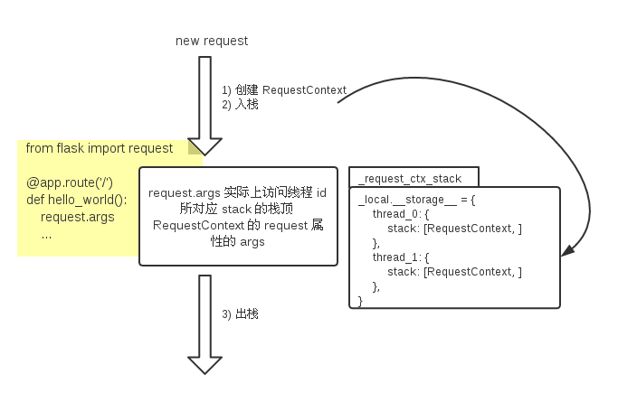

+++
title = "Flask 中的 request"
summary = ''
description = ""
categories = []
tags = []
date = 2018-04-10T14:16:28+08:00
draft = false
+++

*本文所使用的代码来源于*  
*Flask version 0.12.2 commit sha 571334df8e26333f34873a3dcb84441946e6c64c*  
*werkzeug version 0.14 commit sha 5b53d1539147c5db3210e0769d85397ab91f902d*

Flask 使用全局变量 `request` 来获取请求数据，而不是像 Tornado 等那样将 `request` 作为参数传入 handler 中。不过这种全局变量实际上是一个 proxy，它会取上下文中的对应 `request`

### Context 的生成

Flask 遵循 WSGI 规范，默认使用的 WSGI Server 为 werkzeug 提供的 threaded WSGI server

```Python
# app.py
from .ctx import RequestContext

class Flask(_PackageBoundObject):
    def wsgi_app(self, environ, start_response):
        ctx = self.request_context(environ)
        ctx.push()
        error = None
        try:
            try:
                # 调用各种 hook、匹配路由、执行 handler、返回响应
                response = self.full_dispatch_request()
            except Exception as e:
                error = e
                response = self.handle_exception(e)
            except:
                error = sys.exc_info()[1]
                raise
            return response(environ, start_response)
        finally:
            if self.should_ignore_error(error):
                error = None
            ctx.auto_pop(error)  # 传入异常信息

    def __call__(self, environ, start_response):
        return self.wsgi_app(environ, start_response)

    def request_context(self, environ):
        return RequestContext(self, environ)
```

当一个请求到来时，我们会创建对应的 `RequestContext`，它保存了 HTTP Request 解析后的信息(`request`属性)

```Python
# ctx.py
class RequestContext(object):
    def __init__(self, app, environ, request=None):
        self.app = app
        if request is None:
            request = app.request_class(environ)  # falsk.request 实际访问的对象
        self.request = request
        self.url_adapter = app.create_url_adapter(self.request)
        self.flashes = None
        self.session = None

        # Request contexts can be pushed multiple times and interleaved with
        # other request contexts.  Now only if the last level is popped we
        # get rid of them.  Additionally if an application context is missing
        # one is created implicitly so for each level we add this information
        self._implicit_app_ctx_stack = []

        # indicator if the context was preserved.  Next time another context
        # is pushed the preserved context is popped.
        self.preserved = False

        # remembers the exception for pop if there is one in case the context
        # preservation kicks in.
        self._preserved_exc = None

        # Functions that should be executed after the request on the response
        # object.  These will be called before the regular "after_request"
        # functions.
        self._after_request_functions = []

        self.match_request()

    def _get_g(self):
        return _app_ctx_stack.top.g
    def _set_g(self, value):
        _app_ctx_stack.top.g = value
    g = property(_get_g, _set_g)
    del _get_g, _set_g

    def match_request(self):
        """Can be overridden by a subclass to hook into the matching
        of the request.
        """
        try:
            url_rule, self.request.view_args = \
                self.url_adapter.match(return_rule=True)
            self.request.url_rule = url_rule
        except HTTPException as e:
            self.request.routing_exception = e

    def push(self):
        """Binds the request context to the current context."""
        # If an exception occurs in debug mode or if context preservation is
        # activated under exception situations exactly one context stays
        # on the stack.  The rationale is that you want to access that
        # information under debug situations.  However if someone forgets to
        # pop that context again we want to make sure that on the next push
        # it's invalidated, otherwise we run at risk that something leaks
        # memory.  This is usually only a problem in test suite since this
        # functionality is not active in production environments.
        top = _request_ctx_stack.top
        if top is not None and top.preserved:
            top.pop(top._preserved_exc)

        # Before we push the request context we have to ensure that there
        # is an application context.
        app_ctx = _app_ctx_stack.top
        if app_ctx is None or app_ctx.app != self.app:
            app_ctx = self.app.app_context()
            app_ctx.push()
            self._implicit_app_ctx_stack.append(app_ctx)
        else:
            self._implicit_app_ctx_stack.append(None)

        if hasattr(sys, 'exc_clear'):
            sys.exc_clear()

        _request_ctx_stack.push(self)

    def pop(self, exc=_sentinel):
        app_ctx = self._implicit_app_ctx_stack.pop()

        try:
            clear_request = False
            if not self._implicit_app_ctx_stack:
                self.preserved = False
                self._preserved_exc = None
                if exc is _sentinel:
                    exc = sys.exc_info()[1]
                self.app.do_teardown_request(exc)

                # If this interpreter supports clearing the exception information
                # we do that now.  This will only go into effect on Python 2.x,
                # on 3.x it disappears automatically at the end of the exception
                # stack.
                if hasattr(sys, 'exc_clear'):
                    sys.exc_clear()

                request_close = getattr(self.request, 'close', None)
                if request_close is not None:
                    request_close()
                clear_request = True
        finally:
            rv = _request_ctx_stack.pop()

            # get rid of circular dependencies at the end of the request
            # so that we don't require the GC to be active.
            if clear_request:
                rv.request.environ['werkzeug.request'] = None

            # Get rid of the app as well if necessary.
            if app_ctx is not None:
                app_ctx.pop(exc)

            assert rv is self, 'Popped wrong request context.  ' \
                '(%r instead of %r)' % (rv, self)

    def auto_pop(self, exc):
        # PRESERVE_CONTEXT_ON_EXCEPTION:
        # By default if the application is in debug mode the request context
        # is not popped on exceptions to enable debuggers to introspect the data.
        # This can be disabled by this key. You can also use this setting to
        # force-enable it for non debug execution which might be useful to
        # debug production applications (but also very risky).
        if self.request.environ.get('flask._preserve_context') or \
           (exc is not None and self.app.preserve_context_on_exception):
            self.preserved = True
            self._preserved_exc = exc
        else:
            self.pop(exc)
```

`ctx.push()` 中的 `_request_ctx_stack.push(self)` 将自身入栈

### LocalProxy

Flask 中 `request` 的定义如下

```Python
# globals.py
from functools import partial
from werkzeug.local import LocalStack, LocalProxy

_request_ctx_err_msg = '''\
Working outside of request context.
...
'''
_app_ctx_err_msg = '''\
Working outside of application context.
...
'''

def _lookup_req_object(name):
    top = _request_ctx_stack.top
    if top is None:
        raise RuntimeError(_request_ctx_err_msg)
    return getattr(top, name)

_request_ctx_stack = LocalStack()
request = LocalProxy(partial(_lookup_req_object, 'request'))
```

这部分代码依赖于 werkzeug，先来看一下 `LocalProxy` 的实现

```Python
@implements_bool
class LocalProxy(object):
    __slots__ = ('__local', '__dict__', '__name__', '__wrapped__')

    def __init__(self, local, name=None):
        object.__setattr__(self, '_LocalProxy__local', local)  # name mangling
        object.__setattr__(self, '__name__', name)
        # werkzeug.Local 类的实例会拥有 `__release_local__` 属性
        if callable(local) and not hasattr(local, '__release_local__'):
            # "local" is a callable that is not an instance of Local or
            # LocalManager: mark it as a wrapped function.
            object.__setattr__(self, '__wrapped__', local)

    def _get_current_object(self):
        if not hasattr(self.__local, '__release_local__'):
            return self.__local()  # invoke callable
        try:
            return getattr(self.__local, self.__name__)
        except AttributeError:
            raise RuntimeError('no object bound to %s' % self.__name__)

    def __getattr__(self, name):
        if name == '__members__':
            return dir(self._get_current_object())
        return getattr(self._get_current_object(), name)

    __len__ = lambda x: len(x._get_current_object())
    __getitem__ = lambda x, i: x._get_current_object()[i]
    __iter__ = lambda x: iter(x._get_current_object())
    // 省略
```

它是一个对象代理，比如我们访问 `request.args` 时，其实是在访问 `partial(_lookup_req_object, 'request')().args`

`_lookup_req_object` 函数中 `_request_ctx_stack.top` 获取了请求上下文栈中栈顶的元素 即我们当时入栈的 `RequestContext`

`_request_ctx_stack` 是一个 `LocalStack` 对象，其实现如下

```Python
class LocalStack(object):
    def __init__(self):
        self._local = Local()

    def _get__ident_func__(self):
        return self._local.__ident_func__

    def _set__ident_func__(self, value):
        object.__setattr__(self._local, '__ident_func__', value)

    __ident_func__ = property(_get__ident_func__, _set__ident_func__)
    del _get__ident_func__, _set__ident_func__

    def push(self, obj):
        rv = getattr(self._local, 'stack', None)
        if rv is None:
            self._local.stack = rv = []
        rv.append(obj)
        return rv

    def pop(self):
        stack = getattr(self._local, 'stack', None)
        if stack is None:
            return None
        elif len(stack) == 1:
            release_local(self._local)
            return stack[-1]
        else:
            return stack.pop()

    @property
    def top(self):
        try:
            return self._local.stack[-1]
        except (AttributeError, IndexError):
            return None
```

`LocalStack` 内部存储了一个 `Local` 对象，所有的操作都是对其的 `stack` 属性进行的

```Python
try:
    from greenlet import getcurrent as get_ident
except ImportError:
    try:
        from thread import get_ident
    except ImportError:
from _thread import get_ident

class Local(object):
    __slots__ = ('__storage__', '__ident_func__')

    def __init__(self):
        object.__setattr__(self, '__storage__', {})
        object.__setattr__(self, '__ident_func__', get_ident)

    // ...

    def __getattr__(self, name):
        try:
            return self.__storage__[self.__ident_func__()][name]
        except KeyError:
            raise AttributeError(name)

    def __setattr__(self, name, value):
        ident = self.__ident_func__()
        storage = self.__storage__
        try:
            storage[ident][name] = value
        except KeyError:
            storage[ident] = {name: value}

    def __delattr__(self, name):
        try:
            del self.__storage__[self.__ident_func__()][name]
        except KeyError:
            raise AttributeError(name)
```

`Local` 内部维护了 `__storage__`，其将线程标识符与实际存储属性的字典进行映射，实现了 TLS

也就是说其实代码中简单的地访问 `request.args`，背后绕了一个大圈子



那么问题就来了，为什么不直接使用 `threading.local` 做 TLS，为什么要设计成一个栈？

这些可以参考 [Flask 的 Context 机制](https://blog.tonyseek.com/post/the-context-mechanism-of-flask/)

### Reference
[Flask source code](https://github.com/pallets/flask)  
[werkzeug source code](https://github.com/pallets/werkzeug)

    