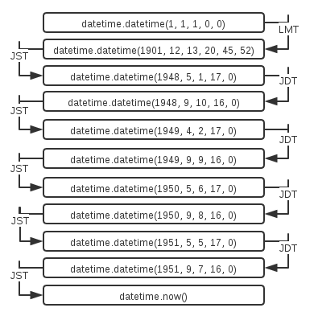

+++
title = "时区知识小结"
summary = ''
description = ""
categories = []
tags = []
date = 2018-04-13T14:27:14+08:00
draft = false
+++

### Naive and Aware

>Python's `datetime.datetime` objects have a `tzinfo` attribute that can be used to store time zone information, represented as an instance of a subclass of `datetime.tzinfo`. When this attribute is set and describes an offset, a datetime object is **aware**. Otherwise, it's **naive**

Django 提供了两个 API 去判断

```Python
def is_naive(value):
    return value.utcoffset() is None
def is_aware(value):
    return value.utcoffset() is not None

In [17]: print(datetime.now())
2018-04-13 19:08:31.472934

In [18]: print(datetime.now().astimezone())
2018-04-13 19:08:41.978848+09:00 # 时区为 JST，格式为 ISO 8601

In [19]: is_naive(datetime.now())
Out[19]: True

In [20]: is_naive(datetime.now().astimezone())
Out[20]: False
```

### Problem

```Python
In [36]: from dateutil import tz

In [37]: from datetime import datetime

In [38]: JST = tz.gettz('Asia/Tokyo')  # 日本的 IANA 时区标识符为 Asia/Tokyo

In [39]: print(datetime(2018, 4, 13, 12, tzinfo=JST))
2018-04-13 12:00:00+09:00  # 注意这里

In [40]: import pytz

In [41]: JST = pytz.timezone('Asia/Tokyo')

In [42]: print(datetime(2018, 4, 13, 12, tzinfo=JST))
2018-04-13 12:00:00+09:19  # 还有这里
```

JST 应当为 `UTC+9:00` 才对，为什么在 `pytz` 这里会出现 `09:19` 这种奇怪的数字呢?

如果你对此感到困惑，那么说明你没有阅读过 `pytz` 的文档

>This library only supports two ways of building a localized time. The first is to use the `localize()` method provided by the pytz library. This is used to localize a naive datetime (datetime with no timezone information):
```Python
>>> loc_dt = eastern.localize(datetime(2002, 10, 27, 6, 0, 0))
>>> print(loc_dt.strftime(fmt))
2002-10-27 06:00:00 EST-0500
```
>The second way of building a localized time is by converting an existing localized time using the standard astimezone() method:
```Python
>>> ams_dt = loc_dt.astimezone(amsterdam)
>>> ams_dt.strftime(fmt)
'2002-10-27 12:00:00 CET+0100'
```
>Unfortunately using the tzinfo argument of the standard datetime constructors ‘’does not work’’ with pytz for many timezones.
```Python
>>> datetime(2002, 10, 27, 12, 0, 0, tzinfo=amsterdam).strftime(fmt)
'2002-10-27 12:00:00 LMT+0020'
```

但是这是为什么呢？

因为这个是 LMT(local mean time) 时间

>Local mean time is a form of solar time that corrects the variations of local apparent time, forming a uniform time scale at a specific longitude. This measurement of time was used for everyday use during the 19th century before time zones were introduced beginning in the late 19th century; it still has some uses in astronomy and navigation.

`pytz` 的每个时区对象都包含一系列固定偏移的时区对象的 `list`，`localize` 函数会自动寻找最合适的，但如果将时区对象作为 `datetime` 的参数则会直接使用 `list` 中的第一个

```Python
In [14]: print(JST.localize(datetime(1901, 4, 13, 12)))
1901-04-13 12:00:00+09:19

In [15]: print(JST.localize(datetime(1902, 4, 13, 12)))
1902-04-13 12:00:00+09:00
```

时区对象所携带的信息可以通过 `_utc_transition_times` 和 `_transition_info` 获取

```Python
In [16]: JST._utc_transition_times
Out[16]:
[datetime.datetime(1, 1, 1, 0, 0),
 datetime.datetime(1901, 12, 13, 20, 45, 52),
 datetime.datetime(1948, 5, 1, 17, 0),
 datetime.datetime(1948, 9, 10, 16, 0),
 datetime.datetime(1949, 4, 2, 17, 0),
 datetime.datetime(1949, 9, 9, 16, 0),
 datetime.datetime(1950, 5, 6, 17, 0),
 datetime.datetime(1950, 9, 8, 16, 0),
 datetime.datetime(1951, 5, 5, 17, 0),
 datetime.datetime(1951, 9, 7, 16, 0)]

In [17]: JST._transition_info
Out[17]:
[(datetime.timedelta(0, 33540), datetime.timedelta(0), 'LMT'),
 (datetime.timedelta(0, 32400), datetime.timedelta(0), 'JST'),
 (datetime.timedelta(0, 36000), datetime.timedelta(0, 3600), 'JDT'),
 (datetime.timedelta(0, 32400), datetime.timedelta(0), 'JST'),
 (datetime.timedelta(0, 36000), datetime.timedelta(0, 3600), 'JDT'),
 (datetime.timedelta(0, 32400), datetime.timedelta(0), 'JST'),
 (datetime.timedelta(0, 36000), datetime.timedelta(0, 3600), 'JDT'),
 (datetime.timedelta(0, 32400), datetime.timedelta(0), 'JST'),
 (datetime.timedelta(0, 36000), datetime.timedelta(0, 3600), 'JDT'),
 (datetime.timedelta(0, 32400), datetime.timedelta(0), 'JST')]
```

根据上面的两个 `list` 可以得出日本时区的变化，如下图



`JDT` 是日本的夏令时，这时候时区偏移为 `UTC+10:00`。日本在 1948 年至 1951 年期间由于美军占领确实使用过夏令时，但目前已经废除

>From 1948–51, Japan observed DST between May and September every year under an initiative of the U.S.-led occupation army. The unpopularity of DST, for which people complained about sleep disruption and longer daytime labor (some workers had to work from early morning until dusk) caused Japan to abandon DST in 1952, shortly after its sovereignty was restored upon the coming into effect of the San Francisco Peace Treaty. Since then, DST has never been officially implemented nationwide in Japan.

### Daylight saving time

夏令时(Daylight saving time)，简写为 DST。一般在天亮较早的夏季人为将时间调快一小时，可以使人早起早睡，减少照明量。不同国家规定不同，同一个国家也有一些地区不适用夏令时，比如美国的亚利桑那州

通过查阅 [Time Zone & Clock Changes in New York, New York, USA](https://www.timeanddate.com/time/zone/usa/new-york) 可知

New York 将在 `2018-11-04T02:00`(local New York time) 结束夏令时，也就是说会将钟表向后拨一小时

举个例子现在是 `2018-11-04 01:30-04:00`，一个小时后的时间为 `2018-11-04 01:30-05:00`。所以对于将 naive time `2018-11-04 01:30` 装换位 aware time 来说可以有两个同时正确的答案

`pytz` 的 `localize` 提供了 `is_dst` 参数来解决这个问题

```Python
In [28]: NYC = pytz.timezone('America/New_York')

In [29]: print(NYC.localize(datetime(2018, 11, 4, 1, 30), is_dst=True))
2018-11-04 01:30:00-04:00

In [30]: print(NYC.localize(datetime(2018, 11, 4, 1, 30), is_dst=False))
2018-11-04 01:30:00-05:00
```

Python3.6 的 `datetime` 也解决了这个问题，参考 [PEP 495](https://www.python.org/dev/peps/pep-0495/)

>This PEP adds a new attribute fold to instances of the datetime.time and datetime.datetime classes that can be used to differentiate between two moments in time for which local times are the same. The allowed values for the fold attribute will be 0 and 1 with 0 corresponding to the earlier and 1 to the later of the two possible readings of an ambiguous local time.

```Python
In [31]: from dateutil import tz

In [32]: NYC = tz.gettz('America/New_York')

In [33]: print(datetime(2018, 11, 4, 1, 30, tzinfo=NYC))
2018-11-04 01:30:00-04:00

In [34]: print(datetime(2018, 11, 4, 1, 30, tzinfo=NYC, fold=1))
2018-11-04 01:30:00-05:00
```

### Reference
[Time Zone | Django documentation](https://docs.djangoproject.com/zh-hans/2.0/topics/i18n/timezones/)  
[PEP 495 -- Local Time Disambiguation](https://www.python.org/dev/peps/pep-0495)

    