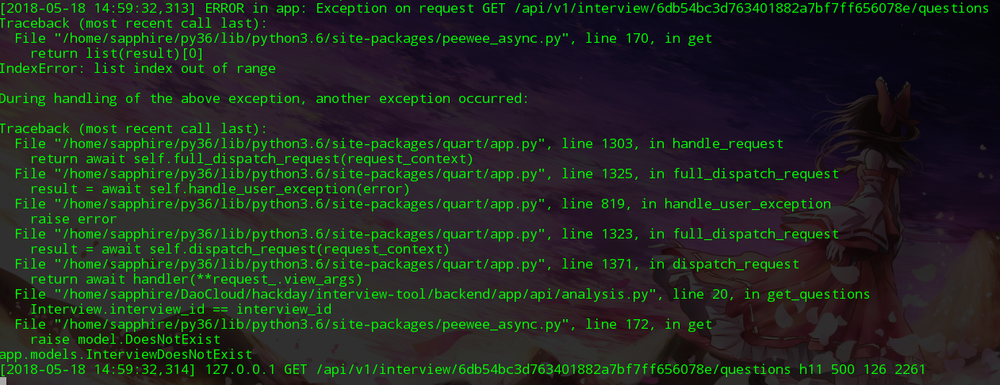

+++
title = "Quart/peewee async 踩坑记录"
summary = ''
description = ""
categories = []
tags = []
date = 2018-05-19T16:30:59+08:00
draft = false
+++

这破博客已经一个月没有更新，感觉快要凉了。然而本次更的也并不是技术性文章，仅是前几天 HackDay(24H猝死日)上踩的一些坑。事实上也不算什么坑，毕竟我才只写了
700 来行代码

技术栈为

- Quart 0.5.0
- peewee-async 0.5.12

首先说一下为什么使用这两个的组合

`Quart` 是一个拥有和 Flask 一样 API 的基于 `asyncio` 的 Web 框架

`peewee-async` 则是不得不用，后面会提到

下面开始聊一下使用体验

#### extension

它的 tutorial 中有提到使用 Flask 的扩展 `flask-login`。但貌似它也并没有说它目前可以完美支持所有的 Flask 扩展，比如我想使用的 `flask_cors` 就不行。目前已知支持的扩展可参考这个列表 [supported-extensions](https://pgjones.gitlab.io/quart/flask_extensions.html#supported-extensions)

#### 迷之 Bug

此 Bug 我现在已经不能复现，我也不知道当时改过什么，全程梦游

[这里](https://github.com/pgjones/quart/blob/2e056de4d38680fb5cd34b71cfd99b6baae58e1f/quart/serving/h11.py#L87) 在上传文件时抛出了一个 `KeyError: 0`

### TraceBack

这个是有记录的，我的脚本名字是 `analysis.py`，从数据库中取指定 `interview_id` 的记录

```Python
interview = await manager.get(
    Interview,
    Interview.interview_id == interview_id
)
```

报错信息如下



`peewee-async` 的[代码](https://github.com/05bit/peewee-async/blob/v0.5.12/peewee_async.py#L170)里是这么写的

```Python
try:
    result = yield from self.execute(query)
    return list(result)[0]
except IndexError:
    raise model.DoesNotExist
```

第一个坑爹的地方，这个 `model.DoesNotExist` 不是说你这个 `model` 不存在，而是指数据库中没有符合查询条件的结果

第二个坑爹的地方，这个 traceback 的输出貌似是有问题的。据我的理解异常应该是

```Python
  File: quart.py line xx
  File: quart.py line xx
  File: peewee_async.py line xx
    return list(result)[0]
IndexError: index out of range

During handling of the above exception, another exception occurred:
  File: peewee_async.py line xx
    raise model.DoesNotExist
```

### WSGI

基于 `asyncio` 的 Web 框架没有一个支持 WSGI 的，这是理所当然的。`Quart` 自己提供了一个 Gunicorn 的 worker `quart.worker.GunicornUVLoopWorker`，这点还是比较方便的。另外 `Quart` 支持 ASGI

### await

- 哪个 api 需要 `await`
- 我该 `await` 谁

其实这点还是很好理解的，典型的两个错误如下

```Python
# return render_template('xx.html')
return await render_template('xx.html')

# await request.files['filename']
(await request.files)['filename']
```

### ORM

比较成熟的 async 的 ORM 目前还是比较少的，或者说能用的仅有下面两个

- [GINO](https://github.com/fantix/gino)，SQLAlchemy 风格，不过目前仅支持 PostgreSQL
- [peewee-async](https://github.com/05bit/peewee-async)，peewee 风格，支持 PostgreSQL 和 MySQL

`GINO` 文档中说它可以进行事务，`peewee_async` 则说目前事务功能在测试中。所以如果想上生产环境，还是需要严格的测试一下


其实这里不用 async 的 ORM，我觉的也是可以的。这种模式被称为 partial async。或者直接使用 `ThreadExecutor`

### 真的是 Flask 么

Sanic 也是一个 Flask-like Web 框架，可以它没有全局的 `request`。Quart 目前看起来是最像 Flask 的框架了

```Python
@app.route('/')
async def hello():
    return iter([b'hello', b'world'])
```

这个在 Flask 上是错误的(我不是说 async)，但在 Quart 中能正常运行。可以参考 [response.py#L89](https://github.com/pgjones/quart/blob/0.5.0/quart/wrappers/response.py#L89)

```Python
self.response: AsyncIterable[bytes]
if isinstance(response, (str, bytes)):
    self.set_data(response)  # type: ignore
else:
    self.response = _ensure_aiter(response)  # type: ignore
    self.push_promises: Set[str] = set()
```

```Python
def set_data(self, data: AnyStr) -> None:
    if isinstance(data, str):
        bytes_data = data.encode(self.charset)
    else:
        bytes_data = data
    self.response = _ensure_aiter([bytes_data])

def _ensure_aiter(
        iter_: Union[AsyncGenerator[bytes, None], Iterable],
) -> AsyncGenerator[bytes, None]:
    if isasyncgen(iter_):
        return iter_  # type: ignore
    else:
        async def aiter() -> AsyncGenerator[bytes, None]:
            for data in iter_:  # type: ignore
                yield data
    return aiter()
```

这样做的好处就是可以进行流式处理，然后我就顺手写了这么一段智障代码

```Python
@app.route('/')
async def hello():
    with open(__file__, 'rb') as f:
        return iter(f.readline, b'')
```

真是糟糕的一天，感谢开源社区为我提供了这么多的欢乐

    