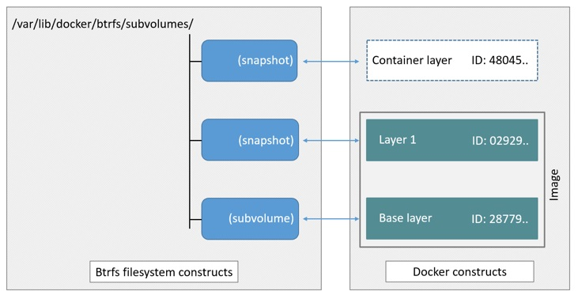

+++
title = "手工实现 Docker"
summary = ''
description = ""
categories = []
tags = []
date = 2018-06-07T14:20:00+08:00
draft = false
+++

本文中的代码建议找一台废弃的 vps 中运行

### Image

传统上 Linux 内核启动时会首先挂载一个 read-only 的 rootfs，当系统检测其完整性后再决定是否将其切换为 read-write 模式，或者最后在 rootfs 之上挂载另一种文件系统并忽略 rootfs。而在 Docker 中，当 daemon 挂载了 read-only 的 rootfs 后会利用 Union Mount 在其之上再挂载一个 read-write 的文件系统。Union Mount 是一种文件系统挂载方式，允许同一时刻将多种文件系统挂载在一起，并以一种文件系统的形式，呈现出多种文件系统合并后的视角。我们平常所提到的镜像(image) 就是 container 的 rootfs，而它又是由多个 image 构成的，每一层可以被称为一个 layer

由于每个 container 都拥有自己的可写层，并且所有更改都存储在此层中，因此多个 container 可以共享底层镜像


这里拿一个比较简单的 btrfs 文件系统来举例(其实完全不需要，因为我没搞 commit)

```Bash
apt-get install btrfs-progs

fallocate -l 2G btrfs.img
mkfs.btrfs btrfs.img
```

挂载

```Bash
mkdir /opt/fake-docker
mount -o loop btrfs.img /opt/fake-docker
```

Docker 提供了一个 shell 脚本去下载 image，因为脚本中使用了 `GOARCH` 之类的 Go ENV，所以这里我改了一个适用于 amd64 的版本

```Bash
# copy and remove golang from https://raw.githubusercontent.com/moby/moby/master/contrib/download-frozen-image-v2.sh
curl -sS https://gist.githubusercontent.com/Hanaasagi/cc2b6930e36d6a132245cbb5b71c6a7c/raw/09ea5fcf3ec92b35c7b23e65e96163733f19be5c/download-frozen-image-v2.sh -o download-frozen-image-v2.sh
chmod +x download-frozen-image-v2.sh
```

创建一个目录存放下载的 image

```Bash
mkdir nginx-img
./download-frozen-image-v2.sh ./nginx-img nginx:latest  # 需要 jq
```

我们会看到如下的东西

```
.
|-- 4ac878dce3c7f994953e33b56b250e85b59c5202a6e4acc12b34e1b3090123db
|   |-- VERSION
|   |-- json
|   `-- layer.tar
|-- 9381b717ffc26f8a09304d2732d44303455aedc7791d537f5a45348105a9629c
|   |-- VERSION
|   |-- json
|   `-- layer.tar
|-- ae513a47849c895a155ddfb868d6ba247f60240ec8495482eca74c4a2c13a881.json
|-- c074885e42d1af9045feda29297b7e5e7fa5df4f7b99fc68eb7d78199625effb
|   |-- VERSION
|   |-- json
|   `-- layer.tar
|-- manifest.json
`-- repositories
```

可以看出 `nginx:latest` 这个镜像一共有三层，而且他们是具有层级关系的，可以在每层下的 `json` 文件中看到

`manifest.json` 保存了此 image 的元信息

```Json
[
  {
    "Config": "ae513a47849c895a155ddfb868d6ba247f60240ec8495482eca74c4a2c13a881.json",
    "RepoTags": [
      "nginx:latest"
    ],
    "Layers": [
      "9381b717ffc26f8a09304d2732d44303455aedc7791d537f5a45348105a9629c/layer.tar",
      "4ac878dce3c7f994953e33b56b250e85b59c5202a6e4acc12b34e1b3090123db/layer.tar",
      "c074885e42d1af9045feda29297b7e5e7fa5df4f7b99fc68eb7d78199625effb/layer.tar"
    ]
  }
]
```

我们将这三个 `layer.tar` 依次进行解压(`Layers` 数组中即 parent 至 child 的顺序)

```Bash
for layer in $(jq '.[].Layers[]' --raw-output < nginx-img/manifest.json); do
        tar xf nginx-img/$layer -C nginx-img && rm -rf nginx-img/$layer
done
```

`ae513a47849c....json` 中保存的是 container 的运行参数。对于 Dockerfile 中的每一条命令，Docker daemon 都会为其创建一个新的 layer。对于命令 `RUN apt-get update`，对应的 layer 肯定会有新添加的内容。而对于 `ENV NGINX_VERSION=1.13.12-1~stretch` 这种不会带来 layer 上更新，则会存储在 config 中

```json
{
  "architecture": "amd64",
  "config": {
    "Env": [
      "PATH=/usr/local/sbin:/usr/local/bin:/usr/sbin:/usr/bin:/sbin:/bin",
      "NGINX_VERSION=1.13.12-1~stretch",
      "NJS_VERSION=1.13.12.0.2.0-1~stretch"
    ],
    "Cmd": [
      "nginx",
      "-g",
      "daemon off;"
    ],
    "WorkingDir": "",
    "Entrypoint": null,
  }
}
```

现在可以看到是一个完整的文件系统 但是小的很多仅有 116M

我们可以装模作样地搞一个 uuid 作为 image_id

使用下面的命令便能够生成

```Bash
python -c "import uuid; print(uuid.uuid4().hex[:12])"
```

本文拿 `1c025eb56d23` 举例

创建一个子卷

```Bash
btrfs subvolume create /opt/fake-docker/1c025eb56d23
# btrfs subvolume delete /opt/fake-docker/1c025eb56d23
```

```Bash
cp -rf --reflink=auto nginx-img/* /opt/fake-docker/1c025eb56d23
```

这样 image 的工作就完成了

### Stroage driver

Docker 支持多种存储驱动(storage driver)，比如 AUFS，Btrfs，Device-mapper 等。本文中使用的是 Btrfs，它是一种支持写入时复制（COW）的文件系统。并且本文的做法有问题 (｡í _ ì｡)

**正确** 的做法是将最底层的 layer 作为一个子卷(subvolume)。然后将其他的 layer 作为快照(snapshot)



具体可以参考 [How the btrfs storage driver works](https://docs.docker.com/storage/storagedriver/btrfs-driver/#how-the-btrfs-storage-driver-works)

> The high level process for creating images and containers on Docker hosts running the btrfs driver is as follows:

> 1. The image’s base layer is stored in a Btrfs subvolume under `/var/lib/docker/btrfs/subvolumes`.

> 2. Subsequent image layers are stored as a Btrfs snapshot of the parent layer’s subvolume or snapshot, but with the changes introduced by this layer. These differences are stored at the block level.

> 3. The container’s writable layer is a Btrfs snapshot of the final image layer, with the differences introduced by the running container. These differences are stored at the block level.

### Network

Docker 默认使用 bridge 模式，新建一个 container 会执行如下操作：

- 创建一对虚拟接口，分别放到本地主机和 container 中
- 本地主机一端桥接到默认的 docker0 或指定网桥上，并具有一个唯一的名字，如 veth2333
- 容器一端放到新容器中，并修改名字作为 eth0，这个接口只在容器的命名空间可见
- 从网桥可用地址段中获取一个空闲地址分配给容器的 eth0，并配置默认路由到桥接网卡 veth2333


这部分的配置借鉴了 cizixs 大佬的 [linux 网络虚拟化： network namespace 简介](http://cizixs.com/2017/02/10/network-virtualization-network-namespace)

首先是开启数据包转发

```Bash
sysctl -w net.ipv4.ip_forward=1
# echo 1 > /proc/sys/net/ipv4/ip_forward
```

然后创建一个 bridge0 网桥，并赋予 10.0.0.1/24 的地址段

```Bash
ip link add bridge0 type bridge
ip addr add 10.0.0.1/24 dev bridge0
ip link set bridge0 up
```

创建 container 所使用的网络命名空间，假设 container_id 为 3236c18fb525。因为长度限制所以缩短了一下

```Bash
ip netns add netns_3236c18fb # add new network namespace
# ip netns list
```

创建 veth pair，并将 veth0 附加到 bridge0 上

```Bash
ip link add dev veth0_3236c18fb type veth peer name veth1_3236c18fb # create the veth pair
ip link set dev veth0_3236c18fb up
ip link set veth0_3236c18fb master bridge0
```

将 veth1 添加到 container 所属的网络命名空间下

```Bash
ip link set veth1_3236c18fb netns netns_3236c18fb # move the interface to specified namespace
```

`ip netns exec netns_name cmd` 可以让命名在指定的网络命名中运行。下面配置 mac 地址和 ip

```Bash
ip netns exec netns_3236c18fb ip link set dev lo up # bring up the links
ip netns exec netns_3236c18fb ip link set veth1_3236c18fb address 00:0C:29:01:98:27
ip netns exec netns_3236c18fb ip addr add 10.0.0.23/24 dev veth1_3236c18fb
ip netns exec netns_3236c18fb ip link set dev veth1_3236c18fb up
ip netns exec netns_3236c18fb ip route add default via 10.0.0.1
```

查看一下刚才的配置

```Bash
└> ip netns exec netns_3236c18fb ip link list
1: lo: <LOOPBACK,UP,LOWER_UP> mtu 65536 qdisc noqueue state UNKNOWN mode DEFAULT group default qlen 1
    link/loopback 00:00:00:00:00:00 brd 00:00:00:00:00:00
4: veth1_3236c18fb@if5: <BROADCAST,MULTICAST,UP,LOWER_UP> mtu 1500 qdisc noqueue state UP mode DEFAULT group default qlen 1000
    link/ether 00:0c:29:01:98:27 brd ff:ff:ff:ff:ff:ff link-netnsid 0
```

目前我们只能 ping 通 10.0.0.1 和 149.28.235.85，无法 ping 通 8.8.8.8(`ip netns exec netns_3236c18fb ping 8.8.8.8`)

我们使用 `iptables` 添加一条 NAT 规则

```Bash
iptables -t nat -A POSTROUTING -o ens3 -j MASQUERADE  # vultr 上网卡接口为 ens3，这里替换成你自己的即可
```

现在已可以从 container 的网络命名空间内访问外部网络

如果你发现转发还是有问题，可能你装了 docker。它会将 FORWARD 链默认的规则由 ACCEPT 改成 DROP

```Bash
# 改回 ACCEPT
iptables -P FORWARD ACCEPT
```

### Isolation

实现环境隔离可以从如下的角度

`chroot` 目录隔离  
`cgroup` 限制资源的使用  
`namespace` 命名空间隔离  

创建快照作为 container 的根目录

*P.S. 加入 `-r` 参数可以创建一个只读快照. 为只读快照创建一个快照可以获得一个只读快照的可写入版本*

```Bash
btrfs subvolume snapshot /opt/fake-docker/1c025eb56d23 /opt/fake-docker/3236c18fb
```

创建新的 cgroup，这里仅限制内存好了

```Bash
# apt-get install cgroup-tools
cgcreate -g memory:3236c18fb
cgset -r memory.limit_in_bytes=67108864 3236c18fb # 64M 内存
```

cgroup 的信息可以在 `/sys/fs/cgroup/` 目录下查看

```Bash
cat /sys/fs/cgroup/memory/3236c18fb/memory.limit_in_bytes
67108864
```

`cgexec` 可以让命名在指定的组下运行，现在我们可以让一个进程完全隔离运行

```Bash
cgexec -g memory:3236c18fb \
  ip netns exec netns_3236c18fb \
  unshare -fmuip --mount-proc \
  chroot /opt/fake-docker/3236c18fb \
  bash
```

这里需要解释一下 `unshare` 命令，它可以使子进程不再与父进程共享相同的命名空间

- `-f`: fork before launching <program>
- `-m`: unshare mounts namespace
- `-u`: unshare UTS namespace (hostname etc)
- `-i`: unshare System V IPC namespace
- `-p`: unshare pid namespace
- `-U`: unshare user namespace

注意这里偷了一个懒，共享了 user-namespace。使用新的用户命名空间需要做 uid 和 gid 的映射，否则连 chroot 都无法执行，因为没有权限

每一个命名空间的详细含义可以参考 [命名空间 · Docker —— 从入门到实践](https://yeasy.gitbooks.io/docker_practice/underly/namespace.html)

如果尝试跑 nginx 容器的 CMD `nginx -g "daemon off;"` 会发现无法访问，因为我们需要配置一条 DNAT 做端口映射

```Bash
iptables -t nat -A PREROUTING -p tcp --dport 80 -j DNAT --to 10.0.0.23:80
```

反正它是跑起来了 2333

### Reference
[Docker源码分析](https://book.douban.com/subject/26581184/)  
[Use the BTRFS storage driver ](https://docs.docker.com/storage/storagedriver/btrfs-driver/)  
[linux 网络虚拟化： network namespace 简介](http://cizixs.com/2017/02/10/network-virtualization-network-namespace)  
[Docker基础技术：Linux CGroup | | 酷 壳 - CoolShell](https://coolshell.cn/articles/17049.html)  
[Docker基础技术：Linux Namespace（上） | | 酷 壳 - CoolShell](https://coolshell.cn/articles/17010.html)  
[Docker基础技术：Linux Namespace（下） | | 酷 壳 - CoolShell](https://coolshell.cn/articles/17029.html)  

    