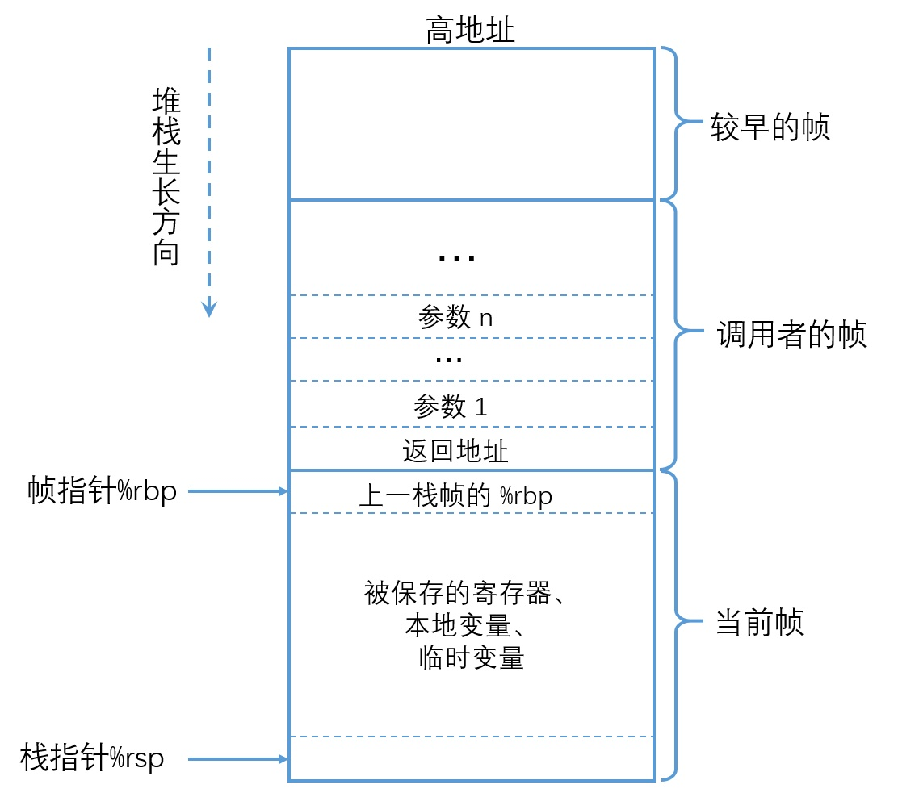
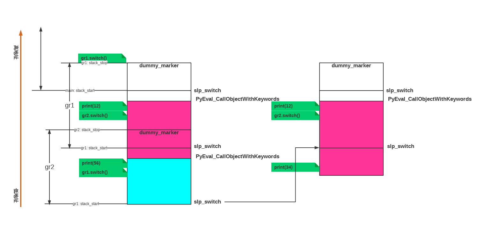

+++
title = "切换的魔法 - greenlet"
summary = ''
description = ""
categories = []
tags = []
date = 2018-08-26T15:42:05+08:00
draft = false
+++

*本文所使用的 greenlet 为 0.4.14, commit sha `f946722143a9bd65764204202fe0c39fbb526d15`*

### Introduction of greenlet

首先来体验一下 greenlet 的执行流程

```Python
from greenlet import greenlet

def test1():
    print(12)
    gr2.switch()
    print(34)

def test2():
    print(56)
    gr1.switch()
    print(78)

gr1 = greenlet(test1)
gr2 = greenlet(test2)
gr1.switch()

# output:
12
56
34
```

`78` 并没有输出，因为 `gr1` 在输出 `34` 后便退出了，它会回到父 greenlet(即 `main`) 中。要想使 `78` 的到输出，可以在 `main` 中再次调用 `gr2.switch()`，或者更改 `gr1` 的父 greenlet

```Python
from greenlet import greenlet

def test1():
    print(12)
    gr2.switch()
    print(34)
    greenlet.getcurrent().parent = gr2

def test2():
    print(56)
    gr1.switch()
    print(78)

gr1 = greenlet(test1)
gr2 = greenlet(test2)
gr1.switch()
```

谁创建了这个 greenlet，谁就是它的 parent。当子 greenlet 发生异常或者退出后会返回至 parent，而不是调用者

所以很显然不能创建循环的 parent，比如下面的代码

```Python
from greenlet import greenlet

def test1():
    print(12)
    gr2 = greenlet(test2)
    gr2.switch()
    print(34)
    greenlet.getcurrent().parent = gr2

def test2():
    print(56)
    gr1.switch()
    print(78)

gr1 = greenlet(test1)
# gr2 = greenlet(test2, parent=gr1) 在创建时也可以指定 parent
gr1.switch()
```

几个特点:

- 树形结构
> Remember, switches are not calls, but transfer of execution between parallel “stack containers”, and the “parent” defines which stack logically comes “below” the current one.

- 显式切换
> Switches between greenlets occur when the method switch() of a greenlet is called, in which case execution jumps to the greenlet whose` switch()` is called, or when a greenlet dies, in which case execution jumps to the parent greenlet. Note that any attempt to switch to a dead greenlet actually goes to the dead greenlet’s parent, or its parent’s parent, and so on. (The final parent is the “main” greenlet, which is never dead.)

- 每个线程都有一个 main greenlet(root)，不同线程间的 greenlet 无法进行切换

### Pandora Box

在阅读源码之前先来回顾一下基础知识



以下面的 C 代码为例

```
//使用 long 类型方便 8 位对齐
long sum(long arg1, long arg2){
    long sum;
    sum = arg1 + arg2;
    return sum;
}

int main(void) {
    long a = 1;
    long b = 2;
    sum(a, b);
    return 0;
}
```

会生成如下的汇编代码(x86-64 gcc 8.2)

```
sum:
        pushq   %rbp             ; 保存 caller(main) 的 rbp
        movq    %rsp, %rbp       ; 重设栈底地址
        movq    %rdi, -24(%rbp)  ; 参数 arg1
        movq    %rsi, -32(%rbp)  ; 参数 arg2
        movq    -24(%rbp), %rdx
        movq    -32(%rbp), %rax
        addq    %rdx, %rax       ; 相加，结果存储在 rax
        movq    %rax, -8(%rbp)   ; 保存至 sum
        movq    -8(%rbp), %rax   ; rax 一般用来保存返回值
        popq    %rbp             ; 恢复 caller 的 rbp
        ret                      ; 跳转
main:
        pushq   %rbp             ; 入栈 rbp
        movq    %rsp, %rbp       ; 将 rbp 设置为 rsp
        subq    $16, %rsp        ; gcc 中当函数内部有调用其他外部函数（有CALL指令）的时候，
                                 ; 使用 subq 指令分配栈空间, 然后使用 movl xx, -4(%rbp)
                                 ; 的形式入栈，如果没有对局部变量初始化，
                                 ; 而且函数后面也没有使用这一变量，则不会为其开辟空间。
        movq    $1, -8(%rbp)     ; a = 1
        movq    $2, -16(%rbp)    ; b = 2
        movq    -16(%rbp), %rdx
        movq    -8(%rbp), %rax
        movq    %rdx, %rsi       ; 第二个参数 b 存储在 rsi 中
        movq    %rax, %rdi       ; 第一个参数 a 存储在 rdi 中
        call    sum              ; 调用 sum，会自动下一条指定的地址(函数返回地址)
        movl    $0, %eax         ; main 函数返回值
        leave                    ; 将 rsp 设置为 rbp，释放堆栈空间。同时 popq %rbp
        ret
```

x64 中对于整数和指针类型参数，前 6 个参数都会通过寄存器来传递，第七个参数开使通过栈传递。这前六个参数分别使用 rdi、rsi、rdx、rcx、r8、r9。但是在早期的 x86 系统都是使用栈传参的，可以参考 [C语言函数调用栈(一)](https://www.cnblogs.com/clover-toeic/p/3755401.html) 和 [x64 函数调用过程分析](https://www.jianshu.com/p/5a4f2d78cb53)

进入正题，首先我们来看一下 `greenlet.greenlet` 类型的定义，这部分在 [`greenleet.c`](https://github.com/bakalab/greenlet/blob/v0.4.14/greenlet.c#L1500)

```
PyTypeObject PyGreenlet_Type = {
	PyVarObject_HEAD_INIT(NULL, 0)
	"greenlet.greenlet",                    /* tp_name */
    // ....
	green_methods,                          /* tp_methods */
	0,                                      /* tp_members */
	green_getsets,                          /* tp_getset */
	(initproc)green_init,                   /* tp_init */
	green_new,                              /* tp_new */
};
```

这里仅截取了几个重要的部分，每一项的含义在注释中已经标明了。首先来看 `greenlet.greenlet` 所具有的方法

```
static PyMethodDef green_methods[] = {
	{"switch", (PyCFunction)green_switch,
	 METH_VARARGS | METH_KEYWORDS, green_switch_doc},
	{"throw",  (PyCFunction)green_throw,  METH_VARARGS, green_throw_doc},
	{"__getstate__", (PyCFunction)green_getstate, METH_NOARGS, NULL},
	{NULL,     NULL} /* sentinel */
};
```

`PyMethodDef` 用于描述扩展类型所具有的方法，可以参考 CPython 的 [C-API 文档](https://docs.python.org/3/c-api/structures.html#c.PyMethodDef)。需要通过四个 Field 来分别指明方法的名称、具体实现函数的指针、Flag、文档字符串

`green_new` 即对象的 `__new__` 方法，用于实例化对象

```
static PyObject* green_new(PyTypeObject *type, PyObject *args, PyObject *kwds)
{
	PyObject* o = PyBaseObject_Type.tp_new(type, ts_empty_tuple, ts_empty_dict);
	if (o != NULL) {
		if (!STATE_OK) {
			Py_DECREF(o);
			return NULL;
		}
		Py_INCREF(ts_current);
		((PyGreenlet*) o)->parent = ts_current;
	}
	return o;
}
```

可以看到将对象的 `parent` 设置为了 `ts_current`，它代表了当前的 `greeenlet` 对象

```
static int green_init(PyGreenlet *self, PyObject *args, PyObject *kwargs)
{
  PyObject *run = NULL;
	PyObject* nparent = NULL;
	static char *kwlist[] = {"run", "parent", 0};  // 0 is sentinel
	if (!PyArg_ParseTupleAndKeywords(args, kwargs, "|OO:green", kwlist,
	                                 &run, &nparent))
		return -1;

	if (run != NULL) {
		if (green_setrun(self, run, NULL))
			return -1;
	}
	if (nparent != NULL && nparent != Py_None)
		return green_setparent(self, nparent, NULL);
	return 0;
}
```

`PyArg_ParseTupleAndKeywords` 用于解析传入的参数，即将 `args` 中包含的参数按照给定的格式 `|00:green` 与关键字参数数组 `kwlist` 解析变量 `run` 和 `nparent` 上。这个 `|00:green` 代表了参数中都是可选参数，前两个参数都是 `PyObject`，`:` 意味着格式化占位符结束，后面跟的 `green` 会被用作错误消息中的函数名。关于这一部分可以参考 [Parsing arguments and building values](https://docs.python.org/3/c-api/arg.html#parsing-arguments-and-building-values)

其对应

```Python
In [2]: greenlet?
Init signature: greenlet(self, /, *args, **kwargs)
Docstring:     
greenlet(run=None, parent=None) -> greenlet

Creates a new greenlet object (without running it).

 - *run* -- The callable to invoke.
 - *parent* -- The parent greenlet. The default is the current greenlet.
```

`green_setrun` 会先检查自身是否启动，如果已经启动则会抛出异常，否则将 `greenlet` 对象的 `run_info` 设置为传入的 `run`。同样的 `green_setparent` 会在一系列检查(比如是否产生 cyclic parent)后将 `greenlet` 对象的 `parent` 属性设置为 `nparent`。注意这里，在 Python 我们是通过 `run` 去获取 `run_info` 的，这是因为有一层 get/set，即在类型定义时我们所看到的 `green_getsets`，不再详细展开了

Python 中的 `greenlet` 对象对应着底层的 `PyGreenlet` 结构体

```
typedef struct _greenlet {
	PyObject_HEAD
	char* stack_start;  // 栈起始(栈顶 rsp)
	char* stack_stop;  // 栈底
	char* stack_copy;  // 栈存储至堆上的地址
	intptr_t stack_saved;  // 已保存的大小
	struct _greenlet* stack_prev;
	struct _greenlet* parent;
	PyObject* run_info;
	struct _frame* top_frame;
	int recursion_depth;
	PyObject* weakreflist;
	PyObject* exc_type;
	PyObject* exc_value;
	PyObject* exc_traceback;
	PyObject* dict;
} PyGreenlet;
```

实例化一个 `greenlet` 对象后，一般会调用 `switch` 方法来执行内部的代码，通过之前的分析可以得出是调用的 `green_switch` 函数。不过在分析 `green_switch` 前需要看一下 main greenlet 如何创建的

```
static char* copy_on_greentype[] = {
	"getcurrent",
	"error",
	"GreenletExit",
	NULL
};


PyMODINIT_FUNC
PyInit_greenlet(void)
{
  PyObject* m = NULL;
	char** p = NULL;
	PyObject *c_api_object;
	static void *_PyGreenlet_API[PyGreenlet_API_pointers];

	GREENLET_NOINLINE_INIT();

  m = PyModule_Create(&greenlet_module_def);

  ts_curkey = PyUnicode_InternFromString("__greenlet_ts_curkey");
	ts_delkey = PyUnicode_InternFromString("__greenlet_ts_delkey");
  ts_empty_tuple = PyTuple_New(0);
  ts_empty_dict = PyDict_New();
  ts_current = green_create_main();

  /* also publish module-level data as attributes of the greentype. */
  for (p=copy_on_greentype; *p; p++) {
		PyObject* o = PyObject_GetAttrString(m, *p);
		if (!o) continue;
		PyDict_SetItemString(PyGreenlet_Type.tp_dict, *p, o);
		Py_DECREF(o);
	}

  // ...
}
```

可以看到在模块初始化时对大量的静态(static)变量进行初始化，并且执行 `green_create_main` 获得了 `ts_current`，这个就是 main greenlet

```
static PyGreenlet* green_create_main(void)
{
	PyGreenlet* gmain;
	PyObject* dict = PyThreadState_GetDict();v  // 用于 C 扩展存储状态

	/* create the main greenlet for this thread */
	gmain = (PyGreenlet*) PyType_GenericAlloc(&PyGreenlet_Type, 0);
	gmain->stack_start = (char*) 1;
	gmain->stack_stop = (char*) -1;
	gmain->run_info = dict;
	Py_INCREF(dict);
	return gmain;
}
```

[`PyThreadState_GetDict()`](https://docs.python.org/3/c-api/init.html#c.PyThreadState_GetDict)
> Return a dictionary in which extensions can store thread-specific state information. Each extension should use a unique key to use to store state in the dictionary.

这里 stack_stop 被赋值为 `-1` 是因为

> The main greenlet doesn't have a stack_stop: it is responsible for the
complete rest of the C stack, and we don't know where it begins.  We
use (char*) -1, the largest possible address.

再来看 `green_switch` 的实现

```
static PyObject* green_switch(
	PyGreenlet* self,
	PyObject* args,
	PyObject* kwargs)
{
	Py_INCREF(args);
	Py_XINCREF(kwargs);
	return single_result(g_switch(self, args, kwargs));
}
```

`single_result` 会判断结果是否为 `tuple`，如果是且仅有一个元素则会提取并返回，大致相当于

```Python
def single_result(results):
    if isinstance(results, tuple) and len(results) == 1:
        return results[0]
    return resutls
```

`green_switch` 的真正实现在 `g_switch` 中

```
static PyObject *
g_switch(PyGreenlet* target, PyObject* args, PyObject* kwargs)
{
	/* _consumes_ a reference to the args tuple and kwargs dict,
	   and return a new tuple reference */
	int err = 0;
	PyObject* run_info;

	/* check ts_current */
	if (!STATE_OK) {
		Py_XDECREF(args);
		Py_XDECREF(kwargs);
		return NULL;
	}
	run_info = green_statedict(target);
	if (run_info == NULL || run_info != ts_current->run_info) {
		Py_XDECREF(args);
		Py_XDECREF(kwargs);
		PyErr_SetString(PyExc_GreenletError, run_info
		                ? "cannot switch to a different thread"
		                : "cannot switch to a garbage collected greenlet");
		return NULL;
	}

  // 参数、返回值都是保存在 ts_passaround_args 与 ts_passaround_kwargs 中的
	ts_passaround_args = args;
	ts_passaround_kwargs = kwargs;

	/* find the real target by ignoring dead greenlets,
	   and if necessary starting a greenlet. */
	while (target) {
		if (PyGreenlet_ACTIVE(target)) {
			ts_target = target;  // ts_target 中保存将要执行的 greenlet 对象
			err = g_switchstack();
			break;
		}
		if (!PyGreenlet_STARTED(target)) {
			void* dummymarker;
			ts_target = target;
			err = g_initialstub(&dummymarker);
			if (err == 1) {
				continue; /* retry the switch */
			}
			break;
		}
		target = target->parent;
	}

	/* For a very short time, immediately after the 'atomic'
	   g_switchstack() call, global variables are in a known state.
	   We need to save everything we need, before it is destroyed
	   by calls into arbitrary Python code. */
  // 这里 ts_passaround_args 和 ts_passaround_kwargs 保存的是返回值
	args = ts_passaround_args;
	ts_passaround_args = NULL;
	kwargs = ts_passaround_kwargs;
	ts_passaround_kwargs = NULL;
	if (err < 0) {
		/* Turn switch errors into switch throws */
		assert(ts_origin == NULL);
		Py_CLEAR(kwargs);
		Py_CLEAR(args);
	} else {
		PyGreenlet *origin;
		origin = ts_origin;
		ts_origin = NULL;
		Py_DECREF(origin);
	}

	/* We need to figure out what values to pass to the target greenlet
	   based on the arguments that have been passed to greenlet.switch(). If
	   switch() was just passed an arg tuple, then we'll just return that.
	   If only keyword arguments were passed, then we'll pass the keyword
	   argument dict. Otherwise, we'll create a tuple of (args, kwargs) and
	   return both. */
	if (kwargs == NULL)
	{
		return args;
	}
	else if (PyDict_Size(kwargs) == 0)
	{
		Py_DECREF(kwargs);
		return args;
	}
	else if (PySequence_Length(args) == 0)
	{
		Py_DECREF(args);
		return kwargs;
	}
	else
	{
		PyObject *tuple = PyTuple_New(2);
		if (tuple == NULL) {
			Py_DECREF(args);
			Py_DECREF(kwargs);
			return NULL;
		}
		PyTuple_SET_ITEM(tuple, 0, args);
		PyTuple_SET_ITEM(tuple, 1, kwargs);
		return tuple;
	}
}
```

greenlet 对象有三种状态:

- `stack_stop == NULL && stack_start == NULL`:  did not start yet
- `stack_stop != NULL && stack_start == NULL`:  already finished
- `stack_stop != NULL && stack_start != NULL`:  active

`g_switch` 会沿着 parent 向上遍历 target greenlet 直到找到一个非 DEAD 状态的 greenlet。如果这个 greenlet 是 ACTIVE 的那么更新 `ts_target` 并调用 `g_switchstack` 进行切换；如果这个 greenlet 没有启动那么会调用 `g_initialstub` 对其进行初始化

先来看负责初始化的 `g_initialstub`

```
static int GREENLET_NOINLINE(g_initialstub)(void* mark)
{
	int err;
	PyObject *o, *run;
	PyObject *exc, *val, *tb;
	PyObject *run_info;
	PyGreenlet* self = ts_target;  // 要进行初始化的 greenlet 对象
	PyObject* args = ts_passaround_args;  // 需要传入的参数
	PyObject* kwargs = ts_passaround_kwargs;

	/* save exception in case getattr clears it */
	PyErr_Fetch(&exc, &val, &tb);
	/* self.run is the object to call in the new greenlet */
	run = PyObject_GetAttrString((PyObject*) self, "run");  // 从 greenlet 对象中取出需要执行的函数
	if (run == NULL) {
		Py_XDECREF(exc);
		Py_XDECREF(val);
		Py_XDECREF(tb);
		return -1;
	}
	/* restore saved exception */
	PyErr_Restore(exc, val, tb);

	/* recheck the state in case getattr caused thread switches */
	if (!STATE_OK) {
		Py_DECREF(run);
		return -1;
	}

	/* recheck run_info in case greenlet reparented anywhere above */
	run_info = green_statedict(self);
	if (run_info == NULL || run_info != ts_current->run_info) {
		Py_DECREF(run);
		PyErr_SetString(PyExc_GreenletError, run_info
		                ? "cannot switch to a different thread"
		                : "cannot switch to a garbage collected greenlet");
		return -1;
	}

	/* by the time we got here another start could happen elsewhere,
	 * that means it should now be a regular switch
	 */
	if (PyGreenlet_STARTED(self)) {
		Py_DECREF(run);
		ts_passaround_args = args;
		ts_passaround_kwargs = kwargs;
		return 1;
	}

	/* start the greenlet */
	self->stack_start = NULL;
	self->stack_stop = (char*) mark;  // 先前的 dummymarker
	if (ts_current->stack_start == NULL) {
		/* ts_current is dying */
		self->stack_prev = ts_current->stack_prev;
	}
	else {
		self->stack_prev = ts_current;
	}
	self->top_frame = NULL;
	green_clear_exc(self);  // 将 self->exec_type self->exec_value self->exec_traceback 赋值为 NULL
	self->recursion_depth = PyThreadState_GET()->recursion_depth;

	/* restore arguments in case they are clobbered */
	ts_target = self;
	ts_passaround_args = args;
	ts_passaround_kwargs = kwargs;

	/* perform the initial switch */
	err = g_switchstack();

	/* returns twice!
	   The 1st time with err=1: we are in the new greenlet
	   The 2nd time with err=0: back in the caller's greenlet
	*/
	if (err == 1) {
		/* in the new greenlet */
		PyGreenlet* origin;
		PyObject* result;
		PyGreenlet* parent;
		self->stack_start = (char*) 1;  /* running */

		/* grab origin while we still can */
		origin = ts_origin;
		ts_origin = NULL;

		/* now use run_info to store the statedict */
		o = self->run_info;
		self->run_info = green_statedict(self->parent);
		Py_INCREF(self->run_info);
		Py_XDECREF(o);

		Py_DECREF(origin);

		if (args == NULL) {
			/* pending exception */
			result = NULL;
		} else {
			/* call g.run(*args, **kwargs) */
			result = PyEval_CallObjectWithKeywords(
				run, args, kwargs);
			Py_DECREF(args);
			Py_XDECREF(kwargs);
		}
		Py_DECREF(run);
		result = g_handle_exit(result);

		/* jump back to parent */
		self->stack_start = NULL;  /* dead */
		for (parent = self->parent; parent != NULL; parent = parent->parent) {
			result = g_switch(parent, result, NULL);
			/* Return here means switch to parent failed,
			 * in which case we throw *current* exception
			 * to the next parent in chain.
			 */
			assert(result == NULL);
		}
		/* We ran out of parents, cannot continue */
		PyErr_WriteUnraisable((PyObject *) self);
		Py_FatalError("greenlets cannot continue");
	}
	/* back in the parent */
	if (err < 0) {
		/* start failed badly, restore greenlet state */
		self->stack_start = NULL;
		self->stack_stop = NULL;
		self->stack_prev = NULL;
	}
	return err;
}
```

注意 `g_switchstack` 会返回两次，这是因为栈的切换导致的，需要结合后续代码才能搞清楚，所以继续来看 `g_switchstack` 的实现

```
static int g_switchstack(void)
{
	/* Perform a stack switch according to some global variables
	   that must be set before:
	   - ts_current: current greenlet (holds a reference)
	   - ts_target: greenlet to switch to (weak reference)
	   - ts_passaround_args: NULL if PyErr_Occurred(),
	       else a tuple of args sent to ts_target (holds a reference)
	   - ts_passaround_kwargs: switch kwargs (holds a reference)
	   On return results are passed via global variables as well:
	   - ts_origin: originating greenlet (holds a reference)
	   - ts_current: current greenlet (holds a reference)
	   - ts_passaround_args: NULL if PyErr_Occurred(),
	       else a tuple of args sent to ts_current (holds a reference)
	   - ts_passaround_kwargs: switch kwargs (holds a reference)
	   It is very important that stack switch is 'atomic', i.e. no
	   calls into other Python code allowed (except very few that
	   are safe), because global variables are very fragile.
	*/
	int err;
	{   /* save state */
		PyGreenlet* current = ts_current;
		PyThreadState* tstate = PyThreadState_GET();
		current->recursion_depth = tstate->recursion_depth;
		current->top_frame = tstate->frame;
		current->exc_type = tstate->exc_type;
		current->exc_value = tstate->exc_value;
		current->exc_traceback = tstate->exc_traceback;
	}
	err = slp_switch();  // 进行切换
	if (err < 0) {   /* error */
		PyGreenlet* current = ts_current;
		current->top_frame = NULL;
		current->exc_type = NULL;
		current->exc_value = NULL;
		current->exc_traceback = NULL;

		assert(ts_origin == NULL);
		ts_target = NULL;
	}
	else {
		PyGreenlet* target = ts_target;
		PyGreenlet* origin = ts_current;
		PyThreadState* tstate = PyThreadState_GET();
		tstate->recursion_depth = target->recursion_depth;
		tstate->frame = target->top_frame;
		target->top_frame = NULL;
		tstate->exc_type = target->exc_type;
		tstate->exc_value = target->exc_value;
		tstate->exc_traceback = target->exc_traceback;
		green_clear_exc(target);

		assert(ts_origin == NULL);
		Py_INCREF(target);
		ts_current = target;  // 更新 ts_current
		ts_origin = origin;
		ts_target = NULL;
	}
	return err;
}
```

*slp 应该是 Stackless Python 的缩写*

`slp_switch` 根据不同系统有不同的实现(选择逻辑位于 `slp_platformselect.h`)，所有实现均位于 `platform` 目录下。这里参考 `switch_amd64_unix.h` 的实现

```
/* #define STACK_MAGIC 3 */
/* the above works fine with gcc 2.96, but 2.95.3 wants this */
#define STACK_MAGIC 0
#define REGS_TO_SAVE "r12", "r13", "r14", "r15"

static int
slp_switch(void)
{
    int err;
    void* rbp;
    void* rbx;
    unsigned int csr;
    unsigned short cw;
    register long *stackref, stsizediff;
    __asm__ volatile ("" : : : REGS_TO_SAVE);
    // asm format (template: output operands: input operands: clobbered registers)
    // Save the floating-point environment
    __asm__ volatile ("fstcw %0" : "=m" (cw));
    __asm__ volatile ("stmxcsr %0" : "=m" (csr));
    // save rbp rbx rsp
    __asm__ volatile ("movq %%rbp, %0" : "=m" (rbp));
    __asm__ volatile ("movq %%rbx, %0" : "=m" (rbx));
    __asm__ ("movq %%rsp, %0" : "=g" (stackref));
    {
        SLP_SAVE_STATE(stackref, stsizediff);  // 将当前的栈信息保存到堆中
        __asm__ volatile (
            "addq %0, %%rsp\n"
            "addq %0, %%rbp\n"
            :
            : "r" (stsizediff)
            );
        SLP_RESTORE_STATE();  // 将目标的栈信息从堆恢复到栈中
        __asm__ volatile ("xorq %%rax, %%rax" : "=a" (err));
    }
    // 将修改后的值重新写入寄存器
    __asm__ volatile ("movq %0, %%rbx" : : "m" (rbx));
    __asm__ volatile ("movq %0, %%rbp" : : "m" (rbp));
    __asm__ volatile ("ldmxcsr %0" : : "m" (csr));
    __asm__ volatile ("fldcw %0" : : "m" (cw));
    __asm__ volatile ("" : : : REGS_TO_SAVE);
    return err;
}
```

主要是借助内联汇编将寄存器状态进行保存，修改

和栈地址相关的寄存器为 `rbp` 和 `rsp`

- `rbp` 指向栈起始位置
- `rsp` 指向栈顶

另外寄存器可以分为 Caller Save 和 Callee Save 两类。被标识为 Caller Save 的寄存器说明子函数中也会使用到这些寄存器，所以需要父函数在调用前进行保存，避免覆盖； Callee Save 的寄存器需要子函数自行保存，它们有 `rbx`、`r12`、`r13`、`r14`、`r15`


`SLP_SAVE_STATE` 的定义如下

```
#define SLP_SAVE_STATE(stackref, stsizediff)            \
	stackref += STACK_MAGIC;                        \
	if (slp_save_state((char*)stackref)) return -1; \
	if (!PyGreenlet_ACTIVE(ts_target)) return 1;    \
	stsizediff = ts_target->stack_start - (char*)stackref
```

`slp_save_state` 会将栈状态存储至堆中。这时如果目标 greenlet 不是 ACTIVE 状态，那么便直接返回 1。需要注意这时一个 macro，所以意味着 `slp_switch` 返回了 1。`g_switchstack` 在经过错误判断后会将 `ts_current` 更新为 `ts_target`，表示完成 greenlet 的切换。最后 `g_initialstub` 会判断返回值是否为 1，如果是那么会通过 `PyEval_CallObjectWithKeywords` 执行 `run` 中的 Python 代码。如果执行结束了，那么会向上遍历 parent 然后调用 `g_switch` 将之间保存的栈信息从堆中还原切换回去

`stsizediff` 代表了两个 greenlet 间的偏移量

下面来看 `slp_save_state` 的具体实现

```
static int GREENLET_NOINLINE(slp_save_state)(char* stackref)
{
	/* must free all the C stack up to target_stop */
	char* target_stop = ts_target->stack_stop;  // 目标 greenlet 的栈底
	PyGreenlet* owner = ts_current;
	if (owner->stack_start == NULL)
		owner = owner->stack_prev;  /* not saved if dying */
	else
		owner->stack_start = stackref;

	while (owner->stack_stop < target_stop) {
		/* ts_current is entierely within the area to free */
		if (g_save(owner, owner->stack_stop))
			return -1;  /* XXX */
		owner = owner->stack_prev;
	}
	if (owner != ts_target) {
		if (g_save(owner, target_stop))
			return -1;  /* XXX */
	}
	return 0;
}
```

`g_save` 负责将栈存储至堆中

```
static int g_save(PyGreenlet* g, char* stop)
{
	/* Save more of g's stack into the heap -- at least up to 'stop'
	   g->stack_stop |_ _ _ _|
	                 |       |
	                 |   __ stop       . . . . .
	                 |       |    ==>  .       .
	                 |_ _ _ _|          _ _ _ _
	                 |       |         |       |
	                 |       |         |       |
	  g->stack_start |       |         |_ _ _ _| g->stack_copy
	 */
	intptr_t sz1 = g->stack_saved;
	intptr_t sz2 = stop - g->stack_start;
	if (sz2 > sz1) {
		char* c = (char*)PyMem_Realloc(g->stack_copy, sz2);
      if (!c) {
      	PyErr_NoMemory();
      	return -1;
      }
		memcpy(c+sz1, g->stack_start+sz1, sz2-sz1);
		g->stack_copy = c;  // 保存的位置
		g->stack_saved = sz2;  // 当前保存的栈大小
	}
	return 0;
}
```

`PyMem_Realloc` 可以调整内存大小，如果 `g->stack_copy` 为 NULL 则会通过 `PyMem_Malloc` 申请内存。参考文档 [PyMem_Realloc](https://docs.python.org/3/c-api/memory.html#c.PyMem_Realloc)

> Resizes the memory block pointed to by p to n bytes. The contents will be unchanged to the minimum of the old and the new sizes. If p is NULL, the call is equivalent to PyMem_Malloc(n); else if n is equal to zero, the memory block is resized but is not freed, and the returned pointer is non-NULL.

通过 `memcpy` 进行拷贝，然后更新 `stack_copy` 和 `stack_saved`

与其相反的 `SLP_RESTORE_STATE` 实质上就是调用的 `slp_restore_state`

```
static void GREENLET_NOINLINE(slp_restore_state)(void)
{
	PyGreenlet* g = ts_target;
	PyGreenlet* owner = ts_current;

	/* Restore the heap copy back into the C stack */
	if (g->stack_saved != 0) {
		memcpy(g->stack_start, g->stack_copy, g->stack_saved);  // 还原至栈上
		PyMem_Free(g->stack_copy);
		g->stack_copy = NULL;
		g->stack_saved = 0;
	}

	if (owner->stack_start == NULL)
		owner = owner->stack_prev; /* greenlet is dying, skip it */
	while (owner && owner->stack_stop <= g->stack_stop)
		owner = owner->stack_prev; /* find greenlet with more stack */
	g->stack_prev = owner;
}
```

以本文开始的示例代码为例，红色和蓝色分别代表 Python 层级的 Frame test1 和 test2。部分过程可表示如下



当前运行的 greeenlet 一定是在栈顶

### Reference

[C语言函数调用栈(一)](https://www.cnblogs.com/clover-toeic/p/3755401.html)  
[x64 函数调用过程分析](https://www.jianshu.com/p/5a4f2d78cb53)  
[greenlet上下文切换的原理](http://cyrusin.github.io/2016/07/28/greenlet-20150728/)  
[Python协程greenlet实现原理](http://codemacro.com/2018/01/17/greenlet/)
    