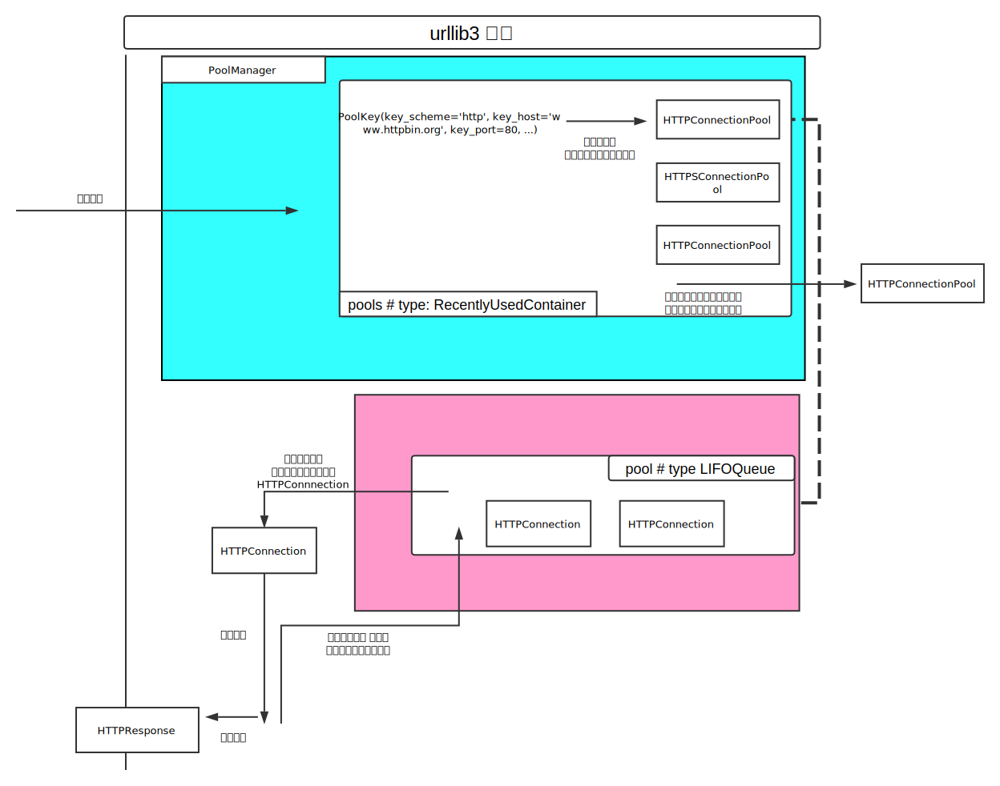

+++
title = "urllib3 源码分析 II -ConnectionPool"
summary = ''
description = ""
categories = []
tags = []
date = 2018-09-23T14:52:21+08:00
draft = false
+++

本文分析 [`urllib3`](https://github.com/urllib3/urllib3) 的连接池设计。所使用代码版本为 `1.23`，commit sha `7c216f433e39e184b84cbfa49e41135a89e4baa0`

续上文 [urllib3 源码分析 I - PoolManager](/2018/09/22/urllib3-yuan-ma-fen-xi-i-poolmanager/)

这里以 HTTP 协议为例，其创建的是 `HTTPConnection` 实例

```Python
# urllib3/connectionpool.py
class HTTPConnectionPool(ConnectionPool, RequestMethods):

    def __init__(self, host, port=None, strict=False,
                 timeout=Timeout.DEFAULT_TIMEOUT, maxsize=1, block=False,
                 headers=None, retries=None,
                 _proxy=None, _proxy_headers=None,
                 **conn_kw):
        ConnectionPool.__init__(self, host, port)
        RequestMethods.__init__(self, headers)

        self.pool = self.QueueCls(maxsize)  # LifoQueue
        self.block = block

        # Fill the queue up so that doing get() on it will block properly
        for _ in xrange(maxsize):
            self.pool.put(None)

        # These are mostly for testing and debugging purposes.
        self.num_connections = 0
        self.num_requests = 0
        self.conn_kw = conn_kw
```

`pool` 是 `LifoQueue` 的实例，最大保存了 `maxsize` 数量的连接。它继承 `queue.Queue` 并且重写了 `_init`、`_qsize`、`_put`、`_get` 这几个方法，使得其成为一个 LIFO 队列，可以参考 [lib/queue.py](https://github.com/python/cpython/blob/3.7/Lib/queue.py#L200)。另外其实在 Python 2.6 标准库中已经实现了 `LifoQueue`，不过内部实现是借助的 `list`，而不是 `deque`

```Python
# urllib3/util/queue.py
class LifoQueue(queue.Queue):
    def _init(self, _):
        self.queue = collections.deque()

    def _qsize(self, len=len):
        return len(self.queue)

    def _put(self, item):
        self.queue.append(item)

    def _get(self):
        return self.queue.pop()
```

根据上文在从 `PoolManager` 获取 `scheme`、`host`、`port` 对应的 ConnectionPool 后，调用了其 `urlopen` 方法

```Python
# urllib3/connectionpool.py
class HTTPConnectionPool(ConnectionPool, RequestMethods):

    ConnectionCls = HTTPConnection  # 定义在 ConnectionPool 中
    ResponseCls = HTTPResponse

    def urlopen(self, method, url, body=None, headers=None, retries=None,
                redirect=True, assert_same_host=True, timeout=_Default,
                pool_timeout=None, release_conn=None, chunked=False,
                body_pos=None, **response_kw):
        if headers is None:
            headers = self.headers

        if not isinstance(retries, Retry):
            retries = Retry.from_int(retries, redirect=redirect, default=self.retries)

        if release_conn is None:
            release_conn = response_kw.get('preload_content', True)

        # 这里需要检查 scheme, host, port 是否和创建 HTTPConnectionPool 时的一致
        # 这是因为用户可能不经过 PoolManager 而直接使用 HTTPConnectionPool
        if assert_same_host and not self.is_same_host(url):
            raise HostChangedError(self, url, retries)

        conn = None

        # Track whether `conn` needs to be released before
        # returning/raising/recursing. Update this variable if necessary, and
        # leave `release_conn` constant throughout the function. That way, if
        # the function recurses, the original value of `release_conn` will be
        # passed down into the recursive call, and its value will be respected.
        #
        # See issue #651 [1] for details.
        #
        # [1] <https://github.com/shazow/urllib3/issues/651>
        release_this_conn = release_conn

        # Merge the proxy headers. Only do this in HTTP. We have to copy the
        # headers dict so we can safely change it without those changes being
        # reflected in anyone else's copy.
        if self.scheme == 'http':
            headers = headers.copy()
            headers.update(self.proxy_headers)

        # Must keep the exception bound to a separate variable or else Python 3
        # complains about UnboundLocalError.
        err = None

        # Keep track of whether we cleanly exited the except block. This
        # ensures we do proper cleanup in finally.
        clean_exit = False

        # Rewind body position, if needed. Record current position
        # for future rewinds in the event of a redirect/retry.
        body_pos = set_file_position(body, body_pos)

        try:
            # Request a connection from the queue.
            timeout_obj = self._get_timeout(timeout)
            conn = self._get_conn(timeout=pool_timeout)

            conn.timeout = timeout_obj.connect_timeout

            is_new_proxy_conn = self.proxy is not None and not getattr(conn, 'sock', None)
            if is_new_proxy_conn:
                self._prepare_proxy(conn)

            # Make the request on the httplib connection object.
            httplib_response = self._make_request(conn, method, url,
                                                  timeout=timeout_obj,
                                                  body=body, headers=headers,
                                                  chunked=chunked)

            # If we're going to release the connection in ``finally:``, then
            # the response doesn't need to know about the connection. Otherwise
            # it will also try to release it and we'll have a double-release
            # mess.
            response_conn = conn if not release_conn else None

            # Pass method to Response for length checking
            response_kw['request_method'] = method

            # Import httplib's response into our own wrapper object
            response = self.ResponseCls.from_httplib(httplib_response,
                                                     pool=self,
                                                     connection=response_conn,
                                                     retries=retries,
                                                     **response_kw)
            # Everything went great!
            clean_exit = True
        except queue.Empty:
            # Timed out by queue.
            raise EmptyPoolError(self, "No pool connections are available.")
        except (TimeoutError, HTTPException, SocketError, ProtocolError,
                BaseSSLError, SSLError, CertificateError) as e:
            # Discard the connection for these exceptions. It will be
            # replaced during the next _get_conn() call.
            clean_exit = False
            if isinstance(e, (BaseSSLError, CertificateError)):
                e = SSLError(e)
            elif isinstance(e, (SocketError, NewConnectionError)) and self.proxy:
                e = ProxyError('Cannot connect to proxy.', e)
            elif isinstance(e, (SocketError, HTTPException)):
                e = ProtocolError('Connection aborted.', e)

            retries = retries.increment(method, url, error=e, _pool=self,
                                        _stacktrace=sys.exc_info()[2])
            retries.sleep()

            # Keep track of the error for the retry warning.
            err = e
        finally:
            if not clean_exit:
                # We hit some kind of exception, handled or otherwise. We need
                # to throw the connection away unless explicitly told not to.
                # Close the connection, set the variable to None, and make sure
                # we put the None back in the pool to avoid leaking it.
                conn = conn and conn.close()
                release_this_conn = True

            if release_this_conn:
                # Put the connection back to be reused. If the connection is
                # expired then it will be None, which will get replaced with a
                # fresh connection during _get_conn.
                self._put_conn(conn)
        # ...
        return response
```

从队列中取空闲连接，然后发送请求，将响应通过 `HTTPResponse` 进行封裹。`preload_content` 和 `release_conn` 这两个参数需要特别说明

- `preload_content` 默认为 `True`，在创建 `HTTPResponse` 实例时会读取整个响应体，保存在 `_body` 属相中。所以在处理 Stream 时，需要将 ` preload_content` 设置为 `False`。但是这样需要我们手动的释放连接以将其放回连接池

```Python
# urllib3/response.py
class HTTPResponse(io.IOBase):

    def release_conn(self):
        if not self._pool or not self._connection:
            return

        self._pool._put_conn(self._connection)
        self._connection = None
```

- `release_conn` 参数用于设置是否自动将连接放回连接池。如果不特别指定，那么此值依赖于 `preload_content`


围绕从连接池中获取可用连接有三组操作，首先来看 `_get_conn`

```Python
# urllib3/connectionpool.py
class HTTPConnectionPool(ConnectionPool, RequestMethods):

    def _get_conn(self, timeout=None):
        conn = None
        try:
            conn = self.pool.get(block=self.block, timeout=timeout)  # collections.queue.get
        except AttributeError:  # self.pool is None
            raise ClosedPoolError(self, "Pool is closed.")

        except queue.Empty:
            if self.block:
                raise EmptyPoolError(self,
                                     "Pool reached maximum size and no more "
                                     "connections are allowed.")
            pass  # Oh well, we'll create a new connection then

        # If this is a persistent connection, check if it got disconnected
        if conn and is_connection_dropped(conn):
            log.debug("Resetting dropped connection: %s", self.host)
            conn.close()
            if getattr(conn, 'auto_open', 1) == 0:
                # This is a proxied connection that has been mutated by
                # httplib._tunnel() and cannot be reused (since it would
                # attempt to bypass the proxy)
                conn = None
        return conn or self._new_conn()
```

从队列中取一个连接，并检查连接是否有效。这里需要说一下 `block` 参数，如果为 `True` 那么当队列中没有空闲连接时会阻塞避免产生 flooding。如果同时指定了 `timeout`，那么会在超时后抛出异常。如果为 `False`，是可以创建出比 `maxsize` 更多的连接的

```Python
# urllib3/connectionpool.py
class HTTPConnectionPool(ConnectionPool, RequestMethods):

    ConnectionCls = HTTPConnection

    def _new_conn(self):
        self.num_connections += 1
        log.debug("Starting new HTTP connection (%d): %s:%s",
                  self.num_connections, self.host, self.port or "80")

        conn = self.ConnectionCls(host=self.host, port=self.port,
                                  timeout=self.timeout.connect_timeout,
                                  strict=self.strict, **self.conn_kw)
        return conn
```

`HTTPConnection` 的实现位于 `urllib3/connection.py` 中，其继承了 `http.client.HTTPConnection`

```Python
# urllib3/connectionpool.py
class HTTPConnectionPool(ConnectionPool, RequestMethods):

    def _put_conn(self, conn):
        try:
            self.pool.put(conn, block=False)
            return  # Everything is dandy, done.
        except AttributeError:
            # self.pool is None.
            pass
        except queue.Full:
            # This should never happen if self.block == True
            log.warning(
                "Connection pool is full, discarding connection: %s", self.host
            )

        # Connection never got put back into the pool, close it.
        if conn:
            conn.close()
```

`_put_conn` 用于在连接使用完时将其放入队列中。因为在 `block=False` 的条件下，是可以创建出任意数量的连接的，但是连接池中只能存储 `maxsize` 数量的连接，如果入队时已满，那么直接释放掉

结合前文，可以得出 urllib3 的层次大致如下图


    