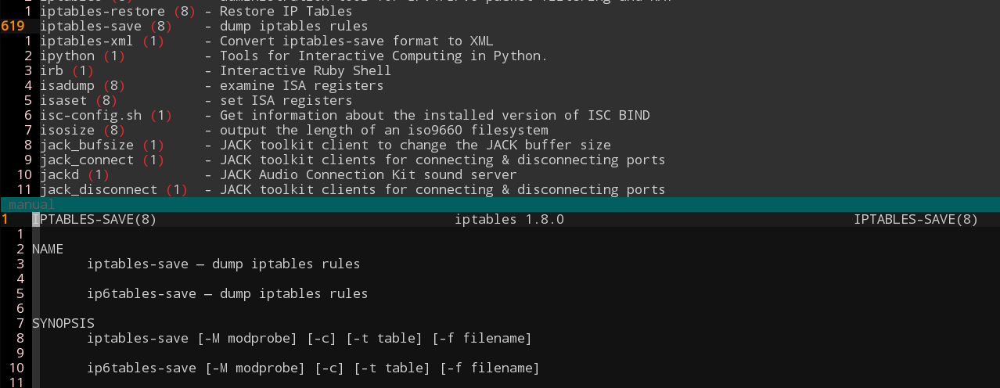

+++
title = "打造一个 Man 文档阅读器"
summary = ''
description = ""
categories = []
tags = []
date = 2018-12-05T15:27:38+08:00
draft = false
+++

*准备一份 Man 文档的清单，以备上班摸鱼之用*

首先我们需要将 Shell Command 罗列出来，遍历一下 `$PATH`

```Bash
#!/bin/bash

list_shell_command()
{
     ls -lh $1                                  \
     | awk 'BEGIN{FS=" "} {print $9}'           \
     | xargs whatis --local=en-US               \
     | tee ; test ${PIPESTATUS[0]} -eq 0
}

generate_manual()
{
    for command in $(echo $1 | tr ":" "\n")
    do
        list_shell_command $command
    done
}

generate_manual $PATH 2>/dev/null | sort | uniq  > manual
```

这里使用 `whatis` 命令添加了简短的描述信息

大概生成的 `manual` 文件是这个样子的

```
[ (1)                - check file types and compare values
2to3 (1)             - Python2 to Python3 converter
2to3-2.7 (1)         - Python2 to Python3 converter
2to3-3.4 (1)         - Python2 to Python3 converter
```

可以过滤掉符号链接，但这些可能是快捷命令，或者历史遗留问题。比如 `ctstat` 是 `lnstat` 的符号链接


然后我们需要更改一下 `Vim` 的配置

```VimScript
function! ReadManual()
    :set iskeyword+=-
    " assign current word under cursor to a script variable
    let s:man_word = expand('<cword>')
    :set iskeyword-=-
    botright new
    setlocal buftype=nofile bufhidden=wipe nobuflisted noswapfile nowrap
    " read in the manpage for man_word (col -b is for formatting)
    execute '$read ! man ' . s:man_word . ' | col -b'
    " goto first line
    execute ':goto'
    " first line is empty, delete it
    execute ':delete'
    setlocal nomodifiable
endfunction
" map the K key to the ReadManual function
map K :call ReadManual()<CR>
```

需要注意的是像 `iptables-save` 这样的命令是有中划线的，所以需要更改 Vim `iskeyword` 的判定。记得改回去，否则会影响 Vim 的 `*` 选中操作




通过 `:shell` 可以挂起 Vim 进入 Shell
    