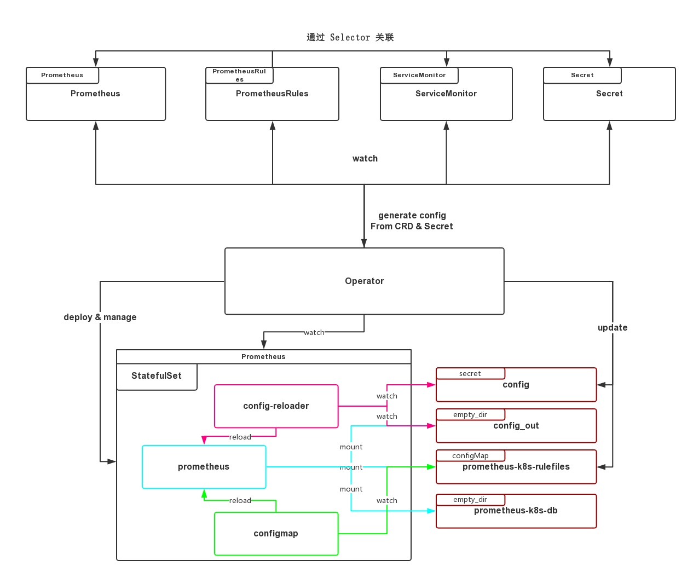

+++
title = "Prometheus Operator Architecture"
summary = ''
description = ""
categories = []
tags = []
date = 2018-12-16T14:37:11+08:00
draft = false
+++

The Prometheus Operator for Kubernetes provides easy monitoring definitions for Kubernetes services and deployment and management of Prometheus instances.

Once installed, the Prometheus Operator provides the following features:

- Create/Destroy: Easily launch a Prometheus instance for your Kubernetes namespace, a specific application or team easily using the Operator.

- Simple Configuration: Configure the fundamentals of Prometheus like versions, persistence, retention policies, and replicas from a native Kubernetes resource.

- Target Services via Labels: Automatically generate monitoring target configurations based on familiar Kubernetes label queries; no need to learn a Prometheus specific configuration language.


上图并不完整，[PR#1333](https://github.com/coreos/prometheus-operator/pull/1333) 引入了 `RuleFule` CRD，现在已经改名为 `PrometheusRules`。简单来说，Prometheus Operator 将 Prometheus 原生的配置抽象成了 Kubernetes 中的资源。通过资源的定义，Operator 会自动去更新 Prometheus 的配置然后 reload

我们下面来分析一下 Prometheus Operator 具体的架构

### Install

安装参考:

```Bash
git clone https://github.com/coreos/prometheus-operator.git
cd prometheus/operator/contrib/kube-prometheus
kubectl apply -f manifests/
nohup kubectl --namespace monitoring port-forward svc/prometheus-k8s 9090 &
# visit localhost:9090
```

### Under the hood

Operator 的启动代码在 `cmd/operator/main.go`

```Golang
func Main() int {
    // ... 根据参数创建 logger

	po, _ := prometheuscontroller.New(cfg, log.With(logger, "component", "prometheusoperator"))
	ao, _ := alertmanagercontroller.New(cfg, log.With(logger, "component", "alertmanageroperator"))

	mux := http.NewServeMux()
	web, _ := api.New(cfg, log.With(logger, "component", "api"))
	web.Register(mux)
	l, _ := net.Listen("tcp", ":8080")

    // 注册&提供自身 metrics

	ctx, cancel := context.WithCancel(context.Background())
	wg, ctx := errgroup.WithContext(ctx)

	wg.Go(func() error { return po.Run(ctx.Done()) })
	wg.Go(func() error { return ao.Run(ctx.Done()) })

	srv := &http.Server{Handler: mux}
	go srv.Serve(l)

	term := make(chan os.Signal)
	signal.Notify(term, os.Interrupt, syscall.SIGTERM)

	select {
	case <-term:
		logger.Log("msg", "Received SIGTERM, exiting gracefully...")
	case <-ctx.Done():
	}

	cancel()
	if err := wg.Wait(); err != nil {
		logger.Log("msg", "Unhandled error received. Exiting...", "err", err)
		return 1
	}
	return 0
}
```

可以看到，它主要做了四件事情

- main goroutine 初始化并管理其他 goroutine
- http server 监听 8080，提供自身的 metrics
- prometheus controller，管理 Prometheus
- alertmanager controller，管理 AlertManager

再来看 `prometheuscontroller` 的初始化与运行

```Golang
// pkg/prometheus/operator.go
func New(conf Config, logger log.Logger) (*Operator, error) {
	cfg, _ := k8sutil.NewClusterConfig(conf.Host, conf.TLSInsecure, &conf.TLSConfig)
	client, _ := kubernetes.NewForConfig(cfg)
	crdclient, _ := apiextensionsclient.NewForConfig(cfg)
	mclient, _ := monitoringclient.NewForConfig(cfg)

    // ... 若启动时传入的 `kubelet-service` 参数，则 `kubeletSyncEnabled` 置为 true，并
    // ... 根据参数的值对 `kubeletObjectName`, `kubeletObjectNamespace` 赋值
    // ... 若启动时未传入则 `kubeletObjectName`, `kubeletObjectNamespace` 为空字符串，
    // ... `kubeletSyncEnabled` 置为 false

	c := &Operator{
		kclient:                client,
		mclient:                mclient,
		crdclient:              crdclient,
		logger:                 logger,
		queue:                  workqueue.NewNamedRateLimitingQueue(workqueue.DefaultControllerRateLimiter(), "prometheus"),
		host:                   cfg.Host,
		kubeletObjectName:      kubeletObjectName,
		kubeletObjectNamespace: kubeletObjectNamespace,
		kubeletSyncEnabled:     kubeletSyncEnabled,
		config:                 conf,
		configGenerator:        NewConfigGenerator(logger),
	}

	c.promInf = cache.NewSharedIndexInformer(
		listwatch.MultiNamespaceListerWatcher(c.config.Namespaces, func(namespace string) cache.ListerWatcher {
			return &cache.ListWatch{
				ListFunc: func(options metav1.ListOptions) (runtime.Object, error) {
					return mclient.MonitoringV1().Prometheuses(namespace).List(options)
				},
				WatchFunc: mclient.MonitoringV1().Prometheuses(namespace).Watch,
			}
		}),
		&monitoringv1.Prometheus{}, resyncPeriod, cache.Indexers{cache.NamespaceIndex: cache.MetaNamespaceIndexFunc},
	)
    // ... 同样 Watch 了
    // ... c.smonInf ServiceMonitors
    // ... c.ruleInf PrometheusRules
    // ... c.cmapInf ConfigMaps
    // ... c.secrInf Secrets
    // ... c.ssetInf StatefulSets

	// nsResyncPeriod is used to control how often the namespace informer
	// should resync. If the unprivileged ListerWatcher is used, then the
	// informer must resync more often because it cannot watch for
	// namespace changes.
	nsResyncPeriod := 15 * time.Second
	// If the only namespace is v1.NamespaceAll, then the client must be
	// privileged and a regular cache.ListWatch will be used. In this case
	// watching works and we do not need to resync so frequently.
	if listwatch.IsAllNamespaces(c.config.Namespaces) {
		nsResyncPeriod = resyncPeriod
	}
	c.nsInf = cache.NewSharedIndexInformer(
		listwatch.NewUnprivilegedNamespaceListWatchFromClient(c.kclient.Core().RESTClient(), c.config.Namespaces, fields.Everything()),
		&v1.Namespace{}, nsResyncPeriod, cache.Indexers{},
	)

	return c, nil
}

func (c *Operator) Run(stopc <-chan struct{}) error {
	defer c.queue.ShutDown()

	errChan := make(chan error)
	go func() {
		v, err := c.kclient.Discovery().ServerVersion()
		if err != nil {
			errChan <- errors.Wrap(err, "communicating with server failed")
			return
		}
		level.Info(c.logger).Log("msg", "connection established", "cluster-version", v)

		if c.config.ManageCRDs {
            // 创建 Prometheus, ServiceMonitor, PrometheusRule 三种 CRD，并且等待创建完成
            // 若已经存在，则使用已经存在的 CRD 的 ResourceVersion 覆盖更新
			if err := c.createCRDs(); err != nil {
				errChan <- errors.Wrap(err, "creating CRDs failed")
				return
			}
		}
		errChan <- nil
	}()

	select {
	case err := <-errChan:
		if err != nil {
			return err
		}
		level.Info(c.logger).Log("msg", "CRD API endpoints ready")
	case <-stopc:
		return nil
	}

	go c.worker()

	go c.promInf.Run(stopc)
	go c.smonInf.Run(stopc)
	go c.ruleInf.Run(stopc)
	go c.cmapInf.Run(stopc)
	go c.secrInf.Run(stopc)
	go c.ssetInf.Run(stopc)
	go c.nsInf.Run(stopc)
	if err := c.waitForCacheSync(stopc); err != nil {
		return err
	}
	c.addHandlers()

	if c.kubeletSyncEnabled {
		go c.reconcileNodeEndpoints(stopc)
	}

	<-stopc
	return nil
}
```

这里对于 Prometheus, ServiceMonitors, PrometheusRules, ConfigMaps, Secrets, StatefulSets 几种资源进行了 Watch，然后通过 `addHandlers` 注册了事件的回调函数

```Golang
// pkg/prometheus/operator.go
func (c *Operator) addHandlers() {
	c.promInf.AddEventHandler(cache.ResourceEventHandlerFuncs{
		AddFunc:    c.handlePrometheusAdd,
		DeleteFunc: c.handlePrometheusDelete,
		UpdateFunc: c.handlePrometheusUpdate,
	})
	// ... c.smonInf.AddEventHandler(
	// ... c.ruleInf.AddEventHandler(
	// ... c.cmapInf.AddEventHandler(
	// ... c.secrInf.AddEventHandler(
	// ... c.ssetInf.AddEventHandler(
}
```

这里以 `handlePrometheusAdd` 为例

```Golang
func (c *Operator) handlePrometheusAdd(obj interface{}) {
	key, ok := c.keyFunc(obj) // checks for DeletedFinalStateUnknown objects before calling MetaNamespaceKeyFunc.
	if !ok {
		return
	}

	level.Debug(c.logger).Log("msg", "Prometheus added", "key", key)
	c.triggerByCounter.WithLabelValues(monitoringv1.PrometheusesKind, "add").Inc()
	c.enqueue(key)
}
// handlePrometheusUpdate 中比对了新旧资源的 ResourceVersion，只有在不同的情况下才入队
```

`triggerByCounter` 记录了事件发生的次数，会以 metrics 的形式暴露出来

```
# HELP prometheus_operator_triggered_total Number of times a Kubernetes object add, delete or update event triggered the Prometheus Operator to reconcile an object
# TYPE prometheus_operator_triggered_total counter
prometheus_operator_triggered_total{action="add",controller="prometheus",triggered_by="ConfigMap"} 18
prometheus_operator_triggered_total{action="add",controller="prometheus",triggered_by="Prometheus"} 1
prometheus_operator_triggered_total{action="update",controller="prometheus",triggered_by="StatefulSet"} 7
```

所有的对象会被转化为 `key` 入队

```Golang
func (c *Operator) enqueue(obj interface{}) {
	if obj == nil {
		return
	}

	key, ok := obj.(string)
	if !ok {
		key, ok = c.keyFunc(obj)
		if !ok {
			return
		}
	}

	c.queue.Add(key)
}
```

worker 将 queue 中的元素出队并且处理。同时也保证了 `syncHandler` 不会被并发的调用

```Golang
func (c *Operator) worker() {
	for c.processNextWorkItem() {
	}
}

func (c *Operator) processNextWorkItem() bool {
	key, quit := c.queue.Get()
	if quit {
		return false
	}
	defer c.queue.Done(key)

	err := c.sync(key.(string))  //
	if err == nil {
		c.queue.Forget(key)
		return true
	}

	c.reconcileErrorsCounter.With(prometheus.Labels{}).Inc()
    // prometheus_operator_reconcile_errors_total{controller="prometheus"} 0
	utilruntime.HandleError(errors.Wrap(err, fmt.Sprintf("Sync %q failed", key)))
	c.queue.AddRateLimited(key)

	return true
}
```

核心部分位于 `sync`，它从资源中抽出配置，并且同步，另外还管理 `StatefulSet`

```Golang
func (c *Operator) sync(key string) error {
	obj, exists, err := c.promInf.GetIndexer().GetByKey(key)
	if err != nil {
		return err
	}
	if !exists {
		// Dependent resources are cleaned up by K8s via OwnerReferences
		return nil
	}

	p := obj.(*monitoringv1.Prometheus)
	p = p.DeepCopy()
	p.APIVersion = monitoringv1.SchemeGroupVersion.String()
	p.Kind = monitoringv1.PrometheusesKind

	if p.Spec.Paused {
		return nil
	}

	level.Info(c.logger).Log("msg", "sync prometheus", "key", key)

    // 1) 根据 p 的 `ruleNamespaceSelector` 选择 namespace，
    // 如果 `RuleNamespaceSelector` 为空，则默认为 p 所在的 namespace
    // 2) 根据 p 的 `ruleSelector` 在指定的 namespace 下获取所有的 PrometheusRule
    // 类型的对象，然后根据其 spec 节中的内容获得新的 Rules
    // 3) 与当前的 Rules 进行对比，如果未改变则什么都不做
    // 若当前没有 ConfigMap 则直接创建新的
    // 若改变则删除现在的 ConfigMap，然后根据新的 Rules 创建新的 ConfigMap
    // 4) 返回最新的所有的 ConfigMap 名字
    // 之后会被 format 到 Prometheus.yaml 中
    // rule_files:
    // - /etc/prometheus/rules/{configmap-name}/*.yaml
	ruleConfigMapNames, err := c.createOrUpdateRuleConfigMaps(p)
	if err != nil {
		return err
	}

	// If no service monitor selectors are configured, the user wants to
	// manage configuration themselves.
	if p.Spec.ServiceMonitorSelector != nil {
		// We just always regenerate the configuration to be safe.

        // 1) 根据 p 的 `ServiceMonitorNamespaceSelector` 选择 namespace，
        // 如果 `ServiceMonitorNamespaceSelector` 为空，则默认为 p 所在的 namespace
        // 2) 根据 p 的 `ServiceMonitorSelector` 在指定的 namespace 下获取所有的 ServiceMonitor
        // 3) 从 ServiceMonitor 中取 Endpoints，从 p 所在 namespace 中的 Secret 中取
        // additional scrape config, additional alert relabel config 等配置
        // 然后生成一分新的 Prometheus 的配置，具体逻辑参考 pkg/prometheus/promcfg.go#L102
        // 4) 比对现有的 Secret(Prometheus 的配置文件是以 Secret 的形式挂载)，然后存在变化就更新
		if err := c.createOrUpdateConfigurationSecret(p, ruleConfigMapNames); err != nil {
			return errors.Wrap(err, "creating config failed")
		}
	}

	// Create empty Secret if it doesn't exist. See comment above.
	s, err := makeEmptyConfigurationSecret(p, c.config)
	if err != nil {
		return errors.Wrap(err, "generating empty config secret failed")
	}
	sClient := c.kclient.CoreV1().Secrets(p.Namespace)
    // 从 p 的 namespace 获取 secret，如果不存在则创建一个空的
	_, err = sClient.Get(s.Name, metav1.GetOptions{})
	if apierrors.IsNotFound(err) {
		if _, err := c.kclient.Core().Secrets(p.Namespace).Create(s); err != nil && !apierrors.IsAlreadyExists(err) {
			return errors.Wrap(err, "creating empty config file failed")
		}
	}
	if !apierrors.IsNotFound(err) && err != nil {
		return err
	}

    // 接下来的代码在创建管理 StatefulSet 及其关联的 Service

	// Create governing service if it doesn't exist.
	svcClient := c.kclient.Core().Services(p.Namespace)
	if err := k8sutil.CreateOrUpdateService(svcClient, makeStatefulSetService(p, c.config)); err != nil {
		return errors.Wrap(err, "synchronizing governing service failed")
	}

	ssetClient := c.kclient.AppsV1beta2().StatefulSets(p.Namespace)
	// Ensure we have a StatefulSet running Prometheus deployed.
	obj, exists, err = c.ssetInf.GetIndexer().GetByKey(prometheusKeyToStatefulSetKey(key))
	if err != nil {
		return errors.Wrap(err, "retrieving statefulset failed")
	}

	newSSetInputHash, err := createSSetInputHash(*p, c.config, ruleConfigMapNames)
	if err != nil {
		return err
	}

	sset, err := makeStatefulSet(*p, &c.config, ruleConfigMapNames, newSSetInputHash)
	if err != nil {
		return errors.Wrap(err, "making statefulset failed")
	}

	if !exists {
		level.Debug(c.logger).Log("msg", "no current Prometheus statefulset found")
		level.Debug(c.logger).Log("msg", "creating Prometheus statefulset")
		if _, err := ssetClient.Create(sset); err != nil {
			return errors.Wrap(err, "creating statefulset failed")
		}
		return nil
	}

	oldSSetInputHash := obj.(*appsv1.StatefulSet).ObjectMeta.Annotations[sSetInputHashName]
	if newSSetInputHash == oldSSetInputHash {
		level.Debug(c.logger).Log("msg", "new statefulset generation inputs match current, skipping any actions")
		return nil
	}

	level.Debug(c.logger).Log("msg", "updating current Prometheus statefulset")

	_, err = ssetClient.Update(sset)
	sErr, ok := err.(*apierrors.StatusError)

	if ok && sErr.ErrStatus.Code == 422 && sErr.ErrStatus.Reason == metav1.StatusReasonInvalid {
		level.Debug(c.logger).Log("msg", "resolving illegal update of Prometheus StatefulSet")
		propagationPolicy := metav1.DeletePropagationForeground
		if err := ssetClient.Delete(sset.GetName(), &metav1.DeleteOptions{PropagationPolicy: &propagationPolicy}); err != nil {
			return errors.Wrap(err, "failed to delete StatefulSet to avoid forbidden action")
		}
		return nil
	}

	if err != nil {
		return errors.Wrap(err, "updating StatefulSet failed")
	}

	return nil
}
```

`StatefulSet` 的生成逻辑在 `pkg/prometheus/statefulset.go`中，会创建包含三个 Container 的 Pod，分别是 `prometheus`, `prometheus-config-reloader`, `rules-configmap-reloader`

```YAML
spec:
  containers:
  - args:
    - --web.console.templates=/etc/prometheus/consoles
    - --web.console.libraries=/etc/prometheus/console_libraries
    - --config.file=/etc/prometheus/config_out/prometheus.env.yaml
    - --storage.tsdb.path=/prometheus
    - --storage.tsdb.retention=24h
    - --web.enable-lifecycle
    - --storage.tsdb.no-lockfile
    - --web.route-prefix=/
    image: quay.io/prometheus/prometheus:v2.5.0
    imagePullPolicy: IfNotPresent
    name: prometheus
    ports:
    - containerPort: 9090
      name: web
      protocol: TCP
    volumeMounts:
    - mountPath: /etc/prometheus/config_out
      name: config-out
      readOnly: true
    - mountPath: /prometheus
      name: prometheus-k8s-db
    - mountPath: /etc/prometheus/rules/prometheus-k8s-rulefiles-0
      name: prometheus-k8s-rulefiles-0
  - args:
    - --log-format=logfmt
    - --reload-url=http://localhost:9090/-/reload
    - --config-file=/etc/prometheus/config/prometheus.yaml
    - --config-envsubst-file=/etc/prometheus/config_out/prometheus.env.yaml
    command:
    - /bin/prometheus-config-reloader
    env:
    - name: POD_NAME
      valueFrom:
        fieldRef:
          apiVersion: v1
          fieldPath: metadata.name
    image: quay.io/coreos/prometheus-config-reloader:v0.26.0
    name: prometheus-config-reloader
    volumeMounts:
    - mountPath: /etc/prometheus/config
      name: config
    - mountPath: /etc/prometheus/config_out
      name: config-out
  - args:
    - --webhook-url=http://localhost:9090/-/reload
    - --volume-dir=/etc/prometheus/rules/prometheus-k8s-rulefiles-0
    image: quay.io/coreos/configmap-reload:v0.0.1
    name: rules-configmap-reloader
    volumeMounts:
    - mountPath: /etc/prometheus/rules/prometheus-k8s-rulefiles-0
      name: prometheus-k8s-rulefiles-0
  volumes:
  - name: config
    secret:
      defaultMode: 420
      secretName: prometheus-k8s
  - emptyDir: {}
    name: config-out
  - configMap:
      defaultMode: 420
      name: prometheus-k8s-rulefiles-0
    name: prometheus-k8s-rulefiles-0
  - emptyDir: {}
    name: prometheus-k8s-db
```

1) `prometheus` 就是我们的 `prometheus` 实例
2) `prometheus-config-reloader` 的代码在 `cmd/prometheus-config-reloader/main.go`，其实借助了 `"github.com/improbable-eng/thanos/pkg/reloader"` 来 watch `/etc/prometheus/config/prometheus.yaml`，并替换配置里的环境变量生成 `/etc/prometheus/config_out/prometheus.env.yaml`，通过 Prometheus 原生提供的 `-/reload` 接口来更新配置。注意这里 Prometheus 所使用的配置文件是替换后的 `prometheus.env.yaml`
3) `rules-configmap-reloader` 使用的是 `https://github.com/jimmidyson/configmap-reload`，它 watch 了 Prometheus 的告警规则和记录规则，然后也是通过 `-/reload` 去 reload Prometheus

Prometheus 的大致结构如下



*如有错误，欢迎纠正*

    